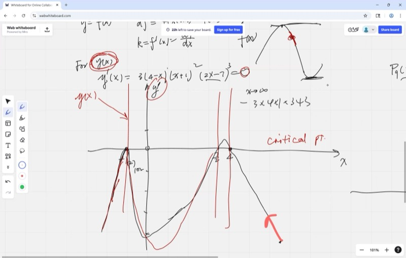

本节课进一步讨论导数图形的读取方法，通过导数判断函数的递增、递减区间以及波峰和波谷的位置。此外还将介绍商法则——用于对分数求导的公式——在涉及比率变化的场景中有广泛应用。

::: {.callout-tip collapse="true"}
## 应用背景

在工程设计中，不仅需要关注轨道或结构的形状，更需要了解其递增、递减区间以及波峰和波谷的位置，这正是导数所提供的信息。商法则则在涉及比率计算的场景中频繁出现，例如"每加仑英里数"或"每场得分"等。
:::

## 本课内容

- 多项式绘图：蛇形法（继续练习）
- 根处的重数：偶数幂 = 反弹，奇数幂 = 穿越
- 通过导数图形 $f'(x)$ 理解 $f(x)$
- 通过 $f'(x)$ 的符号变化识别极大值、极小值和驻点
- 通过将分数改写为 $x$ 的幂来求导
- 商法则：$\displaystyle\frac{d}{dx}\!\left(\frac{P}{Q}\right) = \frac{Q \cdot dP - P \cdot dQ}{Q^2}$

## 课程视频

```{=html}
<video controls width="100%" preload="metadata">
  <source src="https://github.com/ymote/learningcalculus/releases/download/v1.0/calculus20250821.mp4" type="video/mp4">
</video>
```

## 课程关键帧

```{=html}
<div style="display: flex; flex-direction: column; gap: 10px; margin: 1em 0;">
  
  
  
  
</div>
```


## 多项式绘图：蛇形法

::: {.callout-note collapse="true"}
## 预备知识：多项式因式分解

使用蛇形法的前提是将多项式写成因式分解的形式。例如：

$$x^3 - 4x = x(x-2)(x+2)$$

因子给出**根**（图形触碰或穿越 x 轴的位置）。确定根之后，即可蛇形穿过它们。
:::

**蛇形法**是一种快速绘制多项式图形的方法：

1. **从因式分解形式中找到根。**
2. **在 x 轴上标记它们。**
3. **检查首项**以确定图形在右端是从上方还是下方开始。
4. **蛇形穿过根**——在奇数重数根处穿越，在偶数重数根处反弹。

## 重数与根处的行为

每个因子的**幂次**（重数）决定了在该根处的行为：

| 因子 | 重数 | 在根处的行为 |
|---|---|---|
| $(x - r)^1$ | 1（奇数） | 图形**穿越** x 轴 |
| $(x - r)^2$ | 2（偶数） | 图形从 x 轴**反弹** |
| $(x - r)^3$ | 3（奇数） | 图形以**平坦的 S 形穿越** |
| $(x - r)^4$ | 4（偶数） | 图形**反弹**（比平方更平坦） |

::: {.callout-tip collapse="true"}
## 简单规则

**奇数幂 = 穿越。偶数幂 = 反弹。**

为什么？因为 $(x - r)^{\text{偶数}}$ 总是 $\geq 0$——平方（或四次方等）不能为负。所以图形不能穿到另一边。但 $(x - r)^{\text{奇数}}$ 会变号，所以图形必须穿越。
:::

**探索重数——拖动滑块改变幂次：**

```{=html}
<div id="calc1" class="desmos-container"></div>
<script src="https://www.desmos.com/api/v1.9/calculator.js?apiKey=dcb31709b452b1cf9dc26972add0fda6"></script>
<script>
  var calc1 = Desmos.GraphingCalculator(document.getElementById('calc1'), {
    expressions: true,
    settingsMenu: false
  });
  calc1.setExpression({ id: 'bounce', latex: 'y=0.5(x+2)(x-1)^2', color: '#c74440', lineWidth: 2 });
  calc1.setExpression({ id: 'cross', latex: 'y=0.1(x+2)(x-1)^3', color: '#2d70b3', lineWidth: 2 });
  calc1.setExpression({ id: 'p1', latex: '(1, 0)', color: '#c74440', pointSize: 10, label: 'bounces (even power)', showLabel: true });
  calc1.setExpression({ id: 'p2', latex: '(1, 0)', color: '#2d70b3', pointSize: 10, label: 'crosses (odd power)', showLabel: true, labelOrientation: Desmos.LabelOrientations.BELOW });
  calc1.setExpression({ id: 'p3', latex: '(-2, 0)', color: '#388c46', pointSize: 10, label: 'single root (crosses)', showLabel: true });
  calc1.setMathBounds({ left: -5, right: 5, bottom: -8, top: 8 });
</script>
```

## 临界点与读取导数图形

::: {.callout-note collapse="true"}
## 预备知识：什么是导数？

导数 $f'(x)$ 给出 $f(x)$ 在每个点处的**斜率**。若 $f'(x) > 0$，原函数递增；若 $f'(x) < 0$，原函数递减；若 $f'(x) = 0$，函数暂时是平的——此即**临界点**。
:::

导数图形 $f'(x)$ 就像原函数 $f(x)$ 的**仪表盘**：

| $f'(x)$ 的行为 | $f(x)$ 的行为 |
|---|---|
| $f'(x) > 0$（在 x 轴上方） | $f(x)$ **递增**（上升） |
| $f'(x) < 0$（在 x 轴下方） | $f(x)$ **递减**（下降） |
| $f'(x) = 0$（穿过 x 轴） | $f(x)$ 有**临界点**（水平） |

## 识别极大值、极小值和驻点

临界点（$f'(x) = 0$ 处）可能是以下三种情况之一。通过观察 $f'(x)$ 的符号变化来判断：

::: {.callout-important}
## 核心要点：一阶导数判别法
检查临界点前后导数的符号。符号的变化（或不变）准确地反映了临界点的类型。

| $f'(x)$ 的符号变化 | 临界点类型 |
|---|---|
| $+ \to -$（先正后负） | **局部最大值**（山顶） |
| $- \to +$（先负后正） | **局部最小值**（谷底） |
| 符号不变（$+ \to +$ 或 $- \to -$） | **驻点拐点**（水平但继续前进） |
:::

::: {.callout-tip collapse="true"}
## 直观理解

- **最大值**：函数先递增（$f' > 0$），到达顶部后递减（$f' < 0$）。
- **最小值**：函数先递减（$f' < 0$），到达底部后递增（$f' > 0$）。
- **驻点拐点**：变化率暂时为零，但函数继续沿同一方向变化——类比为道路上的一个短暂平坦段。
:::

**探索：同时查看 $f(x)$ 和 $f'(x)$：**

```{=html}
<div id="calc2" class="desmos-container"></div>
<script>
  var calc2 = Desmos.GraphingCalculator(document.getElementById('calc2'), {
    expressions: true,
    settingsMenu: false
  });
  calc2.setExpression({ id: 'func', latex: 'f(x) = x^3 - 3x', color: '#2d70b3', lineWidth: 3 });
  calc2.setExpression({ id: 'deriv', latex: 'g(x) = 3x^2 - 3', color: '#c74440', lineWidth: 2, lineStyle: Desmos.Styles.DASHED });
  calc2.setExpression({ id: 'max', latex: '(-1, 2)', color: '#388c46', pointSize: 10, label: 'local max', showLabel: true });
  calc2.setExpression({ id: 'min', latex: '(1, -2)', color: '#388c46', pointSize: 10, label: 'local min', showLabel: true });
  calc2.setExpression({ id: 'label_f', latex: '(2.5, 9)', color: '#2d70b3', label: 'f(x)', showLabel: true, pointSize: 0 });
  calc2.setExpression({ id: 'label_fp', latex: '(2.5, 6)', color: '#c74440', label: "f'(x) (dashed)", showLabel: true, pointSize: 0 });
  calc2.setMathBounds({ left: -4, right: 4, bottom: -6, top: 10 });
</script>
```

注意：$f'(x) = 0$ 在 $x = -1$ 和 $x = 1$ 处——正好是 $f(x)$ 取得极大值和极小值的位置。

### 动画演示：导数符号图——f'(x) 正/负对应 f(x) 递增/递减

```{=html}
<div class="d3-container" id="d3_0821_1">
  <h4 style="text-align:center; margin-bottom:8px;">Derivative Sign Chart for f(x) = x&sup3; - 3x</h4>
  <div class="d3-controls" style="text-align:center; margin-bottom:8px;">
    <button id="d3_0821_1_play" style="padding:6px 18px; font-size:14px; cursor:pointer;">&#9654; Play</button>
  </div>
</div>
<script>
(function(){
  var w=640,h=440,m={t:25,r:30,b:30,l:50};
  var pw=w-m.l-m.r, topH=180, gap=50, botH=140;
  var svg=d3.select("#d3_0821_1").append("svg").attr("viewBox","0 0 "+w+" "+h).style("max-width","100%");
  var gTop=svg.append("g").attr("transform","translate("+m.l+","+m.t+")");
  var gBot=svg.append("g").attr("transform","translate("+m.l+","+(m.t+topH+gap)+")");
  var xS=d3.scaleLinear().domain([-3,3]).range([0,pw]);
  var yTop=d3.scaleLinear().domain([-5,5]).range([topH,0]);
  var yBot=d3.scaleLinear().domain([-5,10]).range([botH,0]);
  gTop.append("g").attr("transform","translate(0,"+topH+")").call(d3.axisBottom(xS).ticks(7));
  gTop.append("g").call(d3.axisLeft(yTop).ticks(5));
  gBot.append("g").attr("transform","translate(0,"+botH+")").call(d3.axisBottom(xS).ticks(7));
  gBot.append("g").call(d3.axisLeft(yBot).ticks(5));
  gTop.append("line").attr("x1",0).attr("x2",pw).attr("y1",yTop(0)).attr("y2",yTop(0)).attr("stroke","#ccc").attr("stroke-dasharray","3,3");
  gBot.append("line").attr("x1",0).attr("x2",pw).attr("y1",yBot(0)).attr("y2",yBot(0)).attr("stroke","#ccc").attr("stroke-dasharray","3,3");
  gTop.append("text").attr("x",pw/2).attr("y",-8).attr("text-anchor","middle").attr("font-size","13px").attr("font-weight","bold").text("f(x) = x\u00B3 - 3x");
  gBot.append("text").attr("x",pw/2).attr("y",-8).attr("text-anchor","middle").attr("font-size","13px").attr("font-weight","bold").text("f'(x) = 3x\u00B2 - 3");
  // sign chart labels between
  var gMid=svg.append("g").attr("transform","translate("+m.l+","+(m.t+topH+12)+")");
  var regions=[{x1:-3,x2:-1,label:"+  inc",color:"#2ca02c"},{x1:-1,x2:1,label:"-  dec",color:"#d62728"},{x1:1,x2:3,label:"+  inc",color:"#2ca02c"}];
  var bars=gMid.selectAll(".signbar").data(regions).enter().append("rect")
    .attr("x",function(d){return xS(d.x1);}).attr("y",4)
    .attr("width",function(d){return xS(d.x2)-xS(d.x1);}).attr("height",24)
    .attr("fill",function(d){return d.color;}).attr("opacity",0).attr("rx",4);
  var barLabels=gMid.selectAll(".signlbl").data(regions).enter().append("text")
    .attr("x",function(d){return (xS(d.x1)+xS(d.x2))/2;}).attr("y",21)
    .attr("text-anchor","middle").attr("fill","#fff").attr("font-size","12px").attr("font-weight","bold").attr("opacity",0)
    .text(function(d){return d.label;});

  function f(x){return x*x*x-3*x;}
  function fp(x){return 3*x*x-3;}

  // curves
  var line1=d3.line().x(function(d){return xS(d);}).y(function(d){return yTop(f(d));}).curve(d3.curveBasis);
  var line2=d3.line().x(function(d){return xS(d);}).y(function(d){return yBot(fp(d));}).curve(d3.curveBasis);
  var pts=[];for(var i=-3;i<=3;i+=0.04)pts.push(i);
  var fPath=gTop.append("path").attr("fill","none").attr("stroke","#2d70b3").attr("stroke-width",2.5);
  var fpPath=gBot.append("path").attr("fill","none").attr("stroke","#c74440").attr("stroke-width",2.5);

  // shading in top graph
  var incDec=gTop.selectAll(".shade").data(regions).enter().append("rect")
    .attr("x",function(d){return xS(d.x1);}).attr("y",0)
    .attr("width",function(d){return xS(d.x2)-xS(d.x1);}).attr("height",topH)
    .attr("fill",function(d){return d.color;}).attr("opacity",0);

  // scan line
  var scanTop=gTop.append("line").attr("y1",0).attr("y2",topH).attr("stroke","#333").attr("stroke-width",1.5).attr("opacity",0);
  var scanBot=gBot.append("line").attr("y1",0).attr("y2",botH).attr("stroke","#333").attr("stroke-width",1.5).attr("opacity",0);
  var dotTop=gTop.append("circle").attr("r",5).attr("fill","#2d70b3").attr("opacity",0);
  var dotBot=gBot.append("circle").attr("r",5).attr("fill","#c74440").attr("opacity",0);

  function animate(){
    // phase 1: draw curves
    var fullF=line1(pts), fullFp=line2(pts);
    fPath.attr("d",fullF); fpPath.attr("d",fullFp);
    var lenF=fPath.node().getTotalLength(), lenFp=fpPath.node().getTotalLength();
    fPath.attr("stroke-dasharray",lenF).attr("stroke-dashoffset",lenF).transition().duration(1200).attr("stroke-dashoffset",0);
    fpPath.attr("stroke-dasharray",lenFp).attr("stroke-dashoffset",lenFp).transition().duration(1200).attr("stroke-dashoffset",0);

    // phase 2: scan line
    setTimeout(function(){
      scanTop.attr("opacity",0.7); scanBot.attr("opacity",0.7);
      dotTop.attr("opacity",1); dotBot.attr("opacity",1);
      var dur=4000, t0=Date.now();
      var timer=d3.timer(function(){
        var p=Math.min(1,(Date.now()-t0)/dur);
        var x=-3+6*p;
        scanTop.attr("x1",xS(x)).attr("x2",xS(x));
        scanBot.attr("x1",xS(x)).attr("x2",xS(x));
        dotTop.attr("cx",xS(x)).attr("cy",yTop(f(x)));
        dotBot.attr("cx",xS(x)).attr("cy",yBot(fp(x)));
        if(p>=1){timer.stop();
          // phase 3: show bars
          bars.transition().duration(600).attr("opacity",0.7);
          barLabels.transition().duration(600).attr("opacity",1);
          incDec.transition().duration(600).attr("opacity",0.08);
          scanTop.transition().duration(400).attr("opacity",0);
          scanBot.transition().duration(400).attr("opacity",0);
        }
      });
    },1400);
  }

  d3.select("#d3_0821_1_play").on("click",function(){
    bars.attr("opacity",0);barLabels.attr("opacity",0);incDec.attr("opacity",0);
    scanTop.attr("opacity",0);scanBot.attr("opacity",0);dotTop.attr("opacity",0);dotBot.attr("opacity",0);
    fPath.attr("stroke-dashoffset",null).attr("stroke-dasharray",null).attr("d",null);
    fpPath.attr("stroke-dashoffset",null).attr("stroke-dasharray",null).attr("d",null);
    animate();
  });
})();
</script>
```

## 分数求导：改写为幂的形式

::: {.callout-note collapse="true"}
## 预备知识：负指数

利用 $\dfrac{1}{x^n} = x^{-n}$，可以将分数转化为幂函数，进而用幂法则求导。
:::

在学习商法则之前，有一个更简单的技巧，当分母只是 $x$ 的幂时适用：**将分数改写为幂的和**。

**示例：** 对 $\dfrac{1 + x}{x^2}$ 求导。

**第 1 步：** 拆分分数：

$$\frac{1 + x}{x^2} = \frac{1}{x^2} + \frac{x}{x^2} = x^{-2} + x^{-1}$$

**第 2 步：** 对每一项应用幂法则：

$$\frac{d}{dx}\left(x^{-2} + x^{-1}\right) = -2x^{-3} + (-1)x^{-2} = -\frac{2}{x^3} - \frac{1}{x^2}$$

这一快捷方法完全避开了商法则，在分母为 $x$ 的幂时优先采用。

## 商法则

::: {.callout-note collapse="true"}
## 预备知识：乘法法则

商法则建立在乘法法则的基础上。回顾：如果 $y = P \cdot Q$，则

$$\frac{dy}{dx} = P \cdot \frac{dQ}{dx} + Q \cdot \frac{dP}{dx}$$

商法则处理的是 $P/Q$ 而不是 $P \cdot Q$。
:::

当 $P$ 和 $Q$ 都是 $x$ 的函数时，对分数 $\dfrac{P}{Q}$ 求导适用**商法则**：

::: {.callout-important}
## 核心要点：商法则
对分数求导时，使用"下乘上导减上乘下导，除以下的平方"。

$$\frac{d}{dx}\!\left(\frac{P}{Q}\right) = \frac{Q \cdot \dfrac{dP}{dx} \;-\; P \cdot \dfrac{dQ}{dx}}{Q^2}$$
:::

::: {.callout-tip collapse="true"}
## 这个公式从何而来？

从 $y = \dfrac{P}{Q}$ 开始。当 $x$ 变化一个微小量 $dx$ 时：

- $P$ 变为 $P + dP$
- $Q$ 变为 $Q + dQ$

所以新值为 $\dfrac{P + dP}{Q + dQ}$。$y$ 的变化为：

$$dy = \frac{P + dP}{Q + dQ} - \frac{P}{Q}$$

将两个分数通分，公分母为 $Q(Q + dQ)$：

$$dy = \frac{Q(P + dP) - P(Q + dQ)}{Q(Q + dQ)} = \frac{Q \cdot dP - P \cdot dQ}{Q(Q + dQ)}$$

由于 $dQ$ 是无穷小量，$Q + dQ \approx Q$，所以：

$$\frac{dy}{dx} = \frac{Q \cdot \dfrac{dP}{dx} - P \cdot \dfrac{dQ}{dx}}{Q^2}$$
:::

### 动画演示：商法则可视化——矩形面积模型

```{=html}
<div class="d3-container" id="d3_0821_2">
  <h4 style="text-align:center; margin-bottom:8px;">Quotient Rule: Q&middot;P' &minus; P&middot;Q' over Q&sup2;</h4>
  <div class="d3-controls" style="text-align:center; margin-bottom:8px;">
    <button id="d3_0821_2_play" style="padding:6px 18px; font-size:14px; cursor:pointer;">&#9654; Play</button>
    <label style="margin-left:16px;">x = <input type="range" id="d3_0821_2_x" min="0.5" max="2.5" step="0.05" value="1"><span id="d3_0821_2_x_val">1.00</span></label>
  </div>
  <div id="d3_0821_2_info" style="text-align:center; font-size:13px; margin-top:4px;"></div>
</div>
<script>
(function(){
  var w=620,h=340,m={t:30,r:30,b:50,l:60};
  var pw=w-m.l-m.r, ph=h-m.t-m.b;
  var svg=d3.select("#d3_0821_2").append("svg").attr("viewBox","0 0 "+w+" "+h).style("max-width","100%");
  var g=svg.append("g").attr("transform","translate("+m.l+","+m.t+")");

  // P=x^2+1, Q=x-3, P'=2x, Q'=1
  // at given x: show bars for Q*P', P*Q', and the difference
  var barW=pw/5;
  var yS=d3.scaleLinear().domain([-20,20]).range([ph,0]);
  g.append("g").call(d3.axisLeft(yS).ticks(8));
  g.append("line").attr("x1",0).attr("x2",pw).attr("y1",yS(0)).attr("y2",yS(0)).attr("stroke","#999").attr("stroke-width",1);

  var barQP=g.append("rect").attr("rx",4);
  var barPQ=g.append("rect").attr("rx",4);
  var barResult=g.append("rect").attr("rx",4);
  var lblQP=g.append("text").attr("text-anchor","middle").attr("font-size","11px").attr("fill","#2d70b3");
  var lblPQ=g.append("text").attr("text-anchor","middle").attr("font-size","11px").attr("fill","#c74440");
  var lblRes=g.append("text").attr("text-anchor","middle").attr("font-size","11px").attr("fill","#388c46");
  var titleQP=g.append("text").attr("text-anchor","middle").attr("font-size","12px").attr("font-weight","bold").attr("y",ph+18);
  var titlePQ=g.append("text").attr("text-anchor","middle").attr("font-size","12px").attr("font-weight","bold").attr("y",ph+18);
  var titleRes=g.append("text").attr("text-anchor","middle").attr("font-size","12px").attr("font-weight","bold").attr("y",ph+18);

  var cx1=pw*0.18, cx2=pw*0.5, cx3=pw*0.82;
  titleQP.attr("x",cx1).text("Q\u00B7P'").attr("fill","#2d70b3");
  titlePQ.attr("x",cx2).text("P\u00B7Q'").attr("fill","#c74440");
  titleRes.attr("x",cx3).text("Numerator").attr("fill","#388c46");

  function update(x, animated){
    var P=x*x+1, Q=x-3, dP=2*x, dQ=1;
    var qp=Q*dP, pq=P*dQ, res=qp-pq;
    var dur=animated?600:0;

    function drawBar(bar,lbl,cx,val,color){
      var y0=yS(0), y1=yS(val);
      var top=Math.min(y0,y1), ht=Math.abs(y1-y0);
      bar.transition().duration(dur).attr("x",cx-barW/2).attr("y",top).attr("width",barW).attr("height",Math.max(ht,1)).attr("fill",color).attr("opacity",0.7);
      lbl.transition().duration(dur).attr("x",cx).attr("y",val>=0?Math.min(y1-5,yS(0)-5):Math.max(y1+14,yS(0)+14)).text(val.toFixed(1));
    }
    drawBar(barQP,lblQP,cx1,qp,"#2d70b3");
    drawBar(barPQ,lblPQ,cx2,pq,"#c74440");
    drawBar(barResult,lblRes,cx3,res,"#388c46");

    d3.select("#d3_0821_2_x_val").text(x.toFixed(2));
    d3.select("#d3_0821_2_info").html("P="+P.toFixed(1)+", Q="+(Q).toFixed(1)+", P'="+(dP).toFixed(1)+", Q'=1 &nbsp;|&nbsp; Result = ("+qp.toFixed(1)+" - "+pq.toFixed(1)+") / "+(Q*Q).toFixed(1)+" = "+(res/(Q*Q)).toFixed(3));
  }
  update(1,false);

  d3.select("#d3_0821_2_x").on("input",function(){update(+this.value,false);});
  d3.select("#d3_0821_2_play").on("click",function(){
    var dur=3000,t0=Date.now();
    var timer=d3.timer(function(){
      var p=Math.min(1,(Date.now()-t0)/dur);
      var x=0.5+2*p;
      d3.select("#d3_0821_2_x").property("value",x);
      update(x,false);
      if(p>=1)timer.stop();
    });
  });
})();
</script>
```

**示例：** 对 $\dfrac{x^2 + 1}{x - 3}$ 求导。

令 $P = x^2 + 1$，$Q = x - 3$。则 $\dfrac{dP}{dx} = 2x$，$\dfrac{dQ}{dx} = 1$。

$$\frac{d}{dx}\!\left(\frac{x^2+1}{x-3}\right) = \frac{(x-3)(2x) - (x^2+1)(1)}{(x-3)^2} = \frac{2x^2 - 6x - x^2 - 1}{(x-3)^2} = \frac{x^2 - 6x - 1}{(x-3)^2}$$

**探索函数及其导数：**

```{=html}
<div id="calc3" class="desmos-container"></div>
<script>
  var calc3 = Desmos.GraphingCalculator(document.getElementById('calc3'), {
    expressions: true,
    settingsMenu: false
  });
  calc3.setExpression({ id: 'func', latex: 'f(x) = \\frac{x^2+1}{x-3}', color: '#2d70b3', lineWidth: 3 });
  calc3.setExpression({ id: 'deriv', latex: 'g(x) = \\frac{x^2-6x-1}{(x-3)^2}', color: '#c74440', lineWidth: 2, lineStyle: Desmos.Styles.DASHED });
  calc3.setExpression({ id: 'asymptote', latex: 'x=3', color: '#999999', lineWidth: 1, lineStyle: Desmos.Styles.DASHED });
  calc3.setExpression({ id: 'label_f', latex: '(6, 7)', color: '#2d70b3', label: 'f(x)', showLabel: true, pointSize: 0 });
  calc3.setExpression({ id: 'label_fp', latex: '(6, 3)', color: '#c74440', label: "f'(x) (dashed)", showLabel: true, pointSize: 0 });
  calc3.setMathBounds({ left: -5, right: 12, bottom: -20, top: 20 });
</script>
```

## 速查表

::: {.key-formula}
| 概念 | 关键公式/法则 |
|---|---|
| 根处的重数 | 奇数幂 = 穿越，偶数幂 = 反弹 |
| $f'(x) > 0$ | $f(x)$ 递增 |
| $f'(x) < 0$ | $f(x)$ 递减 |
| $f'(x) = 0$，符号 $+ \to -$ | 局部**最大值** |
| $f'(x) = 0$，符号 $- \to +$ | 局部**最小值** |
| $f'(x) = 0$，符号不变 | 驻点拐点 |
| 分数快捷法 | $\dfrac{1+x}{x^2} = x^{-2} + x^{-1}$，然后用幂法则 |
| 商法则 | $\dfrac{d}{dx}\!\left(\dfrac{P}{Q}\right) = \dfrac{Q \cdot dP - P \cdot dQ}{Q^2}$ |
:::
