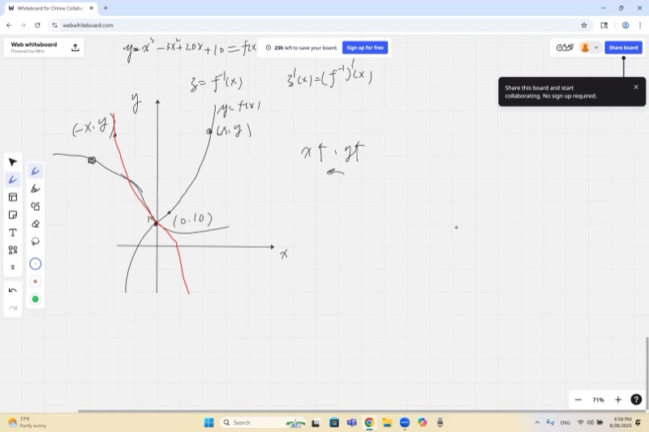
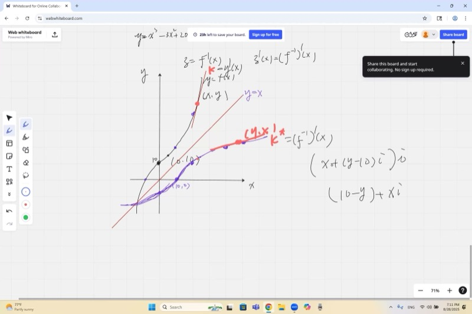
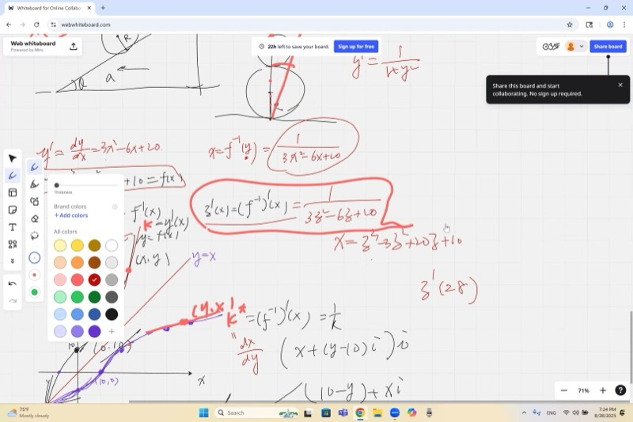
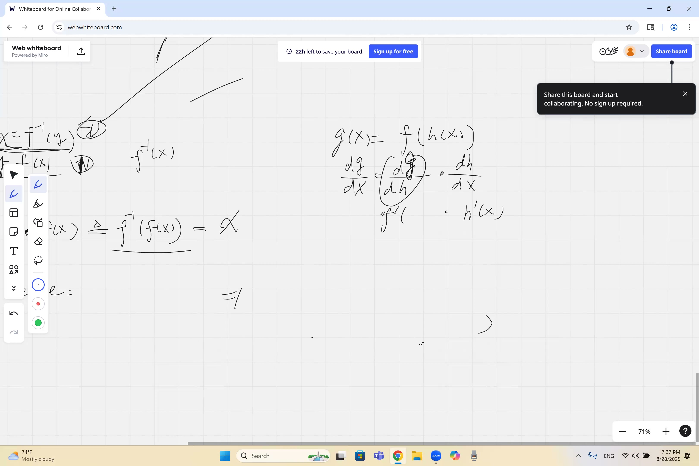

反函数是"撤销"另一个函数的函数，在温度转换等场景中经常出现。本节课讨论反函数与图形反射的关系，用链式法则处理复合函数的求导，并推导将二者联系起来的反函数导数公式。

::: {.callout-tip collapse="true"}
## 应用背景

反函数在需要"逆向求解"的场景中普遍出现：

- **温度转换**：摄氏度转华氏度是一个函数，华氏度转摄氏度即为其反函数
- **加密与解密**：编码消息是一个函数，解码过程即为反函数
- **GPS 导航**：坐标与街道地址之间的相互转换
- **信号处理**：传感器的输入输出关系与其标定曲线互为反函数

链式法则则广泛应用于物理学、机器学习等领域。
:::

## 本课内容

- 反函数图形：关于 $y = x$ 的镜像反射
- 反函数的斜率是倒数关系
- 链式法则：复合函数的导数
- 通过链式法则推导反函数导数公式
- 数值计算反函数导数
- 链式法则练习题

## 课程视频

```{=html}
<video controls width="100%" preload="metadata">
  <source src="https://github.com/ymote/learningcalculus/releases/download/v1.0/calculus20250828.mp4" type="video/mp4">
</video>
```

## 课程关键帧

```{=html}
<div style="display: flex; flex-direction: column; gap: 10px; margin: 1em 0;">
  
  
  
  
</div>
```


::: {.callout-note collapse="true"}
## 预备知识：反函数

函数 $f$ 接受一个输入并给出一个输出。**反函数** $f^{-1}$ 反转这个过程：它将输出变回输入。

$$f(a) = b \iff f^{-1}(b) = a$$

关键思想：如果点 $(a, b)$ 在 $f$ 的图形上，那么点 $(b, a)$ 在 $f^{-1}$ 的图形上。

并非每个函数都有反函数。一个函数必须是**一一对应的**（通过水平线检验）才能有反函数。
:::

::: {.callout-note collapse="true"}
## 预备知识：复合函数

**复合函数**是嵌套在另一个函数里面的函数。我们写作 $f(g(x))$ 或 $(f \circ g)(x)$。

可以理解为一个两步过程：

1. 首先，$x$ 经过 $g$ 的作用，输出 $g(x)$
2. 然后，$g(x)$ 经过 $f$ 的作用，输出 $f(g(x))$

示例：如果 $f(x) = x^2$ 且 $g(x) = 3x + 1$，则

$$f(g(x)) = f(3x+1) = (3x+1)^2$$
:::

::: {.callout-note collapse="true"}
## 预备知识：基本求导法则

回顾这些幂法则导数：

- $\frac{d}{dx}[x^n] = nx^{n-1}$
- $\frac{d}{dx}[c] = 0$（常数）
- $\frac{d}{dx}[cf(x)] = c \cdot f'(x)$（常数倍数）
- $\frac{d}{dx}[f(x) + g(x)] = f'(x) + g'(x)$（求和法则）
:::

## 反函数图形：镜像反射

$f^{-1}$ 的图形是 $f$ 关于直线 $y = x$ 的**镜像反射**。

这是因为 $f$ 上的每个点 $(a, b)$ 变成 $f^{-1}$ 上的 $(b, a)$——即 $x$ 和 $y$ 坐标互换。直线 $y = x$ 是 $x$ 轴和 $y$ 轴的**角平分线**，关于它反射恰好交换坐标。

::: {.callout-tip collapse="true"}
## 重要提示：是反射，不是旋转

一个常见错误是将图形旋转 90 度。旋转和反射是不同的变换。

- **关于 $y = x$ 的反射**：交换 $(a, b) \to (b, a)$
- **旋转 90 度**：移动 $(a, b) \to (-b, a)$

注意旋转中的负号——它改变了形状。始终想"关于 $y = x$ 的镜像"，而不是"转动页面"。
:::

**探索——查看 $f$ 和 $f^{-1}$ 作为关于 $y = x$ 的反射：**

```{=html}
<div id="calc1" class="desmos-container"></div>
<script src="https://www.desmos.com/api/v1.9/calculator.js?apiKey=dcb31709b452b1cf9dc26972add0fda6"></script>
<script>
  var calc1 = Desmos.GraphingCalculator(document.getElementById('calc1'), {
    expressions: true,
    settingsMenu: false
  });
  calc1.setExpression({ id: 'f', latex: 'y=x^2 \\left\\{x \\ge 0\\right\\}', color: '#2d70b3', lineWidth: 3 });
  calc1.setExpression({ id: 'finv', latex: 'y=\\sqrt{x}', color: '#c74440', lineWidth: 3 });
  calc1.setExpression({ id: 'mirror', latex: 'y=x', color: '#888888', lineStyle: 'DASHED', lineWidth: 1.5 });
  calc1.setExpression({ id: 'a', latex: 'a=2', sliderBounds: {min: 0, max: 4, step: 0.1} });
  calc1.setExpression({ id: 'p1', latex: '(a, a^2)', color: '#2d70b3', pointSize: 10, label: '(a, a^2)', showLabel: true });
  calc1.setExpression({ id: 'p2', latex: '(a^2, a)', color: '#c74440', pointSize: 10, label: '(a^2, a)', showLabel: true });
  calc1.setMathBounds({ left: -2, right: 8, bottom: -2, top: 8 });
</script>
```

## 反函数的斜率是倒数

这是一个优美的结论：如果 $f$ 的图形在点 $(a, b)$ 处的斜率为 $k$，那么 $f^{-1}$ 的图形在点 $(b, a)$ 处的斜率为 $\frac{1}{k}$。

$$f'(a) = k \implies (f^{-1})'(b) = \frac{1}{k}$$

原因在于：关于 $y = x$ 反射时，上升量和水平量互换。斜率 $\frac{\text{上升量}}{\text{水平量}} = k$ 变为 $\frac{\text{水平量}}{\text{上升量}} = \frac{1}{k}$。

::: {.callout-important}
## 核心要点：反函数导数公式
要求反函数在某点的斜率，取原函数在对应点斜率的倒数。如果原函数上升得很陡，反函数就上升得很缓。

$$(f^{-1})'(b) = \frac{1}{f'(f^{-1}(b))}$$
:::

用文字说：要求反函数在 $b$ 处的斜率，取 $f$ 在对应输入处斜率的倒数。

## 链式法则

链式法则给出复合函数 $f(g(x))$ 的求导方法：

::: {.callout-important}
## 核心要点：链式法则
要对嵌套函数求导，先对外层函数求导（保持内层不变），然后乘以内层函数的导数。

$$\frac{d}{dx}\big[f(g(x))\big] = f'(g(x)) \cdot g'(x)$$
:::

简而言之：**外层的导数（保持内层不动）乘以内层的导数。**

::: {.callout-tip collapse="true"}
## 链式法则的通俗解释

想象一个齿轮系统：一个小齿轮转动一个中齿轮，中齿轮转动一个大齿轮。

- 大齿轮的转速取决于中齿轮（外层导数）
- 中齿轮的转速取决于小齿轮（内层导数）
- 总转速 = 外层速率 $\times$ 内层速率

这个乘法关系正是链式法则。
:::

### 示例：对 $(3x^4 - 7x + 1)^3 - 7x^2 + 2$ 求导

分成几部分：

**部分 1：** $(3x^4 - 7x + 1)^3$——这是一个复合函数。外层函数是 $u^3$，内层是 $u = 3x^4 - 7x + 1$。

$$\frac{d}{dx}(3x^4 - 7x + 1)^3 = 3(3x^4 - 7x + 1)^2 \cdot (12x^3 - 7)$$

**部分 2：** $-7x^2 + 2$——直接用幂法则：

$$\frac{d}{dx}(-7x^2 + 2) = -14x$$

**完整答案：**

$$\frac{d}{dx}\big[(3x^4 - 7x + 1)^3 - 7x^2 + 2\big] = 3(3x^4 - 7x + 1)^2(12x^3 - 7) - 14x$$

## 推导反函数导数公式

这里是链式法则和反函数优美结合的地方。从反函数的定义性质出发：

$$f^{-1}(f(x)) = x$$

现在用链式法则对**两边**求导：

$$\frac{d}{dx}\big[f^{-1}(f(x))\big] = \frac{d}{dx}[x]$$

$$(f^{-1})'(f(x)) \cdot f'(x) = 1$$

解出 $(f^{-1})'$：

$$(f^{-1})'(f(x)) = \frac{1}{f'(x)}$$

这正是从几何上观察到的倒数关系。若 $f(a) = b$，则：

$$(f^{-1})'(b) = \frac{1}{f'(a)}$$

## 数值计算反函数导数

### 示例：求 $(f^{-1})'(28)$，其中 $f(x) = x^3 + x$

**第 1 步：** 找到哪个输入 $a$ 使得 $f(a) = 28$。

$$a^3 + a = 28$$

试 $a = 3$：$27 + 3 = 30$（太大）。试 $a = 2$：$8 + 2 = 10$（太小）。嗯——但让我们按照讲座的例子来看。试着系统地求解，或注意这道题可能用了另一个三次函数。重要的是方法：

**一般方法：**

1. **找到 $a$** 使得 $f(a) = 28$（即 $f^{-1}(28) = a$）
2. **计算 $f'(a)$**：对 $f$ 求导并代入 $a$
3. **取倒数**：$(f^{-1})'(28) = \frac{1}{f'(a)}$

**使用 $f(x) = x^3 + 3x$ 求 $(f^{-1})'(10)$ 的完整示例：**

1. 解 $a^3 + 3a = 10$。试 $a = 1$：$1 + 3 = 4$。试 $a = 2$：$8 + 6 = 14$。嗯，不是整数。让我们用 $f(x) = x^3 + x$ 求 $(f^{-1})'(30)$：
   - 解 $a^3 + a = 30$。试 $a = 3$：$27 + 3 = 30$ ✓
2. $f'(x) = 3x^2 + 1$，所以 $f'(3) = 3(9) + 1 = 28$
3. $(f^{-1})'(30) = \frac{1}{28}$

**探索——查看函数及其反函数，切线显示倒数斜率关系：**

```{=html}
<div id="calc2" class="desmos-container"></div>
<script>
  var calc2 = Desmos.GraphingCalculator(document.getElementById('calc2'), {
    expressions: true,
    settingsMenu: false
  });
  calc2.setExpression({ id: 'f', latex: 'y=x^3+x', color: '#2d70b3', lineWidth: 2.5 });
  calc2.setExpression({ id: 'mirror', latex: 'y=x', color: '#888888', lineStyle: 'DASHED', lineWidth: 1 });
  calc2.setExpression({ id: 'pt', latex: '(3, 30)', color: '#2d70b3', pointSize: 10, label: '(3, 30) on f', showLabel: true });
  calc2.setExpression({ id: 'ptinv', latex: '(30, 3)', color: '#c74440', pointSize: 10, label: '(30, 3) on f^{-1}', showLabel: true });
  calc2.setExpression({ id: 'tangent_f', latex: 'y=28(x-3)+30', color: '#2d70b3', lineStyle: 'DASHED', lineWidth: 1.5 });
  calc2.setExpression({ id: 'tangent_finv', latex: 'y=\\frac{1}{28}(x-30)+3', color: '#c74440', lineStyle: 'DASHED', lineWidth: 1.5 });
  calc2.setMathBounds({ left: -5, right: 40, bottom: -5, top: 40 });
</script>
```

## 速查表

::: {.key-formula}
| 概念 | 公式/法则 |
|---|---|
| 反函数图形 | 关于 $y = x$ 反射（交换坐标），不是旋转 |
| 反函数斜率 | 如果 $f'(a) = k$，则 $(f^{-1})'(b) = \frac{1}{k}$，其中 $b = f(a)$ |
| 反函数导数公式 | $(f^{-1})'(b) = \frac{1}{f'(f^{-1}(b))}$ |
| 链式法则 | $\frac{d}{dx}[f(g(x))] = f'(g(x)) \cdot g'(x)$ |
| 链式法则口诀 | 外层的导数 $\times$ 内层的导数 |
| 推导反函数导数 | 从 $f^{-1}(f(x)) = x$ 出发，对两边求导 |

### 数值求 $(f^{-1})'(b)$ 的步骤

1. 找到 $a$ 使得 $f(a) = b$
2. 计算 $f'(a)$
3. 答案：$(f^{-1})'(b) = \frac{1}{f'(a)}$
:::
