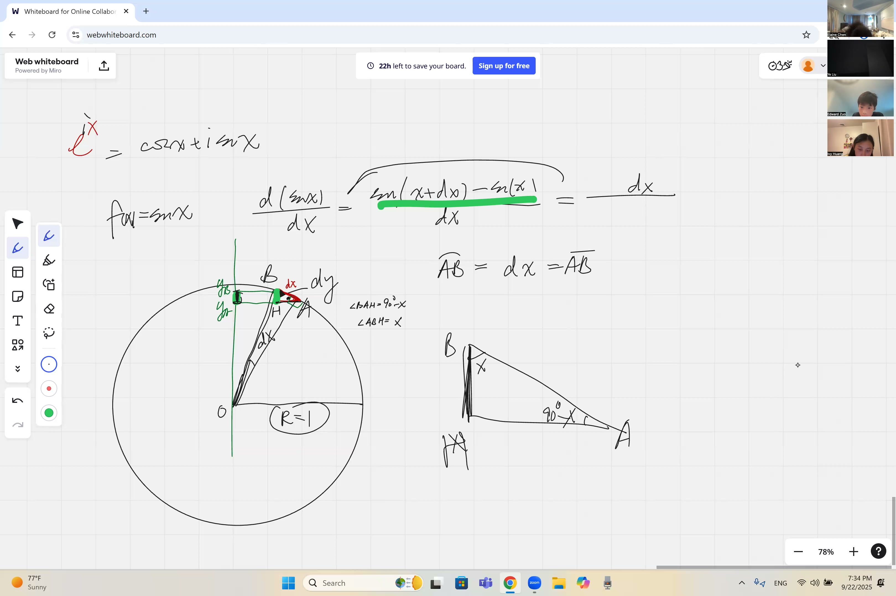
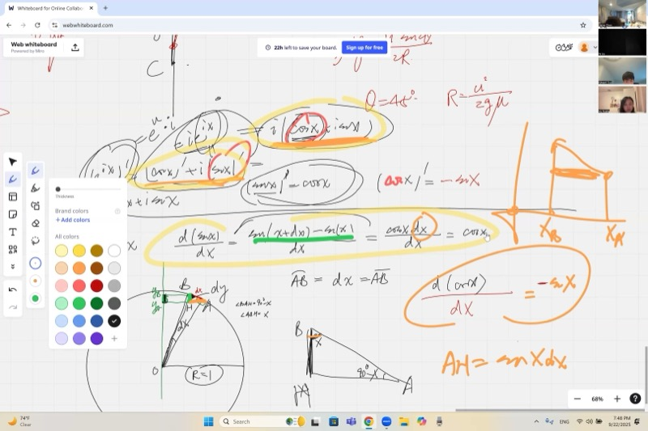
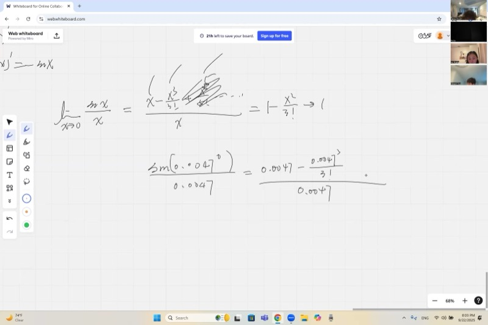
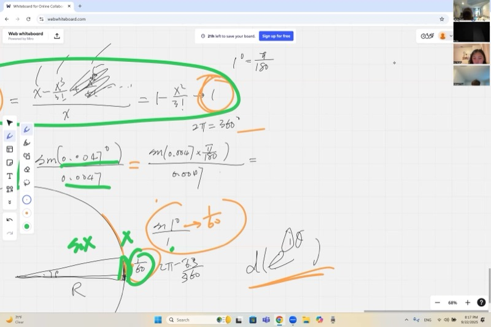

正弦和余弦广泛出现于声波、过山车、海洋潮汐以及交流电等周期性现象中。本节课将通过三种不同的方法推导 $\sin x$ 的导数为 $\cos x$，分析使之成立的关键极限，并阐明为什么弧度是唯一与微积分相容的角度度量方式。掌握这些概念后，即可运用它们分析任意周期运动。

::: {.callout-tip collapse="true"}
## 为什么三角函数的导数很重要

三角函数描述任何周期性重复的事物：

- **音乐**：声波是正弦和余弦曲线，其导数描述气压的变化速率
- **过山车**：轨道在任一点的坡度就是三角函数的导数
- **潮汐**：海平面遵循类似正弦的规律，导数可用于确定潮水上涨最快的时刻
- **电力**：家用交流电是正弦波——工程师需要它的导数来设计电路

$\sin x$ 的导数为 $\cos x$ 这一结论，是科学和工程中最常用的基本事实之一。
:::

## 本课内容

- 利用单位圆几何推导 $\frac{d}{dx}(\sin x) = \cos x$
- 几何推导 $\frac{d}{dx}(\cos x) = -\sin x$
- 三角函数导数的三种方法：复指数、几何法和麦克劳林级数
- 基本极限：$\lim_{x \to 0} \frac{\sin x}{x} = 1$
- 为什么弧度很重要（以及用角度制时会出什么问题）
- 有效数字与数值估计
- $\sin x$ 和 $\cos x$ 的麦克劳林展开

## 课程视频

```{=html}
<video controls width="100%" preload="metadata">
  <source src="https://github.com/ymote/learningcalculus/releases/download/v1.0/calculus20250922.mp4" type="video/mp4">
</video>
```

## 课程关键帧

```{=html}
<div style="display: flex; flex-direction: column; gap: 10px; margin: 1em 0;">
  
  
  
  
</div>
```


## 预备知识

::: {.callout-note collapse="true"}
## 什么是单位圆？

**单位圆**是以原点为圆心、半径为1的圆。

单位圆上的任何一点都可以写成 $(\cos\theta, \sin\theta)$，其中 $\theta$ 是从正 $x$ 轴逆时针测量的角度。

- $\cos\theta$ 是**水平**（x）坐标
- $\sin\theta$ 是**垂直**（y）坐标

这是角度和坐标之间的桥梁，也是本课所有内容的基础。
:::

::: {.callout-note collapse="true"}
## 什么是弧度？

**弧度**是一种用圆的半径来度量角度的方式。

将圆的半径沿圆弧铺开，所对应的圆心角即为**1弧度**。

- 整圆 = $2\pi$ 弧度（约6.28弧度）
- $\pi$ 弧度 = $180°$
- 换算方法：角度乘以 $\frac{\pi}{180}$

**为什么弧度对微积分很重要：**公式 $\frac{d}{dx}(\sin x) = \cos x$ 只有当 $x$ 用弧度表示时才成立。
:::

::: {.callout-note collapse="true"}
## 什么是导数？

函数的**导数**刻画其**变化率**——当输入变化时，输出变化的快慢。

从几何上看，某一点处的导数就是该点处**切线的斜率**。

我们将其写作 $\frac{d}{dx} f(x)$ 或 $f'(x)$。
:::

::: {.callout-note collapse="true"}
## 什么是阶乘？

**阶乘**写作 $n!$，表示"从1到 $n$ 的所有整数的乘积"。

- $3! = 3 \times 2 \times 1 = 6$
- $5! = 5 \times 4 \times 3 \times 2 \times 1 = 120$
- $0! = 1$（按定义）

阶乘增长极快，在级数展开中经常出现。
:::

## 核心概念

::: {.callout-important}
## 核心要点：正弦的导数
$\sin x$ 的导数是 $\cos x$。从几何上可以这样理解：当单位圆上的角度增加微小量时，纵坐标（正弦）的变化率等于横坐标（余弦）。

$$\frac{d}{dx}(\sin x) = \cos x$$
:::

### 几何推导：$\frac{d}{dx}(\sin x) = \cos x$

想象一个点在单位圆上移动。当角度 $\theta$ 增加微小量 $\Delta\theta$ 时：

1. 该点沿一段微小的**弧**移动，弧长为 $\Delta\theta$（因为半径 = 1，弧长 = 弧度角）
2. 对于非常小的角度，弧实际上就是一条直线段——**弧 $\approx$ 弦**
3. 这个微小位移沿圆的切线方向，垂直于半径
4. 这个位移的**垂直分量**（$\sin\theta$ 的变化量）为 $\Delta\theta \cdot \cos\theta$

所以：

$$\frac{\Delta(\sin\theta)}{\Delta\theta} \approx \cos\theta$$

在极限下：$\frac{d}{d\theta}(\sin\theta) = \cos\theta$

**交互演示——观察 $\sin\theta$ 如何随 $\theta$ 变化：**

```{=html}
<div id="calc1" class="desmos-container"></div>
<script src="https://www.desmos.com/api/v1.9/calculator.js?apiKey=dcb31709b452b1cf9dc26972add0fda6"></script>
<script>
  var calc1 = Desmos.GraphingCalculator(document.getElementById('calc1'), {
    expressions: true,
    settingsMenu: false
  });
  calc1.setExpression({ id: 'circle', latex: 'x^2+y^2=1', color: '#aaaaaa' });
  calc1.setExpression({ id: 'theta', latex: '\\theta=1', sliderBounds: {min: 0, max: 6.28, step: 0.01} });
  calc1.setExpression({ id: 'point', latex: '(\\cos\\theta, \\sin\\theta)', color: '#2d70b3', pointSize: 12, label: '(cos θ, sin θ)', showLabel: true });
  calc1.setExpression({ id: 'sinline', latex: 'x=\\cos\\theta', color: '#c74440', lineStyle: 'DASHED', domain: {min: '\\min(0,\\sin\\theta)', max: '\\max(0,\\sin\\theta)'} });
  calc1.setExpression({ id: 'cosline', latex: 'y=0', color: '#388c46', lineStyle: 'DASHED', domain: {min: '\\min(0,\\cos\\theta)', max: '\\max(0,\\cos\\theta)'} });
  calc1.setExpression({ id: 'sinlabel', latex: '(\\cos\\theta, \\sin\\theta/2)', color: '#c74440', pointSize: 0, label: 'sin θ', showLabel: true });
  calc1.setExpression({ id: 'coslabel', latex: '(\\cos\\theta/2, 0)', color: '#388c46', pointSize: 0, label: 'cos θ', showLabel: true });
  calc1.setMathBounds({ left: -1.5, right: 1.5, bottom: -1.5, top: 1.5 });
</script>
```

::: {.callout-important}
## 核心要点：余弦的导数
$\cos x$ 的导数是 $-\sin x$。负号是合理的：当 $\sin x$ 为正（点在 x 轴上方）时，横坐标（余弦）在递减，所以其变化率为负。

$$\frac{d}{dx}(\cos x) = -\sin x$$
:::

### 几何推导：$\frac{d}{dx}(\cos x) = -\sin x$

同样的推理，但现在我们看**水平分量**：

1. 当 $\theta$ 增加 $\Delta\theta$ 时，微小位移沿圆的切线方向
2. 这个位移的**水平分量**为 $-\Delta\theta \cdot \sin\theta$（负号是因为在上半部分，$\theta$ 增大时点向左移动）

$$\frac{d}{d\theta}(\cos\theta) = -\sin\theta$$

::: {.callout-tip collapse="true"}
## 为什么有负号？

考虑以下情形：当 $\theta$ 在 $0$ 和 $\pi/2$ 之间时，点在**向上且向左**移动。因此 $\sin\theta$ 在增加（正导数），而 $\cos\theta$ 在减少（负导数）。$-\sin\theta$ 恰好反映了这一点：在正弦为正的区域，余弦在递减。
:::

::: {.callout-important}
## 核心要点：sin(x)/x 极限
对于小角度（弧度制），$\sin x$ 几乎完全等于 $x$ 本身。这个事实是使正弦的导数等于余弦的隐藏引擎，而且它只在 $x$ 用弧度度量时才成立。

$$\lim_{x \to 0} \frac{\sin x}{x} = 1$$
:::

### 基本极限：$\lim_{x \to 0} \frac{\sin x}{x} = 1$

这个极限是 $\frac{d}{dx}(\sin x) = \cos x$ 背后的隐藏引擎。

**为什么它是对的？** 利用麦克劳林级数：

$$\sin x = x - \frac{x^3}{3!} + \frac{x^5}{5!} - \cdots$$

两边除以 $x$：

$$\frac{\sin x}{x} = 1 - \frac{x^2}{3!} + \frac{x^4}{5!} - \cdots$$

当 $x \to 0$ 时，除第一项外所有项都趋于零，所以 $\frac{\sin x}{x} \to 1$。

**交互演示——在 $x = 0$ 附近放大观察：**

```{=html}
<div id="calc2" class="desmos-container"></div>
<script>
  var calc2 = Desmos.GraphingCalculator(document.getElementById('calc2'), {
    expressions: true,
    settingsMenu: false
  });
  calc2.setExpression({ id: 'sinc', latex: 'y=\\frac{\\sin(x)}{x}', color: '#2d70b3' });
  calc2.setExpression({ id: 'limit', latex: '(0, 1)', color: '#c74440', pointSize: 10, pointStyle: 'OPEN', label: 'Limit = 1', showLabel: true });
  calc2.setExpression({ id: 'one', latex: 'y=1', color: '#aaaaaa', lineStyle: 'DASHED' });
  calc2.setMathBounds({ left: -15, right: 15, bottom: -0.5, top: 1.5 });
</script>
```

### 动画演示：sin(x)/x 趋近于 1 的动态缩放

```{=html}
<div class="d3-container" id="d3_0922_1">
  <h4 style="margin:0 0 8px;">sin(x)/x Approaching 1 as x → 0</h4>
  <p style="margin:0 0 8px;font-size:13px;color:#555;">Press Play to zoom into x = 0 and watch the function value converge to 1.</p>
  <svg id="d3_0922_1_svg"></svg>
  <div class="d3-controls" style="margin-top:8px;display:flex;gap:12px;align-items:center;flex-wrap:wrap;">
    <button id="d3_0922_1_play" style="padding:4px 16px;cursor:pointer;">&#9654; Zoom In</button>
    <button id="d3_0922_1_reset" style="padding:4px 16px;cursor:pointer;">Reset</button>
    <label>Zoom level: <input type="range" id="d3_0922_1_zoom" min="0" max="100" value="0" step="1"><span id="d3_0922_1_zoom_val">0%</span></label>
    <span id="d3_0922_1_info" style="font-size:13px;color:#555;"></span>
  </div>
</div>
<script>
(function(){
  var W=560, H=380;
  var margin={top:20,right:20,bottom:35,left:50};
  var w=W-margin.left-margin.right, h=H-margin.top-margin.bottom;
  var svg=d3.select("#d3_0922_1_svg").attr("width",W).attr("height",H);
  var g=svg.append("g").attr("transform","translate("+margin.left+","+margin.top+")");

  var xAxisG=g.append("g").attr("transform","translate(0,"+h+")");
  var yAxisG=g.append("g");
  var curvePath=g.append("path").attr("fill","none").attr("stroke","#2d70b3").attr("stroke-width",2.5);
  var oneLine=g.append("line").attr("stroke","#e74c3c").attr("stroke-width",1.5).attr("stroke-dasharray","5,3");
  var oneLabel=g.append("text").attr("fill","#e74c3c").attr("font-size",12);
  var probeDot=g.append("circle").attr("r",5).attr("fill","#388c46");
  var probeLabel=g.append("text").attr("font-size",12).attr("fill","#388c46");
  var holeDot=g.append("circle").attr("r",6).attr("fill","#fff").attr("stroke","#c74440").attr("stroke-width",2);
  var info=document.getElementById("d3_0922_1_info");

  var zoom=0, animating=false, animId=null;

  function sinc(x){return x===0?1:Math.sin(x)/x;}

  function draw(){
    var t=zoom/100;
    var halfRange=12*Math.pow(0.01,t); // from 12 down to 0.12
    var xDom=[-halfRange,halfRange];
    var yRange=0.6*Math.pow(0.05,t); // vertical zoom too
    var yDom=[1-yRange,1+yRange*0.3];
    if(zoom<30){yDom=[-0.4,1.3];}

    var xS=d3.scaleLinear().domain(xDom).range([0,w]);
    var yS=d3.scaleLinear().domain(yDom).range([h,0]);
    xAxisG.call(d3.axisBottom(xS).ticks(8));
    yAxisG.call(d3.axisLeft(yS).ticks(6));

    // curve
    var pts=[], step=Math.max(0.001,(xDom[1]-xDom[0])/400);
    for(var x=xDom[0];x<=xDom[1];x+=step){
      if(Math.abs(x)<1e-10) continue;
      pts.push({x:x,y:sinc(x)});
    }
    var line=d3.line().x(function(d){return xS(d.x);}).y(function(d){return yS(d.y);}).curve(d3.curveBasis);
    curvePath.attr("d",line(pts));

    oneLine.attr("x1",0).attr("y1",yS(1)).attr("x2",w).attr("y2",yS(1));
    oneLabel.attr("x",w-5).attr("y",yS(1)-5).text("y = 1 (limit)");

    holeDot.attr("cx",xS(0)).attr("cy",yS(1));

    // probe point
    var px=halfRange*0.3;
    var pv=sinc(px);
    probeDot.attr("cx",xS(px)).attr("cy",yS(pv));
    probeLabel.attr("x",xS(px)+8).attr("y",yS(pv)-8).text("sin("+px.toFixed(4)+")/"+px.toFixed(4)+" = "+pv.toFixed(6));

    info.textContent="Zoom: "+zoom+"% | Window: ["+xDom[0].toFixed(3)+", "+xDom[1].toFixed(3)+"] | At x="+px.toFixed(4)+": sin(x)/x = "+pv.toFixed(8);
  }

  function animate(){
    zoom+=0.5;
    if(zoom>100){zoom=100;animating=false;document.getElementById("d3_0922_1_play").textContent="\u25B6 Zoom In";}
    document.getElementById("d3_0922_1_zoom").value=zoom;
    document.getElementById("d3_0922_1_zoom_val").textContent=Math.round(zoom)+"%";
    draw();
    if(animating) animId=requestAnimationFrame(animate);
  }

  document.getElementById("d3_0922_1_play").addEventListener("click",function(){
    if(!animating){animating=true;this.textContent="\u23F8 Pause";animate();}
    else{animating=false;this.textContent="\u25B6 Zoom In";if(animId)cancelAnimationFrame(animId);}
  });
  document.getElementById("d3_0922_1_reset").addEventListener("click",function(){
    zoom=0;animating=false;
    document.getElementById("d3_0922_1_play").textContent="\u25B6 Zoom In";
    document.getElementById("d3_0922_1_zoom").value=0;
    document.getElementById("d3_0922_1_zoom_val").textContent="0%";
    draw();
  });
  document.getElementById("d3_0922_1_zoom").addEventListener("input",function(){zoom=+this.value;document.getElementById("d3_0922_1_zoom_val").textContent=Math.round(zoom)+"%";draw();});

  draw();
})();
</script>
```

### 动画演示：弧长与弦长——为什么 sin(θ)/θ → 1

```{=html}
<div class="d3-container" id="d3_0922_2">
  <h4 style="margin:0 0 8px;">Arc vs Chord: Why sin(θ)/θ → 1</h4>
  <p style="margin:0 0 8px;font-size:13px;color:#555;">As θ shrinks, the arc (green) and chord (red) become nearly identical — their ratio approaches 1.</p>
  <svg id="d3_0922_2_svg"></svg>
  <div class="d3-controls" style="margin-top:8px;display:flex;gap:12px;align-items:center;flex-wrap:wrap;">
    <button id="d3_0922_2_play" style="padding:4px 16px;cursor:pointer;">&#9654; Shrink Angle</button>
    <label>θ (radians): <input type="range" id="d3_0922_2_theta" min="0.02" max="2.5" value="1.5" step="0.01"><span id="d3_0922_2_theta_val">1.50</span></label>
    <span id="d3_0922_2_info" style="font-size:13px;color:#555;"></span>
  </div>
</div>
<script>
(function(){
  var W=520, H=420;
  var margin={top:20,right:140,bottom:35,left:50};
  var w=W-margin.left-margin.right, h=H-margin.top-margin.bottom;
  var svg=d3.select("#d3_0922_2_svg").attr("width",W).attr("height",H);
  var g=svg.append("g").attr("transform","translate("+margin.left+","+margin.top+")");

  var R=Math.min(w,h)/2-10;
  var cxP=w/2, cyP=h/2;

  // unit circle
  g.append("circle").attr("cx",cxP).attr("cy",cyP).attr("r",R).attr("fill","none").attr("stroke","#aaa").attr("stroke-width",1.5);
  // axes
  g.append("line").attr("x1",cxP-R-20).attr("y1",cyP).attr("x2",cxP+R+20).attr("y2",cyP).attr("stroke","#ddd");
  g.append("line").attr("x1",cxP).attr("y1",cyP-R-20).attr("x2",cxP).attr("y2",cyP+R+20).attr("stroke","#ddd");

  var arcPath=g.append("path").attr("fill","none").attr("stroke","#2ecc71").attr("stroke-width",3);
  var chordLine=g.append("line").attr("stroke","#e74c3c").attr("stroke-width",2.5);
  var sinLine=g.append("line").attr("stroke","#3498db").attr("stroke-width",2).attr("stroke-dasharray","4,3");
  var radiusLine=g.append("line").attr("stroke","#333").attr("stroke-width",1.5);
  var dot1=g.append("circle").attr("r",5).attr("fill","#333");
  var dot2=g.append("circle").attr("r",5).attr("fill","#c74440");
  var originDot=g.append("circle").attr("cx",cxP).attr("cy",cyP).attr("r",3).attr("fill","#333");

  // Labels in right margin
  var arcLabel=g.append("text").attr("font-size",13).attr("fill","#2ecc71").attr("x",w+10).attr("y",h/2-40);
  var chordLabel=g.append("text").attr("font-size",13).attr("fill","#e74c3c").attr("x",w+10).attr("y",h/2-15);
  var sinLabel=g.append("text").attr("font-size",13).attr("fill","#3498db").attr("x",w+10).attr("y",h/2+10);
  var ratioLabel=g.append("text").attr("font-size",14).attr("font-weight","bold").attr("fill","#333").attr("x",w+10).attr("y",h/2+45);
  var info=document.getElementById("d3_0922_2_info");

  var theta=1.5, animating=false, animId=null;

  function draw(){
    var px=cxP+R*Math.cos(theta), py=cyP-R*Math.sin(theta);
    var bx=cxP+R, by=cyP; // point at angle 0

    // arc from (1,0) to (cos θ, sin θ)
    var steps=60, arcPts=[];
    for(var i=0;i<=steps;i++){
      var a=i/steps*theta;
      arcPts.push([cxP+R*Math.cos(a), cyP-R*Math.sin(a)]);
    }
    var arcD="M"+arcPts.map(function(p){return p[0]+","+p[1];}).join("L");
    arcPath.attr("d",arcD);

    // chord from (1,0) to point
    chordLine.attr("x1",bx).attr("y1",by).attr("x2",px).attr("y2",py);

    // sin line (vertical from point to x-axis)
    sinLine.attr("x1",px).attr("y1",py).attr("x2",px).attr("y2",cyP);

    // radius to point
    radiusLine.attr("x1",cxP).attr("y1",cyP).attr("x2",px).attr("y2",py);

    dot1.attr("cx",bx).attr("cy",by);
    dot2.attr("cx",px).attr("cy",py);

    var arcLen=theta; // arc length = θ on unit circle
    var chordLen=Math.sqrt(2-2*Math.cos(theta));
    var sinVal=Math.sin(theta);
    var ratio=sinVal/theta;

    arcLabel.text("Arc = θ = "+arcLen.toFixed(4));
    chordLabel.text("Chord = "+chordLen.toFixed(4));
    sinLabel.text("sin(θ) = "+sinVal.toFixed(4));
    ratioLabel.text("sin(θ)/θ = "+ratio.toFixed(6));

    info.textContent="θ = "+theta.toFixed(3)+" rad | arc = "+arcLen.toFixed(4)+" | sin(θ) = "+sinVal.toFixed(4)+" | ratio = "+ratio.toFixed(6);
  }

  function animate(){
    theta*=0.985;
    if(theta<0.02){theta=0.02;animating=false;document.getElementById("d3_0922_2_play").textContent="\u25B6 Shrink Angle";}
    document.getElementById("d3_0922_2_theta").value=theta;
    document.getElementById("d3_0922_2_theta_val").textContent=theta.toFixed(2);
    draw();
    if(animating) animId=requestAnimationFrame(animate);
  }

  document.getElementById("d3_0922_2_play").addEventListener("click",function(){
    if(!animating){animating=true;theta=2.5;this.textContent="\u23F8 Pause";animate();}
    else{animating=false;this.textContent="\u25B6 Shrink Angle";if(animId)cancelAnimationFrame(animId);}
  });
  document.getElementById("d3_0922_2_theta").addEventListener("input",function(){theta=+this.value;document.getElementById("d3_0922_2_theta_val").textContent=theta.toFixed(2);draw();});

  draw();
})();
</script>
```

### 弧度 vs. 角度制：为什么弧度胜出

极限 $\frac{\sin x}{x} \to 1$ **只有当 $x$ 用弧度表示时才成立**。

如果 $x$ 用角度表示：

$$\lim_{x \to 0} \frac{\sin_{\text{deg}}(x)}{x} = \frac{\pi}{180} \approx 0.01745$$

::: {.callout-tip collapse="true"}
## 数值示例：$\frac{\sin(0.0047°)}{0.0047}$

需要注意的是，若角度以度为单位，则必须先进行换算：

$$0.0047° = 0.0047 \times \frac{\pi}{180} \approx 8.203 \times 10^{-5} \text{ 弧度}$$

由于小弧度角时 $\sin(\theta) \approx \theta$：

$$\sin(0.0047°) \approx 8.203 \times 10^{-5}$$

所以 $\frac{\sin(0.0047°)}{0.0047} \approx \frac{8.203 \times 10^{-5}}{0.0047} \approx 0.01745 = \frac{\pi}{180}$

答案不是1——而是 $\frac{\pi}{180}$，因为我们除以的是角度值，而不是弧度值。
:::

### 殊途同归

有三种完全不同的方法可以证明 $\frac{d}{dx}(\sin x) = \cos x$：

| 方法 | 核心思想 |
|---|---|
| **复指数法** | 将 $\sin x = \frac{e^{ix} - e^{-ix}}{2i}$，利用 $\frac{d}{dx}e^{ix} = ie^{ix}$ 求导 |
| **几何法（单位圆）** | 小角度时弧 $\approx$ 弦，投影到纵轴 |
| **麦克劳林级数法** | 逐项对 $x - \frac{x^3}{3!} + \frac{x^5}{5!} - \cdots$ 求导 |

三种方法给出相同结果，这为结论的正确性提供了有力的佐证。

### 正弦和余弦的麦克劳林级数

以下无穷级数使得仅用加法和乘法即可计算三角函数：

$$\sin x = x - \frac{x^3}{3!} + \frac{x^5}{5!} - \frac{x^7}{7!} + \cdots = \sum_{n=0}^{\infty} \frac{(-1)^n \, x^{2n+1}}{(2n+1)!}$$

$$\cos x = 1 - \frac{x^2}{2!} + \frac{x^4}{4!} - \frac{x^6}{6!} + \cdots = \sum_{n=0}^{\infty} \frac{(-1)^n \, x^{2n}}{(2n)!}$$

::: {.callout-tip collapse="true"}
## 可以观察到以下规律

- $\sin x$ 只有**奇数**次幂：$x^1, x^3, x^5, \ldots$
- $\cos x$ 只有**偶数**次幂：$x^0, x^2, x^4, \ldots$
- 符号交替出现：$+, -, +, -, \ldots$
- 对 $\sin x$ 的级数逐项求导，恰好得到 $\cos x$ 的级数
:::

**交互演示——观察添加更多项如何逐步逼近真实曲线：**

```{=html}
<div id="calc3" class="desmos-container"></div>
<script>
  var calc3 = Desmos.GraphingCalculator(document.getElementById('calc3'), {
    expressions: true,
    settingsMenu: false
  });
  calc3.setExpression({ id: 'sin', latex: 'y=\\sin(x)', color: '#2d70b3', lineWidth: 3 });
  calc3.setExpression({ id: 't1', latex: 'y=x', color: '#c74440', lineStyle: 'DASHED', lineWidth: 1.5 });
  calc3.setExpression({ id: 't3', latex: 'y=x-\\frac{x^3}{6}', color: '#388c46', lineStyle: 'DASHED', lineWidth: 1.5 });
  calc3.setExpression({ id: 't5', latex: 'y=x-\\frac{x^3}{6}+\\frac{x^5}{120}', color: '#6042a6', lineStyle: 'DASHED', lineWidth: 1.5 });
  calc3.setExpression({ id: 't7', latex: 'y=x-\\frac{x^3}{6}+\\frac{x^5}{120}-\\frac{x^7}{5040}', color: '#fa7e19', lineStyle: 'DASHED', lineWidth: 1.5 });
  calc3.setMathBounds({ left: -8, right: 8, bottom: -3, top: 3 });
</script>
```

### 有效数字与数值估计

处理非常小的角度时：

- 当 $x$（弧度制）很小时，$\sin x \approx x$，$x$ 越小近似越精确
- 可信赖的**有效数字**数量取决于 $x$ 的大小
- 计算前应确认角度的单位是**弧度**还是**角度**

## 速查表

::: {.key-formula}
| 公式 | 备注 |
|---|---|
| $\frac{d}{dx}(\sin x) = \cos x$ | $x$ 必须用弧度 |
| $\frac{d}{dx}(\cos x) = -\sin x$ | 注意负号 |
| $\lim_{x \to 0} \frac{\sin x}{x} = 1$ | 仅限弧度制 |
| $\lim_{x \to 0} \frac{\sin_{\text{deg}} x}{x} = \frac{\pi}{180}$ | 角度制下 |
| $\sin x \approx x$（$x$ 较小时） | 一阶近似 |

### 麦克劳林级数

$$\sin x = x - \frac{x^3}{3!} + \frac{x^5}{5!} - \cdots$$

$$\cos x = 1 - \frac{x^2}{2!} + \frac{x^4}{4!} - \cdots$$

### 角度制转弧度

$$\theta_{\text{rad}} = \theta_{\text{deg}} \times \frac{\pi}{180}$$
:::
