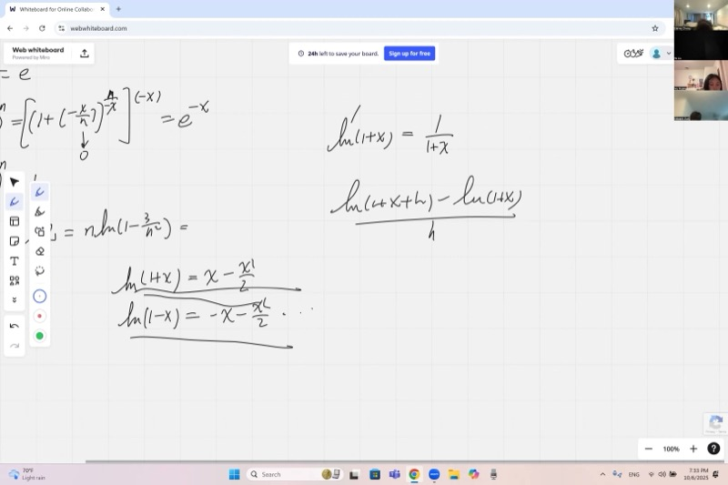
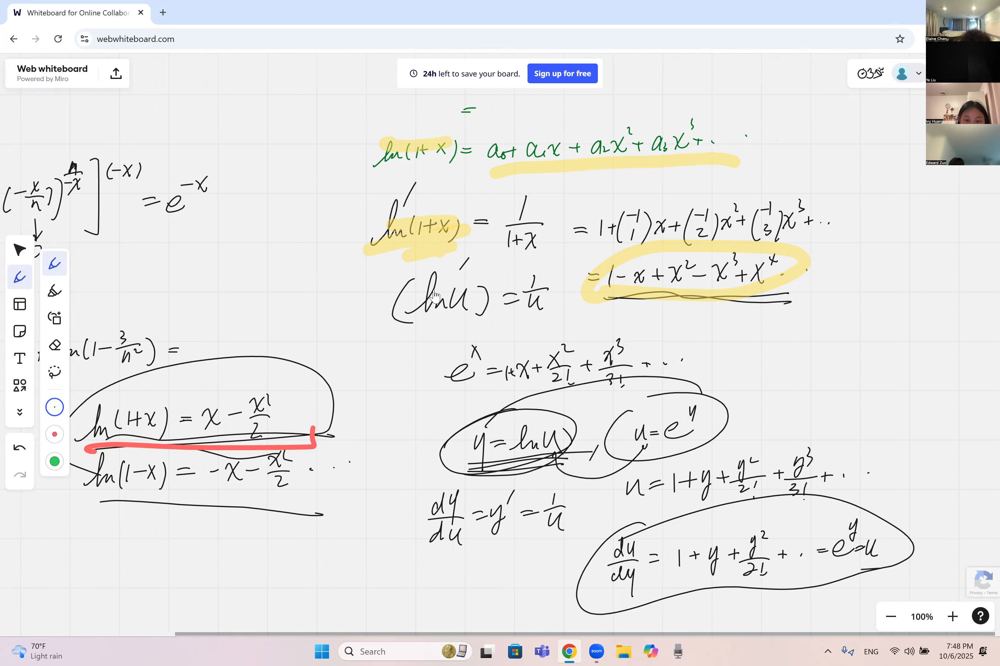
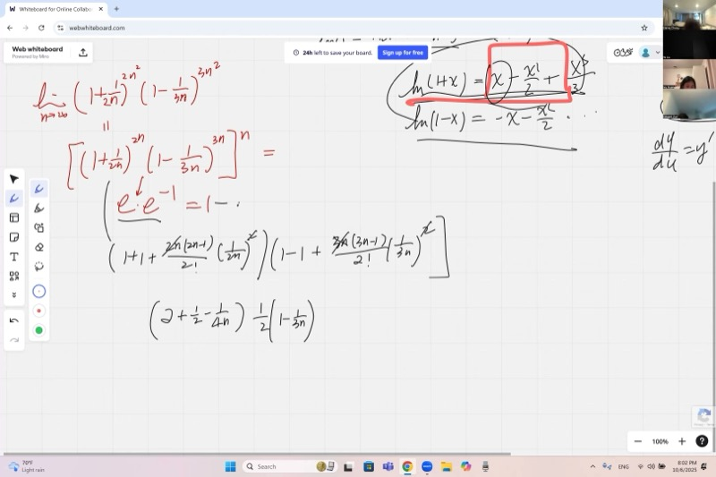
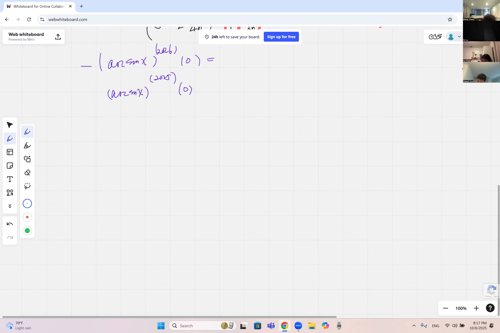

数字 $e$ 在数学中无处不在，今天你将看到原因。我们将处理乍一看不可能的极限——像 $(1 + \text{很小的数})^{\text{很大的幂}}$ 这样的表达式——并学习一个强大的对数技巧来攻克它们。你还将发现一个神奇的捷径：如果你知道一个函数的幂级数，你可以直接读出它在零点处的第 2024 阶导数，而不需要做一次求导。真的。

::: {.callout-tip collapse="true"}
## 为什么涉及 e 的极限和幂展开很重要

数字 $e$ 和计算棘手极限的技巧在科学和日常生活中不断出现：

- **金融**：复利公式使用 $(1 + r/n)^n$，它趋近于 $e^r$——这正是银行计算连续复利的方法
- **医学**：血液中的药物浓度按指数衰减，医生使用涉及 $e$ 的极限来确定给药方案
- **工程**：带有电容器的电路按照基于 $e$ 的指数曲线充放电，工程师用幂展开来近似这些曲线
- **计算机科学**：将问题一分为二的算法具有对数复杂度——理解 $\ln(1+x)$ 展开有助于分析其性能
- **物理学**：放射性衰变、热传导和种群动态都依赖于由 $e$ 的定义构建的指数函数

今天我们将掌握计算伪装了 $e$ 的定义的极限的技巧，看看幂展开何时有效（何时失效！），并发现麦克劳林级数如何让我们在不做求导的情况下找到极高阶的导数。
:::

## 本课内容

- $e$ 的定义：$\displaystyle\lim_{n \to \infty}\left(1 + \frac{1}{n}\right)^n = e$
- 极限定义的变体：$\displaystyle\lim_{n \to \infty}\left(1 - \frac{x}{n}\right)^n = e^{-x}$
- 用对数技巧计算 $\displaystyle\lim_{n \to \infty}\left(1 - \frac{3}{n^2}\right)^n$ 等极限
- 从头推导 $\ln(1+x)$ 的幂展开
- 使用 $\ln(1+x)$ 展开处理直接二项展开失效的极限
- 为什么 $(1 + 1/n)^n$ 的二项展开在按 $n$ 的幂次截断时不收敛
- 麦克劳林系数公式：$f^{(k)}(0) = k! \cdot a_k$
- 奇函数和偶函数及其对麦克劳林展开的影响
- 利用幂级数求 $\arcsin x$ 的高阶导数

## 课程视频

```{=html}
<video controls width="100%" preload="metadata">
  <source src="https://github.com/ymote/learningcalculus/releases/download/v1.0/calculus20251006.mp4" type="video/mp4">
</video>
```

## 课程关键帧

```{=html}
<div style="display: flex; flex-direction: column; gap: 10px; margin: 1em 0;">
  
  
  
  
</div>
```


## 预备知识

::: {.callout-note collapse="true"}
## 什么是数字 e？

数字 $e \approx 2.71828\ldots$ 是数学中最重要的常数之一。它定义为：

$$e = \lim_{n \to \infty}\left(1 + \frac{1}{n}\right)^n$$

当 $n$ 增大时，底数 $1 + 1/n$ 越来越接近 1，但指数 $n$ 无限增长。这两个相反的力量平衡出有限数 $e$。这是一个 $1^\infty$ 不定式——结果可能是 1、无穷大，或介于两者之间的任何值，取决于底数和指数如何相互作用。
:::

::: {.callout-note collapse="true"}
## 什么是 ln(1+x) 的麦克劳林展开？

我们在之前的课中证明过：

$$\ln(1+x) = x - \frac{x^2}{2} + \frac{x^3}{3} - \frac{x^4}{4} + \cdots = \sum_{k=1}^{\infty} \frac{(-1)^{k+1} x^k}{k}$$

这是通过对几何级数 $\frac{1}{1+x} = 1 - x + x^2 - x^3 + \cdots$ 逐项积分得到的。积分常数通过代入 $x = 0$（因为 $\ln 1 = 0$）来确定。
:::

::: {.callout-note collapse="true"}
## 什么是二项展开？

**二项展开**将 $(1+x)^n$ 推广到任意指数 $n$，包括负数或分数：

$$(1+x)^n = \sum_{k=0}^{\infty} \binom{n}{k} x^k = 1 + nx + \frac{n(n-1)}{2!}x^2 + \frac{n(n-1)(n-2)}{3!}x^3 + \cdots$$

当 $n$ 是负整数如 $-1$ 时，这给出几何级数：

$$(1+x)^{-1} = 1 - x + x^2 - x^3 + \cdots$$
:::

::: {.callout-note collapse="true"}
## 什么是奇函数和偶函数？

**偶函数**满足 $f(-x) = f(x)$——其图像关于 $y$ 轴对称。例如：$x^2$、$\cos x$。

**奇函数**满足 $f(-x) = -f(x)$——其图像关于原点具有旋转对称性。例如：$x^3$、$\sin x$。

就麦克劳林级数而言：

- 偶函数只含 $x$ 的**偶次幂**
- 奇函数只含 $x$ 的**奇次幂**

这意味着对于奇函数，在零处的所有偶数阶导数自动为零！
:::

::: {.callout-note collapse="true"}
## 麦克劳林系数与导数的关系是什么？

如果一个函数具有麦克劳林展开 $f(x) = \sum_{k=0}^{\infty} a_k x^k$，则每个系数编码了一个导数：

$$a_k = \frac{f^{(k)}(0)}{k!} \quad \Longleftrightarrow \quad f^{(k)}(0) = k! \cdot a_k$$

因此如果你知道幂级数，你可以直接读出零处的任何导数，而不需要做求导！
:::

## 核心要点

### e 的定义的变体

我们从基本定义出发：

$$\lim_{n \to \infty}\left(1 + \frac{1}{n}\right)^n = e$$

关键特征是括号内加到 1 上的项是指数的**倒数**。我们可以通过将其他表达式强行转化为这种形式来创建变体。

**示例 1**：求 $\displaystyle\lim_{n \to \infty}\left(1 - \frac{x}{n}\right)^n$。

我们重写表达式以匹配定义。由于括号内有 $-x/n$，指数为 $n$，我们可以写成：

$$\left(1 + \frac{(-x)}{n}\right)^n$$

为了将其强行转化为 $e$ 的定义形式，我们需要指数是 $-x/n$ 的倒数，即 $-n/x$。所以我们写成：

$$\left(1 + \frac{(-x)}{n}\right)^{(-n/x) \cdot (-x)} = \left[\left(1 + \frac{(-x)}{n}\right)^{-n/x}\right]^{-x}$$

当 $n \to \infty$ 时，内部括号由定义趋近于 $e$，所以极限为：

::: {.callout-important}
## 核心要点：e 的定义的变体
任何形如 $(1 + \text{某项}/n)^n$ 的极限都可以转化为 $e$ 的定义。技巧是重写表达式，使指数成为括号内小项的倒数。

$$\boxed{\lim_{n \to \infty}\left(1 - \frac{x}{n}\right)^n = e^{-x}}$$
:::

**探索——观察 $(1 + 1/n)^n$ 如何收敛到 $e$：**

::: {.desmos-container}
```{=html}
<div id="calc-e-def" style="width: 100%; height: 400px;"></div>
<script src="https://www.desmos.com/api/v1.9/calculator.js?apiKey=dcb31709b452b1cf9dc26972add0fda6"></script>
<script>
var elt1 = document.getElementById('calc-e-def');
var calc1 = Desmos.GraphingCalculator(elt1, { expressions: true, settingsMenu: false });
calc1.setExpression({ id: 'e_def', latex: 'y=\\left(1+\\frac{1}{x}\\right)^{x}', color: '#2d70b3', lineWidth: 3 });
calc1.setExpression({ id: 'e_line', latex: 'y=e', color: '#c74440', lineWidth: 2, lineStyle: 'DASHED' });
calc1.setExpression({ id: 'n_slider', latex: 'n=10', sliderBounds: {min: 1, max: 200, step: 1} });
calc1.setExpression({ id: 'pt', latex: '\\left(n, \\left(1+\\frac{1}{n}\\right)^{n}\\right)', color: '#388c46', pointSize: 10, label: '(1+1/n)^n', showLabel: true });
calc1.setMathBounds({ left: -5, right: 100, bottom: 1, top: 4 });
</script>
```
:::

*拖动滑块 $n$，观察绿色点如何趋近红色虚线 $y = e \approx 2.718$。*

### 极限的对数技巧

**示例 2**：求 $\displaystyle\lim_{n \to \infty}\left(1 - \frac{3}{n^2}\right)^n$。

这个极限不能直接转化为 $e$ 的定义，因为括号内的项是 $-3/n^2$，而指数只是 $n$（不是 $n^2$）。令极限为 $L$，取自然对数：

$$\ln L = \lim_{n \to \infty} n \cdot \ln\left(1 - \frac{3}{n^2}\right)$$

现在我们应用麦克劳林展开 $\ln(1+u) = u - \frac{u^2}{2} + \cdots$，其中 $u = -3/n^2$：

$$\ln\left(1 - \frac{3}{n^2}\right) = -\frac{3}{n^2} - \frac{9}{2n^4} - \cdots$$

乘以 $n$：

$$n \cdot \ln\left(1 - \frac{3}{n^2}\right) = -\frac{3}{n} - \frac{9}{2n^3} - \cdots$$

当 $n \to \infty$ 时，每一项都趋于零。所以 $\ln L = 0$，这意味着：

$$\boxed{L = e^0 = 1}$$

我们可以验证这在直觉上是合理的：底数 $1 - 3/n^2$ 比指数 $n$ 的增长更快地趋近 1，所以极限收缩为 1。

**替代方法**：直接转化为 $e$ 的定义。重写为：

$$\left(1 + \frac{(-3)}{n^2}\right)^{(-n^2/3) \cdot (-3/n)} = \left[\left(1 + \frac{(-3)}{n^2}\right)^{-n^2/3}\right]^{-3/n}$$

内部括号趋近于 $e$，外部指数 $-3/n \to 0$。所以我们得到 $e^0 = 1$。相同答案，已验证。

### 一个棘手的乘积极限

**示例 3**：求 $\displaystyle\lim_{n \to \infty}\left(1 + \frac{1}{2n}\right)^{2n^2}\left(1 - \frac{1}{3n}\right)^{3n^2}$。

这是两项之积，每一项都是 $1^\infty$ 不定式。一个自然的想法是将每一项转化为 $e$ 的定义：

$$\left(1 + \frac{1}{2n}\right)^{2n} \to e \quad \text{且} \quad \left(1 - \frac{1}{3n}\right)^{3n} \to e^{-1}$$

但实际指数是 $2n^2$ 和 $3n^2$，而不是 $2n$ 和 $3n$。我们可以将第一个因子重写为：

$$\left[\left(1 + \frac{1}{2n}\right)^{2n}\right]^{n} \to e^n \to \infty$$

第二个因子为：

$$\left[\left(1 - \frac{1}{3n}\right)^{3n}\right]^{n} \to e^{-n} \to 0$$

所以我们得到 $\infty \cdot 0$，一个不定式。我们需要更仔细的方法。

**为什么二项展开在这里失效**：如果你尝试用二项定理展开 $(1 + 1/(2n))^{2n^2}$，系数 $\binom{2n^2}{k}$ 在分子中包含 $n$ 的幂，与分母中 $1/(2n)$ 的幂相消。各项不是按 $1/n$ 的幂次递减的——它们按 $1/k!$ 递减。这意味着你不能截断到几项；你需要无穷多项才能捕获极限。

**对数技巧有效**：令 $L$ 等于极限并取对数：

$$\ln L = \lim_{n \to \infty}\left[2n^2 \ln\left(1 + \frac{1}{2n}\right) + 3n^2 \ln\left(1 - \frac{1}{3n}\right)\right]$$

现在展开每个对数，使用 $\ln(1+u) = u - \frac{u^2}{2} + \frac{u^3}{3} - \cdots$：

$$\ln\left(1 + \frac{1}{2n}\right) = \frac{1}{2n} - \frac{1}{8n^2} + \cdots$$

$$\ln\left(1 - \frac{1}{3n}\right) = -\frac{1}{3n} - \frac{1}{18n^2} - \cdots$$

乘以系数：

$$2n^2 \cdot \ln\left(1 + \frac{1}{2n}\right) = 2n^2\left(\frac{1}{2n} - \frac{1}{8n^2} + \cdots\right) = n - \frac{1}{4} + \cdots$$

$$3n^2 \cdot \ln\left(1 - \frac{1}{3n}\right) = 3n^2\left(-\frac{1}{3n} - \frac{1}{18n^2} - \cdots\right) = -n - \frac{1}{6} + \cdots$$

将它们相加：

$$\ln L = \left(n - \frac{1}{4} + \cdots\right) + \left(-n - \frac{1}{6} + \cdots\right) = -\frac{1}{4} - \frac{1}{6} + \cdots = -\frac{5}{12}$$

$n$ 项相消（如预期），高阶项消失。因此：

$$\boxed{L = e^{-5/12}}$$

这是一个漂亮的结果——一个介于 0 和 1 之间的数，没有这个技巧你绝不可能猜到。

**探索——观察乘积如何随 $n$ 增大而收敛：**

::: {.desmos-container}
```{=html}
<div id="calc-product" style="width: 100%; height: 400px;"></div>
<script>
var elt2 = document.getElementById('calc-product');
var calc2 = Desmos.GraphingCalculator(elt2, { expressions: true, settingsMenu: false });
calc2.setExpression({ id: 'n_slider', latex: 'n=5', sliderBounds: {min: 1, max: 100, step: 1} });
calc2.setExpression({ id: 'factor1', latex: 'f=\\left(1+\\frac{1}{2n}\\right)^{2n^2}', color: '#2d70b3' });
calc2.setExpression({ id: 'factor2', latex: 'g=\\left(1-\\frac{1}{3n}\\right)^{3n^2}', color: '#c74440' });
calc2.setExpression({ id: 'product', latex: 'p=f\\cdot g', color: '#388c46' });
calc2.setExpression({ id: 'limit_line', latex: 'y=e^{-5/12}', color: '#6042a6', lineWidth: 2, lineStyle: 'DASHED' });
calc2.setExpression({ id: 'pt', latex: '(n, p)', color: '#388c46', pointSize: 10, label: 'product', showLabel: true });
calc2.setMathBounds({ left: -5, right: 50, bottom: 0, top: 2 });
</script>
```
:::

*用滑块增大 $n$，观察绿色点收敛到 $e^{-5/12} \approx 0.659$。*

### 为什么对数技巧是必不可少的

乘积极限示例的关键洞察是：当你有 $(1 + \text{小量})^{\text{大量}}$ 并尝试用二项定理直接展开时，收敛取决于 $1/k!$（分母中的阶乘），**而非** $1/n$ 的幂次。这意味着：

- 你不能将展开截断到几项
- "最低阶无穷小量"策略不能直接适用

但当你取自然对数时，指数**降下来**成为乘数：

$$\ln\left[(1 + u)^m\right] = m \cdot \ln(1+u)$$

现在 $\ln(1+u)$ 的展开**确实**取决于 $u$ 的递增幂次，因此截断完美适用。这就是对数技巧对这些极限问题如此强大的原因。

### 重新推导 ln(1+x) 的幂展开

这个推导在课上从头做了复习。以下是推理链：

**第一步**：我们需要 $\ln u$ 的导数。由于 $\ln$ 是 $e^x$ 的反函数，我们写 $y = \ln u$，则 $u = e^y$。求导：

$$\frac{du}{dy} = e^y = u \quad \Longrightarrow \quad \frac{dy}{du} = \frac{1}{u}$$

所以 $\frac{d}{du}\ln u = \frac{1}{u}$。注意：这种函数与其反函数的导数之间的倒数关系只适用于**一阶**导数。

**第二步**：由链式法则，$\frac{d}{dx}\ln(1+x) = \frac{1}{1+x}$。

**第三步**：用二项/几何级数展开 $\frac{1}{1+x} = (1+x)^{-1}$：

$$\frac{1}{1+x} = 1 - x + x^2 - x^3 + x^4 - \cdots$$

**第四步**：由于 $\ln(1+x)$ 是 $\frac{1}{1+x}$ 的原函数，逐项积分：

$$\ln(1+x) = C + x - \frac{x^2}{2} + \frac{x^3}{3} - \frac{x^4}{4} + \cdots$$

**第五步**：代入 $x = 0$ 确定 $C$：因为 $\ln(1) = 0$，所以 $C = 0$。

::: {.callout-important}
## 核心要点：ln(1+x) 的幂级数
这个级数来自对几何级数 $\frac{1}{1+x} = 1 - x + x^2 - \cdots$ 的逐项积分。它是微积分中最有用的展开之一——攻克 $1^\infty$ 极限的关键武器。

$$\boxed{\ln(1+x) = x - \frac{x^2}{2} + \frac{x^3}{3} - \frac{x^4}{4} + \cdots}$$
:::

### 通过麦克劳林系数求高阶导数

回顾一般的麦克劳林展开：

$$f(x) = \sum_{k=0}^{\infty} a_k x^k \quad \text{其中} \quad a_k = \frac{f^{(k)}(0)}{k!}$$

我们通过对幂级数求 $k$ 次导并在 $x = 0$ 处求值来推导这个。每次求导剥离一个 $x$ 的幂次并乘以对应的下标，直到 $k$ 次求导后只剩下常数 $k! \cdot a_k$。

**应用于反正弦函数**：$\arcsin x$ 在 $x = 0$ 处的第 2025 阶导数是多少？

首先，注意到 $\sin x$ 是**奇函数**，其反函数 $\arcsin x$ 也是奇函数。奇函数的麦克劳林展开只含 $x$ 的奇数次幂：

$$\arcsin x = a_1 x + a_3 x^3 + a_5 x^5 + \cdots$$

第 2025 阶导数对应 $x^{2025}$ 的系数。由于 2025 是奇数，这个系数可能不为零——你需要找到完整的展开才能确定答案。

但 $\arcsin x$ 在 $x = 0$ 处的**第 2024 阶导数**呢？由于 2024 是**偶数**，奇函数的展开中没有 $x^{2024}$ 项。因此：

$$\boxed{(\arcsin x)^{(2024)}\bigg|_{x=0} = 0}$$

不需要计算——函数的对称性直接告诉我们答案。

**探索——观察 $\arcsin x$ 是奇函数：**

::: {.desmos-container}
```{=html}
<div id="calc-arcsin" style="width: 100%; height: 400px;"></div>
<script>
var elt3 = document.getElementById('calc-arcsin');
var calc3 = Desmos.GraphingCalculator(elt3, { expressions: true, settingsMenu: false });
calc3.setExpression({ id: 'arcsin', latex: 'y=\\arcsin(x)', color: '#2d70b3', lineWidth: 3 });
calc3.setExpression({ id: 'sin', latex: 'y=\\sin(x) \\left\\{-\\frac{\\pi}{2} \\le x \\le \\frac{\\pi}{2}\\right\\}', color: '#c74440', lineWidth: 2, lineStyle: 'DASHED' });
calc3.setExpression({ id: 'bisector', latex: 'y=x', color: '#999999', lineWidth: 1, lineStyle: 'DASHED' });
calc3.setExpression({ id: 'origin', latex: '(0,0)', color: '#388c46', pointSize: 8 });
calc3.setMathBounds({ left: -3, right: 3, bottom: -3, top: 3 });
</script>
```
:::

*注意 $\arcsin x$（蓝色）是 $\sin x$（红色虚线）关于直线 $y = x$ 的反射。两者都是奇函数，经过原点并具有旋转对称性。*

### 求 arcsin x 的展开（作业预告）

要找到 $\arcsin x$ 的实际麦克劳林展开，应用与 $\ln(1+x)$ 相同的策略：

1. 求导：$\frac{d}{dx}\arcsin x = \frac{1}{\sqrt{1 - x^2}} = (1 - x^2)^{-1/2}$
2. 用二项级数展开 $(1 - x^2)^{-1/2}$
3. 逐项积分以恢复 $\arcsin x$
4. 常数为零，因为 $\arcsin(0) = 0$

这是布置的作业——自己试试吧！

## 速查表

::: {.key-formula}
| 你需要的 | 公式 |
|---|---|
| $e$ 的定义 | $\displaystyle\lim_{n \to \infty}\left(1 + \frac{1}{n}\right)^n = e$ |
| 一般变体 | $\displaystyle\lim_{n \to \infty}\left(1 + \frac{x}{n}\right)^n = e^x$ |
| $\ln(1+x)$ 的幂级数 | $\ln(1+x) = x - \frac{x^2}{2} + \frac{x^3}{3} - \frac{x^4}{4} + \cdots$ |
| 对数技巧 | 令 $L = \lim$，计算 $\ln L$，然后 $L = e^{\ln L}$ |
| 麦克劳林系数公式 | $a_k = \frac{f^{(k)}(0)}{k!}$，所以 $f^{(k)}(0) = k! \cdot a_k$ |
| 奇函数法则 | 奇函数的麦克劳林级数只含奇数次幂；在 0 处的所有偶数阶导数为零 |
| $\ln u$ 的导数 | $\frac{d}{du}\ln u = \frac{1}{u}$（通过 $e^x$ 的反函数证明） |
| 反函数导数 | $\frac{dy}{dx} = \frac{1}{dx/dy}$（仅适用于一阶导数！） |

### $1^\infty$ 极限的大策略

$$\text{令 } L = \lim \;\xrightarrow{\;\text{取}\;\ln\;}\; \ln L = \lim\, m \cdot \ln(1+u) \;\xrightarrow{\;\text{展开}\;}\; \text{保留 } u \text{ 的最低阶} \;\xrightarrow{\;\text{求值}\;}\; L = e^{\ln L}$$
:::
