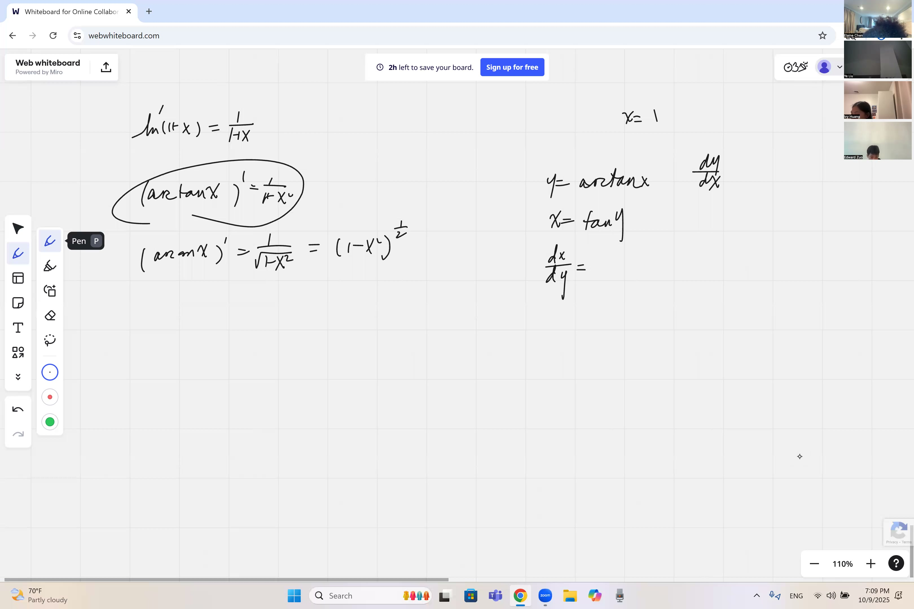
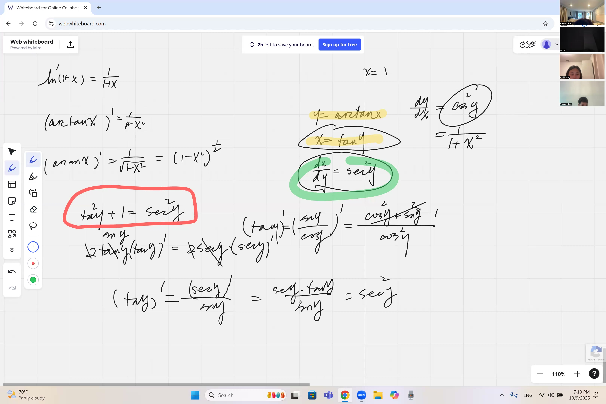
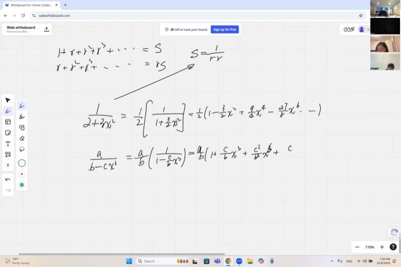
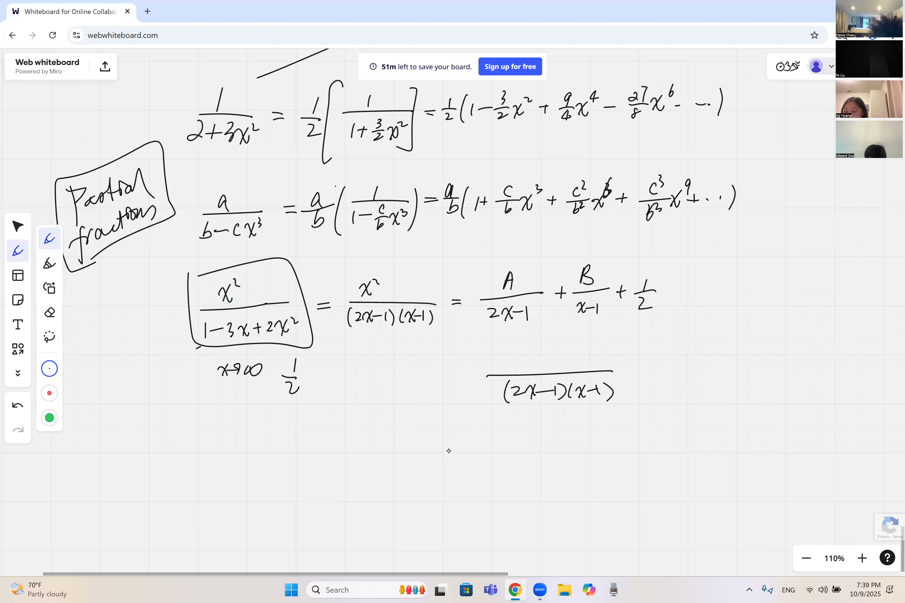

幂级数可以将复杂函数表示为易于处理的无穷多项式。本节课将介绍如何利用已知级数高效地构建新的幂展开，而非逐一计算高阶导数。此外还将讨论部分分式分解方法，以及一种可以快速确定系数的"遮盖技巧"。

::: {.callout-tip collapse="true"}
## 为什么幂级数和部分分式很重要

幂级数可用简单的多项式替代复杂的函数，部分分式可将复杂的分式拆成简单的部分：

- **计算机图形学**：电子游戏用幂级数近似三角函数和对数函数，使 GPU 能在毫秒内渲染画面
- **医学**：MRI 扫描仪使用从人体测量的信号的级数展开来重建图像
- **金融**：银行使用泰勒展开快速估算利率变动时债券价格的变化
- **机器人学**：机械臂使用 arctan 展开将坐标实时转换为关节角度，从而计算逆运动学
- **音频工程**：均衡器使用部分分式分解信号的传递函数，以理解每个频段的响应
:::

## 本课内容

- 从已知级数推导幂展开：$\ln(1+x)$、$\arctan x$、$\arcsin x$
- 通过反函数证明 $\frac{d}{dx}(\arctan x) = \frac{1}{1+x^2}$
- 将 $\frac{1}{1+x^2}$ 识别为几何级数：$1 - x^2 + x^4 - x^6 + \cdots$
- 一般有理表达式如 $\frac{1}{a + bx^n}$ 的幂展开
- **部分分式分解**：将复杂分式拆成简单的、可用几何级数展开的部分
- 快速求部分分式系数的**遮盖技巧**

## 课程视频

```{=html}
<video controls width="100%" preload="metadata">
  <source src="https://github.com/ymote/learningcalculus/releases/download/v1.0/calculus20251009.mp4" type="video/mp4">
</video>
```

## 课程关键帧

```{=html}
<div style="display: flex; flex-direction: column; gap: 10px; margin: 1em 0;">
  
  
  
  
</div>
```


## 预备知识

::: {.callout-note collapse="true"}
## 什么是幂级数（泰勒展开）？

**幂级数**以 $x = 0$ 为中心将函数写成无穷多项式：

$$f(x) = a_0 + a_1 x + a_2 x^2 + a_3 x^3 + \cdots$$

系数来自 $f$ 在零处的导数：

$$a_n = \frac{f^{(n)}(0)}{n!}$$

一旦知道了幂级数，即可自动获得 $f$ 在零处的每一阶导数——反之亦然。
:::

::: {.callout-note collapse="true"}
## 什么是几何级数？

**几何级数**是每一项都是前一项的固定倍数 $r$ 的求和：

$$1 + r + r^2 + r^3 + \cdots = \frac{1}{1 - r} \qquad \text{当 } |r| < 1$$

例如，令 $r = -x^2$：

$$1 - x^2 + x^4 - x^6 + \cdots = \frac{1}{1 + x^2}$$

识别几何级数可以省去每次做完整二项展开的麻烦。
:::

::: {.callout-note collapse="true"}
## 什么是反函数？

如果 $y = f(x)$，则**反函数** $f^{-1}$ 将其逆转：$x = f^{-1}(y)$。

例如，$y = \tan x$ 和 $x = \arctan y$ 互为反函数。关键的导数关系是：

$$\frac{dy}{dx} = \frac{1}{\;\dfrac{dx}{dy}\;}$$

因此，若已知 $\tan y$ 的导数，可通过取倒数得到 $\arctan x$ 的导数。

**重要**：反函数**不**满足算术分配律。例如，$\arctan x \neq \frac{\arcsin x}{\arccos x}$。不难验证：$\arctan(1) = \frac{\pi}{4}$，但 $\frac{\arcsin(1)}{\arccos(1)} = \frac{\pi/2}{0}$，后者无定义。
:::

::: {.callout-note collapse="true"}
## 什么是二项展开？

对于任意指数 $n$（包括负数和分数值），**二项展开**为：

$$(1 + u)^n = \sum_{k=0}^{\infty} \binom{n}{k} u^k = 1 + nu + \frac{n(n-1)}{2!}u^2 + \frac{n(n-1)(n-2)}{3!}u^3 + \cdots$$

当 $n$ 是负整数时，这简化为几何级数。例如：

$$(1 + u)^{-1} = 1 - u + u^2 - u^3 + \cdots = \frac{1}{1+u}$$
:::

::: {.callout-note collapse="true"}
## 什么是部分分式？

**部分分式分解**将一个复杂的有理函数拆成更简单的分式之和。例如：

$$\frac{x^2}{(2x-1)(x-1)} = \frac{1}{2} + \frac{A}{2x-1} + \frac{B}{x-1}$$

每个简单分式的分母是一次式，这意味着每一个都可以展开为几何级数。这是一种强大的积分技巧，也可用于求有理函数的幂级数。
:::

## 核心要点

### 从已知级数构建幂级数

我们很少通过计算高阶导数来找幂级数。相反，我们利用微分和积分**在已知展开的基础上构建**。

**策略**：如果一个函数的导数有已知的幂展开，逐项积分这个级数就能恢复原函数的展开。

| 目标函数 | 先求导 | 将导数识别为... |
|---|---|---|
| $\ln(1+x)$ | $\frac{1}{1+x}$ | $r = -x$ 的几何级数 |
| $\arctan x$ | $\frac{1}{1+x^2}$ | $r = -x^2$ 的几何级数 |
| $\arcsin x$ | $\frac{1}{\sqrt{1-x^2}}$ | 二项展开 $(1-x^2)^{-1/2}$ |

### 通过反函数求 $\arctan x$ 的导数

令 $y = \arctan x$。则 $x = \tan y$，我们对较简单的一边求导：

$$\frac{dx}{dy} = \sec^2 y$$

我们用商法则对 $\frac{\sin y}{\cos y}$ 证明了 $\frac{d}{dy}(\tan y) = \sec^2 y$：

$$\frac{d}{dy}\!\left(\frac{\sin y}{\cos y}\right) = \frac{\cos y \cdot \cos y - \sin y \cdot (-\sin y)}{\cos^2 y} = \frac{\cos^2 y + \sin^2 y}{\cos^2 y} = \sec^2 y$$

现在取倒数得到 $\frac{dy}{dx}$，并用 $x$ 重新表达：

$$\frac{dy}{dx} = \cos^2 y$$

利用恒等式 $1 + \tan^2 y = \sec^2 y = \frac{1}{\cos^2 y}$，我们得到 $\cos^2 y = \frac{1}{1 + \tan^2 y}$。

由于 $\tan y = x$：

::: {.callout-important}
## 核心要点：反正切的导数
推导方法：令 $x = \tan y$，对简单的一边求导得到 $\sec^2 y$，取其倒数，再用 $\tan y = x$ 重写。结果为一个简洁的有理函数，同时也可视为几何级数。

$$\boxed{\frac{d}{dx}(\arctan x) = \frac{1}{1 + x^2}}$$
:::

**交互演示——观察 $\arctan x$ 及其导数 $\frac{1}{1+x^2}$：**

::: {.desmos-container}
```{=html}
<div id="arctan-graph" style="width: 100%; height: 400px;"></div>
<script src="https://www.desmos.com/api/v1.9/calculator.js?apiKey=dcb31709b452b1cf9dc26972add0fda6"></script>
<script>
var elt1 = document.getElementById('arctan-graph');
var calc1 = Desmos.GraphingCalculator(elt1, {expressions: true, settingsMenu: false});
calc1.setExpression({id: 'arctan', latex: 'y=\\arctan(x)', color: '#2d70b3', lineWidth: 3});
calc1.setExpression({id: 'deriv', latex: 'y=\\frac{1}{1+x^2}', color: '#c74440', lineWidth: 2, lineStyle: 'DASHED'});
calc1.setExpression({id: 'a', latex: 'a=0.5', sliderBounds: {min: -4, max: 4, step: 0.01}});
calc1.setExpression({id: 'pt', latex: '(a, \\arctan(a))', color: '#2d70b3', pointSize: 10, label: 'arctan(a)', showLabel: true});
calc1.setExpression({id: 'tangent_line', latex: 'y - \\arctan(a) = \\frac{1}{1+a^2}(x - a)', color: '#388c46', lineWidth: 1.5, lineStyle: 'DASHED'});
calc1.setMathBounds({left: -6, right: 6, bottom: -3, top: 3});
</script>
```
:::

*拖动滑块 $a$。绿色虚线切线的斜率为 $\frac{1}{1+a^2}$（红色曲线）。注意斜率在 $a = 0$ 时最大，随 $|a|$ 增大而减小——$\arctan x$ 向其水平渐近线 $\pm\frac{\pi}{2}$ 逐渐变平。*

### 通过几何级数求 $\arctan x$ 的幂展开

由于 $\frac{1}{1+x^2}$ 是公比 $r = -x^2$ 的几何级数：

$$\frac{1}{1+x^2} = 1 - x^2 + x^4 - x^6 + \cdots \qquad (|x| < 1)$$

逐项积分以恢复 $\arctan x$（利用 $\arctan(0) = 0$）：

::: {.callout-important}
## 核心要点：反正切的幂级数（莱布尼茨公式）
对几何级数 $\frac{1}{1+x^2} = 1 - x^2 + x^4 - \cdots$ 逐项积分就得到这个优雅的级数。代入 $x = 1$ 就得到一个著名的 $\pi/4$ 公式。

$$\boxed{\arctan x = x - \frac{x^3}{3} + \frac{x^5}{5} - \frac{x^7}{7} + \cdots}$$
:::

这个美丽的结果称为**莱布尼茨公式**。代入 $x = 1$ 得到著名的恒等式：

$$\frac{\pi}{4} = 1 - \frac{1}{3} + \frac{1}{5} - \frac{1}{7} + \cdots$$

### 识别伪装的几何级数

许多幂展开只不过是伪装的几何级数 $\frac{1}{1-r}$。技巧是**强行**将表达式转化为 $\frac{1}{1 - (\text{某项})}$ 的形式。

**示例 1**：展开 $\dfrac{1}{2 - 3x^2}$。

提取常数以在分母中创造前导 $1$：

$$\frac{1}{2 - 3x^2} = \frac{1}{2} \cdot \frac{1}{1 - \frac{3}{2}x^2}$$

现在应用公比 $r = \frac{3}{2}x^2$ 的几何级数：

$$= \frac{1}{2}\!\left(1 + \frac{3}{2}x^2 + \frac{9}{4}x^4 + \frac{27}{8}x^6 + \cdots\right)$$

$$= \frac{1}{2} + \frac{3}{4}x^2 + \frac{9}{8}x^4 + \frac{27}{16}x^6 + \cdots$$

**示例 2**：展开 $\dfrac{a}{b - cx^3}$。

从分母中提取 $b$：

$$\frac{a}{b - cx^3} = \frac{a}{b} \cdot \frac{1}{1 - \frac{c}{b}x^3}$$

应用公比 $r = \frac{c}{b}x^3$ 的几何级数：

$$= \frac{a}{b}\!\left(1 + \frac{c}{b}x^3 + \frac{c^2}{b^2}x^6 + \frac{c^3}{b^3}x^9 + \cdots\right)$$

**交互演示——比较有理函数与其几何级数近似：**

::: {.desmos-container}
```{=html}
<div id="geom-series" style="width: 100%; height: 400px;"></div>
<script>
var elt2 = document.getElementById('geom-series');
var calc2 = Desmos.GraphingCalculator(elt2, {expressions: true, settingsMenu: false});
calc2.setExpression({id: 'exact', latex: 'y=\\frac{1}{2-3x^2}', color: '#2d70b3', lineWidth: 3});
calc2.setExpression({id: 'n', latex: 'n=3', sliderBounds: {min: 1, max: 8, step: 1}});
calc2.setExpression({id: 'approx1', latex: 'y=\\frac{1}{2}\\sum_{k=0}^{n}\\left(\\frac{3}{2}x^2\\right)^k', color: '#c74440', lineWidth: 2, lineStyle: 'DASHED'});
calc2.setMathBounds({left: -1.5, right: 1.5, bottom: -2, top: 5});
</script>
```
:::

*拖动滑块 $n$ 以添加更多项。观察红色虚线近似在收敛半径 $|x| < \sqrt{2/3} \approx 0.82$ 内如何更紧密地贴合蓝色曲线。*

### 部分分式分解

当分母可以分解为一次因式时，我们可以将分式分解为更简单的部分，每个部分都可以展开为几何级数。

**示例**：将 $\dfrac{x^2}{2x^2 - 3x + 1}$ 展开为幂级数。

**第一步——检查次数。** 分子是 2 次，分母也是 2 次，所以这不是真分式。当 $x \to \infty$ 时，函数趋近于 $\frac{x^2}{2x^2} = \frac{1}{2}$。所以我们先提取多项式部分：

$$\frac{x^2}{2x^2 - 3x + 1} = \frac{1}{2} + \frac{\text{余式}}{2x^2 - 3x + 1}$$

**第二步——分解分母。**

$$2x^2 - 3x + 1 = (2x - 1)(x - 1)$$

**第三步——设置部分分式。** 提取 $\frac{1}{2}$ 后，写成：

$$\frac{x^2}{(2x-1)(x-1)} = \frac{1}{2} + \frac{A}{2x-1} + \frac{B}{x-1}$$

**第四步——求系数**，通过通分并比较同类项。两边乘以 $(2x-1)(x-1)$：

$$x^2 - \tfrac{1}{2}(2x-1)(x-1) = A(x-1) + B(2x-1)$$

左边化简为 $x^2 - \tfrac{1}{2}(2x^2 - 3x + 1) = \tfrac{3}{2}x - \tfrac{1}{2}$。比较 $x$ 的系数和常数项得到：

$$A + 2B = \tfrac{3}{2}, \qquad -A - B = -\tfrac{1}{2}$$

解得：$B = 1$，$A = -\tfrac{1}{2}$。

$$\frac{x^2}{(2x-1)(x-1)} = \frac{1}{2} - \frac{1/2}{2x-1} + \frac{1}{x-1}$$

**第五步——将每个分式展开为几何级数：**

$$\frac{1}{2x - 1} = \frac{-1}{1 - 2x} = -(1 + 2x + 4x^2 + 8x^3 + \cdots)$$

$$\frac{1}{x - 1} = \frac{-1}{1 - x} = -(1 + x + x^2 + x^3 + \cdots)$$

将所有部分组合起来即得原函数的完整幂级数。

### 部分分式的遮盖技巧

通过通分和比较系数来求 $A$ 和 $B$ 较为繁琐。以下介绍一种通过巧妙选择 $x$ 值来简化计算的方法。

**求 $B$**：选择 $x$ 使因子 $(x - 1)$ 消失，即令 $x = 1$。这样 $A$ 项有一个有限值，而我们实际上是在"遮盖"$(x-1)$ 因子：

$$B = \left.\frac{x^2 - \frac{1}{2}(2x-1)(x-1)}{2x - 1}\right|_{x=1} = \frac{\frac{3}{2}(1) - \frac{1}{2}}{2(1)-1} = 1$$

**求 $A$**：令 $x = \frac{1}{2}$ 使 $(2x - 1)$ 消失：

$$A = \left.\frac{x^2 - \frac{1}{2}(2x-1)(x-1)}{x - 1}\right|_{x=1/2} = \frac{\frac{3}{2}\!\cdot\!\frac{1}{2} - \frac{1}{2}}{\frac{1}{2} - 1} = \frac{1/4}{-1/2} = -\frac{1}{2}$$

思路是：选择一个**使某个分母为零**的 $x$ 值，从而只剩下一个未知数，无需解方程组。

**交互演示——观察部分分式如何分解有理函数：**

::: {.desmos-container}
```{=html}
<div id="partial-frac" style="width: 100%; height: 400px;"></div>
<script>
var elt3 = document.getElementById('partial-frac');
var calc3 = Desmos.GraphingCalculator(elt3, {expressions: true, settingsMenu: false});
calc3.setExpression({id: 'original', latex: 'y=\\frac{x^2}{2x^2-3x+1}', color: '#2d70b3', lineWidth: 3});
calc3.setExpression({id: 'piece1', latex: 'y=\\frac{1}{2}+\\frac{1}{2(2x-1)}', color: '#c74440', lineWidth: 2, lineStyle: 'DASHED'});
calc3.setExpression({id: 'piece2', latex: 'y=\\frac{1}{x-1}', color: '#388c46', lineWidth: 2, lineStyle: 'DASHED'});
calc3.setExpression({id: 'asymp1', latex: 'x=\\frac{1}{2}', color: '#aaaaaa', lineStyle: 'DASHED', lineWidth: 1});
calc3.setExpression({id: 'asymp2', latex: 'x=1', color: '#aaaaaa', lineStyle: 'DASHED', lineWidth: 1});
calc3.setExpression({id: 'horiz', latex: 'y=\\frac{1}{2}', color: '#6042a6', lineStyle: 'DASHED', lineWidth: 1});
calc3.setMathBounds({left: -2, right: 3, bottom: -8, top: 8});
</script>
```
:::

*蓝色曲线是原函数。红色和绿色虚线曲线是部分分式的各个部分。灰色虚线标示 $x = \frac{1}{2}$ 和 $x = 1$ 处的竖直渐近线；紫色虚线标示 $y = \frac{1}{2}$ 处的水平渐近线。*

### $\ln(1+x)$ 和 $\arcsin x$ 的幂展开

为完整起见，以下是课堂上讨论的用同样的"求导、展开、积分"策略构建的另外两个展开：

**自然对数**：由于 $\frac{d}{dx}\ln(1+x) = \frac{1}{1+x} = 1 - x + x^2 - x^3 + \cdots$，积分得到：

$$\ln(1+x) = x - \frac{x^2}{2} + \frac{x^3}{3} - \frac{x^4}{4} + \cdots$$

**反正弦**：由于 $\frac{d}{dx}\arcsin x = (1 - x^2)^{-1/2}$，我们使用二项展开：

$$(1-x^2)^{-1/2} = 1 + \frac{1}{2}x^2 + \frac{3}{8}x^4 + \frac{5}{16}x^6 + \cdots$$

逐项积分：

$$\arcsin x = x + \frac{x^3}{6} + \frac{3x^5}{40} + \frac{5x^7}{112} + \cdots$$

注意 $\arcsin x$ 在 $x = 0$ 处的所有偶数阶导数都为零（只出现奇数次幂），这在幂级数中一目了然。

## 速查表

::: {.key-formula}
| 公式 | 核心思想 |
|---|---|
| $\dfrac{d}{dx}(\arctan x) = \dfrac{1}{1+x^2}$ | 写 $x = \tan y$，求导，取倒数 |
| $\dfrac{1}{1-r} = 1 + r + r^2 + r^3 + \cdots$ | 几何级数（$\lvert r\rvert < 1$ 时有效） |
| $\arctan x = x - \dfrac{x^3}{3} + \dfrac{x^5}{5} - \cdots$ | 对 $\frac{1}{1+x^2}$ 的几何级数积分 |
| $\ln(1+x) = x - \dfrac{x^2}{2} + \dfrac{x^3}{3} - \cdots$ | 对 $\frac{1}{1+x}$ 的几何级数积分 |

### 几何级数转换方法

要展开 $\dfrac{1}{a + bx^n}$：

1. 提取 $a$：$\;\dfrac{1}{a} \cdot \dfrac{1}{1 + \frac{b}{a}x^n}$
2. 确定 $r = -\dfrac{b}{a}x^n$ 并应用 $\dfrac{1}{1-r} = 1 + r + r^2 + \cdots$

### 部分分式步骤

1. 如果分子的次数 $\geq$ 分母的次数，先做**多项式长除法**
2. **分解**分母为一次因式
3. 写成 $\dfrac{A}{(\text{因子}_1)} + \dfrac{B}{(\text{因子}_2)} + \cdots$
4. 用**遮盖技巧**求 $A, B, \ldots$：代入每个因子的根以逐一分离未知数
5. 将每个简单分式展开为**几何级数**

### 遮盖技巧

要求给定一次因子的系数，令 $x$ 等于该因子的**根**。这会使所有其他部分分式项归零，只留下待求的那一项，无需解方程组。
:::
