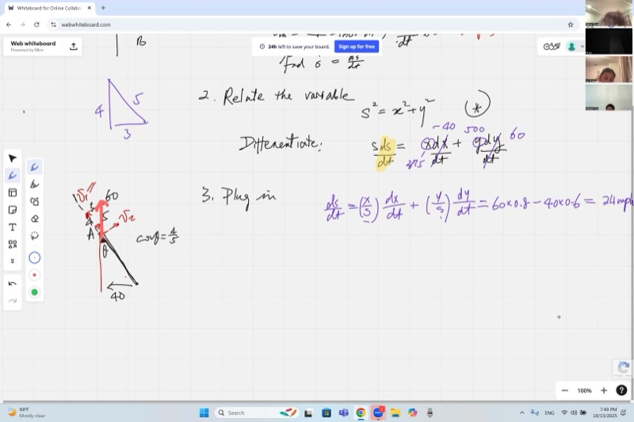
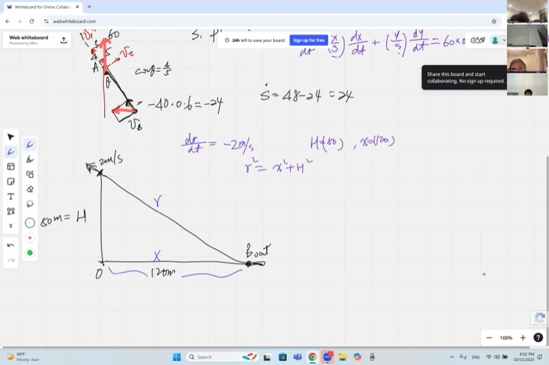
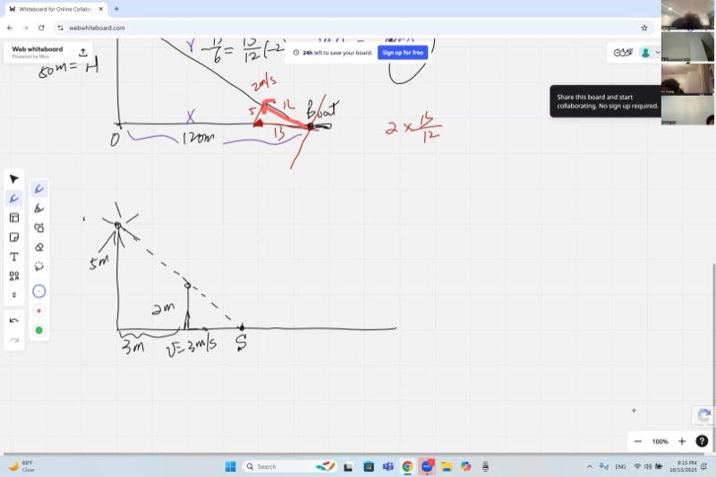
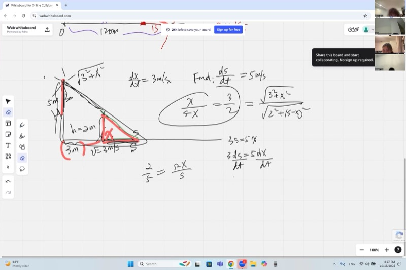

本节课将完整求解若干相关变化率问题：十字路口的两辆车、船被拉向悬崖，以及行人远离路灯时影子的移动速度。此外还将介绍一种源自物理学的方法——"速度分解"，在某些情形下可以简化代数运算。课程最后总结一套适用于一般相关变化率问题的求解步骤。

::: {.callout-tip collapse="true"}
## 为什么相关变化率很重要

相关变化率问题的核心是："如果一个量在变化，那么与之相关的另一个量变化有多快？"这在现实世界中经常出现：

- **导航**：空中交通管制员跟踪两架飞机之间距离变化的速度，以防止碰撞
- **建筑**：工程师计算影子移动的速度，以规划建筑和体育场的照明
- **救援行动**：海岸警卫队计算收绳的速度，以便以合适的速度将船拉到岸边
- **医学**：医生根据静脉输液速率来建模血液中药物浓度变化的速度
- **体育**：教练分析接力赛中两名跑者之间差距缩小的速度

本节课将分别用微积分（隐函数求导）和物理学（速度分解）两种方法求解几个经典的相关变化率问题。
:::

## 本课内容

- 建立相关变化率问题：确定变量、已知变化率和所求变化率
- 用勾股定理 $s^2 = x^2 + y^2$ 来关联距离
- 对隐函数方程求微分：$s\,ds = x\,dx + y\,dy$
- 除以 $dt$ 将微分转化为变化率
- 两车在十字路口：由 $\dfrac{dx}{dt}$ 和 $\dfrac{dy}{dt}$ 求 $\dfrac{ds}{dt}$
- 速度分解：将运动投影到径向方向
- 船与悬崖问题：收回连接船的绳索
- 用相似三角形建立影子问题中的变量关系
- 区分问题中的变量与常量

## 课程视频

```{=html}
<video controls width="100%" preload="metadata">
  <source src="https://github.com/ymote/learningcalculus/releases/download/v1.0/calculus20251013_2.mp4" type="video/mp4">
</video>
```

## 课程关键帧

```{=html}
<div style="display: flex; flex-direction: column; gap: 10px; margin: 1em 0;">
  
  
  
  
</div>
```


## 预备知识

::: {.callout-note collapse="true"}
## 什么是隐函数求导？

当方程为 $x^2 + y^2 = s^2$，且 $x$、$y$ 和 $s$ 均依赖于时间 $t$ 时，不能简单地"对 $x$ 求导"。正确的做法是对每一项关于其自身变量**取微分**：

$$2x\,dx + 2y\,dy = 2s\,ds$$

然后两边除以 $dt$ 得到变化率：

$$2x\frac{dx}{dt} + 2y\frac{dy}{dt} = 2s\frac{ds}{dt}$$

这就是**隐函数求导**——同时将所有变化量视为变量。
:::

::: {.callout-note collapse="true"}
## 什么是勾股定理？

对于直角边为 $a$ 和 $b$、斜边为 $c$ 的直角三角形：

$$a^2 + b^2 = c^2$$

这是处理垂直方向上距离的首选方程。对于相关变化率，关键是识别哪些边是变量，哪些是常量。
:::

::: {.callout-note collapse="true"}
## 什么是相似三角形？

两个三角形如果角度相同，则它们是**相似的**。当三角形相似时，对应边成比例：

$$\frac{a_1}{a_2} = \frac{b_1}{b_2} = \frac{c_1}{c_2}$$

影子问题几乎总是涉及由光源、物体和影子构成的相似三角形。
:::

::: {.callout-note collapse="true"}
## 什么是向量分解？

任何速度向量都可以分解为两个垂直分量。若需分析运动对某特定方向（如两物体间距离）的影响，可将速度**投影**到该方向上：

$$v_{\text{径向}} = v \cos\theta$$

其中 $\theta$ 是速度与所关注方向之间的夹角。垂直分量 $v \sin\theta$ 不影响距离，仅引起旋转。
:::

## 相关变化率的解题步骤

每个相关变化率问题都遵循相同的三步法则：

**第一步——建立变量和变化率。** 明确确定：

- **变量**是什么（哪些量在变化）？
- 已知哪些**变化率**（$\frac{dx}{dt}$、$\frac{dy}{dt}$ 等）？
- 要求的**变化率**是什么？
- 注意**符号**：如果一个量在减小，其变化率为负。

**第二步——关联变量。** 找到连接变量的几何方程（勾股定理、相似三角形等）。此时**不要**代入数值——方程必须在每个时刻都成立，而不仅仅是给定的那个时刻。

**第三步——求导，然后代入。** 对方程求微分（对每个变量取微分），除以 $dt$，**然后**再代入给定的数值。

## 问题 1：十字路口的两辆车

### 问题设置

两辆车在一个十字路口。车 A 以 $60$ mph 向北行驶，车 B 以 $40$ mph 向西行驶（朝交叉路口方向）。在所关注的时刻，车 A 在北边 $500$ 米处，车 B 在东边 $375$ 米处。两车之间的距离变化有多快？

::: {.desmos-container}
```{=html}
<div id="crossroad-graph" style="width: 100%; height: 400px;"></div>
<script src="https://www.desmos.com/api/v1.9/calculator.js?apiKey=dcb31709b452b1cf9dc26972add0fda6"></script>
<script>
var elt1 = document.getElementById('crossroad-graph');
var calc1 = Desmos.GraphingCalculator(elt1, { expressions: true, settingsMenu: false });
calc1.setExpression({id: 'origin', latex: '(0,0)', color: '#000000', pointSize: 8, label: 'O (intersection)', showLabel: true});
calc1.setExpression({id: 'carA', latex: '(0, 500)', color: '#2d70b3', pointSize: 10, label: 'Car A (y=500)', showLabel: true});
calc1.setExpression({id: 'carB', latex: '(375, 0)', color: '#c74440', pointSize: 10, label: 'Car B (x=375)', showLabel: true});
calc1.setExpression({id: 'yaxis', latex: 'x=0 \\left\\{0 \\le y \\le 500\\right\\}', color: '#2d70b3', lineWidth: 2});
calc1.setExpression({id: 'xaxis', latex: 'y=0 \\left\\{0 \\le x \\le 375\\right\\}', color: '#c74440', lineWidth: 2});
calc1.setExpression({id: 'dist', latex: 'y - 500 = \\frac{500}{-375}(x - 0) \\left\\{0 \\le x \\le 375\\right\\}', color: '#388c46', lineWidth: 2, lineStyle: 'DASHED'});
calc1.setMathBounds({left: -100, right: 500, bottom: -100, top: 650});
</script>
```
:::

*绿色虚线是两车之间的距离 $s$。三角形的两条直角边为 $x = 375$ 和 $y = 500$，构成 3-4-5 的比例。*

### 微积分方法求解（相关变化率）

**变量和变化率：**

- $y$ = 车 A 的位置（北方向），$\frac{dy}{dt} = 60$ mph（增大）
- $x$ = 车 B 的位置（东方向），$\frac{dx}{dt} = -40$ mph（减小——朝原点移动）
- $s$ = 两车之间的距离；求 $\frac{ds}{dt}$

**用勾股定理关联变量：**

$$s^2 = x^2 + y^2$$

**求导**（取微分，然后除以 $dt$）：

$$2s\,ds = 2x\,dx + 2y\,dy \quad \Longrightarrow \quad s\frac{ds}{dt} = x\frac{dx}{dt} + y\frac{dy}{dt}$$

**代入。** 注意 $x : y = 375 : 500 = 3 : 4$，所以 $s$ 对应比例中的 $5$。我们只需要比值：

$$\frac{ds}{dt} = \frac{x}{s}\cdot\frac{dx}{dt} + \frac{y}{s}\cdot\frac{dy}{dt} = \frac{3}{5}(-40) + \frac{4}{5}(60) = -24 + 48 = 24 \text{ mph}$$

::: {.callout-important}
## 核心要点：勾股定理的相关变化率
当两个物体沿垂直方向运动时，勾股定理将它们的位置联系起来，对其求导就能将它们的速度与两者距离的变化率联系起来。

$$\boxed{\frac{ds}{dt} = 24 \text{ mph}}$$
:::

距离以 $24$ mph 的速率增大。

### 速度分解法求解（物理方法）

另一种方法是将每辆车的速度分解为**径向**分量（沿连接 A 和 B 的方向）和**切向**分量（垂直于该方向）。只有径向分量影响两车之间的距离。

**车 A** 以 $60$ mph 向上运动。三角形 $OAB$ 的比例为 $3:4:5$，所以车 A 速度在径向方向的投影用 $\cos\theta = \frac{4}{5}$：

$$v_{r,A} = 60 \times \frac{4}{5} = 48 \text{ mph（使距离增大）}$$

**车 B** 以 $40$ mph 向左运动。投影到径向方向用 $\sin\theta = \frac{3}{5}$：

$$v_{r,B} = 40 \times \frac{3}{5} = 24 \text{ mph（使距离减小）}$$

净变化率：

$$\frac{ds}{dt} = 48 - 24 = 24 \text{ mph}$$

结果一致。一旦发现 $3$-$4$-$5$ 比例，计算过程可以大幅简化。

## 问题 2：船与悬崖（绳索问题）

### 问题设置

一个人站在 $50$ 米高的悬崖顶上，以 $2$ m/s 的速度收绳，绳子连着一艘船。在所关注的时刻，船距悬崖底部 $120$ 米。船靠近悬崖的速度是多少？

::: {.desmos-container}
```{=html}
<div id="cliff-graph" style="width: 100%; height: 400px;"></div>
<script>
var elt2 = document.getElementById('cliff-graph');
var calc2 = Desmos.GraphingCalculator(elt2, { expressions: true, settingsMenu: false });
calc2.setExpression({id: 'cliff', latex: 'x=0 \\left\\{0 \\le y \\le 50\\right\\}', color: '#000000', lineWidth: 4});
calc2.setExpression({id: 'ground', latex: 'y=0 \\left\\{0 \\le x \\le 150\\right\\}', color: '#6c757d', lineWidth: 2});
calc2.setExpression({id: 'rope', latex: 'y = 50 - \\frac{50}{120}x \\left\\{0 \\le x \\le 120\\right\\}', color: '#c74440', lineWidth: 2, lineStyle: 'DASHED'});
calc2.setExpression({id: 'person', latex: '(0, 50)', color: '#2d70b3', pointSize: 10, label: 'Person (top of cliff)', showLabel: true});
calc2.setExpression({id: 'boat', latex: '(120, 0)', color: '#c74440', pointSize: 10, label: 'Boat (x=120)', showLabel: true});
calc2.setExpression({id: 'base', latex: '(0, 0)', color: '#000000', pointSize: 8, label: 'O', showLabel: true});
calc2.setMathBounds({left: -20, right: 160, bottom: -20, top: 70});
</script>
```
:::

*红色虚线是长度为 $r = 130$ 的绳索。悬崖高度 $h = 50$ 是常量——只有 $x$ 和 $r$ 是变量。*

### 相关变化率求解

**变量和变化率：**

- $r$ = 绳索长度（斜边），$\frac{dr}{dt} = -2$ m/s（绳在变短）
- $x$ = 船到悬崖底部的水平距离；求 $\frac{dx}{dt}$
- $h = 50$ 米是**常量**（悬崖高度不变，所以 $dh = 0$）

**关联变量：**

$$r^2 = x^2 + h^2 = x^2 + 50^2$$

**求导**（由于 $h$ 是常量，其微分为零）：

$$2r\,dr = 2x\,dx \quad \Longrightarrow \quad \frac{dx}{dt} = \frac{r}{x}\cdot\frac{dr}{dt}$$

**求比值。** 在此时刻：$x = 120$，$h = 50$。注意 $120 : 50 = 12 : 5$，所以边的比例为 $5 : 12 : 13$，得到 $r/x = 13/12$。

$$\frac{dx}{dt} = \frac{13}{12} \times (-2) = -\frac{13}{6} \text{ m/s}$$

::: {.callout-important}
## 核心要点：当一条边是常量时，问题变得简单
在船与悬崖问题中，悬崖高度恒定不变，其微分为零。因此只剩下两个变量，由此可得收绳速度和船速之间的简洁比值关系。

$$\boxed{\frac{dx}{dt} = -\frac{13}{6} \approx -2.17 \text{ m/s}}$$
:::

船以 $\frac{13}{6}$ m/s 的速度靠近悬崖，快于收绳速度，原因在于绳子是倾斜的。

### 速度分解法求解

绳子以 $2$ m/s 的速率缩短——这是船速度的**径向**分量。船沿水平方向移动，所以它的全部速度 $v$ 投影到绳索方向为 $v \cdot \frac{12}{13}$。令其等于 $2$：

$$v = 2 \times \frac{13}{12} = \frac{13}{6} \text{ m/s}$$

一旦发现 $5$-$12$-$13$ 三角形，计算可以直接完成。

## 问题 3：行走者的影子

### 问题设置

一根路灯高 $5$ 米。一个身高 $2$ 米的人以 $3$ m/s 的速度远离路灯行走。当此人距路灯 $3$ 米时，影子尖端移动的速度是多少？

::: {.desmos-container}
```{=html}
<div id="shadow-graph" style="width: 100%; height: 400px;"></div>
<script>
var elt3 = document.getElementById('shadow-graph');
var calc3 = Desmos.GraphingCalculator(elt3, { expressions: true, settingsMenu: false });
calc3.setExpression({id: 'lamp', latex: 'x=0 \\left\\{0 \\le y \\le 5\\right\\}', color: '#e8a900', lineWidth: 4});
calc3.setExpression({id: 'ground', latex: 'y=0 \\left\\{0 \\le x \\le 10\\right\\}', color: '#6c757d', lineWidth: 2});
calc3.setExpression({id: 't_slider', latex: 't=3', sliderBounds: {min: 0.5, max: 6, step: 0.1}});
calc3.setExpression({id: 'person_line', latex: 'x=t \\left\\{0 \\le y \\le 2\\right\\}', color: '#2d70b3', lineWidth: 3});
calc3.setExpression({id: 'light_ray', latex: 'y = 5 - \\frac{5}{\\frac{5}{3}t} x \\left\\{0 \\le x \\le \\frac{5}{3}t\\right\\}', color: '#e8a900', lineWidth: 1.5, lineStyle: 'DASHED'});
calc3.setExpression({id: 'lamp_top', latex: '(0, 5)', color: '#e8a900', pointSize: 10, label: 'Lamp (H=5)', showLabel: true});
calc3.setExpression({id: 'person_head', latex: '(t, 2)', color: '#2d70b3', pointSize: 8, label: 'Person (h=2)', showLabel: true});
calc3.setExpression({id: 'shadow_tip', latex: '(\\frac{5}{3}t, 0)', color: '#388c46', pointSize: 10, label: 'Shadow tip', showLabel: true});
calc3.setMathBounds({left: -1, right: 12, bottom: -1, top: 7});
</script>
```
:::

*拖动滑块 $t$ 来移动人。观察影子尖端（绿点）如何总是成比例移动——$s/x = 5/3$ 的比值永远不变。*

### 求解

**变量和常量：**

- $x$ = 人到路灯的距离（**变量**），$\frac{dx}{dt} = 3$ m/s
- $s$ = 影子尖端到路灯的距离（**变量**）；求 $\frac{ds}{dt}$
- 高度 $H = 5$ 米（路灯）和 $h = 2$ 米（人）是**常量**

**用相似三角形建立关系。** 大三角形（路灯到影子尖端，高 $5$，底 $s$）与小三角形（人到影子尖端，高 $2$，底 $s - x$）相似：

$$\frac{x}{s - x} = \frac{H - h}{h} = \frac{5 - 2}{2} = \frac{3}{2}$$

交叉相乘：

$$2x = 3(s - x) = 3s - 3x \quad \Longrightarrow \quad 5x = 3s$$

**求导：**

$$5\,dx = 3\,ds \quad \Longrightarrow \quad \frac{ds}{dt} = \frac{5}{3}\cdot\frac{dx}{dt} = \frac{5}{3} \times 3 = 5 \text{ m/s}$$

::: {.callout-important}
## 核心要点：相似三角形给出恒定比例的变化率
当相似三角形在两个变量之间建立线性关系（如 $5x = 3s$）时，它们的变化率也锁定在相同的比例中。这就是为什么无论人站在哪里，影子尖端的速度都是恒定的。

$$\boxed{\frac{ds}{dt} = 5 \text{ m/s}}$$
:::

值得注意的是，影子尖端以恒定的 $5$ m/s 移动，与人的位置无关。这是因为 $s$ 和 $x$ 之间的关系是线性的，因此它们的变化率保持固定比例。

## 问题 4：墙上的影子

### 问题设置

一盏灯高 $3$ 米，一个身高 $2.5$ 米的人站在灯和墙之间，墙距灯 $4$ 米远。这个人以 $3$ m/s 的速度走向墙，目前距灯 $1$ 米。墙上的影子移动有多快？

### 求解

**变量和常量：**

- $x$ = 人到灯的距离（**变量**），$\frac{dx}{dt} = 3$ m/s
- $y$ = 墙上影子的高度（**变量**）；求 $\frac{dy}{dt}$
- 灯高 $= 3$ 米，人高 $= 2.5$ 米，墙距 $= 4$ 米，都是**常量**

**用相似三角形建立关系。** 高 $3$ 米的灯光越过人头顶（高 $2.5$ 米）投射到墙上。由相似三角形：

$$\frac{x}{4 - x} = \frac{3 - 2.5}{y - 3} \quad \Longrightarrow \quad x(y - 3) = 0.5(4 - x) \quad \Longrightarrow \quad xy = 2 + 2.5x$$

**求导**，对 $xy$ 使用乘积法则，然后除以 $dt$：

$$y\frac{dx}{dt} + x\frac{dy}{dt} = 2.5\frac{dx}{dt}$$

**代入。** 当 $x = 1$ 时：$y = 2 + 2.5 = 4.5$ 米。

$$4.5(3) + 1 \cdot \frac{dy}{dt} = 2.5(3) \quad \Longrightarrow \quad \frac{dy}{dt} = 7.5 - 13.5 = -6$$

$$\boxed{\frac{dy}{dt} = -6 \text{ m/s}}$$

负号表示影子以 $6$ m/s 的速度在墙上**向下**移动。与问题 3 不同，$xy$ 的乘积使这个关系成为非线性的——影子速度取决于位置。

## 常见错误

1. **过早代入数值。** 若在求导前代入 $x = 3$，则 $\frac{d}{dt}(3) = 0$，$\frac{dx}{dt}$ 项将丢失。方程必须在每个时刻都成立。

2. **混淆变量和常量。** 悬崖高度 $h = 50$ 始终不变，故 $dh = 0$；人的位置 $x$ 是变化的，故 $dx \neq 0$。应在建模之初即明确标注。

3. **符号错误。** 减小的量具有**负的**变化率。车 B 靠近意味着 $\frac{dx}{dt} < 0$；收绳意味着 $\frac{dr}{dt} < 0$。

4. **直接取导数而非取微分。** 应先对每个变量取微分（$2r\,dr = 2x\,dx$），再除以 $dt$，而非过早决定"对什么求导"。

## 速查表

::: {.key-formula}
| 所需内容 | 公式 |
|---|---|
| 勾股关系 | $s^2 = x^2 + y^2$ |
| 勾股定理求导 | $s\dfrac{ds}{dt} = x\dfrac{dx}{dt} + y\dfrac{dy}{dt}$ |
| 相似三角形 | $\dfrac{a_1}{a_2} = \dfrac{b_1}{b_2}$（对应边成比例） |
| 径向投影 | $v_{\text{径向}} = v\cos\theta$（沿距离方向的分量） |
| 相关变化率步骤 | (1) 建立变量和变化率，(2) 关联变量，(3) 求导并代入 |
| 乘积法则微分 | $d(xy) = y\,dx + x\,dy$ |
| 关键原理 | 只有速度的径向分量才能改变两个物体之间的距离 |

### 相关变化率工作流程

$$\text{确定变量} \;\to\; \text{几何方程} \;\xrightarrow{\text{求导}}\; \text{微分方程} \;\xrightarrow{\div\, dt}\; \text{变化率方程} \;\xrightarrow{\text{代入}}\; \text{答案}$$
:::
