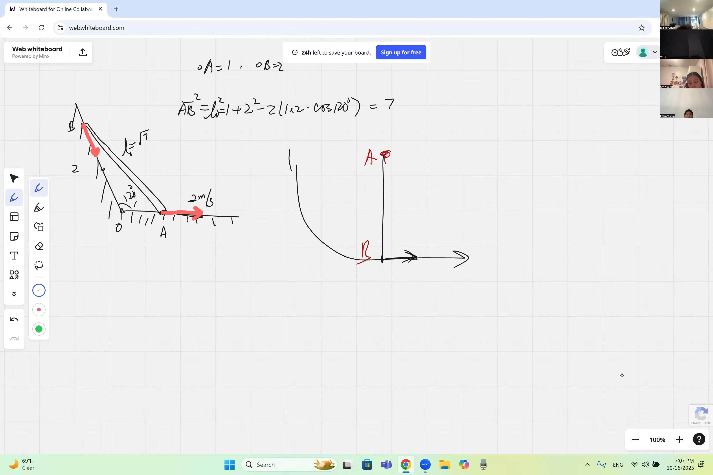
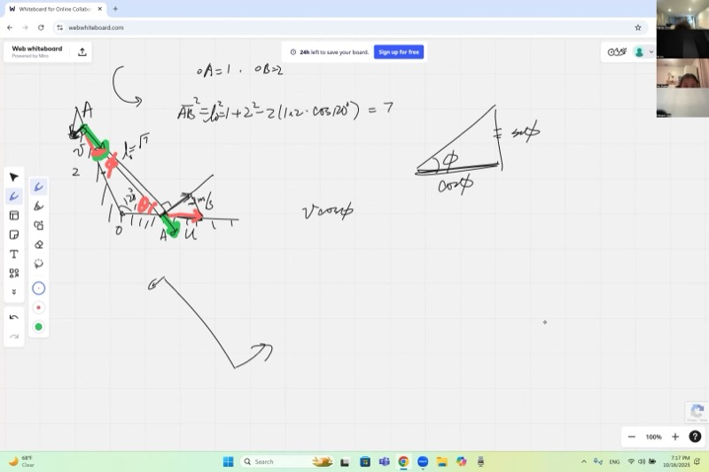
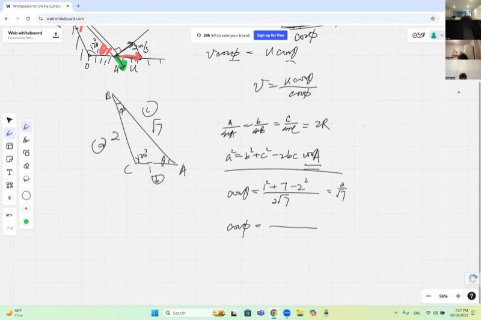
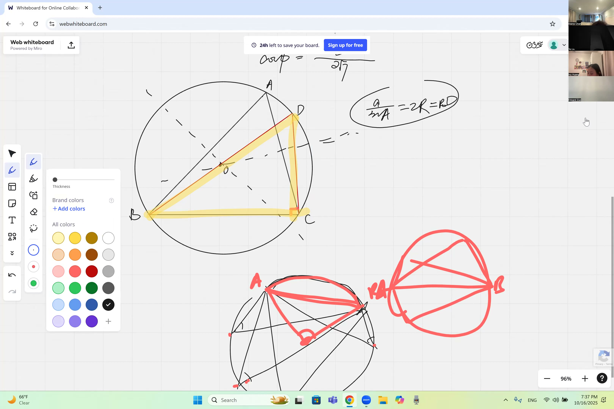

如果你不用求一次导数就能算出某个东西移动的速度呢？在这节课中，你将学习"物理方法"——一种利用向量投影来解决刚体（如杆和梁）相关变化率问题的技术。你还将用圆来证明正弦定理，这是几何学中最美丽的结果之一。准备好迎接物理与数学的精彩合作吧！

::: {.callout-tip collapse="true"}
## 为什么向量投影和相关变化率很重要

理解连接物体的速度如何相互关联，在现实世界中处处可见：

- **机器人学**：机械臂由刚性连杆通过关节连接——工程师用速度投影来计算当电机转动一个关节时，臂端移动的速度
- **汽车引擎**：活塞和曲轴通过刚性连杆连接，活塞速度取决于曲轴速度在连杆方向上的投影
- **体育**：棒球棒挥动时，棒上的每个点以不同速度移动——刚体约束精确决定了棒尖相对于握把的移动速度
- **建筑起重机**：当起重臂旋转时，缆绳连接点沿圆弧运动，载荷会摆动——预测载荷的速度需要将运动分解为沿缆绳方向和垂直于缆绳方向的分量
- **电子游戏**：物理引擎通过约束连接部件的运动方式来模拟刚体，使用的正是本课中的投影思想
:::

## 本课内容

- 用**向量投影法**解刚体的相关变化率（无需求导）
- 将速度分解为沿刚性杆的**径向**分量和**切向**分量
- 刚体约束：两端的径向速度分量必须相等
- 杆沿两面墙滑动时的结果 $v = u \dfrac{\cos\theta}{\cos\phi}$
- **余弦定理**：$a^2 = b^2 + c^2 - 2bc\cos A$
- **正弦定理**：$\dfrac{a}{\sin A} = \dfrac{b}{\sin B} = \dfrac{c}{\sin C} = 2R$
- 用**外接圆**和圆周角定理证明正弦定理
- 通过中垂线确定外接圆的唯一性
- 圆周角定理：圆周角 $= \frac{1}{2} \times$ 圆心角

## 课程视频

```{=html}
<video controls width="100%" preload="metadata">
  <source src="https://github.com/ymote/learningcalculus/releases/download/v1.0/calculus20251016.mp4" type="video/mp4">
</video>
```

## 课程关键帧

```{=html}
<div style="display: flex; flex-direction: column; gap: 10px; margin: 1em 0;">
  
  
  
  
</div>
```


## 预备知识

::: {.callout-note collapse="true"}
## 什么是余弦定理？

**余弦定理**将勾股定理推广到任意三角形。对于边为 $a$、$b$、$c$，角 $A$ 对应边 $a$ 的三角形：

$$a^2 = b^2 + c^2 - 2bc\cos A$$

当 $A = 90°$ 时，$\cos A = 0$，就退化为 $a^2 = b^2 + c^2$，也就是勾股定理。这个公式可以在知道两边和夹角时求第三边，或在知道三边时求角。
:::

::: {.callout-note collapse="true"}
## 什么是向量分解？

任何速度向量都可以**分解**（拆分）为两个垂直分量。例如，如果你有一个速度 $\vec{v}$ 和一个参考方向，你可以写成：

$$\vec{v} = v_{\text{径向}} + v_{\text{切向}}$$

其中：

- $v_{\text{径向}} = |\vec{v}|\cos\alpha$ 是**沿着**参考方向的分量
- $v_{\text{切向}} = |\vec{v}|\sin\alpha$ 是**垂直于**参考方向的分量

这里 $\alpha$ 是 $\vec{v}$ 和参考方向之间的角度。这就是用余弦将向量投影到一条直线上的思想。
:::

::: {.callout-note collapse="true"}
## 什么是刚体？

**刚体**是不能拉伸、压缩或变形的物体。长度为 $L$ 的刚性杆意味着无论怎样运动，两端之间的距离始终恰好为 $L$。

这给了我们一个强有力的约束：两端之间距离的变化率必须始终为零：

$$\frac{dL}{dt} = 0$$

在物理/向量方法中，这意味着两端的径向速度分量（即会使杆拉伸或压缩的部分）必须相等。
:::

::: {.callout-note collapse="true"}
## 什么是三角形的外接圆？

**外接圆**是通过三角形所有三个顶点的唯一圆。它的圆心叫做**外心**，半径叫做**外接半径** $R$。

外心位于任意两边**中垂线**的交点上。由于线段的中垂线是所有与两个端点等距的点的集合，所以外心到三个顶点的距离相等。
:::

::: {.callout-note collapse="true"}
## 什么是圆周角定理？

**圆周角定理**指出，圆内接角（由两条弦在圆上一点交汇形成的角）恰好是对应同一弧的圆心角的一半：

$$\text{圆周角} = \frac{1}{2} \times \text{弧度数}$$

一个重要推论：半圆上的圆周角（对着直径的角）总是 $90°$，因为半圆弧的度数为 $\pi$ 弧度，$\frac{\pi}{2} = 90°$。
:::

## L 形墙问题

### 建立几何模型

考虑两面墙在点 $O$ 以 $120°$ 角交汇。一根刚性杆 $AB$ 靠在两面墙上：

- $OA = 1$（从墙角到杆接触一面墙的距离）
- $OB = 2$（从墙角到杆接触另一面墙的距离）

我们首先用**余弦定理**求杆的长度 $AB$：

$$AB^2 = OA^2 + OB^2 - 2 \cdot OA \cdot OB \cdot \cos(120°)$$

$$= 1^2 + 2^2 - 2(1)(2)\cos(120°)$$

由于 $\cos 120° = -\frac{1}{2}$：

$$AB^2 = 1 + 4 - 2(1)(2)\!\left(-\frac{1}{2}\right) = 5 + 2 = 7$$

$$\boxed{AB = \sqrt{7}}$$

**探索——查看 L 形墙的配置：**

::: {.desmos-container}
```{=html}
<div id="lwall" style="width: 100%; height: 400px;"></div>
<script src="https://www.desmos.com/api/v1.9/calculator.js?apiKey=dcb31709b452b1cf9dc26972add0fda6"></script>
<script>
var elt = document.getElementById('lwall');
var calculator = Desmos.GraphingCalculator(elt, {expressions: true, settingsMenu: false});
calculator.setExpression({id: 'wall1', latex: 'y=0 \\left\\{x \\ge 0\\right\\}', color: '#888888', lineWidth: 3});
calculator.setExpression({id: 'wall2', latex: 'y=-\\tan(60\\cdot\\pi/180)\\cdot x \\left\\{x \\le 0\\right\\}', color: '#888888', lineWidth: 3});
calculator.setExpression({id: 'ptO', latex: '(0,0)', color: '#000000', pointSize: 10, label: 'O', showLabel: true});
calculator.setExpression({id: 'ptA', latex: '(1,0)', color: '#2d70b3', pointSize: 10, label: 'A (OA=1)', showLabel: true});
calculator.setExpression({id: 'ptB', latex: '(-2\\cos(\\pi/3), 2\\sin(\\pi/3))', color: '#c74440', pointSize: 10, label: 'B (OB=2)', showLabel: true});
calculator.setExpression({id: 'rod', latex: '(1-t)(1, 0)+t(-2\\cos(\\pi/3), 2\\sin(\\pi/3))', color: '#388c46', lineWidth: 3, parametricDomain: {min: '0', max: '1'}});
calculator.setMathBounds({left: -3, right: 3, bottom: -1, top: 4});
</script>
```
:::

*绿色线段是长度为 $\sqrt{7}$ 的刚性杆 $AB$。两条灰线是在原点 $O$ 以 $120°$ 交汇的墙。*

### 物理方法（向量投影法）

现在假设点 $A$ 以水平速度 $u = 2$ m/s 沿其所在墙被拉动。我们要求点 $B$ 沿另一面墙的速度 $v$。

**物理方法**的关键思想是：

> 对于刚性杆，**沿杆方向**的速度分量在两端必须相等。

如果径向（沿杆方向）分量不同，杆就会被拉伸或压缩——这对刚体来说是不可能的。

### 为什么速度必须垂直于杆（单个固定点的情况）

在处理两端都运动的情况之前，先考虑一个更简单的场景：点 $A$ **固定**，只有 $B$ 能移动。$B$ 的速度可以指向什么方向？

- 如果 $B$ 有任何**沿杆方向**的速度分量，距离 $AB$ 就会立即开始变化——杆会拉伸或缩短。
- 所以 $B$ 的速度必须完全**垂直于**杆。速度大小没有约束——$B$ 可以快或慢，只是必须横向移动。
- 从几何上看，$B$ 在以 $A$ 为圆心的圆上运动，瞬时速度与圆相切。

### 两端都运动：分解速度

当 $A$ 和 $B$ 都在运动时，我们将每个速度分解为：

- **径向分量**（沿杆 $AB$ 方向）——这是会改变杆长度的部分
- **切向分量**（垂直于杆）——这只是旋转杆，不改变长度

设 $\theta$ 为杆与 $A$ 端墙之间的角度，$\phi$ 为杆与 $B$ 端墙之间的角度。

点 $A$ 的速度 $u$ 沿水平墙方向。它在杆方向上的分量为：

$$u_{\text{径向}} = u \cos\theta$$

点 $B$ 的速度 $v$ 沿另一面墙方向。它在杆方向上的分量为：

$$v_{\text{径向}} = v \cos\phi$$

### 应用刚体约束

由于杆不能改变长度，径向分量必须相等：

$$u \cos\theta = v \cos\phi$$

求解 $v$：

::: {.callout-important}
## 核心要点：刚体速度公式
对于不能拉伸或压缩的刚性杆，两端沿杆方向的速度分量必须相等。这给出了一个简单的公式，可以从一端的速度求另一端的速度——完全不需要微积分！

$$\boxed{v = u \cdot \frac{\cos\theta}{\cos\phi}}$$
:::

没有求过导数。我们纯粹通过几何投影来关联速度。

### 求解三角形：求 $\cos\theta$ 和 $\cos\phi$

我们有三角形 $OAB$，边 $OA = 1$，$OB = 2$，$AB = \sqrt{7}$，$O$ 处的夹角为 $120°$。

**求 $\cos\theta$**（顶点 $A$ 处的角度，即杆与水平墙之间的角）：

对角 $\theta$ 应用余弦定理：

$$OB^2 = OA^2 + AB^2 - 2 \cdot OA \cdot AB \cdot \cos\theta$$

$$4 = 1 + 7 - 2(1)(\sqrt{7})\cos\theta$$

$$\cos\theta = \frac{1 + 7 - 4}{2\sqrt{7}} = \frac{4}{2\sqrt{7}} = \frac{2}{\sqrt{7}}$$

**求 $\cos\phi$**（顶点 $B$ 处的角度，即杆与另一面墙之间的角）：

$$OA^2 = OB^2 + AB^2 - 2 \cdot OB \cdot AB \cdot \cos\phi$$

$$1 = 4 + 7 - 2(2)(\sqrt{7})\cos\phi$$

$$\cos\phi = \frac{4 + 7 - 1}{4\sqrt{7}} = \frac{10}{4\sqrt{7}} = \frac{5}{2\sqrt{7}}$$

### 计算最终答案

$$v = u \cdot \frac{\cos\theta}{\cos\phi} = 2 \cdot \frac{\;\dfrac{2}{\sqrt{7}}\;}{\;\dfrac{5}{2\sqrt{7}}\;} = 2 \cdot \frac{2}{\sqrt{7}} \cdot \frac{2\sqrt{7}}{5} = 2 \cdot \frac{4}{5} = \frac{8}{5}$$

$$\boxed{v = \frac{8}{5} = 1.6 \text{ m/s}}$$

注意 $\sqrt{7}$ 完美地约掉了——中间表达式不需要有理化。

## 正弦定理的证明

### 外接圆的唯一性

每个三角形都有唯一的**外接圆**通过所有三个顶点。外心 $O$ 必须位于：

1. $AB$ 的**中垂线**上（到 $A$ 和 $B$ 等距）
2. $AC$ 的**中垂线**上（到 $A$ 和 $C$ 等距）

这两条线恰好交于一点。由传递性，该点也到 $B$ 和 $C$ 等距，确认它也在 $BC$ 的中垂线上。这个唯一的点就是外心，它到任何顶点的距离就是外接半径 $R$。

### 圆周角定理

对应同一弧的所有圆周角都相等，且每个等于圆心角的一半：

$$\text{圆周角} = \frac{1}{2} \times \text{圆心角（弧度数）}$$

一个关键特例：半圆上的圆周角等于 $90°$。

### 证明 $\dfrac{a}{\sin A} = 2R$

过顶点 $B$ 作直径 $BD$。由于 $\angle BCD$ 是半圆上的圆周角：

$$\angle BCD = 90°$$

根据圆周角定理，$\angle BDC = \angle A$（两者对应同一弧 $BC$）。

在以 $BD = 2R$ 为斜边的直角三角形 $BDC$ 中：

$$\sin(\angle BDC) = \frac{BC}{BD} = \frac{a}{2R}$$

由于 $\angle BDC = \angle A$：

$$\sin A = \frac{a}{2R} \implies \frac{a}{\sin A} = 2R$$

对其他顶点应用相同的推理：

::: {.callout-important}
## 核心要点：正弦定理
在任何三角形中，一条边与其对角的正弦之比对所有三条边都相同——而这个公共值等于外接圆的直径。

$$\boxed{\frac{a}{\sin A} = \frac{b}{\sin B} = \frac{c}{\sin C} = 2R}$$
:::

**探索——外接圆和圆周角定理：**

::: {.desmos-container}
```{=html}
<div id="circumcircle" style="width: 100%; height: 400px;"></div>
<script>
var elt2 = document.getElementById('circumcircle');
var calc2 = Desmos.GraphingCalculator(elt2, {expressions: true, settingsMenu: false});
calc2.setExpression({id: 'circle', latex: 'x^2+y^2=4', color: '#aaaaaa', lineWidth: 2});
calc2.setExpression({id: 'pA', latex: '(2\\cos(2.5), 2\\sin(2.5))', color: '#2d70b3', pointSize: 10, label: 'A', showLabel: true});
calc2.setExpression({id: 'pB', latex: '(2\\cos(0.3), 2\\sin(0.3))', color: '#c74440', pointSize: 10, label: 'B', showLabel: true});
calc2.setExpression({id: 'pC', latex: '(2\\cos(4.5), 2\\sin(4.5))', color: '#388c46', pointSize: 10, label: 'C', showLabel: true});
calc2.setExpression({id: 'sAB', latex: '(1-t)(2\\cos(2.5), 2\\sin(2.5))+t(2\\cos(0.3), 2\\sin(0.3))', color: '#2d70b3', lineWidth: 2, parametricDomain: {min: '0', max: '1'}});
calc2.setExpression({id: 'sBC', latex: '(1-t)(2\\cos(0.3), 2\\sin(0.3))+t(2\\cos(4.5), 2\\sin(4.5))', color: '#c74440', lineWidth: 2, parametricDomain: {min: '0', max: '1'}});
calc2.setExpression({id: 'sCA', latex: '(1-t)(2\\cos(4.5), 2\\sin(4.5))+t(2\\cos(2.5), 2\\sin(2.5))', color: '#388c46', lineWidth: 2, parametricDomain: {min: '0', max: '1'}});
calc2.setExpression({id: 'diam', latex: '(1-t)(2\\cos(0.3), 2\\sin(0.3))+t(-2\\cos(0.3), -2\\sin(0.3))', color: '#fa7e19', lineWidth: 2, lineStyle: 'DASHED', parametricDomain: {min: '0', max: '1'}});
calc2.setExpression({id: 'pD', latex: '(-2\\cos(0.3), -2\\sin(0.3))', color: '#fa7e19', pointSize: 8, label: 'D', showLabel: true});
calc2.setExpression({id: 'sDC', latex: '(1-t)(-2\\cos(0.3), -2\\sin(0.3))+t(2\\cos(4.5), 2\\sin(4.5))', color: '#fa7e19', lineWidth: 1, lineStyle: 'DASHED', parametricDomain: {min: '0', max: '1'}});
calc2.setMathBounds({left: -4, right: 4, bottom: -3.5, top: 3.5});
</script>
```
:::

*三角形 $ABC$ 内接于半径 $R = 2$ 的圆。橙色虚线是直径 $BD$。三角形 $BDC$ 是直角三角形（$C$ 处的角为 $90°$），根据圆周角定理，角 $D$ 等于角 $A$。*

## 圆上的刚性杆（课后作业）

以下是课堂上的第二个示例，留作课后练习：

一根杆 $AB$ 的长度等于内接于给定圆的正六边形的一条边（因此弧 $AB$ 对应 $60°$，即 $AB$ 等于半径 $r$）。

点 $B$ 以 $v = 2$ m/s 的速度沿径向**向外**移动。点 $A$ 被约束沿**圆**运动（切向运动）。求 $A$ 的速度。

**入手提示：**

1. 由于弧 $AB$ 对应圆心角 $60°$，三角形 $OAB$（$O$ 为圆心）是**等边三角形**——所有边等于 $r$，所有角等于 $60°$
2. $A$ 的速度必须沿圆在 $A$ 点的**切线方向**（垂直于半径 $OA$）
3. $B$ 的速度沿通过 $B$ 的**径向方向**
4. 将两个速度沿杆方向 $AB$ 分解
5. 令径向分量相等（刚体约束）：$v_A \cos\alpha = v_B \cos\beta$
6. 利用等边三角形的几何关系求 $\alpha$ 和 $\beta$

方法与 L 形墙问题完全相同——只是约束运动的方向改变了。

## 速查表

::: {.key-formula}
| 公式 | 含义 |
|---|---|
| $a^2 = b^2 + c^2 - 2bc\cos A$ | **余弦定理**——求任意三角形的边或角 |
| $\dfrac{a}{\sin A} = \dfrac{b}{\sin B} = \dfrac{c}{\sin C} = 2R$ | **正弦定理**——将边与对角及外接半径联系起来 |
| $\cos 120° = -\dfrac{1}{2}$ | L 形墙问题中用到的关键值 |
| $u\cos\theta = v\cos\phi$ | **刚体约束**——径向速度分量必须匹配 |
| $v = u\dfrac{\cos\theta}{\cos\phi}$ | 求另一端点的未知速度 |

### 向量投影法（逐步说明）

1. 确定连接两个运动点的**刚性杆**
2. 确定每个点被约束运动的**方向**
3. 将每个速度**分解**为径向（沿杆）分量和切向（垂直于杆）分量
4. 令**径向分量相等**：$v_A^{\text{径向}} = v_B^{\text{径向}}$
5. 求解未知速度

### 关键几何知识

$$\text{圆周角} = \frac{1}{2} \times \text{弧（圆心角）}$$

$$\text{半圆上的圆周角} = 90°$$

$$\text{外心} = \text{中垂线的交点}$$

### 何时使用哪种方法

| 方法 | 适用场景 |
|---|---|
| **向量投影（物理方法）** | 两个点由刚性杆连接，各自被约束在已知路径上运动 |
| **微积分（相关变化率）** | 变化量之间的一般关系，不限于刚性杆 |
:::
