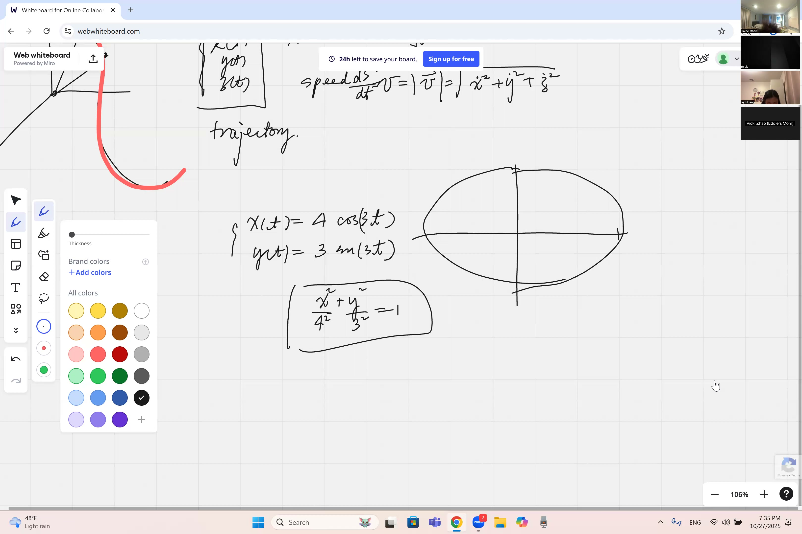
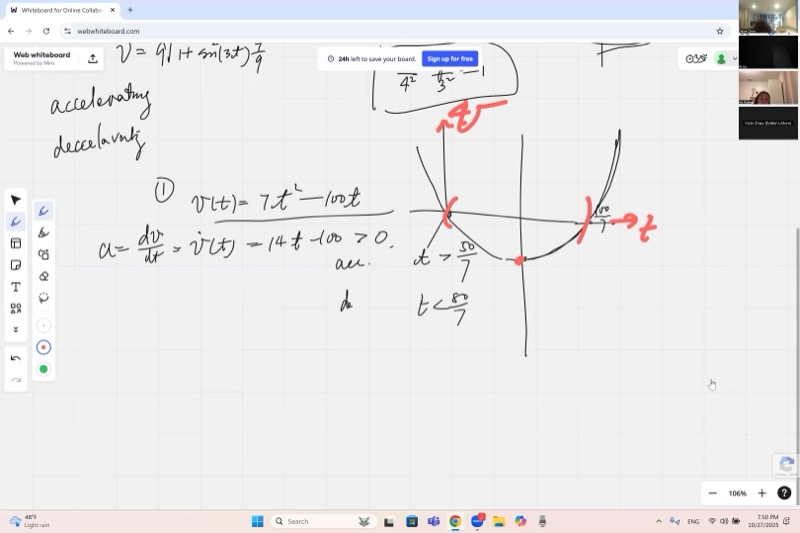
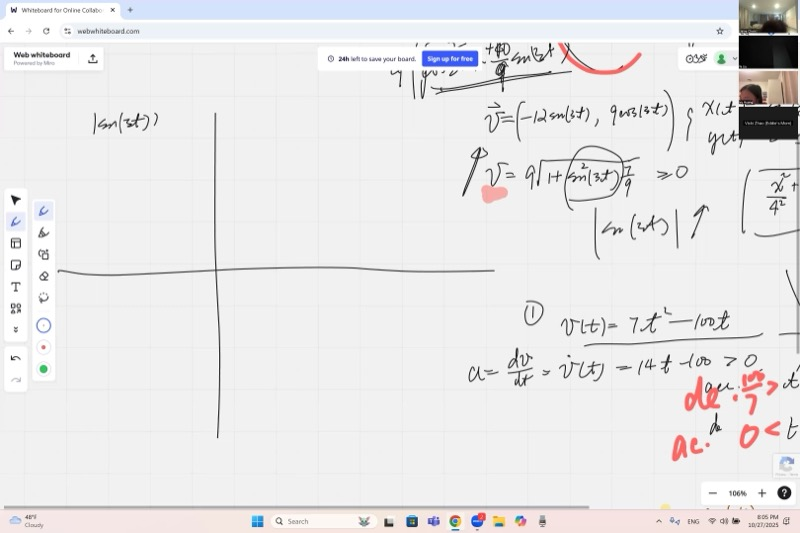
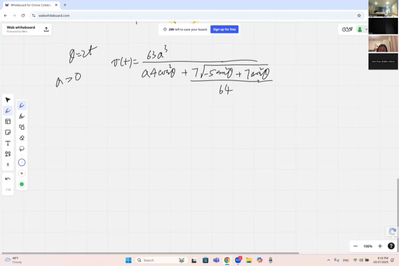

你有没有想过电子游戏如何知道抛射物会落在哪里，或者 NASA 如何绘制卫星的轨道？秘密在于用方程式分别追踪 x 和 y 坐标随时间的变化来描述运动。在本课中，你将学习如何从位置求出物体的速率和方向，如何确定其路径的形状，以及如何判断它是在加速还是减速——这些技能可以解锁从过山车到火箭发射的所有物理学。

::: {.callout-tip collapse="true"}
## 为什么二维运动很重要

理解物体如何在空间中运动是物理学和工程学的基础。以下是二维运动在现实世界中的应用：

- **电子游戏与动画**：每个角色、抛射物和摄像机路径都由参数方程描述，将位置表示为时间的函数
- **太空探索**：NASA 正是使用这些方程来绘制卫星轨道（它们是椭圆！）并计算何时点燃推进器
- **运动科学**：追踪足球的弧线路径或跑道上的跑步者需要将速度分解为分量
- **机器人技术**：自动驾驶汽车必须分别知道它们的速率（大小）和方向（速度向量）才能安全导航
- **天气预报**：飓风和风场用二维和三维的速度场来描述，气象学家需要知道风暴何时在加速

今天我们将学习如何用向量描述运动，消去时间参数找到轨迹形状，以及判断物体何时在加速或减速！
:::

## 本课内容

- 位置向量 $\vec{r}(t) = (x(t),\, y(t),\, z(t))$ 及其时间演化
- 速度向量 $\vec{v}(t) = \frac{d\vec{r}}{dt} = (\dot{x},\, \dot{y},\, \dot{z})$
- 速率是速度的大小：$v = |\vec{v}| = \sqrt{\dot{x}^2 + \dot{y}^2 + \dot{z}^2}$
- 消去参数 $t$ 以求轨迹方程
- 利用勾股恒等式从参数方程中识别椭圆轨道
- 确定轨迹上的起点和运动方向
- 加速与减速：$a(t) \cdot v(t) > 0$ 与 $a(t) \cdot v(t) < 0$
- 无需计算复杂导数的速率图形分析
- 一维运动中的转折点：$v(t) = 0$ 且速度变号的位置

## 课程视频

```{=html}
<video controls width="100%" preload="metadata">
  <source src="https://github.com/ymote/learningcalculus/releases/download/v1.0/calculus20251027.mp4" type="video/mp4">
</video>
```

## 课程关键帧

```{=html}
<div style="display: flex; flex-direction: column; gap: 10px; margin: 1em 0;">
  
  
  
  
</div>
```


## 预备知识

::: {.callout-note collapse="true"}
## 什么是向量？

**向量**是一个同时具有大小（模）和方向的量。我们用箭头表示向量：$\vec{v}$。

在二维中，向量有两个分量：$\vec{v} = (v_x,\, v_y)$。在三维中，它有三个分量：$\vec{v} = (v_x,\, v_y,\, v_z)$。

向量的**模**（长度）使用勾股定理：

$$|\vec{v}| = \sqrt{v_x^2 + v_y^2} \quad \text{（二维）} \qquad |\vec{v}| = \sqrt{v_x^2 + v_y^2 + v_z^2} \quad \text{（三维）}$$

例如，如果 $\vec{v} = (3, 4)$，那么 $|\vec{v}| = \sqrt{9 + 16} = 5$。
:::

::: {.callout-note collapse="true"}
## 什么是参数方程？

**参数方程**通过将每个坐标表示为一个参数（通常是时间 $t$）的独立函数来描述曲线：

$$x = f(t), \qquad y = g(t)$$

不是直接将 $y$ 写成 $x$ 的函数，而是让 $x$ 和 $y$ 都依赖于 $t$。当 $t$ 变化时，点 $(x, y)$ 描绘出一条称为**轨迹**的曲线。

例如，$x = \cos t$，$y = \sin t$ 当 $t$ 从 $0$ 到 $2\pi$ 时描绘出一个单位圆。
:::

::: {.callout-note collapse="true"}
## 什么是三角恒等式（勾股恒等式）？

最重要的三角恒等式是：

$$\cos^2\theta + \sin^2\theta = 1$$

这直接来自单位圆：任意点 $(\cos\theta, \sin\theta)$ 都在圆 $x^2 + y^2 = 1$ 上。

我们经常使用这个恒等式来从含有正弦和余弦的参数方程中**消去**参数 $t$。
:::

::: {.callout-note collapse="true"}
## 什么是椭圆？

**椭圆**是一个被拉伸的圆。它的标准方程为：

$$\frac{x^2}{a^2} + \frac{y^2}{b^2} = 1$$

其中 $a$ 是半长轴（宽度的一半），$b$ 是半短轴（高度的一半），或反之。当 $a = b$ 时，椭圆就变成了一个圆。

椭圆的参数形式为 $x = a\cos\theta$，$y = b\sin\theta$。
:::

## 核心概念

### 二维和三维中的位置、速度与速率

一个在空间中运动的物体有一个随时间变化的**位置向量**：

$$\vec{r}(t) = \big(x(t),\; y(t),\; z(t)\big)$$

**速度向量**是位置对时间的导数：

$$\vec{v}(t) = \frac{d\vec{r}}{dt} = \big(\dot{x}(t),\; \dot{y}(t),\; \dot{z}(t)\big)$$

这里的点记号 $\dot{x}$ 表示 $\frac{dx}{dt}$。速度告诉我们运动的快慢和方向。它是一个**向量**——指向轨迹的切线方向。

**速率**是速度的大小——它只告诉我们运动的快慢，没有方向：

$$v = |\vec{v}| = \sqrt{\dot{x}^2 + \dot{y}^2 + \dot{z}^2}$$

速率也可以写成 $\frac{ds}{dt}$，其中 $ds$ 是沿轨迹的无穷小弧长。

### 消去参数：求轨迹

给定参数方程，我们通常希望得到**轨迹**——空间中的曲线，不涉及时间。我们通过消去 $t$ 来实现。

**示例**：假设 $x(t) = 4\cos(3t)$，$y(t) = 3\sin(3t)$。

第 1 步——分离三角函数：

$$\frac{x}{4} = \cos(3t), \qquad \frac{y}{3} = \sin(3t)$$

第 2 步——应用勾股恒等式 $\cos^2\theta + \sin^2\theta = 1$：

$$\left(\frac{x}{4}\right)^2 + \left(\frac{y}{3}\right)^2 = \cos^2(3t) + \sin^2(3t) = 1$$

::: {.callout-important}
## 核心要点：消去参数揭示轨迹形状
通过使用勾股恒等式 $\cos^2\theta + \sin^2\theta = 1$，你可以从参数方程中去掉时间，发现路径的几何形状。这里，参数化的圆/椭圆方程组合成一个简洁的方程。

$$\boxed{\frac{x^2}{16} + \frac{y^2}{9} = 1}$$
:::

这是一个**椭圆**，半长轴 $a = 4$（沿 $x$ 方向），半短轴 $b = 3$（沿 $y$ 方向）。

**探索——观察椭圆轨迹随时间的描绘过程：**

```{=html}
<div id="calc1" class="desmos-container"></div>
<script src="https://www.desmos.com/api/v1.9/calculator.js?apiKey=dcb31709b452b1cf9dc26972add0fda6"></script>
<script>
  var calc1 = Desmos.GraphingCalculator(document.getElementById('calc1'), {
    expressions: true,
    settingsMenu: false
  });
  calc1.setExpression({ id: 'ellipse', latex: '\\frac{x^2}{16}+\\frac{y^2}{9}=1', color: '#2d70b3', lineWidth: 2 });
  calc1.setExpression({ id: 't_max', latex: 't_{max}=1', sliderBounds: {min: 0, max: 6.28, step: 0.01} });
  calc1.setExpression({ id: 'path', latex: '(4\\cos(3t),\\; 3\\sin(3t))', color: '#c74440', lineWidth: 3, parametricDomain: {min: '0', max: 't_{max}'} });
  calc1.setExpression({ id: 'point', latex: '(4\\cos(3t_{max}),\\; 3\\sin(3t_{max}))', color: '#388c46', pointSize: 12, label: 'particle', showLabel: true });
  calc1.setExpression({ id: 'start', latex: '(4, 0)', color: '#fa7e19', pointSize: 10, label: 'start (t=0)', showLabel: true });
  calc1.setMathBounds({ left: -6, right: 6, bottom: -5, top: 5 });
</script>
```

*拖动 $t_{\max}$ 的滑块来观察质点描绘椭圆的过程。它从 $(4, 0)$ 开始，沿逆时针方向运动！*

### 起点和运动方向

轨迹方程 $\frac{x^2}{16} + \frac{y^2}{9} = 1$ 告诉我们形状，但**不能**告诉我们运动从哪里开始或沿哪个方向。要恢复这些信息，我们需要回到参数方程。

**起点**：代入 $t = 0$：

$$x(0) = 4\cos(0) = 4, \qquad y(0) = 3\sin(0) = 0$$

所以运动从 $(4, 0)$ 开始，即椭圆的最右端。

**方向**：对于一个很小的正 $t$，$\cos(3t)$ 从 1 略微减小，而 $\sin(3t)$ 从 0 增大。所以 $x$ 减小，$y$ 增大——质点向**左上方**移动，即**逆时针**方向。

### 计算椭圆的速度和速率

对 $x(t) = 4\cos(3t)$ 和 $y(t) = 3\sin(3t)$ 求导：

$$\vec{v}(t) = \big(-12\sin(3t),\;\; 9\cos(3t)\big)$$

速率为：

$$v = \sqrt{(-12\sin 3t)^2 + (9\cos 3t)^2} = \sqrt{144\sin^2(3t) + 81\cos^2(3t)}$$

我们将 $144 = 81 + 63$ 拆分来简化：

$$v = \sqrt{81\sin^2(3t) + 63\sin^2(3t) + 81\cos^2(3t)}$$

$$= \sqrt{81\underbrace{(\sin^2 3t + \cos^2 3t)}_{= 1} + 63\sin^2(3t)}$$

$$\boxed{v(t) = \sqrt{81 + 63\sin^2(3t)}}$$

由于 $\sin^2(3t) \ge 0$，最小速率为 $v_{\min} = \sqrt{81} = 9$（当 $\sin(3t) = 0$ 时），最大速率为 $v_{\max} = \sqrt{81 + 63} = \sqrt{144} = 12$（当 $|\sin(3t)| = 1$ 时）。

### 加速与减速：微妙的区别

物体在速率增大时是**加速**的，在速率减小时是**减速**的。这比听起来更复杂！

#### 一维中的陷阱

考虑一维速度 $v(t) = 7t^2 - 100t$。加速度为：

$$a(t) = \frac{dv}{dt} = 14t - 100$$

令 $a > 0$ 得 $t > \frac{50}{7}$。但正加速度**并不**总是意味着物体在加速！

速度 $v(t)$ 是一条抛物线，在 $t = 0$ 和 $t = \frac{100}{7}$ 处为零。在这两个零点之间，速度是**负的**（向左移动）。即使加速度在 $t = \frac{50}{7}$ 时变为正值，此时物体仍在向左移动并在减速。

正确的规则是：看**速率** $|v(t)|$，而不是速度。

- 当 $v$ 和 $a$ **同号**时：物体加速
- 当 $v$ 和 $a$ **异号**时：物体减速

::: {.callout-important}
## 核心要点：加速与减速的判断
当速度和加速度指向同一方向时，物体加速；当它们指向相反方向时，物体减速。它们乘积的符号告诉你属于哪种情况。

$$\boxed{\text{加速：} \quad a(t) \cdot v(t) > 0 \qquad\qquad \text{减速：} \quad a(t) \cdot v(t) < 0}$$
:::

**探索——观察 $v(t) = 7t^2 - 100t$ 的速率与速度的区别：**

```{=html}
<div id="calc2" class="desmos-container"></div>
<script>
  var calc2 = Desmos.GraphingCalculator(document.getElementById('calc2'), {
    expressions: true,
    settingsMenu: false
  });
  calc2.setExpression({ id: 'vel', latex: 'y=7x^2-100x', color: '#2d70b3', lineWidth: 3, label: 'v(t)', showLabel: true });
  calc2.setExpression({ id: 'speed', latex: 'y=|7x^2-100x|', color: '#c74440', lineWidth: 3, lineStyle: 'DASHED', label: '|v(t)| = speed', showLabel: true });
  calc2.setExpression({ id: 'zero1', latex: '(0, 0)', color: '#388c46', pointSize: 8 });
  calc2.setExpression({ id: 'zero2', latex: '(100/7, 0)', color: '#388c46', pointSize: 8, label: '100/7', showLabel: true });
  calc2.setExpression({ id: 'mid', latex: '(50/7, -2500/7)', color: '#fa7e19', pointSize: 8, label: '50/7 (max speed)', showLabel: true });
  calc2.setMathBounds({ left: -2, right: 18, bottom: -450, top: 200 });
</script>
```

*蓝色曲线是速度 $v(t)$。红色虚线曲线是速率 $|v(t)|$。速率从 $t=0$ 到 $t=\frac{50}{7}$ 增大（加速），然后从 $t=\frac{50}{7}$ 到 $t = \frac{100}{7}$ 减小（减速）——即使加速度 $a(t)$ 在 $t = \frac{50}{7}$ 处变号，但变号的时刻并不相同！*

### 二维速率的图形分析（避免求导）

对于我们的椭圆，我们得到 $v(t) = \sqrt{81 + 63\sin^2(3t)}$。要确定速率何时增大或减小，我们**不需要**对这个复杂的表达式求导！

**技巧**：速率 $v$ 在 $\sin^2(3t)$ 增大时增大，而这发生在 $|\sin(3t)|$ 增大时。所以我们只需画出 $|\sin(3t)|$ 的图形，读出它在哪里上升或下降即可。

```{=html}
<div id="calc3" class="desmos-container"></div>
<script>
  var calc3 = Desmos.GraphingCalculator(document.getElementById('calc3'), {
    expressions: true,
    settingsMenu: false
  });
  calc3.setExpression({ id: 'sin_raw', latex: 'y=\\sin(3x)', color: '#bbbbbb', lineWidth: 1.5, lineStyle: 'DASHED', label: 'sin(3t)', showLabel: true });
  calc3.setExpression({ id: 'sin_abs', latex: 'y=|\\sin(3x)|', color: '#2d70b3', lineWidth: 3, label: '|sin(3t)|', showLabel: true });
  calc3.setExpression({ id: 'p1', latex: '(\\pi/6, 1)', color: '#c74440', pointSize: 8, label: 'pi/6', showLabel: true });
  calc3.setExpression({ id: 'p2', latex: '(\\pi/3, 0)', color: '#388c46', pointSize: 8, label: 'pi/3', showLabel: true });
  calc3.setMathBounds({ left: -0.5, right: 4, bottom: -1.5, top: 1.5 });
</script>
```

*灰色虚线是 $\sin(3t)$。蓝色曲线是 $|\sin(3t)|$——通过将负值部分"翻转"到正值方向得到。注意函数在零点处有尖角。速率在蓝色曲线上升的地方增大。*

从图形中，$|\sin(3t)|$ 在 $3t$ 从 $k\pi$ 到 $k\pi + \frac{\pi}{2}$ 的区间上递增：

$$\text{加速区间：} t \in \left[\frac{k\pi}{3},\;\; \frac{k\pi}{3} + \frac{\pi}{6}\right] \quad \text{对任意整数 } k$$

$$\text{减速区间：} t \in \left[\frac{k\pi}{3} + \frac{\pi}{6},\;\; \frac{(k+1)\pi}{3}\right] \quad \text{对任意整数 } k$$

### 简化复杂的速率表达式

图形方法即使对令人生畏的公式也有效。假设：

$$v(t) = \frac{63a^3}{4\cos^2\theta + 7\sqrt{\frac{12\cos^2\theta + 7\sin^2\theta}{64}}}$$

其中 $\theta = 2t$，$a$ 是正常数。我们不求导，而是进行推理：

1. **分母的两项都是正的**，所以要让 $v$ 增大，我们需要分母**减小**。
2. 用 $\sin^2\theta = 1 - \cos^2\theta$ 将一切用 $u = \cos^2\theta$ 表示。
3. 分母的两项都是 $u$ 的递增函数，所以当 $u$ 减小时它们减小，即当 $|\cos\theta|$ 减小时。
4. 画出 $|\cos\theta|$ 的图形，读出它递减的区间——那些就是物体加速的区间。

这种方法完全避免了链式法则的噩梦！

### 一维运动中的转折点

**转折点**是一维物体改变运动方向的位置。它需要满足两个条件：

$$\dot{x}(t_0) = 0 \qquad \text{且} \qquad \dot{x}(t) \text{ 在 } t_0 \text{ 处变号}$$

仅有 $\dot{x} = 0$ 是不够的——速度必须从正变负（物体原来向右移动，现在转向左移动）或反过来。这就像位置 $x(t)$ 的局部最大值或最小值。

在**二维运动**中，转折点没有唯一严格的定义。一个点是否算作"转折"取决于你分析的坐标方向。例如，在椭圆上，顶部和底部可以是 $y$ 坐标的转折点，而左右两端是 $x$ 坐标的转折点。

### 作业：椭圆上的最大和最小距离

对于椭圆 $\frac{x^2}{16} + \frac{y^2}{9} = 1$，使用微分学（优化方法）求距中心最大和最小距离的点。

**提示**：在椭圆约束下最大化和最小化 $r^2 = x^2 + y^2$。你可以代入 $y^2 = 9\left(1 - \frac{x^2}{16}\right)$ 并对 $x$ 进行优化。

你的直觉说最远的点在 $(\pm 4, 0)$，最近的点在 $(0, \pm 3)$——请严格证明它！

## 速查表

::: {.key-formula}
| 你想要的 | 公式 |
|---|---|
| 位置向量 | $\vec{r}(t) = (x(t),\, y(t))$ |
| 速度向量 | $\vec{v}(t) = (\dot{x}(t),\, \dot{y}(t)) = \frac{d\vec{r}}{dt}$ |
| 速率 | $v = \lvert\vec{v}\rvert = \sqrt{\dot{x}^2 + \dot{y}^2}$ |
| 消去参数（三角函数） | 使用 $\cos^2\theta + \sin^2\theta = 1$ 消去 $t$ |
| 参数化椭圆 | $x = a\cos\omega t,\; y = b\sin\omega t \;\Rightarrow\; \frac{x^2}{a^2} + \frac{y^2}{b^2} = 1$ |
| 起点 | 将 $t = 0$ 代入 $x(t)$ 和 $y(t)$ |
| 运动方向 | 检查小正 $t$ 时 $\dot{x}$ 和 $\dot{y}$ 的符号 |
| 加速（一维） | $a(t) \cdot v(t) > 0$（同号） |
| 减速（一维） | $a(t) \cdot v(t) < 0$（异号） |
| 加速（二维） | 速率 $\lvert\vec{v}\rvert$ 在增大 |
| 转折点（一维） | $v(t_0) = 0$ 且 $v$ 变号 |

### 核心思路链

$$\vec{r}(t) \;\xrightarrow{\;\frac{d}{dt}\;}\; \vec{v}(t) \;\xrightarrow{\;|\cdot|\;}\; v(t) = \text{速率} \;\xrightarrow{\;\text{在增大？}\;}\; \text{加速}$$

$$\text{参数方程：} x(t),\, y(t) \;\xrightarrow{\;\text{消去 } t\;}\; F(x, y) = 0 \;\text{（轨迹）}$$
:::
