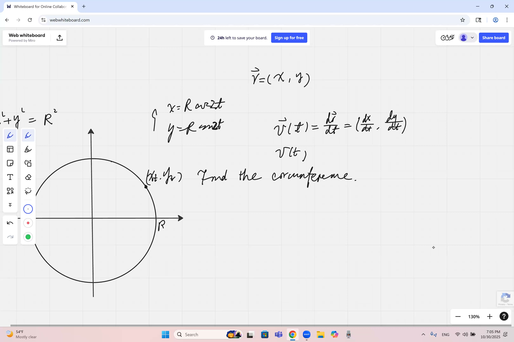
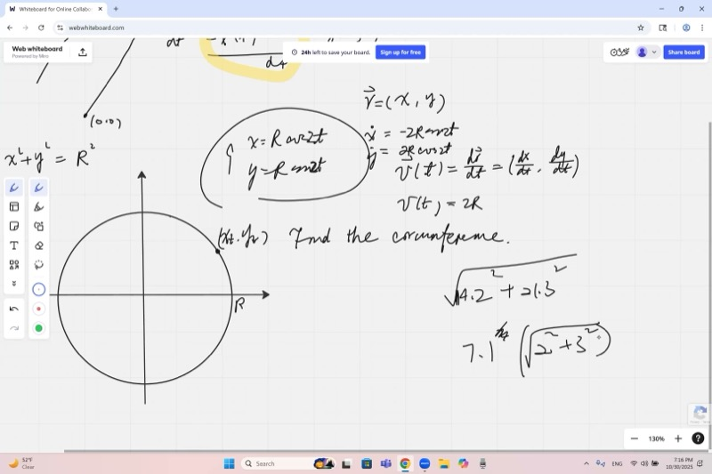
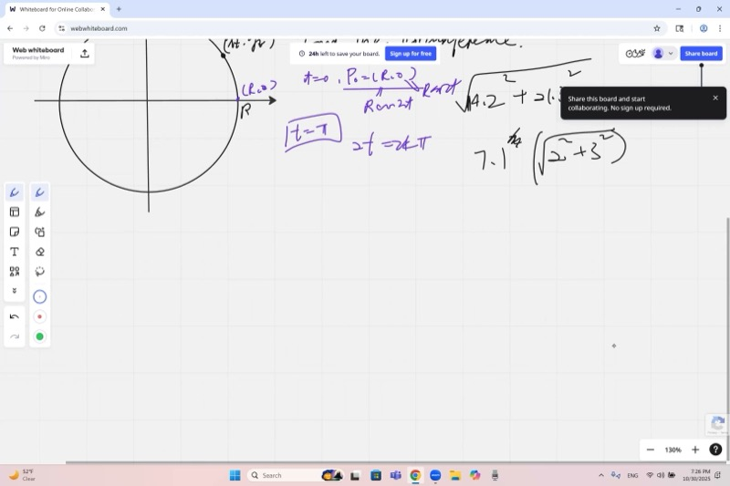
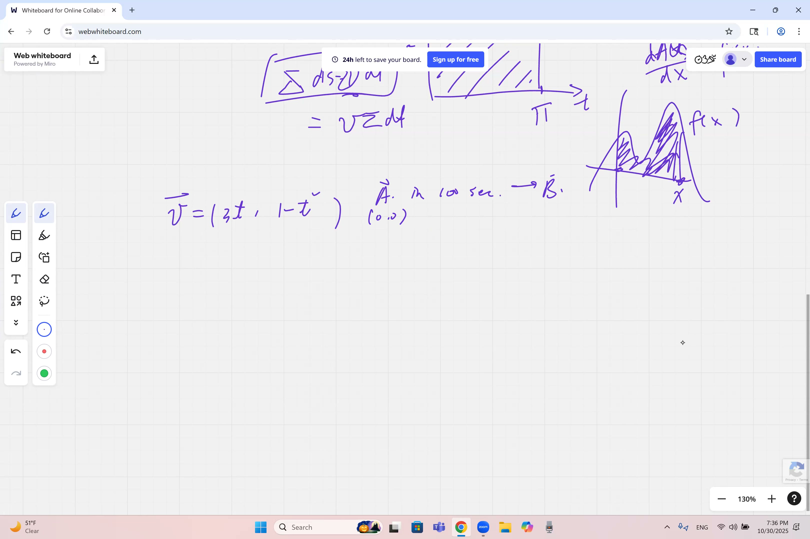

圆的周长公式 $C = 2\pi r$ 是基础数学中的经典结论。本课使用参数方程描述圆上质点的运动，通过求导计算其速率，进而用微积分严格证明周长公式。此外，还将讨论如何通过反微分从速度恢复物体的位置。

::: {.callout-tip collapse="true"}
## 为什么参数运动很重要

参数方程描述了物体在空间中如何随时间运动：

- **GPS 导航**：手机将用户位置追踪为独立的 $x(t)$ 和 $y(t)$ 坐标，以在地图上绘制路线
- **电子游戏**：屏幕上的每个角色和抛射物都使用每帧更新的参数方程来移动
- **天气追踪**：飓风路径被建模为参数曲线，气象学家在每个时刻计算速率和方向
- **机器人技术**：机器人手臂在空间中描绘路径，工程师需要知道每个关节的运动速度和方向
- **过山车**：设计师使用参数曲线来确保车辆的速率和方向对乘客产生刺激但安全的力
:::

## 本课内容

- 圆周运动的参数方程：$x(t) = r\cos(2t)$，$y(t) = r\sin(2t)$
- 速度是位置的导数：$\vec{v} = \left(\frac{dx}{dt},\, \frac{dy}{dt}\right)$
- 速率是速度的大小：$|\vec{v}| = \sqrt{\dot{x}^2 + \dot{y}^2}$
- 证明圆的周长：$C = 2\pi r$
- 路程与位移的区别
- 通过反微分从速度恢复位置
- 与微积分基本定理的联系

## 课程视频

```{=html}
<video controls width="100%" preload="metadata">
  <source src="https://github.com/ymote/learningcalculus/releases/download/v1.0/calculus20251030.mp4" type="video/mp4">
</video>
```

## 课程关键帧

```{=html}
<div style="display: flex; flex-direction: column; gap: 10px; margin: 1em 0;">
  
  
  
  
</div>
```


## 预备知识

::: {.callout-note collapse="true"}
## 什么是参数方程？

不是将 $y$ 写成 $x$ 的函数，而是通过将**两个**坐标都表示为第三个变量（通常是时间 $t$）的函数来描述曲线：

$$x = f(t), \quad y = g(t)$$

当 $t$ 变化时，点 $(x, y)$ 描绘出一条称为**参数曲线**或**轨迹**的路径。

例如，$x = \cos t$，$y = \sin t$ 当 $t$ 从 $0$ 到 $2\pi$ 时描绘出单位圆。
:::

::: {.callout-note collapse="true"}
## 速率和速度有什么区别？

- **速度**是一个**向量**——同时具有大小和方向。在二维中，$\vec{v} = (v_x, v_y)$。
- **速率**是一个**标量**——它是速度的大小：$|\vec{v}| = \sqrt{v_x^2 + v_y^2}$。

例如，一辆以 60 英里/时向北行驶的汽车，其速度为 60 英里/时向北，速率为 60 英里/时。若掉头以 60 英里/时向南行驶，速度改变了（方向不同），但速率不变。
:::

::: {.callout-note collapse="true"}
## 什么是链式法则？

当一个函数嵌套在另一个函数内时，**链式法则**给出其求导方法：

$$\frac{d}{dt}\, f\!\bigl(g(t)\bigr) = f'\!\bigl(g(t)\bigr) \cdot g'(t)$$

例如：$\frac{d}{dt}\cos(2t) = -\sin(2t) \cdot 2 = -2\sin(2t)$。

先对外层函数求导，然后乘以内层函数的导数。
:::

::: {.callout-note collapse="true"}
## 什么是位移与路程？

- **位移**是从起点到终点的直线向量。例如，向东走 3 个街区再向西走 3 个街区，位移为零。
- **路程**是实际走过的路径总长度。在上面的例子中，路程是 6 个街区。

路程总是大于或等于位移的大小。
:::

::: {.callout-note collapse="true"}
## 什么是反导数？

**反导数**（或**不定积分**）是微分的逆运算。如果 $\frac{d}{dt} F(t) = f(t)$，那么 $F(t)$ 是 $f(t)$ 的一个反导数。

例如，因为 $\frac{d}{dt}\left(\frac{3}{2}t^2\right) = 3t$，所以 $3t$ 的反导数是 $\frac{3}{2}t^2 + C$，其中 $C$ 是一个任意常数。
:::

## 从圆到运动：参数方程

我们都知道以原点为圆心、半径为 $r$ 的圆的方程：

$$x^2 + y^2 = r^2$$

但这只是一个**轨道**——一个静态的形状。为了将它变成**运动**，我们引入时间。利用半径为 $r$ 的圆上余弦和正弦的定义：

$$x(t) = r\cos(2t), \quad y(t) = r\sin(2t)$$

参数内的系数 $2$ 控制点沿圆运动的快慢。不同的选择会给出不同的速率，但描绘的是同一条路径。

**探索参数化的圆——拖动滑块观察点的运动：**

```{=html}
<div id="calc1" class="desmos-container"></div>
<script src="https://www.desmos.com/api/v1.9/calculator.js?apiKey=dcb31709b452b1cf9dc26972add0fda6"></script>
<script>
  var calc1 = Desmos.GraphingCalculator(document.getElementById('calc1'), {
    expressions: true,
    settingsMenu: false
  });
  calc1.setExpression({ id: 'circle', latex: 'x^2+y^2=r^2', color: '#aaaaaa' });
  calc1.setExpression({ id: 'r', latex: 'r=2', sliderBounds: {min: 0.5, max: 4, step: 0.1} });
  calc1.setExpression({ id: 't', latex: 't_0=0', sliderBounds: {min: 0, max: 3.14, step: 0.01} });
  calc1.setExpression({ id: 'point', latex: '(r\\cos(2t_0), r\\sin(2t_0))', color: '#2d70b3', pointSize: 12, label: 'P(t)', showLabel: true });
  calc1.setExpression({ id: 'radius', latex: '(tr\\cos(2t_0), tr\\sin(2t_0))', color: '#388c46', lineWidth: 1.5, parametricDomain: {min: 0, max: 1} });
  calc1.setMathBounds({ left: -5, right: 5, bottom: -5, top: 5 });
</script>
```

## 求速度向量

速度是位置的变化率。我们分别对每个坐标求导：

$$\vec{v}(t) = \left(\frac{dx}{dt},\; \frac{dy}{dt}\right)$$

对每个分量应用**链式法则**：

$$\frac{dx}{dt} = \frac{d}{dt}\bigl[r\cos(2t)\bigr] = -r\sin(2t) \cdot 2 = -2r\sin(2t)$$

$$\frac{dy}{dt} = \frac{d}{dt}\bigl[r\sin(2t)\bigr] = r\cos(2t) \cdot 2 = 2r\cos(2t)$$

所以速度向量为：

$$\vec{v}(t) = \bigl(-2r\sin(2t),\; 2r\cos(2t)\bigr)$$

注意速度始终**与圆相切**——它指向运动的方向，垂直于半径。

## 速率：速度的大小

速率是速度向量的模：

$$|\vec{v}| = \sqrt{\dot{x}^2 + \dot{y}^2} = \sqrt{(-2r\sin 2t)^2 + (2r\cos 2t)^2}$$

**先提取公因子**来简化勾股求和（这是一个良好的计算习惯）：

$$= \sqrt{(2r)^2\bigl(\sin^2(2t) + \cos^2(2t)\bigr)}$$

由于对任意角 $\theta$ 都有 $\sin^2\theta + \cos^2\theta = 1$：

::: {.callout-important}
## 核心要点：匀速圆周运动具有恒定速率
当一个点沿圆运动时，其速度中的正弦和余弦项由于勾股恒等式而相消，留下一个永不改变的速率。速率只取决于半径和角速度的大小。

$$|\vec{v}| = 2r$$
:::

速率是**恒定的**——该点在任何时刻都以相同的速率沿圆运动。这就是**匀速圆周运动**。

## 求周期

在 $t = 0$ 时，点从以下位置出发：

$$P_0 = \bigl(r\cos(0),\, r\sin(0)\bigr) = (r,\, 0)$$

要完成一圈，角度 $2t$ 必须增加 $2\pi$（一整圈的弧度数）：

$$2t = 2\pi \implies t = \pi$$

所以**周期**——完成一整圈所需的时间——是 $T = \pi$。

::: {.callout-tip collapse="true"}
## 为什么不用 360 度？

时间不能等于某个度数。方程 $2t = 2\pi$ 成立是因为 $2\pi$ 是一个**无量纲的数**（弧度没有单位）。写 $t = 180°$ 会导致单位不匹配。这是微积分总是使用弧度的深层原因之一。
:::

## 证明周长公式：$C = 2\pi r$

我们知道速率 $|\vec{v}| = 2r$ 是常数，周期是 $T = \pi$。一圈中走过的总距离为：

::: {.callout-important}
## 核心要点：用微积分证明周长公式
路程等于速率乘以时间。由于沿圆运动的速率恒定为 $2r$，一整圈的时间为 $\pi$，所以总路程——即周长——就是它们的乘积。

$$C = \int_0^{\pi} |\vec{v}|\, dt = \int_0^{\pi} 2r\, dt = 2r \cdot \pi = 2\pi r$$
:::

这就是我们熟悉的周长公式，但现在我们已经用微积分**证明**了它，而不是将其作为事实来陈述。

换言之，以恒定速率 $2r$ 行驶时间 $\pi$，走过的距离就是 $2r \times \pi$。它就是恒定速度图形下方矩形的面积。

**观察速度图形——矩形的面积就是周长：**

```{=html}
<div id="calc2" class="desmos-container"></div>
<script>
  var calc2 = Desmos.GraphingCalculator(document.getElementById('calc2'), {
    expressions: true,
    settingsMenu: false
  });
  calc2.setExpression({ id: 'r', latex: 'r=2', sliderBounds: {min: 0.5, max: 4, step: 0.1} });
  calc2.setExpression({ id: 'speed', latex: 'y=2r \\left\\{0 \\le x \\le \\pi\\right\\}', color: '#2d70b3', lineWidth: 3 });
  calc2.setExpression({ id: 'fill', latex: '0 \\le y \\le 2r \\left\\{0 \\le x \\le \\pi\\right\\}', color: '#2d70b3' });
  calc2.setExpression({ id: 'label', latex: '(\\pi/2, r)', color: '#c74440', pointSize: 0, label: 'Area = 2\\pi r', showLabel: true, labelSize: '2' });
  calc2.setExpression({ id: 'xaxis', latex: 'y=0', color: '#000000', lineWidth: 0.5 });
  calc2.setMathBounds({ left: -0.5, right: 4, bottom: -1, top: 10 });
</script>
```

## 一般运动中的路程与位移

周长的证明突显了一个重要的区别：

| 物理量 | 定义 | 公式 |
|---|---|---|
| **位移** | 从起点到终点的向量 | $\Delta\vec{r} = \vec{r}(t_f) - \vec{r}(t_0)$ |
| **路程** | 路径总长度（始终为正） | $s = \int_{t_0}^{t_f} |\vec{v}(t)|\, dt$ |

对于完整的圆，位移是 $\vec{0}$（质点回到了起点），但路程是 $2\pi r$。

连接速率和路程的关键公式是：

$$ds = |\vec{v}|\, dt \quad \implies \quad s = \int_{t_0}^{t_f} |\vec{v}|\, dt$$

这就是**弧长积分**——它沿着路径将所有微小距离元素 $ds$ 加起来。


## 计算示例：非匀速二维运动

现在考虑一个更一般的**非恒定**速度向量：

$$\vec{v}(t) = (3t,\; 1 - t^2)$$

从原点 $A = (0, 0)$ 出发，求 $t = 100$ 秒后的位置。

### 第 1 步：对 $\dot{x} = 3t$ 反微分求 $x(t)$

$$x(t) = \int 3t\, dt = \frac{3}{2}t^2 + C_1$$

由于 $x(0) = 0$，得 $C_1 = 0$，所以 $x(t) = \frac{3}{2}t^2$。

### 第 2 步：对 $\dot{y} = 1 - t^2$ 反微分求 $y(t)$

$$y(t) = \int (1 - t^2)\, dt = t - \frac{t^3}{3} + C_2$$

由于 $y(0) = 0$，得 $C_2 = 0$，所以 $y(t) = t - \frac{t^3}{3}$。

### 第 3 步：在 $t = 100$ 时求值

$$x(100) = \frac{3}{2}(100)^2 = 15{,}000$$

$$y(100) = 100 - \frac{100^3}{3} = 100 - \frac{1{,}000{,}000}{3} \approx -333{,}233$$

$t = 100$ 时的位置为 $B \approx (15{,}000,\; -333{,}233)$。

::: {.callout-tip collapse="true"}
## 为什么常数 $C$ 会消去？

在计算位置的**变化**时，常数会消去：

$$\Delta x = x(t_f) - x(t_0) = \left[\frac{3}{2}t_f^2 + C\right] - \left[\frac{3}{2}t_0^2 + C\right] = \frac{3}{2}(t_f^2 - t_0^2)$$

常数 $C$ 代表坐标系的一个未知平移。因为我们只关心变化量，所以它消去了。当我们将起点设在原点时，实际上就是选择了 $C = 0$。
:::

### 第 4 步：路程（更难的问题）

路程**不等于**位移的大小。我们需要弧长积分：

$$s = \int_0^{100} |\vec{v}(t)|\, dt = \int_0^{100} \sqrt{(3t)^2 + (1 - t^2)^2}\, dt = \int_0^{100} \sqrt{9t^2 + 1 - 2t^2 + t^4}\, dt$$

$$= \int_0^{100} \sqrt{t^4 + 7t^2 + 1}\, dt$$

这个积分不能化简为简洁的解析形式，这在真实世界的运动中很典型。在实践中，我们会用数值方法来求值。

**探索轨迹——拖动滑块观察点描绘路径：**

```{=html}
<div id="calc3" class="desmos-container"></div>
<script>
  var calc3 = Desmos.GraphingCalculator(document.getElementById('calc3'), {
    expressions: true,
    settingsMenu: false
  });
  calc3.setExpression({ id: 'tmax', latex: 'T=2', sliderBounds: {min: 0, max: 3, step: 0.01} });
  calc3.setExpression({ id: 'path', latex: '\\left(\\frac{3}{2}t^2,\\; t - \\frac{t^3}{3}\\right)', color: '#2d70b3', lineWidth: 2, parametricDomain: {min: 0, max: 'T'} });
  calc3.setExpression({ id: 'point', latex: '\\left(\\frac{3}{2}T^2,\\; T - \\frac{T^3}{3}\\right)', color: '#c74440', pointSize: 12, label: 'P(T)', showLabel: true });
  calc3.setExpression({ id: 'origin', latex: '(0,0)', color: '#388c46', pointSize: 8, label: 'A', showLabel: true });
  calc3.setMathBounds({ left: -1, right: 15, bottom: -6, top: 2 });
</script>
```

## 与微积分基本定理的联系

我们使用的过程——通过反微分从速度回到位置——正是**微积分基本定理**的实际应用：

$$x(t_f) - x(t_0) = \int_{t_0}^{t_f} \dot{x}(t)\, dt$$

用文字来说：**变化率的积分等于总变化量**。这与"速度-时间图形下方的面积等于位移"是同一个原理。

对于路程（而非位移），我们对**速率**（速度的大小）积分：

$$s = \int_{t_0}^{t_f} |\vec{v}(t)|\, dt$$

## 速查表

::: {.key-formula}
| 公式 | 说明 |
|---|---|
| $x(t) = r\cos(\omega t),\; y(t) = r\sin(\omega t)$ | 参数化圆，半径 $r$，角速度 $\omega$ |
| $\vec{v}(t) = \left(\frac{dx}{dt},\, \frac{dy}{dt}\right)$ | 速度 = 位置的时间导数 |
| $\lvert\vec{v}\rvert = \sqrt{\dot{x}^2 + \dot{y}^2}$ | 速率 = 速度的大小 |
| $T = \frac{2\pi}{\omega}$ | 圆周运动的周期 |
| $C = \lvert\vec{v}\rvert \cdot T = 2\pi r$ | 周长 = 速率乘以时间 |
| $s = \int_{t_0}^{t_f} \lvert\vec{v}(t)\rvert\, dt$ | 弧长 / 路程 |
| $\Delta\vec{r} = \int_{t_0}^{t_f} \vec{v}(t)\, dt$ | 从速度求位移 |

### 用到的关键恒等式

$$\sin^2\theta + \cos^2\theta = 1$$

$$\frac{d}{dt}\cos(\omega t) = -\omega\sin(\omega t), \qquad \frac{d}{dt}\sin(\omega t) = \omega\cos(\omega t)$$

### 反导数法则

$$\int t^n\, dt = \frac{t^{n+1}}{n+1} + C \quad (n \neq -1)$$
:::
