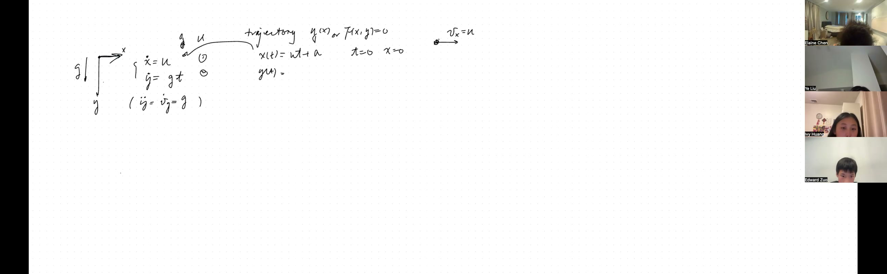
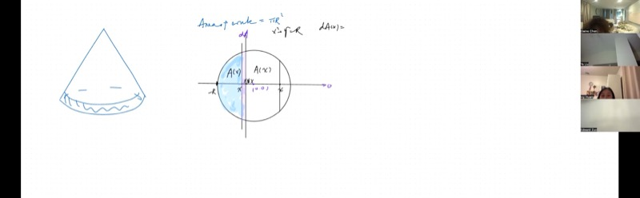
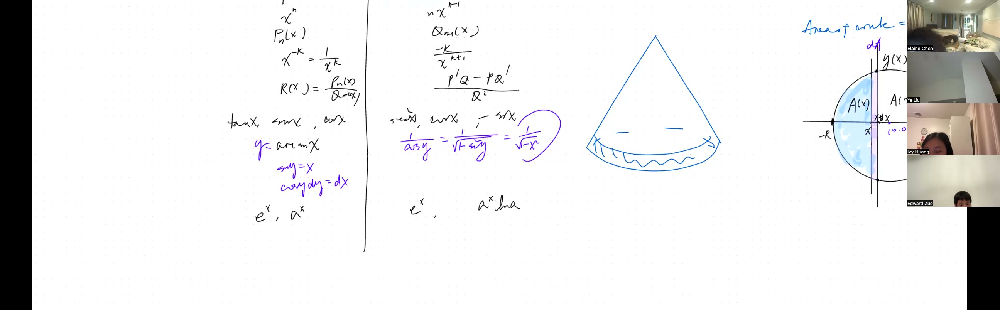
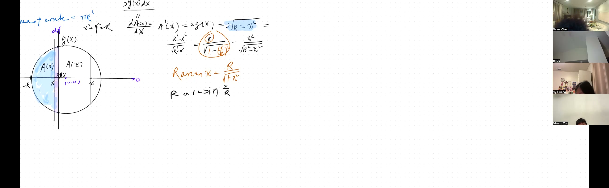

如何严格计算曲线图形的面积？本课展示如何将圆切成无限薄的条带，通过积分求出仅靠初等几何难以处理的面积。课程还讨论反微分的基本方法，并说明在处理圆形区域时，反三角函数（如反正弦）如何自然出现。此外，将证明水平抛射物体的轨迹为抛物线。

::: {.callout-tip collapse="true"}
## 为什么反导数和积分很重要

积分是微积分的第二大支柱——将无数个微小部分加在一起以得到总量：

- **医学**：医生通过对吸收速率积分来计算人体在一段时间内吸收的药物总量——剂量计算错误可能是危险的
- **太空旅行**：NASA 工程师对加速度数据积分来计算火箭已经飞了多远以及在每个时刻的速度
- **建筑**：建筑师通过将弯曲表面（如穹顶和拱门）切成薄条并加总来计算面积——这就是积分
- **体育分析**：追踪足球运动员在比赛中跑了多远意味着对他们的速率随时间积分
- **动画**：皮克斯使用积分来计算光如何从弯曲表面反射，使 3D 角色看起来逼真
:::

## 本课内容

- 抛体运动：通过反导数从速度恢复位置（$x = ut$，$y = \tfrac{1}{2}gt^2$）
- 消去参数 $t$ 得到轨迹 $y = \dfrac{g}{2u^2}\,x^2$
- 积分学入门：组装无穷小量
- 用竖直条带求圆的面积：$dA = 2\sqrt{r^2 - x^2}\,dx$
- 复习七大函数族及其导数-反导数对
- 通过隐函数微分求 $\arcsin x$ 的导数：$\dfrac{d}{dx}\arcsin x = \dfrac{1}{\sqrt{1-x^2}}$
- 通过反函数法则求 $\ln x$ 的导数：$\dfrac{d}{dx}\ln x = \dfrac{1}{x}$
- 含反正弦的反导数：$\displaystyle\int \frac{1}{\sqrt{r^2 - x^2}}\,dx = \arcsin\!\left(\frac{x}{r}\right) + C$

## 课程视频

```{=html}
<video controls width="100%" preload="metadata">
  <source src="https://github.com/ymote/learningcalculus/releases/download/v1.0/calculus20251103.mp4" type="video/mp4">
</video>
```

## 课程关键帧

```{=html}
<div style="display: flex; flex-direction: column; gap: 10px; margin: 1em 0;">
  
  
  
  
</div>
```


## 预备知识

::: {.callout-note collapse="true"}
## 什么是反导数？

函数 $f(x)$ 的**反导数**是任何导数等于 $f(x)$ 的函数 $F(x)$：

$$F'(x) = f(x)$$

例如，如果 $f(x) = 2x$，那么 $F(x) = x^2$ 是一个反导数，因为 $\frac{d}{dx}(x^2) = 2x$。

但 $F(x) = x^2 + 7$ 同样成立。加上任何常数的反导数仍然是反导数，因为常数在求导时消失。这就是为什么在末尾写 $+C$（一个任意常数）。
:::

::: {.callout-note collapse="true"}
## 什么是抛体运动？

水平抛出一个球时，两个过程同时发生：

1. **水平方向**，球以恒定速率 $u$ 继续运动（没有力在横向推或拉它）
2. **竖直方向**，重力以恒定加速度 $g \approx 9.8\;\text{m/s}^2$ 将球向下拉

水平和竖直运动是独立的。我们用独立的方程来描述它们：

$$\dot{x} = u \qquad \text{（恒定水平速度）}$$
$$\dot{y} = g\,t \qquad \text{（竖直速度随时间增大）}$$

点记号 $\dot{x}$ 表示 $\frac{dx}{dt}$，即对时间的变化率。
:::

::: {.callout-note collapse="true"}
## "消去参数"是什么意思？

在物理学中，位置通常用时间的两个独立方程给出：$x(t)$ 和 $y(t)$。变量 $t$ 称为**参数**。

要找到**轨迹**（物体在 $xy$ 平面上描绘的路径），我们通过从一个方程中解出 $t$ 并代入另一个方程来消去 $t$。结果是一个直接的关系 $y = f(x)$——路径的形状，与物体在每个点的时刻无关。
:::

::: {.callout-note collapse="true"}
## 什么是圆的方程？

以原点为圆心、半径为 $r$ 的圆由**隐式方程**描述：

$$x^2 + y^2 = r^2$$

这不是一个函数（它无法通过竖直线检验），但我们可以解出 $y$：

$$y = \pm\sqrt{r^2 - x^2}$$

正根给出上半部分，负根给出下半部分。
:::

::: {.callout-note collapse="true"}
## 什么是幂法则的反导数形式？

如果 $x^n$ 的导数是 $nx^{n-1}$，那么反向运用这个规则得到：

$$\int x^n\,dx = \frac{x^{n+1}}{n+1} + C \qquad (n \neq -1)$$

例如，由 $\frac{d}{dt}(t^2) = 2t$ 可知 $2t$ 的反导数就是 $t^2 + C$。等价地，$t$ 的反导数是 $\frac{t^2}{2} + C$。
:::

## 核心概念

### 抛体运动：从速度到位置

给定在引力场中水平抛出的球（初速度为 $u$）的速度分量：

$$\dot{x} = u \qquad \dot{y} = g\,t$$

**目标**：通过（1）从速度恢复位置，然后（2）消去 $t$，来找到轨迹 $y(x)$。

**第 1 步——求 $x(t)$。**  由于 $\dot{x} = u$ 是常数，反导数为：

$$x(t) = ut + a$$

利用初始条件 $x(0) = 0$（球从原点出发），得 $a = 0$，所以：

$$\boxed{x(t) = ut}$$

**第 2 步——求 $y(t)$。**  由于 $\dot{y} = gt$ 是 $t$ 的线性函数，反用幂法则：

$$y(t) = \frac{1}{2}g\,t^2 + a$$

同样，$y(0) = 0$ 要求 $a = 0$：

$$\boxed{y(t) = \tfrac{1}{2}g\,t^2}$$

**第 3 步——消去 $t$。**  由 $x = ut$ 得 $t = \frac{x}{u}$。代入 $y(t)$：

$$y = \frac{1}{2}g\left(\frac{x}{u}\right)^2$$

::: {.callout-important}
## 核心要点：水平抛射的轨迹是抛物线
通过从速度求位置（反微分）然后消去时间，可以证明水平抛出的球描绘出抛物线路径。重力控制曲线的陡峭程度，而抛出速度控制曲线的平坦程度。

$$\boxed{y = \frac{g}{2u^2}\,x^2}$$
:::

这是一条**抛物线**。$g$ 越大，抛物线越陡（球下落更快）；$u$ 越大，抛物线越平（球在下落前飞得更远）。

**探索——$g$ 和 $u$ 如何改变轨迹：**

```{=html}
<div id="calc1" class="desmos-container"></div>
<script src="https://www.desmos.com/api/v1.9/calculator.js?apiKey=dcb31709b452b1cf9dc26972add0fda6"></script>
<script>
  var calc1 = Desmos.GraphingCalculator(document.getElementById('calc1'), {
    expressions: true,
    settingsMenu: false
  });
  calc1.setExpression({ id: 'g', latex: 'g=9.8', sliderBounds: {min: 1, max: 20, step: 0.1} });
  calc1.setExpression({ id: 'u', latex: 'u=5', sliderBounds: {min: 1, max: 15, step: 0.1} });
  calc1.setExpression({ id: 'traj', latex: 'y=\\frac{g}{2u^2}x^2', color: '#2d70b3', lineWidth: 3 });
  calc1.setExpression({ id: 'origin', latex: '(0,0)', color: '#2d70b3', pointSize: 10, label: 'Launch point', showLabel: true });
  calc1.setMathBounds({ left: -1, right: 12, bottom: -1, top: 15 });
</script>
```

*拖动 $g$ 来增大重力（抛物线变陡），或增大 $u$ 来增大初速度（抛物线变平）。球始终沿抛物线路径运动。*

### 从微分学到积分学

到目前为止，我们一直在做**微分学**：将量切割成无穷小量并求变化率。现在我们开始**积分学**：将无穷小量重新组合以求总量。关键的见解是，微分和反微分是**互逆运算**——正如我们在上面的抛体问题中从速度恢复位置一样。

### 求圆的面积

我们如何证明半径为 $r$ 的圆的面积是 $\pi r^2$？我们将它切成无穷薄的竖直条带并加总。

**建模。** 将圆 $x^2 + y^2 = r^2$ 放在原点。定义 $A(x)$ 为从 $-r$ 扫到位置 $x$ 的面积：

$$A(x) = \text{从 } {-r} \text{ 到 } x \text{ 的阴影面积}$$

当 $x$ 增加一个微小量 $dx$ 时，面积增加一个薄矩形条带：

$$dA = \text{高度} \times \text{宽度} = 2\sqrt{r^2 - x^2}\;\cdot\;dx$$

系数 $2$ 考虑了圆的上半部分和下半部分。因此，面积函数的导数为：

::: {.callout-important}
## 核心要点：将圆切成薄条带
要求圆的面积，想象一条竖直线扫过圆。每一条无限薄的条带高 $2\sqrt{r^2 - x^2}$，宽 $dx$。总面积是所有条带的总和（积分）——而求这个总和意味着找到一个反导数。

$$\boxed{A'(x) = 2\sqrt{r^2 - x^2}}$$
:::

现在问题简化为求 $2\sqrt{r^2 - x^2}$ 的反导数。

**探索——观察圆的竖直切割：**

```{=html}
<div id="calc2" class="desmos-container"></div>
<script>
  var calc2 = Desmos.GraphingCalculator(document.getElementById('calc2'), {
    expressions: true,
    settingsMenu: false
  });
  calc2.setExpression({ id: 'circle', latex: 'x^2+y^2=9', color: '#2d70b3', lineWidth: 2 });
  calc2.setExpression({ id: 'a', latex: 'a=1', sliderBounds: {min: -3, max: 3, step: 0.01} });
  calc2.setExpression({ id: 'shade', latex: '0 \\le y^2 \\le 9 - x^2 \\left\\{-3 \\le x \\le a\\right\\}', color: '#2d70b3' });
  calc2.setExpression({ id: 'strip', latex: 'x=a \\left\\{-\\sqrt{9-a^2} \\le y \\le \\sqrt{9-a^2}\\right\\}', color: '#c74440', lineWidth: 3 });
  calc2.setExpression({ id: 'pt_top', latex: '(a, \\sqrt{9-a^2})', color: '#c74440', pointSize: 8 });
  calc2.setExpression({ id: 'pt_bot', latex: '(a, -\\sqrt{9-a^2})', color: '#c74440', pointSize: 8 });
  calc2.setMathBounds({ left: -5, right: 5, bottom: -4, top: 4 });
</script>
```

*将 $a$ 从 $-3$ 拖到 $3$。蓝色阴影区域是 $A(a)$。红色条带是无穷小切片 $dA$——它的高度是 $2\sqrt{9 - a^2}$。当 $a$ 到达 $3$ 时，阴影面积等于整个圆的面积：$\pi(3)^2 = 9\pi \approx 28.27$。*

### 复习：七大函数族及其导数

在求 $\sqrt{r^2 - x^2}$ 的反导数之前，我们复习一下哪些函数产生哪些导数。大多数函数族是"封闭"的——导数仍属于同一族。关键的例外是**反函数**。

| 函数族 | $f(x)$ | $f'(x)$ | 是否在同一族中？ |
|---|---|---|---|
| 幂函数 | $x^n$ | $nx^{n-1}$ | 是 |
| 多项式 | $a_nx^n + \cdots + a_0$ | $na_nx^{n-1} + \cdots$ | 是 |
| 有理函数 | $\dfrac{p(x)}{q(x)}$ | $\dfrac{p'q - pq'}{q^2}$ | 是 |
| 三角函数 | $\sin x,\;\cos x$ | $\cos x,\;{-}\sin x$ | 是 |
| 反三角函数 | $\arcsin x$ | $\dfrac{1}{\sqrt{1 - x^2}}$ | **否**——得到根式 |
| 指数函数 | $a^x$ | $a^x \ln a$ | 是 |
| 对数函数 | $\ln x$ | $\dfrac{1}{x}$ | **否**——得到有理函数 |

关键观察：**当遇到像 $\frac{1}{\sqrt{1-x^2}}$ 这样的根式并需要其反导数时，应联想到反三角函数。当遇到 $\frac{1}{x}$ 时，应联想到对数。** 导数"离开"了函数族，所以反导数"回到"了函数族。

### 推导 $\arcsin x$ 的导数

令 $y = \arcsin x$。那么 $\sin y = x$。对两边关于 $x$ 求导：

$$\cos y \;\frac{dy}{dx} = 1 \qquad \Longrightarrow \qquad \frac{dy}{dx} = \frac{1}{\cos y}$$

现在用勾股恒等式 $\sin^2 y + \cos^2 y = 1$ 来改写 $\cos y$：

$$\cos y = \sqrt{1 - \sin^2 y} = \sqrt{1 - x^2}$$

因此：

::: {.callout-important}
## 核心要点：反正弦的导数
$\arcsin x$ 的导数产生一个根式表达式——它"离开"了反三角函数族。这意味着当遇到 $\frac{1}{\sqrt{1-x^2}}$ 并需要其反导数时，答案就是 $\arcsin x$。这正是对圆形区域积分的关键联系。

$$\boxed{\frac{d}{dx}\arcsin x = \frac{1}{\sqrt{1 - x^2}}}$$
:::

**探索——观察 $\arcsin x$ 及其导数：**

```{=html}
<div id="calc3" class="desmos-container"></div>
<script>
  var calc3 = Desmos.GraphingCalculator(document.getElementById('calc3'), {
    expressions: true,
    settingsMenu: false
  });
  calc3.setExpression({ id: 'arcsin', latex: 'y=\\arcsin(x)', color: '#2d70b3', lineWidth: 3 });
  calc3.setExpression({ id: 'deriv', latex: 'y=\\frac{1}{\\sqrt{1-x^2}}', color: '#c74440', lineWidth: 2, lineStyle: 'DASHED' });
  calc3.setExpression({ id: 'a', latex: 'a=0.5', sliderBounds: {min: -0.95, max: 0.95, step: 0.01} });
  calc3.setExpression({ id: 'pt', latex: '(a, \\arcsin(a))', color: '#2d70b3', pointSize: 10, label: 'arcsin(a)', showLabel: true });
  calc3.setExpression({ id: 'tangent', latex: 'y - \\arcsin(a) = \\frac{1}{\\sqrt{1-a^2}}(x - a)', color: '#388c46', lineWidth: 1.5, lineStyle: 'DASHED' });
  calc3.setMathBounds({ left: -2, right: 2, bottom: -2.5, top: 2.5 });
</script>
```

*将 $a$ 在 $-1$ 和 $1$ 之间拖动。$\arcsin x$（蓝色）的绿色切线的斜率为 $\frac{1}{\sqrt{1-a^2}}$（红色虚线）。可以观察到，在 $x = \pm 1$ 附近斜率趋向无穷——曲线在该处变成竖直的。*

### 推导 $\ln x$ 和 $a^x$ 的导数

**自然对数。** 令 $y = \ln x$，则 $e^y = x$。对两边求导：

$$e^y \frac{dy}{dx} = 1 \qquad \Longrightarrow \qquad \frac{dy}{dx} = \frac{1}{e^y} = \frac{1}{x}$$

$$\boxed{\frac{d}{dx}\ln x = \frac{1}{x}}$$

**一般指数函数。** 令 $y = a^x$，则 $\ln y = x\ln a$。求导得：$\frac{1}{y}\frac{dy}{dx} = \ln a$，于是：

$$\boxed{\frac{d}{dx}\,a^x = a^x \ln a}$$

### $\dfrac{1}{\sqrt{r^2 - x^2}}$ 的反导数

回到圆的面积问题，我们需要 $\sqrt{r^2 - x^2}$ 的反导数。我们将其分成两部分。第一部分引出一个含 $\frac{1}{\sqrt{r^2 - x^2}}$ 的项，这看起来类似于 $\arcsin x$ 的导数。

**第 1 步——提取 $r$。**  从平方根中提出 $r^2$：

$$\frac{1}{\sqrt{r^2 - x^2}} = \frac{1}{r\,\sqrt{1 - (x/r)^2}}$$

**第 2 步——猜测反导数。**  由于 $\frac{d}{dx}\arcsin(x) = \frac{1}{\sqrt{1 - x^2}}$，尝试 $\arcsin\!\left(\frac{x}{r}\right)$。通过链式法则：

$$\frac{d}{dx}\arcsin\!\left(\frac{x}{r}\right) = \frac{1}{\sqrt{1 - (x/r)^2}} \cdot \frac{1}{r} = \frac{1}{\sqrt{r^2 - x^2}}$$

完全吻合，所以：

$$\boxed{\int \frac{dx}{\sqrt{r^2 - x^2}} = \arcsin\!\left(\frac{x}{r}\right) + C}$$

**第 3 步——为圆面积放缩。**  我们需要完整表达式 $\frac{r^2}{\sqrt{r^2 - x^2}}$ 的反导数，它出现在改写 $\sqrt{r^2 - x^2}$ 之后。乘以 $r^2$：

$$\int \frac{r^2}{\sqrt{r^2 - x^2}}\,dx = r^2\,\arcsin\!\left(\frac{x}{r}\right) + C$$

圆面积中剩余的部分（涉及 $x\sqrt{r^2 - x^2}$）有一个几何解释，即三角形区域——将反正弦项解释为**圆扇形面积**就能揭示第二项必须是什么。

**探索——反正弦反导数与被积函数的对比：**

```{=html}
<div id="calc4" class="desmos-container"></div>
<script>
  var calc4 = Desmos.GraphingCalculator(document.getElementById('calc4'), {
    expressions: true,
    settingsMenu: false
  });
  calc4.setExpression({ id: 'r', latex: 'r=3', sliderBounds: {min: 1, max: 5, step: 0.1} });
  calc4.setExpression({ id: 'integrand', latex: 'y=\\frac{1}{\\sqrt{r^2-x^2}}', color: '#c74440', lineWidth: 2 });
  calc4.setExpression({ id: 'antideriv', latex: 'y=\\arcsin(x/r)', color: '#2d70b3', lineWidth: 3 });
  calc4.setExpression({ id: 'a', latex: 'a=1.5', sliderBounds: {min: -2.9, max: 2.9, step: 0.01} });
  calc4.setExpression({ id: 'pt', latex: '(a, \\arcsin(a/r))', color: '#2d70b3', pointSize: 10 });
  calc4.setExpression({ id: 'slope_pt', latex: '(a, \\frac{1}{\\sqrt{r^2-a^2}})', color: '#c74440', pointSize: 10, label: 'slope', showLabel: true });
  calc4.setMathBounds({ left: -5, right: 5, bottom: -2, top: 4 });
</script>
```

*蓝色曲线是 $\arcsin(x/r)$（反导数），红色曲线是 $\frac{1}{\sqrt{r^2 - x^2}}$（被积函数）。在每一点上，红色的值等于蓝色曲线的斜率。拖动 $r$ 来改变半径。*

## 速查表

::: {.key-formula}
| 公式 | 含义 |
|---|---|
| $x(t) = ut$ | 恒定速度 $u$ 下的水平位置 |
| $y(t) = \tfrac{1}{2}gt^2$ | 恒定加速度 $g$ 下的竖直位置 |
| $y = \dfrac{g}{2u^2}\,x^2$ | 水平抛射的抛物线轨迹 |
| $dA = 2\sqrt{r^2 - x^2}\;dx$ | 半径为 $r$ 的圆的无穷小面积切片 |
| $\dfrac{d}{dx}\arcsin x = \dfrac{1}{\sqrt{1-x^2}}$ | 反正弦的导数 |
| $\dfrac{d}{dx}\ln x = \dfrac{1}{x}$ | 自然对数的导数 |
| $\dfrac{d}{dx}\,a^x = a^x\ln a$ | 一般指数函数的导数 |
| $\displaystyle\int \frac{dx}{\sqrt{r^2 - x^2}} = \arcsin\!\left(\frac{x}{r}\right) + C$ | 圆面积问题的关键反导数 |

### 七大函数族

$$\frac{d}{dx}(x^n) = nx^{n-1} \qquad\longleftrightarrow\qquad \int x^n\,dx = \frac{x^{n+1}}{n+1}+C$$

$$\frac{d}{dx}(\sin x) = \cos x \qquad \frac{d}{dx}(\cos x) = -\sin x$$

$$\frac{d}{dx}(\arcsin x) = \frac{1}{\sqrt{1-x^2}} \qquad \frac{d}{dx}(\arccos x) = \frac{-1}{\sqrt{1-x^2}}$$

$$\frac{d}{dx}(e^x) = e^x \qquad \frac{d}{dx}(\ln x) = \frac{1}{x}$$

### 反函数求导法则

如果 $y = f^{-1}(x)$，那么：

$$\frac{dy}{dx} = \frac{1}{f'(y)}$$

反函数的导数是原函数导数的**倒数**，在 $y$ 处求值。
:::
