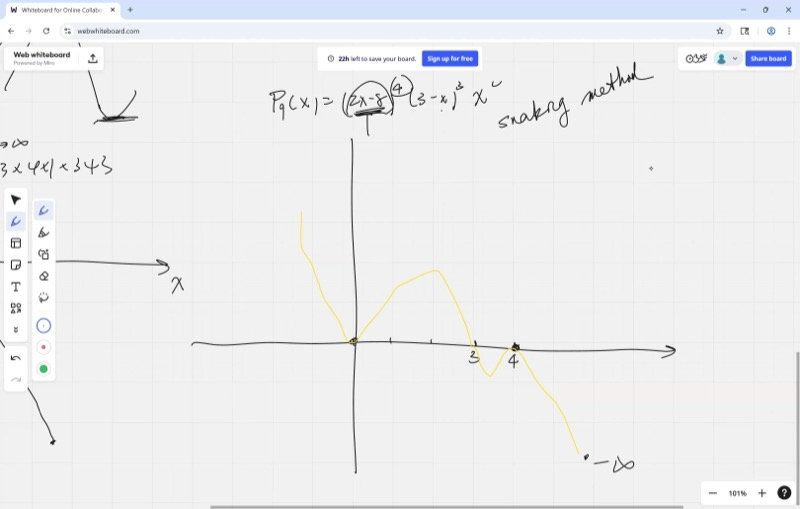
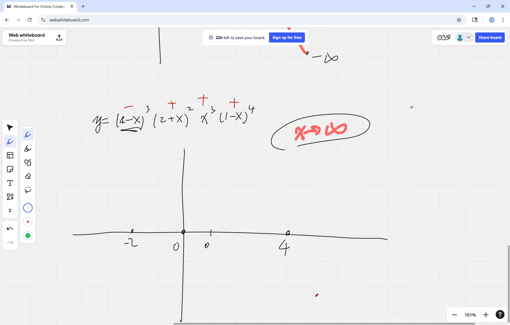
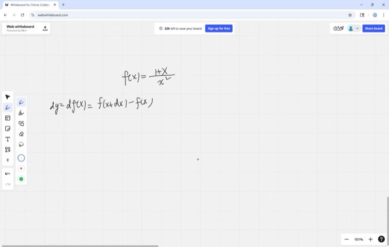

This lesson develops techniques for sketching polynomial graphs, locating critical points via derivatives, and deriving the Quotient Rule for differentiating rational expressions. These methods arise throughout engineering, economics, and the sciences.

::: {.callout-tip collapse="true"}
## Applications: Why Derivatives Matter for Graphing

Derivatives provide essential tools for solving applied problems:

- **Roller coaster design**: Engineers use critical points to locate the highest climbs and fastest drops on a track, ensuring the ride is both thrilling and safe.
- **GPS navigation**: Derivatives of position with respect to time yield speed and direction, enabling real-time route updates.
- **Stock market analysis**: Traders examine the rate of change of a stock price (its derivative) to inform buying and selling decisions.
- **Bridge and building design**: Structural engineers locate maximum stress points in beams and cables — these correspond to critical points of a stress function.
- **Medicine and biology**: Researchers track the rate at which drug concentration in the bloodstream increases or decreases, informing dosage and timing decisions.
:::

## Topics Covered

- Polynomial graphing using the "snaking method" through x-intercepts
- Root multiplicity: even multiplicity bounces, odd multiplicity crosses
- Critical points from the derivative: solving $f'(x) = 0$
- Reading derivative graphs to determine increasing/decreasing behavior
- Local maximum, local minimum, and stationary points
- The Quotient Rule: $\frac{d}{dx}\left(\frac{P}{Q}\right) = \frac{Q \cdot P' - P \cdot Q'}{Q^2}$

## Lecture Video

```{=html}
<video controls width="100%" preload="metadata">
  <source src="https://github.com/ymote/learningcalculus/releases/download/v1.0/calculus20250819.mp4" type="video/mp4">
</video>
```

## Key Frames from the Lecture

```{=html}
<div style="display: flex; flex-direction: column; gap: 10px; margin: 1em 0;">
  
  
  
  
</div>
```


::: {.callout-note collapse="true"}
## Prerequisites: Factoring Polynomials

To graph a polynomial, one must first find its **roots** (x-intercepts) by factoring. For example:

$$f(x) = x^3 - 4x = x(x-2)(x+2)$$

The roots are $x = 0, 2, -2$. Readers who are not comfortable with factoring should review that topic first, as it is the foundation for everything in this lesson.
:::

::: {.callout-note collapse="true"}
## Prerequisites: Basic Derivatives

The reader should already be familiar with differentiating polynomials using the power rule:

$$\frac{d}{dx}(x^n) = n \cdot x^{n-1}$$

For example, if $f(x) = 3x^4 - 2x^2 + x$, then $f'(x) = 12x^3 - 4x + 1$.
:::

## The Snaking Method for Polynomial Graphs

The key idea is as follows: once the **roots** and the **leading term** are known, one can sketch the graph by "snaking" through the x-intercepts.

**Steps:**

1. **Factor** the polynomial completely to find the roots.
2. **Check the leading term** to determine end behavior (does the graph start high or low on the left?).
3. **Snake through the roots** — at each root, decide whether the graph **crosses** or **bounces** based on the multiplicity.

### Root Multiplicity and Sign Changes

| Multiplicity | Behavior at root | Sign change? |
|---|---|---|
| Odd (1, 3, 5, ...) | Graph **crosses** through the x-axis | Yes |
| Even (2, 4, 6, ...) | Graph **bounces** off the x-axis | No |

::: {.callout-tip collapse="true"}
## Justification

Consider $(x - r)^2$. A square is always non-negative, so the factor never changes sign — the graph touches the axis and bounces back. By contrast, $(x - r)^1$ changes from negative to positive as $x$ crosses $r$, so the graph must cross through. Intuitively, this corresponds to the observation that an odd number of negative factors reverses the sign, while an even number preserves it.
:::

**Explore the snaking method — drag the sliders to move roots and change multiplicities:**

```{=html}
<div id="calc1" class="desmos-container"></div>
<script src="https://www.desmos.com/api/v1.9/calculator.js?apiKey=dcb31709b452b1cf9dc26972add0fda6"></script>
<script>
  var calc1 = Desmos.GraphingCalculator(document.getElementById('calc1'), {
    expressions: true,
    settingsMenu: false
  });
  calc1.setExpression({ id: 'single', latex: 'y=(x+3)(x-1)^2(x-4)', color: '#2d70b3', lineWidth: 2.5 });
  calc1.setExpression({ id: 'p1', latex: '(-3, 0)', color: '#388c46', pointSize: 10, label: 'crosses (single)', showLabel: true });
  calc1.setExpression({ id: 'p2', latex: '(1, 0)', color: '#c74440', pointSize: 10, label: 'bounces (double)', showLabel: true });
  calc1.setExpression({ id: 'p3', latex: '(4, 0)', color: '#388c46', pointSize: 10, label: 'crosses (single)', showLabel: true });
  calc1.setMathBounds({ left: -6, right: 7, bottom: -40, top: 40 });
</script>
```

## Critical Points from the Derivative

A **critical point** is a value of $x$ where $f'(x) = 0$. At these points, the graph has a horizontal tangent — it is momentarily flat.

To find critical points:

1. Compute $f'(x)$
2. Set $f'(x) = 0$ and solve for $x$
3. Substitute each $x$ back into $f(x)$ to obtain the $(x, y)$ coordinates

### Example: Find the critical points of $f(x) = x^3 - 3x$

$$f'(x) = 3x^2 - 3 = 3(x^2 - 1) = 3(x-1)(x+1)$$

Setting $f'(x) = 0$: $x = 1$ or $x = -1$

- $f(1) = 1 - 3 = -2$ → critical point at $(1, -2)$
- $f(-1) = -1 + 3 = 2$ → critical point at $(-1, 2)$

**See the function and its derivative together:**

```{=html}
<div id="calc2" class="desmos-container"></div>
<script>
  var calc2 = Desmos.GraphingCalculator(document.getElementById('calc2'), {
    expressions: true,
    settingsMenu: false
  });
  calc2.setExpression({ id: 'func', latex: 'y=x^3-3x', color: '#2d70b3', lineWidth: 2.5 });
  calc2.setExpression({ id: 'deriv', latex: 'y=3x^2-3', color: '#c74440', lineWidth: 2, lineStyle: 'DASHED' });
  calc2.setExpression({ id: 'cp1', latex: '(-1, 2)', color: '#388c46', pointSize: 10, label: 'local max (-1, 2)', showLabel: true });
  calc2.setExpression({ id: 'cp2', latex: '(1, -2)', color: '#388c46', pointSize: 10, label: 'local min (1, -2)', showLabel: true });
  calc2.setExpression({ id: 'label_f', latex: '(2.2, 2.3)', color: '#2d70b3', label: 'f(x)', showLabel: true, pointSize: 0 });
  calc2.setExpression({ id: 'label_fp', latex: '(2.2, 8.5)', color: '#c74440', label: "f'(x)", showLabel: true, pointSize: 0 });
  calc2.setMathBounds({ left: -4, right: 4, bottom: -8, top: 8 });
</script>
```

## Reading a Derivative Graph

The graph of $f'(x)$ tells you everything about the shape of $f(x)$:

| $f'(x)$ | $f(x)$ is... |
|---|---|
| Positive ($f'(x) > 0$) | **Increasing** |
| Negative ($f'(x) < 0$) | **Decreasing** |
| Zero ($f'(x) = 0$) | **Flat** (horizontal tangent) |

::: {.callout-note collapse="true"}
## Prerequisites: Positive and Negative Regions

When we write $f'(x) > 0$, the derivative graph lies **above** the x-axis. When $f'(x) < 0$, the derivative graph lies **below** the x-axis. The points where the derivative crosses zero correspond to the critical points of the original function.
:::

## Local Max, Local Min, and Stationary Points

When the derivative equals zero, three things can happen:

::: {.callout-important}
## Key Idea: Classifying Critical Points by Sign Change
The sign of the derivative on either side of a critical point determines its classification. One examines whether the derivative changes from positive to negative, negative to positive, or remains the same.

| $f'(x)$ changes from... | The critical point is a... |
|---|---|
| Positive to negative ($+ \to -$) | **Local maximum** |
| Negative to positive ($- \to +$) | **Local minimum** |
| No sign change ($+ \to +$ or $- \to -$) | **Stationary point** (flat but keeps going) |
:::

Intuitively, a stationary point with no sign change corresponds to a curve that briefly flattens but continues in the same direction — as exemplified by $f(x) = x^3$ at the origin.

**Explore — adjust $a$ to see how the critical points change:**

```{=html}
<div id="calc3" class="desmos-container"></div>
<script>
  var calc3 = Desmos.GraphingCalculator(document.getElementById('calc3'), {
    expressions: true,
    settingsMenu: false
  });
  calc3.setExpression({ id: 'a', latex: 'a=3', sliderBounds: {min: -5, max: 5, step: 0.1} });
  calc3.setExpression({ id: 'func', latex: 'y=x^3-a\\cdot x', color: '#2d70b3', lineWidth: 2.5 });
  calc3.setExpression({ id: 'deriv', latex: 'y=3x^2-a', color: '#c74440', lineWidth: 2, lineStyle: 'DASHED' });
  calc3.setExpression({ id: 'note_f', latex: '(2.5, 2.5)', color: '#2d70b3', label: 'f(x)', showLabel: true, pointSize: 0 });
  calc3.setExpression({ id: 'note_fp', latex: '(2.5, 9)', color: '#c74440', label: "f'(x)", showLabel: true, pointSize: 0 });
  calc3.setMathBounds({ left: -5, right: 5, bottom: -10, top: 10 });
</script>
```

::: {.callout-tip collapse="true"}
## Interactive demonstration

Set $a = 0$. Observe that $f(x) = x^3$ has a critical point at $x = 0$, but it is a **stationary point** — the derivative touches zero without changing sign. Increasing $a$ causes a local maximum and local minimum to appear.
:::

## The Quotient Rule

To differentiate a fraction $\frac{P(x)}{Q(x)}$, we apply the Quotient Rule:

::: {.callout-important}
## Key Idea: The Quotient Rule
To compute the derivative of one function divided by another, apply the following formula. It may be remembered as "bottom times derivative of top, minus top times derivative of bottom, all over bottom squared."

$$\frac{d}{dx}\left(\frac{P}{Q}\right) = \frac{Q \cdot P' - P \cdot Q'}{Q^2}$$
:::

::: {.callout-note collapse="true"}
## Prerequisites: The Product Rule

The Quotient Rule is built from the Product Rule. Recall:

$$\frac{d}{dx}(P \cdot Q) = P' \cdot Q + P \cdot Q'$$

One may derive the Quotient Rule by writing $\frac{P}{Q} = P \cdot Q^{-1}$ and applying the Product Rule together with the Chain Rule.
:::

### Deriving the Quotient Rule

Start with $\frac{P}{Q}$ and use the product rule on $P \cdot Q^{-1}$:

$$\frac{d}{dx}\left(P \cdot Q^{-1}\right) = P' \cdot Q^{-1} + P \cdot (-1) \cdot Q^{-2} \cdot Q'$$

$$= \frac{P'}{Q} - \frac{P \cdot Q'}{Q^2} = \frac{P' \cdot Q - P \cdot Q'}{Q^2}$$

::: {.callout-tip collapse="true"}
## Memory trick: "Low D-High minus High D-Low, over Low squared"

- **Low** = denominator $Q$
- **High** = numerator $P$
- **D** = derivative of

So: $\frac{Q \cdot P' - P \cdot Q'}{Q^2}$ = "Low D-High minus High D-Low, over Low squared"
:::

### Example: Differentiate $f(x) = \frac{x^2 + 1}{x - 3}$

Let $P = x^2 + 1$ and $Q = x - 3$, so $P' = 2x$ and $Q' = 1$.

$$f'(x) = \frac{(x-3)(2x) - (x^2+1)(1)}{(x-3)^2}$$

$$= \frac{2x^2 - 6x - x^2 - 1}{(x-3)^2} = \frac{x^2 - 6x - 1}{(x-3)^2}$$

## Cheat Sheet

::: {.key-formula}
| Concept | Key Fact |
|---|---|
| Snaking method | Factor, check end behavior, weave through roots |
| Odd multiplicity root | Graph **crosses** x-axis (sign changes) |
| Even multiplicity root | Graph **bounces** off x-axis (no sign change) |
| Critical points | Solve $f'(x) = 0$ |
| $f'(x) > 0$ | $f(x)$ is increasing |
| $f'(x) < 0$ | $f(x)$ is decreasing |
| $f'$: $+ \to -$ at critical point | Local maximum |
| $f'$: $- \to +$ at critical point | Local minimum |
| $f'$: no sign change | Stationary point |
| Quotient Rule | $\dfrac{d}{dx}\!\left(\dfrac{P}{Q}\right) = \dfrac{Q \cdot P' - P \cdot Q'}{Q^2}$ |
:::
