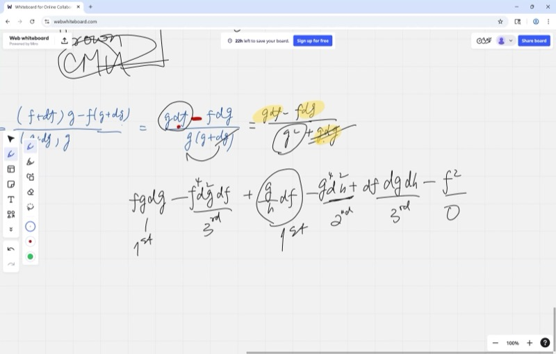
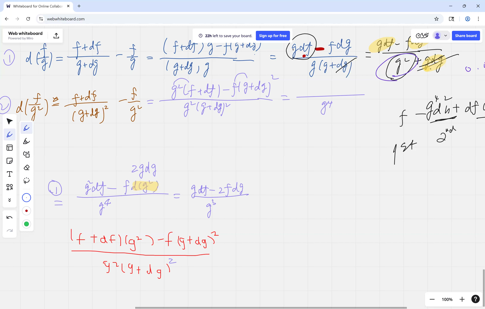
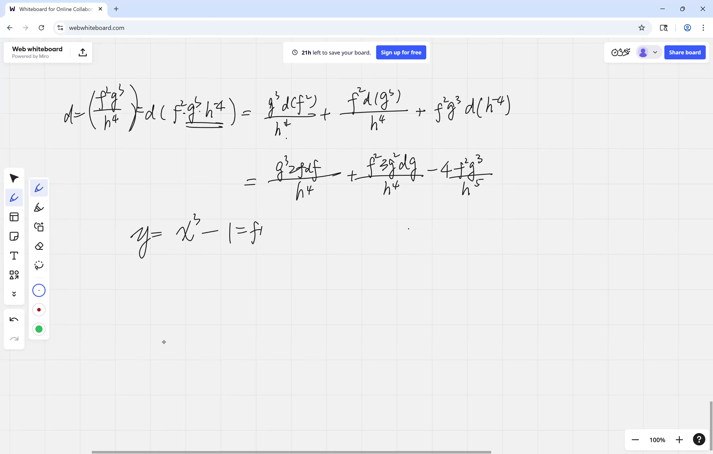
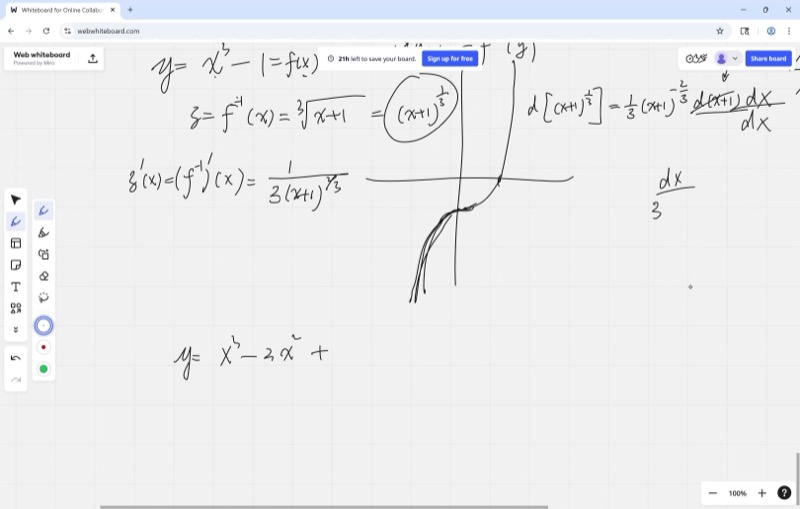

This lesson addresses the differentiation of products, compositions, and inverses of functions. We develop three fundamental rules — the Product Rule, the Chain Rule, and the Inverse Function Derivative — that together provide the means to differentiate virtually any function encountered in practice.

::: {.callout-tip collapse="true"}
## Motivation: Why These Rules Matter

In applications, functions are routinely built from simpler components:

- **Product rule**: A factory's revenue equals (price per unit) $\times$ (units sold). Both quantities change over time — the product rule determines the rate of change of revenue.
- **Chain rule**: A GPS converts satellite signals to position, then position to speed. Each step feeds into the next, forming a composite function.
- **Inverse functions**: A thermometer converts temperature to mercury height, but one *reads* it in reverse: mercury height to temperature. This reversal is an inverse function.
:::

## Topics Covered

- Quotient rule review: $d\!\left(\frac{f}{g}\right) = \frac{g\,df - f\,dg}{g^2}$
- Orders of infinitesimals: which tiny terms to keep and which to drop
- Differentiating $\frac{f}{g^2}$ by extending the quotient rule
- Product rule: $d(fg) = g\,df + f\,dg$ with geometric interpretation
- Generalized product rule for many factors (e.g., $f^2 \cdot g^3 \cdot h^{-4}$)
- Composite functions and the chain rule
- Derivative of an inverse function: $\frac{dx}{dy} = \frac{1}{dy/dx}$
- Monotonicity and invertibility via the discriminant

## Lecture Video

```{=html}
<video controls width="100%" preload="metadata">
  <source src="https://github.com/ymote/learningcalculus/releases/download/v1.0/calculus20250825.mp4" type="video/mp4">
</video>
```

## Key Frames from the Lecture

```{=html}
<div style="display: flex; flex-direction: column; gap: 10px; margin: 1em 0;">
  
  
  
  
</div>
```


::: {.callout-note collapse="true"}
## Prerequisites: Infinitesimals

An **infinitesimal** $dx$ is a quantity so small it is essentially zero — but not *exactly* zero. We use it to measure the change in a function when its input is perturbed by an infinitesimal amount.

Key idea: if $dx$ is infinitesimally small, then $dx^2$ (i.e., $dx \times dx$) is of a strictly smaller order. For instance, if $dx = 0.001$, then $dx^2 = 0.000001$ — a thousand times smaller. Consequently, we may safely **discard** terms involving $dx^2$ or higher powers.
:::

::: {.callout-note collapse="true"}
## Prerequisites: The Quotient Rule

We already derived the quotient rule in a previous lesson. Here is the result:

$$d\!\left(\frac{f}{g}\right) = \frac{g\,df - f\,dg}{g^2}$$

Read it as: "bottom times change-in-top, minus top times change-in-bottom, all over bottom squared."
:::

## Quotient Rule Review & Orders of Infinitesimals

When we derived the quotient rule, we expanded everything and then **discarded the higher-order terms** — the products like $df \cdot dg$ that are infinitesimally small compared to $df$ or $dg$ alone.

**The guiding principle**: always retain the **lowest-order** infinitesimal terms and neglect anything of higher order.

| Term | Order | Keep or Drop? |
|---|---|---|
| $df$ | 1st order | Keep |
| $dg$ | 1st order | Keep |
| $df \cdot dg$ | 2nd order | Discard |
| $df^2$ | 2nd order | Discard |

> If one has a sum such as $3\,df + 5\,dg + 2\,df\,dg$, the result is $3\,df + 5\,dg$.

## Extending the Quotient Rule: Differentiating $\frac{f}{g^2}$

If the denominator is $g^2$ instead of $g$, we treat $g^2$ as a single function and apply the quotient rule:

$$d\!\left(\frac{f}{g^2}\right) = \frac{g^2\,df - f\,d(g^2)}{g^4}$$

We need $d(g^2)$. Expanding $(g + dg)^2 - g^2 = 2g\,dg + (dg)^2$, and dropping the $(dg)^2$ term:

$$d(g^2) = 2g\,dg$$

Substituting back and simplifying:

$$d\!\left(\frac{f}{g^2}\right) = \frac{g^2\,df - f \cdot 2g\,dg}{g^4} = \frac{g\,df - 2f\,dg}{g^3}$$

**Explore the quotient rule — compare $f/g$ and $f/g^2$:**

```{=html}
<div id="calc1" class="desmos-container"></div>
<script src="https://www.desmos.com/api/v1.9/calculator.js?apiKey=dcb31709b452b1cf9dc26972add0fda6"></script>
<script>
  var calc1 = Desmos.GraphingCalculator(document.getElementById('calc1'), {
    expressions: true,
    settingsMenu: false
  });
  calc1.setExpression({ id: 'f', latex: 'f(x) = x^2 + 1', color: '#2d70b3' });
  calc1.setExpression({ id: 'g', latex: 'g(x) = x + 2', color: '#388c46' });
  calc1.setExpression({ id: 'q1', latex: 'y = \\frac{f(x)}{g(x)}', color: '#fa7e19', lineWidth: 2.5 });
  calc1.setExpression({ id: 'q2', latex: 'y = \\frac{f(x)}{g(x)^2}', color: '#c74440', lineWidth: 2.5 });
  calc1.setMathBounds({ left: -8, right: 8, bottom: -5, top: 10 });
</script>
```

## The Product Rule

To differentiate a product $y = f \cdot g$, consider what happens when both $f$ and $g$ change by tiny amounts $df$ and $dg$:

$$(f + df)(g + dg) = fg + g\,df + f\,dg + df\,dg$$

Subtracting the original $fg$ and dropping the tiny $df\,dg$ term:

::: {.callout-important}
## Key Idea: The Product Rule
When two functions are multiplied together, the change in their product equals the first function times the change in the second, plus the second function times the change in the first.

$$\boxed{d(fg) = g\,df + f\,dg}$$
:::

### Geometric Interpretation

Consider $f \cdot g$ as the **area of a rectangle** with sides $f$ and $g$.

When both sides are increased by small amounts, the new area gains:

- A **thin horizontal strip**: height $f$, width $dg$ — area $f\,dg$
- A **thin vertical strip**: width $g$, height $df$ — area $g\,df$
- A **tiny corner square**: $df \times dg$ — negligible

So the total change in area is $g\,df + f\,dg$.

**Animated: Product Rule as a rectangle area model**

```{=html}
<div class="d3-container" id="d3_0825_1">
  <h4 style="text-align:center; margin-bottom:8px;">Product Rule: Area Model &mdash; d(fg) = g&middot;df + f&middot;dg</h4>
  <div class="d3-controls" style="text-align:center; margin-bottom:8px;">
    <button id="d3_0825_1_play" style="padding:6px 18px; font-size:14px; cursor:pointer;">&#9654; Play</button>
    <label style="margin-left:12px;">df: <input type="range" id="d3_0825_1_df" min="0" max="1.5" step="0.05" value="0"><span id="d3_0825_1_df_val">0.00</span></label>
    <label style="margin-left:12px;">dg: <input type="range" id="d3_0825_1_dg" min="0" max="1.5" step="0.05" value="0"><span id="d3_0825_1_dg_val">0.00</span></label>
  </div>
  <div id="d3_0825_1_info" style="text-align:center; font-size:13px; margin-top:4px;"></div>
</div>
<script>
(function(){
  var w=580,h=440,m={t:30,r:80,b:50,l:60};
  var pw=w-m.l-m.r, ph=h-m.t-m.b;
  var svg=d3.select("#d3_0825_1").append("svg").attr("viewBox","0 0 "+w+" "+h).style("max-width","100%");
  var g=svg.append("g").attr("transform","translate("+m.l+","+m.t+")");
  var F=3, G=4;
  var maxV=6;
  var s=d3.scaleLinear().domain([0,maxV]).range([0,pw]);
  var sY=d3.scaleLinear().domain([0,maxV]).range([ph,ph-pw*maxV/maxV]);
  // axes
  g.append("g").attr("transform","translate(0,"+ph+")").call(d3.axisBottom(d3.scaleLinear().domain([0,maxV]).range([0,pw])).ticks(6));
  g.append("g").call(d3.axisLeft(d3.scaleLinear().domain([0,maxV]).range([ph,ph-pw])).ticks(6));
  g.append("text").attr("x",pw/2).attr("y",ph+36).attr("text-anchor","middle").attr("font-size","13px").text("g \u2192");
  g.append("text").attr("transform","rotate(-90)").attr("x",-(ph-pw/2)).attr("y",-40).attr("text-anchor","middle").attr("font-size","13px").text("f \u2192");

  var rectMain=g.append("rect").attr("fill","#2d70b3").attr("opacity",0.25).attr("stroke","#2d70b3").attr("stroke-width",1.5);
  var rectRight=g.append("rect").attr("fill","#388c46").attr("opacity",0).attr("stroke","#388c46").attr("stroke-width",1.5);
  var rectTop=g.append("rect").attr("fill","#fa7e19").attr("opacity",0).attr("stroke","#fa7e19").attr("stroke-width",1.5);
  var rectCorner=g.append("rect").attr("fill","#c74440").attr("opacity",0).attr("stroke","#c74440").attr("stroke-width",1.5);

  var lblMain=g.append("text").attr("font-size","14px").attr("font-weight","bold").attr("fill","#2d70b3");
  var lblRight=g.append("text").attr("font-size","12px").attr("fill","#388c46").attr("font-weight","bold");
  var lblTop=g.append("text").attr("font-size","12px").attr("fill","#fa7e19").attr("font-weight","bold");
  var lblCorner=g.append("text").attr("font-size","10px").attr("fill","#c74440");

  // legend
  var leg=svg.append("g").attr("transform","translate("+(w-70)+","+(m.t+10)+")");
  [["f\u00B7g","#2d70b3"],["f\u00B7dg","#388c46"],["g\u00B7df","#fa7e19"],["df\u00B7dg","#c74440"]].forEach(function(d,i){
    leg.append("rect").attr("x",0).attr("y",i*22).attr("width",14).attr("height",14).attr("fill",d[1]).attr("opacity",0.5);
    leg.append("text").attr("x",18).attr("y",i*22+12).text(d[0]).attr("font-size","11px");
  });

  function draw(df,dg){
    var sx=function(v){return s(v);};
    var sy=function(v){return ph-s(v);};
    rectMain.attr("x",sx(0)).attr("y",sy(F)).attr("width",sx(G)).attr("height",s(F));
    lblMain.attr("x",sx(G/2)).attr("y",sy(F/2)+5).attr("text-anchor","middle").text("f\u00B7g = "+(F*G));

    if(dg>0.01){
      rectRight.attr("x",sx(G)).attr("y",sy(F)).attr("width",sx(dg)).attr("height",s(F)).attr("opacity",0.45);
      lblRight.attr("x",sx(G+dg/2)).attr("y",sy(F/2)+5).attr("text-anchor","middle").text((F*dg).toFixed(2));
    } else { rectRight.attr("opacity",0); lblRight.text(""); }
    if(df>0.01){
      rectTop.attr("x",sx(0)).attr("y",sy(F+df)).attr("width",sx(G)).attr("height",s(df)).attr("opacity",0.45);
      lblTop.attr("x",sx(G/2)).attr("y",sy(F+df/2)+5).attr("text-anchor","middle").text((G*df).toFixed(2));
    } else { rectTop.attr("opacity",0); lblTop.text(""); }
    if(df>0.01&&dg>0.01){
      rectCorner.attr("x",sx(G)).attr("y",sy(F+df)).attr("width",sx(dg)).attr("height",s(df)).attr("opacity",0.5);
      lblCorner.attr("x",sx(G+dg/2)).attr("y",sy(F+df/2)+4).attr("text-anchor","middle").text((df*dg).toFixed(2));
    } else { rectCorner.attr("opacity",0); lblCorner.text(""); }

    d3.select("#d3_0825_1_df_val").text(df.toFixed(2));
    d3.select("#d3_0825_1_dg_val").text(dg.toFixed(2));
    d3.select("#d3_0825_1_info").html("d(fg) \u2248 g\u00B7df + f\u00B7dg = "+(G*df).toFixed(2)+" + "+(F*dg).toFixed(2)+" = "+(G*df+F*dg).toFixed(2)+"&nbsp;&nbsp;(tiny corner df\u00B7dg = "+(df*dg).toFixed(3)+" dropped)");
  }
  draw(0,0);

  d3.select("#d3_0825_1_df").on("input",function(){draw(+this.value,+d3.select("#d3_0825_1_dg").property("value"));});
  d3.select("#d3_0825_1_dg").on("input",function(){draw(+d3.select("#d3_0825_1_df").property("value"),+this.value);});

  d3.select("#d3_0825_1_play").on("click",function(){
    var dur=3000,t0=Date.now();
    var timer=d3.timer(function(){
      var p=Math.min(1,(Date.now()-t0)/dur);
      var v=1.2*p;
      d3.select("#d3_0825_1_df").property("value",v);
      d3.select("#d3_0825_1_dg").property("value",v);
      draw(v,v);
      if(p>=1)timer.stop();
    });
  });
})();
</script>
```

**Explore the rectangle interpretation — drag the slider to change the "nudge":**

```{=html}
<div id="calc2" class="desmos-container"></div>
<script>
  var calc2 = Desmos.GraphingCalculator(document.getElementById('calc2'), {
    expressions: false,
    settingsMenu: false
  });
  calc2.setExpression({ id: 'fval', latex: 'f = 3' });
  calc2.setExpression({ id: 'gval', latex: 'g = 4' });
  calc2.setExpression({ id: 'eps', latex: '\\epsilon = 0.5', sliderBounds: {min: 0, max: 1.5, step: 0.05} });
  calc2.setExpression({ id: 'rect', latex: '0 \\le x \\le g \\left\\{0 \\le y \\le f\\right\\}', color: '#2d70b3', fillOpacity: 0.3 });
  calc2.setExpression({ id: 'strip_right', latex: 'g \\le x \\le g+\\epsilon \\left\\{0 \\le y \\le f\\right\\}', color: '#388c46', fillOpacity: 0.5 });
  calc2.setExpression({ id: 'strip_top', latex: '0 \\le x \\le g \\left\\{f \\le y \\le f+\\epsilon\\right\\}', color: '#fa7e19', fillOpacity: 0.5 });
  calc2.setExpression({ id: 'corner', latex: 'g \\le x \\le g+\\epsilon \\left\\{f \\le y \\le f+\\epsilon\\right\\}', color: '#c74440', fillOpacity: 0.7 });
  calc2.setMathBounds({ left: -0.5, right: 7, bottom: -0.5, top: 6 });
</script>
```

## Generalized Product Rule

When there are **many** factors multiplied together, the pattern extends naturally. To differentiate, one proceeds through each factor in turn: **differentiate that one factor, leave the rest unchanged**, then sum all the resulting terms.

### Example: $y = f^2 \cdot g^3 \cdot h^{-4}$

$$dy = \underbrace{2f\,df \cdot g^3 \cdot h^{-4}}_{\text{differentiate } f^2} + \underbrace{f^2 \cdot 3g^2\,dg \cdot h^{-4}}_{\text{differentiate } g^3} + \underbrace{f^2 \cdot g^3 \cdot (-4)h^{-5}\,dh}_{\text{differentiate } h^{-4}}$$

::: {.callout-tip collapse="true"}
## Remark: Logarithmic Shortcut

Dividing both sides by $y = f^2 g^3 h^{-4}$:

$$\frac{dy}{y} = \frac{2\,df}{f} + \frac{3\,dg}{g} - \frac{4\,dh}{h}$$

Each term is the **exponent** times the **relative change** of that factor. This technique is called **logarithmic differentiation** and substantially simplifies the differentiation of complicated products.
:::

## Composite Functions & the Chain Rule

A **composite function** is a function inside another function. For example:

$$y = (3x^2 + 1)^5$$

Here the "inner" function is $u = 3x^2 + 1$ and the "outer" function is $y = u^5$.

### The Chain Rule

To find $dy$, work from the outside in:

$$dy = 5u^4 \cdot du = 5(3x^2 + 1)^4 \cdot 6x\,dx$$

In fraction form:

::: {.callout-important}
## Key Idea: The Chain Rule
To differentiate a function inside another function, multiply the derivative of the outer function (evaluated at the inner function) by the derivative of the inner function. Intuitively, this corresponds to a chain of gears — each rate multiplies the next.

$$\boxed{\frac{dy}{dx} = \frac{dy}{du} \cdot \frac{du}{dx}}$$
:::

Intuitively, a small change in $x$ induces a change in $u$, which in turn induces a change in $y$. The total effect is multiplicative.

**Animated: Chain Rule — nudge propagation through composition**

```{=html}
<div class="d3-container" id="d3_0825_2">
  <h4 style="text-align:center; margin-bottom:8px;">Chain Rule: x &rarr; u = g(x) &rarr; y = f(u)</h4>
  <div class="d3-controls" style="text-align:center; margin-bottom:8px;">
    <button id="d3_0825_2_play" style="padding:6px 18px; font-size:14px; cursor:pointer;">&#9654; Play</button>
    <label style="margin-left:12px;">x: <input type="range" id="d3_0825_2_x" min="0.5" max="2.5" step="0.05" value="1"><span id="d3_0825_2_x_val">1.00</span></label>
    <label style="margin-left:12px;">dx: <input type="range" id="d3_0825_2_dx" min="0" max="0.5" step="0.01" value="0"><span id="d3_0825_2_dx_val">0.00</span></label>
  </div>
  <div id="d3_0825_2_info" style="text-align:center; font-size:13px; margin-top:4px;"></div>
</div>
<script>
(function(){
  var w=640,h=260,m={t:25,r:20,b:60,l:20};
  var pw=w-m.l-m.r, ph=h-m.t-m.b;
  var svg=d3.select("#d3_0825_2").append("svg").attr("viewBox","0 0 "+w+" "+h).style("max-width","100%");
  var g=svg.append("g").attr("transform","translate("+m.l+","+m.t+")");

  // Three number lines: x, u, y
  var lineY=50, gap=55;
  var labels=["x","u = x\u00B2+1","y = u\u00B3"];
  var scales=[
    d3.scaleLinear().domain([0,3.5]).range([40,pw-40]),
    d3.scaleLinear().domain([0,10]).range([40,pw-40]),
    d3.scaleLinear().domain([0,1200]).range([40,pw-40])
  ];
  function gInner(x){return x*x+1;}
  function fOuter(u){return u*u*u;}
  function dgdx(x){return 2*x;}
  function dfdu(u){return 3*u*u;}

  labels.forEach(function(lbl,i){
    var y=lineY+i*gap;
    g.append("line").attr("x1",scales[i].range()[0]).attr("x2",scales[i].range()[1]).attr("y1",y).attr("y2",y).attr("stroke","#999").attr("stroke-width",2);
    g.append("text").attr("x",5).attr("y",y+5).attr("font-size","12px").attr("font-weight","bold").text(lbl);
    g.append("g").attr("transform","translate(0,"+y+")").call(d3.axisBottom(scales[i]).ticks(5).tickSize(6)).selectAll("text").attr("font-size","9px");
  });

  var dots=[], nudgeBars=[], valLabels=[];
  var colors=["#2d70b3","#fa7e19","#c74440"];
  for(var i=0;i<3;i++){
    var y=lineY+i*gap;
    dots.push(g.append("circle").attr("cy",y).attr("r",7).attr("fill",colors[i]));
    nudgeBars.push(g.append("rect").attr("y",y-4).attr("height",8).attr("fill",colors[i]).attr("opacity",0.4).attr("rx",3));
    valLabels.push(g.append("text").attr("y",y-14).attr("text-anchor","middle").attr("font-size","11px").attr("fill",colors[i]).attr("font-weight","bold"));
  }

  // arrows between lines
  for(var i=0;i<2;i++){
    var y1=lineY+i*gap+10, y2=lineY+(i+1)*gap-10;
    g.append("line").attr("x1",pw/2).attr("x2",pw/2).attr("y1",y1).attr("y2",y2).attr("stroke","#666").attr("stroke-width",1.5).attr("marker-end","url(#arrowhead_0825)");
  }
  svg.append("defs").append("marker").attr("id","arrowhead_0825").attr("viewBox","0 0 10 10").attr("refX",8).attr("refY",5).attr("markerWidth",6).attr("markerHeight",6).attr("orient","auto").append("path").attr("d","M 0 0 L 10 5 L 0 10 z").attr("fill","#666");

  function draw(x,dx){
    var u=gInner(x), y=fOuter(u);
    var x2=x+dx, u2=gInner(x2), y2=fOuter(u2);
    var du=u2-u, dy=y2-y;

    dots[0].attr("cx",scales[0](x));
    dots[1].attr("cx",scales[1](u));
    dots[2].attr("cx",scales[2](y));
    valLabels[0].attr("x",scales[0](x)).text(x.toFixed(2));
    valLabels[1].attr("x",scales[1](u)).text(u.toFixed(2));
    valLabels[2].attr("x",scales[2](y)).text(y.toFixed(1));

    if(dx>0.005){
      nudgeBars[0].attr("x",scales[0](x)).attr("width",Math.max(1,scales[0](x2)-scales[0](x))).attr("opacity",0.5);
      nudgeBars[1].attr("x",scales[1](Math.min(u,u2))).attr("width",Math.max(1,Math.abs(scales[1](u2)-scales[1](u)))).attr("opacity",0.5);
      nudgeBars[2].attr("x",scales[2](Math.min(y,y2))).attr("width",Math.max(1,Math.abs(scales[2](y2)-scales[2](y)))).attr("opacity",0.5);
    } else {
      nudgeBars.forEach(function(b){b.attr("opacity",0);});
    }

    d3.select("#d3_0825_2_x_val").text(x.toFixed(2));
    d3.select("#d3_0825_2_dx_val").text(dx.toFixed(2));
    var dudx_val=dgdx(x), dfdu_val=dfdu(u);
    d3.select("#d3_0825_2_info").html(
      "du/dx = "+dudx_val.toFixed(2)+" &nbsp;\u00D7&nbsp; dy/du = "+dfdu_val.toFixed(1)+" &nbsp;=&nbsp; dy/dx = "+(dudx_val*dfdu_val).toFixed(1)+
      (dx>0.005?" &nbsp;|&nbsp; \u0394x="+dx.toFixed(2)+", \u0394u="+du.toFixed(3)+", \u0394y="+dy.toFixed(1):"")
    );
  }
  draw(1,0);

  d3.select("#d3_0825_2_x").on("input",function(){draw(+this.value,+d3.select("#d3_0825_2_dx").property("value"));});
  d3.select("#d3_0825_2_dx").on("input",function(){draw(+d3.select("#d3_0825_2_x").property("value"),+this.value);});

  d3.select("#d3_0825_2_play").on("click",function(){
    var x0=+d3.select("#d3_0825_2_x").property("value");
    var dur=2500,t0=Date.now();
    var timer=d3.timer(function(){
      var p=Math.min(1,(Date.now()-t0)/dur);
      var dx=0.4*p;
      d3.select("#d3_0825_2_dx").property("value",dx);
      draw(x0,dx);
      if(p>=1)timer.stop();
    });
  });
})();
</script>
```

**Explore the chain rule — see how the inner function shapes the derivative:**

```{=html}
<div id="calc3" class="desmos-container"></div>
<script>
  var calc3 = Desmos.GraphingCalculator(document.getElementById('calc3'), {
    expressions: true,
    settingsMenu: false
  });
  calc3.setExpression({ id: 'n', latex: 'n = 2', sliderBounds: {min: 1, max: 5, step: 1} });
  calc3.setExpression({ id: 'func', latex: 'y = (x^2 + 1)^n', color: '#2d70b3', lineWidth: 2.5 });
  calc3.setExpression({ id: 'deriv', latex: 'y = n(x^2+1)^{(n-1)} \\cdot 2x', color: '#c74440', lineStyle: 'DASHED', lineWidth: 2 });
  calc3.setExpression({ id: 'inner', latex: 'y = x^2 + 1', color: '#388c46', lineStyle: 'DOTTED', lineWidth: 1.5 });
  calc3.setMathBounds({ left: -4, right: 4, bottom: -5, top: 30 });
</script>
```

## Derivative of an Inverse Function

If $y = f(x)$, the inverse function gives you $x = f^{-1}(y)$ — it "undoes" $f$.

The derivative of the inverse has a beautifully simple formula:

::: {.callout-important}
## Key Idea: Inverse Function Derivative
The slope of an inverse function is the reciprocal of the original function's slope. If the original increases steeply, the inverse increases gently, and conversely.

$$\boxed{\frac{dx}{dy} = \frac{1}{\dfrac{dy}{dx}}}$$
:::

This is geometrically natural: if $y$ changes 3 times as fast as $x$, then $x$ changes $\frac{1}{3}$ as fast as $y$.

### Example

If $y = x^3$, then $\frac{dy}{dx} = 3x^2$, so:

$$\frac{dx}{dy} = \frac{1}{3x^2}$$

Since $x = y^{1/3}$, we can write $x^2 = y^{2/3}$, giving $\frac{dx}{dy} = \frac{1}{3y^{2/3}}$.

This agrees with the result obtained by differentiating $x = y^{1/3}$ directly.

## Monotonicity and Invertibility

A function is **invertible** only if it is **monotonic** — meaning it is always increasing or always decreasing. If it reverses direction (has a local maximum or minimum), then two different $x$-values yield the same $y$, and the process cannot be reversed uniquely.

### How to Check: The Discriminant Test

For a polynomial like $y = ax^3 + bx^2 + cx + d$, the derivative is:

$$\frac{dy}{dx} = 3ax^2 + 2bx + c$$

This is a quadratic. The function is monotonic if this quadratic **never changes sign**, which happens when its discriminant is negative:

$$(2b)^2 - 4(3a)(c) < 0 \quad \Longrightarrow \quad 4b^2 - 12ac < 0$$

No real roots means the derivative never crosses zero, so the function is strictly monotonic.

**Explore — a cubic with adjustable coefficients. When is it invertible?**

```{=html}
<div id="calc4" class="desmos-container"></div>
<script>
  var calc4 = Desmos.GraphingCalculator(document.getElementById('calc4'), {
    expressions: true,
    settingsMenu: false
  });
  calc4.setExpression({ id: 'a', latex: 'a = 1', sliderBounds: {min: -3, max: 3, step: 0.1} });
  calc4.setExpression({ id: 'b', latex: 'b = 0', sliderBounds: {min: -5, max: 5, step: 0.1} });
  calc4.setExpression({ id: 'c', latex: 'c = 1', sliderBounds: {min: -5, max: 5, step: 0.1} });
  calc4.setExpression({ id: 'cubic', latex: 'y = a x^3 + b x^2 + c x', color: '#2d70b3', lineWidth: 2.5 });
  calc4.setExpression({ id: 'deriv', latex: 'y = 3a x^2 + 2b x + c', color: '#c74440', lineStyle: 'DASHED', lineWidth: 2 });
  calc4.setExpression({ id: 'zero_line', latex: 'y = 0', color: '#000000', lineStyle: 'DOTTED', lineWidth: 1 });
  calc4.setMathBounds({ left: -5, right: 5, bottom: -10, top: 10 });
</script>
```

::: {.callout-tip collapse="true"}
## Interactive demonstration

In the graph above, set $a = 1$, $b = 3$, $c = 1$. The derivative (dashed red curve) dips below zero, indicating that the cubic has a local maximum and minimum and is **not** invertible.

Now set $a = 1$, $b = 0$, $c = 1$. The derivative remains positive everywhere — the cubic is strictly increasing and **is** invertible.
:::

## Cheat Sheet

::: {.key-formula}
| Rule | Formula |
|---|---|
| Product rule | $d(fg) = g\,df + f\,dg$ |
| Quotient rule | $d\!\left(\frac{f}{g}\right) = \frac{g\,df - f\,dg}{g^2}$ |
| Extended quotient | $d\!\left(\frac{f}{g^2}\right) = \frac{g\,df - 2f\,dg}{g^3}$ |
| Chain rule | $\frac{dy}{dx} = \frac{dy}{du} \cdot \frac{du}{dx}$ |
| Inverse function | $\frac{dx}{dy} = \frac{1}{dy/dx}$ |

### Generalized Product Rule

To differentiate $f_1^{n_1} \cdot f_2^{n_2} \cdots f_k^{n_k}$: for each factor, differentiate it (bring down the exponent), hold the rest fixed, and add all pieces together.

### Invertibility Check

A function is invertible when it is **monotonic** (always increasing or always decreasing). For a cubic $ax^3 + bx^2 + cx + d$, check that the derivative $3ax^2 + 2bx + c$ has a **negative discriminant**: $4b^2 - 12ac < 0$.

### Orders of Infinitesimals

Always keep the **lowest-order** terms. Drop any product of two or more infinitesimals ($df \cdot dg$, $dx^2$, etc.).
:::
