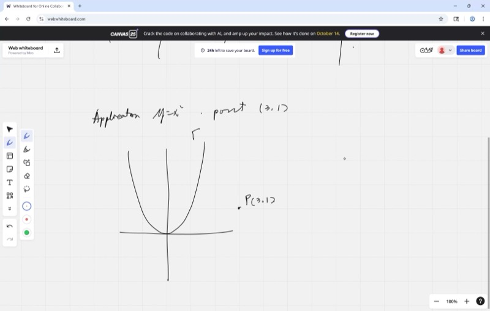
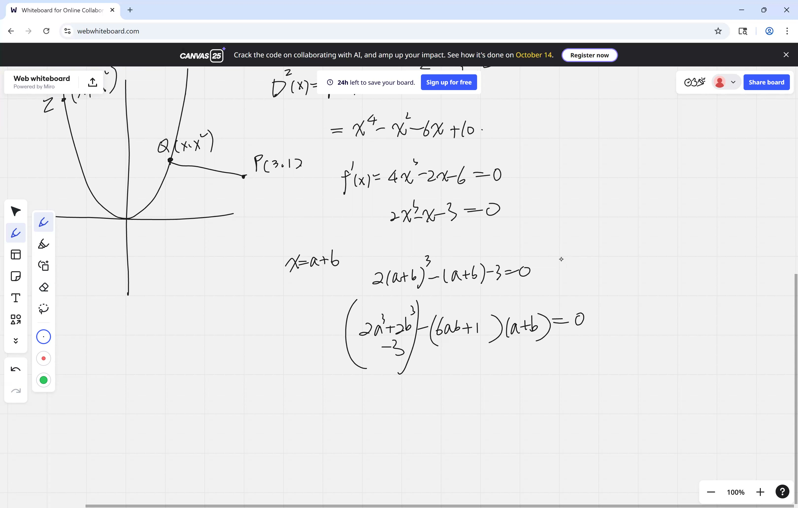
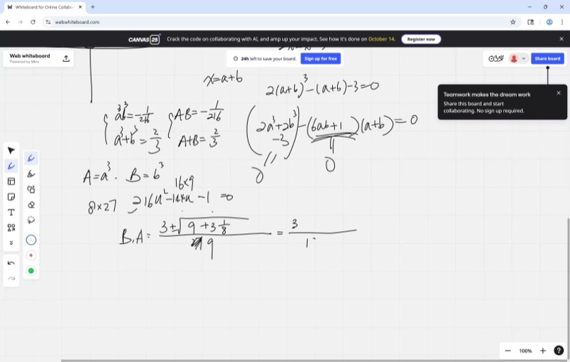
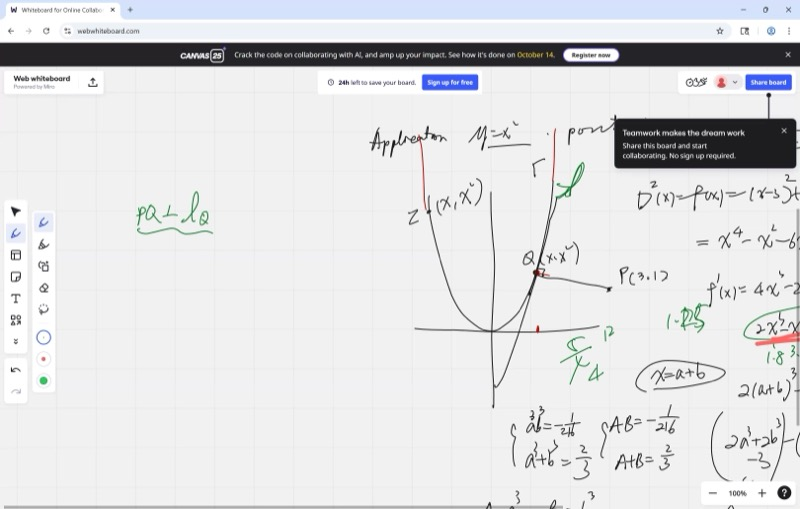

This lesson develops optimization techniques using derivatives — methods for finding the shortest distance, the lowest cost, or the optimal design. We study the problem of minimizing the distance from an external point to a curve as a motivating example.

::: {.callout-tip collapse="true"}
## Motivation

Optimization concerns finding the **best** value — the shortest path, the cheapest design, the fastest route.

- **GPS navigation**: determines the shortest route between two locations.
- **Logistics**: maximizes the number of items packed into a delivery vehicle.
- **Architecture**: designs the strongest bridge using the least material.
- **Computer graphics**: determines the optimal camera angle for a scene.

The power of calculus lies in replacing exhaustive search with a direct computation: derivatives identify the optimal solution.
:::

## Topics Covered

- Optimization review: finding max/min using derivative = 0
- AM-GM inequality proved with calculus
- Minimizing distance from a point to a curve
- The "minimize $D^2$ instead of $D$" trick
- Solving cubic equations by hand
- Geometric approach: minimum distance line is perpendicular to the tangent
- Tangent and normal vectors from differentials

## Lecture Video

```{=html}
<video controls width="100%" preload="metadata">
  <source src="https://github.com/ymote/learningcalculus/releases/download/v1.0/calculus20250901.mp4" type="video/mp4">
</video>
```

## Key Frames from the Lecture

```{=html}
<div style="display: flex; flex-direction: column; gap: 10px; margin: 1em 0;">
  
  
  
  
</div>
```


## Prerequisites

::: {.callout-note collapse="true"}
## What is optimization?

**Optimization** means finding the input value that makes a function as large as possible (maximum) or as small as possible (minimum).

In calculus, we use the fact that at a max or min, the **derivative equals zero**:

$$f'(x) = 0$$

The reason is that the derivative measures the slope of the curve. At a local extremum, the slope is zero. This observation is the key insight that makes calculus effective for optimization.
:::

::: {.callout-note collapse="true"}
## What is a derivative?

The **derivative** $f'(x)$ gives the **rate of change** — how rapidly $f(x)$ is increasing or decreasing at any point $x$.

- $f'(x) > 0$: function is **increasing**
- $f'(x) < 0$: function is **decreasing**
- $f'(x) = 0$: function is **flat** (potential extremum)

For $f(x) = x^n$, the derivative is $f'(x) = nx^{n-1}$. For example, $f(x) = x^2$ gives $f'(x) = 2x$.
:::

::: {.callout-note collapse="true"}
## What is the distance formula?

The distance between two points $(x_1, y_1)$ and $(x_2, y_2)$ is:

$$D = \sqrt{(x_2 - x_1)^2 + (y_2 - y_1)^2}$$

This comes straight from the Pythagorean theorem — the distance is the hypotenuse of a right triangle with legs $(x_2 - x_1)$ and $(y_2 - y_1)$.
:::

## Key Concepts

### Optimization Review: Setting $f'(x) = 0$

To find the maximum or minimum of a function $f(x)$:

1. Take the derivative $f'(x)$
2. Set $f'(x) = 0$ and solve for $x$
3. Check whether it's a max or min (using the second derivative or by testing nearby points)

### AM-GM Inequality via Calculus

The **AM-GM inequality** says that for positive numbers $a$ and $b$:

$$\frac{a + b}{2} \geq \sqrt{ab}$$

The arithmetic mean is always at least as large as the geometric mean. We can prove this using calculus. For a fixed product $ab = P$, we seek to minimize $a + b = a + \frac{P}{a}$:

$$f(a) = a + \frac{P}{a}$$

$$f'(a) = 1 - \frac{P}{a^2} = 0 \implies a^2 = P \implies a = \sqrt{P}$$

When $a = \sqrt{P}$, we get $b = \frac{P}{\sqrt{P}} = \sqrt{P} = a$. So the sum $a + b$ is smallest when $a = b$ — and that's exactly when AM equals GM!

**Explore — see how the sum $a + \frac{P}{a}$ has its minimum when $a = \sqrt{P}$:**

```{=html}
<div id="calc1" class="desmos-container"></div>
<script src="https://www.desmos.com/api/v1.9/calculator.js?apiKey=dcb31709b452b1cf9dc26972add0fda6"></script>
<script>
  var calc1 = Desmos.GraphingCalculator(document.getElementById('calc1'), {
    expressions: true,
    settingsMenu: false
  });
  calc1.setExpression({ id: 'P', latex: 'P=4', sliderBounds: {min: 0.5, max: 16, step: 0.5} });
  calc1.setExpression({ id: 'func', latex: 'y=x+\\frac{P}{x} \\left\\{x>0\\right\\}', color: '#2d70b3' });
  calc1.setExpression({ id: 'minpt', latex: '(\\sqrt{P}, 2\\sqrt{P})', color: '#c74440', pointSize: 12, label: 'Minimum: AM = GM', showLabel: true });
  calc1.setExpression({ id: 'amgm', latex: 'y=2\\sqrt{P}', color: '#c74440', lineStyle: 'DASHED', lineWidth: 1.5 });
  calc1.setMathBounds({ left: -1, right: 10, bottom: -1, top: 15 });
</script>
```

### Minimizing Distance from a Point to a Curve

**Problem:** Find the point on the parabola $y = x^2$ closest to the point $P(3, 1)$.

The distance from $P(3,1)$ to a point $(x, x^2)$ on the parabola is:

$$D = \sqrt{(x - 3)^2 + (x^2 - 1)^2}$$

::: {.callout-tip collapse="true"}
## Remark: The $D^2$ Technique

The square root in the distance formula complicates differentiation. The key observation is that **$D$ is minimized exactly when $D^2$ is minimized** (since $D \geq 0$ and squaring preserves order for non-negative numbers).

Therefore, instead of minimizing $D$, we minimize:

$$D^2 = (x - 3)^2 + (x^2 - 1)^2$$

Eliminating the square root yields a much cleaner derivative.
:::

::: {.callout-important}
## Key Idea: Minimize $D^2$ Instead of $D$
Since distance is always non-negative, the value of $x$ that minimizes the distance $D$ is the same value that minimizes $D^2$. Working with $D^2$ gets rid of the square root and makes the derivative much easier to compute.
:::

$$D^2 = (x-3)^2 + (x^2-1)^2$$

Take the derivative and set it to zero:

$$\frac{d(D^2)}{dx} = 2(x-3) + 2(x^2-1)(2x) = 0$$

$$2(x - 3) + 4x(x^2 - 1) = 0$$

$$(x - 3) + 2x(x^2 - 1) = 0$$

$$2x^3 - 2x + x - 3 = 0$$

$$2x^3 - x - 3 = 0$$

This is a **cubic equation** — and we need to solve it!

**Explore — drag the point along the parabola to see the distance change:**

```{=html}
<div id="calc2" class="desmos-container"></div>
<script>
  var calc2 = Desmos.GraphingCalculator(document.getElementById('calc2'), {
    expressions: true,
    settingsMenu: false
  });
  calc2.setExpression({ id: 'parabola', latex: 'y=x^2', color: '#2d70b3' });
  calc2.setExpression({ id: 'P', latex: '(3, 1)', color: '#c74440', pointSize: 12, label: 'P(3, 1)', showLabel: true });
  calc2.setExpression({ id: 't', latex: 't=1', sliderBounds: {min: -2, max: 3, step: 0.01} });
  calc2.setExpression({ id: 'Qpt', latex: '(t, t^2)', color: '#388c46', pointSize: 10, label: 'Q on parabola', showLabel: true });
  calc2.setExpression({ id: 'segment', latex: '((1-s)\\cdot 3 + s\\cdot t,\\; (1-s)\\cdot 1 + s\\cdot t^2)', color: '#fa7e19', lineWidth: 2, parametricDomain: {min: 0, max: 1} });
  calc2.setExpression({ id: 'dsq', latex: 'D^2=(t-3)^2+(t^2-1)^2', color: '#000000' });
  calc2.setMathBounds({ left: -3, right: 6, bottom: -1, top: 10 });
</script>
```

### Solving the Cubic $2x^3 - x - 3 = 0$

First, try rational roots. Testing $x = 1$: $2(1) - 1 - 3 = -2 \neq 0$. Testing $x = -1$: $-2 + 1 - 3 = -4 \neq 0$.

But we can factor: try $x = 1$ again more carefully — actually, we need the substitution method.

**Substitution approach:** Let $x = a + b$. We want $a^3 + b^3$ and $ab$ to simplify the equation. Using **Vieta's formulas**, we can reduce the cubic to a quadratic in $a^3$ and $b^3$:

From $2x^3 - x - 3 = 0$, divide by 2:

$$x^3 - \frac{1}{2}x - \frac{3}{2} = 0$$

By inspection or numerical methods, $x = 1$ doesn't work, but we can verify that $2(1)^3 - 1 - 3 = -2$. We check that the cubic has one real root near $x \approx 1.18$.

For this course, the important takeaway is the **method**: substitute $x = a + b$, use the identity $(a+b)^3 = a^3 + 3ab(a+b) + b^3$, and match coefficients to turn the cubic into a quadratic.

### The Geometric Approach: Normal Lines

There is a beautiful geometric shortcut. At the closest point on the curve, the line from $P$ to the curve must be **perpendicular to the tangent line**.

::: {.callout-important}
## Key Idea: Closest Point Means Perpendicular to the Tangent
The shortest path from an external point to a curve always hits the curve at a right angle. If it arrived at any other angle, you could slide along the curve to get closer, so it wouldn't be the minimum.
:::

The reason is that if the line from $P$ met the curve at a non-perpendicular angle, one could slide along the curve to achieve a shorter distance — contradicting the assumption of minimality.

::: {.callout-note collapse="true"}
## Vocabulary: Tangent and Normal

- **Tangent line**: the line that is tangent to the curve at a point, sharing its direction at that point
- **Normal line**: the line perpendicular (at a right angle) to the tangent line at that point
:::

### Tangent and Normal Vectors from Differentials

For the parabola $y = x^2$, the differential is:

$$dy = 2x \, dx$$

This tells us the **tangent direction**: moving $dx$ in the $x$-direction causes $dy = 2x \, dx$ in the $y$-direction. So the tangent vector is:

$$\vec{T} = (1, \; 2x)$$

To get the **normal vector** (perpendicular to the tangent), we swap and negate:

$$\vec{N} = (-2x, \; 1)$$

The minimum-distance line from $P(3,1)$ to the parabola must point in the normal direction. At a point $(x_0, x_0^2)$ on the parabola, the direction to $P$ is $(3 - x_0, \; 1 - x_0^2)$. For this to be parallel to $\vec{N} = (-2x_0, 1)$:

$$\frac{3 - x_0}{-2x_0} = \frac{1 - x_0^2}{1}$$

This gives us the same cubic equation — but we arrived at it geometrically instead of algebraically!

**Explore — see the tangent and normal lines at any point on the parabola:**

```{=html}
<div id="calc3" class="desmos-container"></div>
<script>
  var calc3 = Desmos.GraphingCalculator(document.getElementById('calc3'), {
    expressions: true,
    settingsMenu: false
  });
  calc3.setExpression({ id: 'parabola', latex: 'y=x^2', color: '#2d70b3' });
  calc3.setExpression({ id: 'P', latex: '(3, 1)', color: '#c74440', pointSize: 12, label: 'P(3, 1)', showLabel: true });
  calc3.setExpression({ id: 'a', latex: 'a=1', sliderBounds: {min: -2, max: 3, step: 0.01} });
  calc3.setExpression({ id: 'Qpt', latex: '(a, a^2)', color: '#388c46', pointSize: 10, label: 'Q', showLabel: true });
  calc3.setExpression({ id: 'tangent', latex: 'y - a^2 = 2a(x - a)', color: '#fa7e19', lineWidth: 2 });
  calc3.setExpression({ id: 'normal', latex: 'y - a^2 = -\\frac{1}{2a}(x - a) \\left\\{a \\neq 0\\right\\}', color: '#6042a6', lineWidth: 2 });
  calc3.setExpression({ id: 'seg', latex: '((1-s)\\cdot a + s\\cdot 3,\\; (1-s)\\cdot a^2 + s\\cdot 1)', color: '#c74440', lineWidth: 1.5, lineStyle: 'DASHED', parametricDomain: {min: 0, max: 1} });
  calc3.setMathBounds({ left: -3, right: 6, bottom: -2, top: 10 });
</script>
```

*Drag the slider for $a$ until the normal line (purple) passes through $P$ — that identifies the closest point.*

### Homework: Ellipse Distance Problem

Use the geometric method to find the point on the ellipse $\frac{x^2}{4} + y^2 = 1$ closest to a given external point.

**Hint:** For the ellipse, the differential is:

$$\frac{2x}{4}\,dx + 2y\,dy = 0 \implies \frac{x}{2}\,dx + 2y\,dy = 0$$

So the tangent vector is $(2y, -\frac{x}{2})$ and the normal vector is $(\frac{x}{2}, 2y)$. Set up the perpendicularity condition just like we did for the parabola!

## Cheat Sheet

::: {.key-formula}
| What you want | What to do |
|---|---|
| Find max or min of $f(x)$ | Solve $f'(x) = 0$ |
| Minimize a distance | Minimize $D^2$ instead (avoids the square root) |
| AM-GM inequality | $\frac{a+b}{2} \geq \sqrt{ab}$, equality when $a = b$ |
| Tangent vector to $y = f(x)$ | $(1, \; f'(x))$ |
| Normal vector to $y = f(x)$ | $(-f'(x), \; 1)$ |
| Closest point on a curve | Line from external point must be perpendicular to tangent |

### The Optimization Recipe

$$\text{Write } D^2 \text{ as a function of one variable} \;\longrightarrow\; \text{Take derivative} \;\longrightarrow\; \text{Set } = 0 \;\longrightarrow\; \text{Solve!}$$
:::
