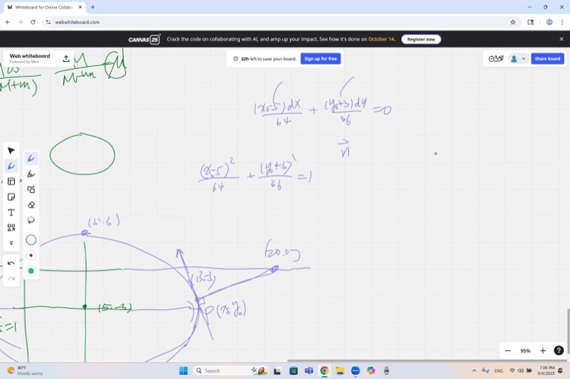
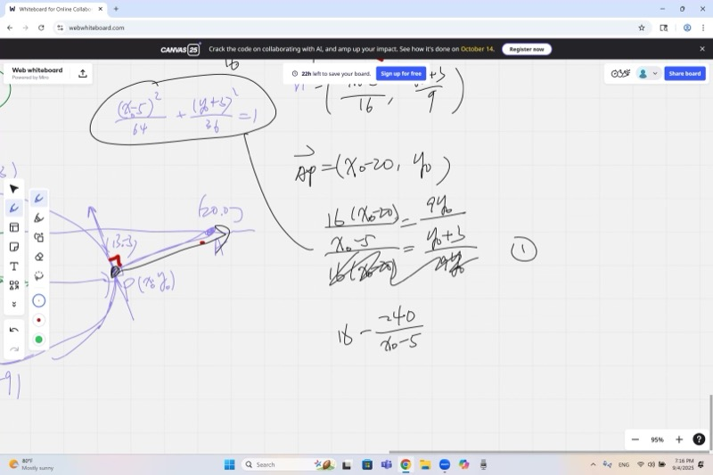
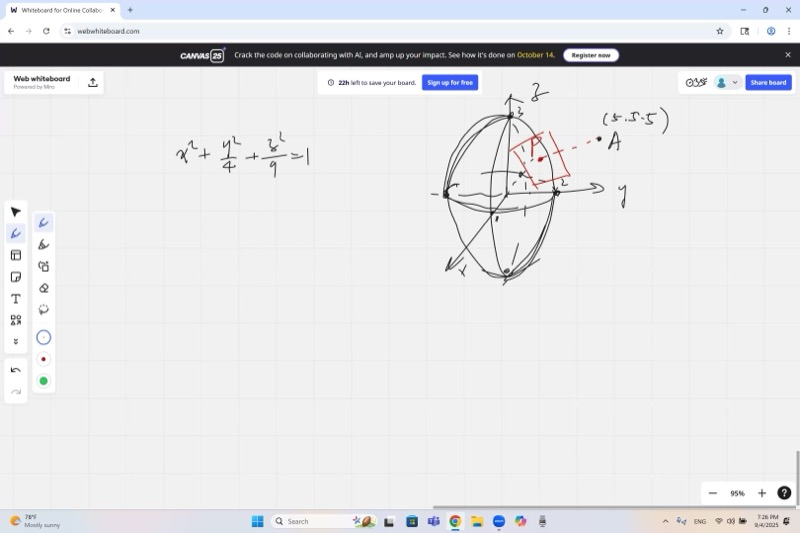
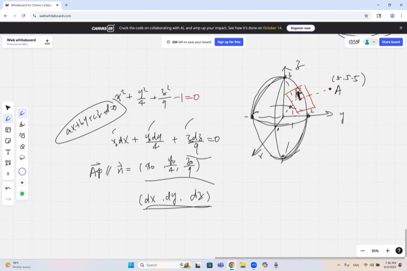

Have you ever wondered how GPS figures out the closest road to where you're standing, or how a video game decides where a laser beam hits a curved spaceship? In this lesson, you'll learn how to find the closest point on a curve to any spot you pick. We'll start with ellipses in 2D, then level up to 3D surfaces called ellipsoids. The secret weapon? A simple geometric rule about perpendicular lines that makes even tricky optimization problems totally doable.

::: {.callout-tip collapse="true"}
## Why Optimization on Curves Matters

Finding the closest point on a curve shows up everywhere:

- **GPS navigation**: your phone finds the nearest point on a road to your location
- **Robotics**: a robot arm calculates the closest approach to a curved surface
- **Computer graphics**: ray tracing finds where light hits curved objects like helmets and planets
- **Satellite orbits**: mission control calculates the closest approach of an elliptical orbit to a space station

Ellipses and ellipsoids are some of the most common shapes in nature --- planets, orbits, and even eggs are roughly ellipsoidal!
:::

## Topics Covered

- Ellipse review: center, axes, standard form
- Optimization: closest point on an ellipse to an external point
- Using differential equations to find the normal vector
- Geometric insight: the normal must point toward the external point
- Setting up and solving the system of equations
- Extension to 3D: ellipsoids and tangent planes
- 3D optimization: closest point on an ellipsoid

## Lecture Video

```{=html}
<video controls width="100%" preload="metadata">
  <source src="https://github.com/ymote/learningcalculus/releases/download/v1.0/calculus20250905.mp4" type="video/mp4">
</video>
```

## Key Frames from the Lecture

```{=html}
<div style="display: grid; grid-template-columns: 1fr 1fr 1fr 1fr; gap: 10px; margin: 1em 0;">
  
  
  
  
</div>
```


## What You Need to Know First

::: {.callout-note collapse="true"}
## What is an ellipse?

An **ellipse** is a stretched circle. Think of squishing a circle so it's wider in one direction than the other.

The **standard form** of an ellipse centered at the origin is:

$$\frac{x^2}{a^2} + \frac{y^2}{b^2} = 1$$

- $a$ = half the width (semi-major axis if $a > b$)
- $b$ = half the height (semi-minor axis if $a > b$)

If the center is at $(h, k)$ instead of the origin:

$$\frac{(x - h)^2}{a^2} + \frac{(y - k)^2}{b^2} = 1$$
:::

::: {.callout-note collapse="true"}
## What is a distance formula?

The **distance** between two points $(x_1, y_1)$ and $(x_2, y_2)$ is:

$$d = \sqrt{(x_2 - x_1)^2 + (y_2 - y_1)^2}$$

This comes straight from the Pythagorean theorem. In 3D, with points $(x_1, y_1, z_1)$ and $(x_2, y_2, z_2)$:

$$d = \sqrt{(x_2 - x_1)^2 + (y_2 - y_1)^2 + (z_2 - z_1)^2}$$
:::

::: {.callout-note collapse="true"}
## What is implicit differentiation?

When you have an equation like $x^2 + y^2 = 25$ (a circle), $y$ isn't written as "$y = \dots$" --- it's mixed in with $x$. To find $\frac{dy}{dx}$, you differentiate **both sides** with respect to $x$, treating $y$ as a function of $x$:

$$2x + 2y\frac{dy}{dx} = 0 \quad\Rightarrow\quad \frac{dy}{dx} = -\frac{x}{y}$$

This gives you the slope of the tangent line at any point on the curve.
:::

::: {.callout-note collapse="true"}
## What is a normal vector?

A **tangent line** just touches a curve at a point and goes in the direction the curve is heading. A **normal vector** is perpendicular (at a right angle) to the tangent line.

If the tangent has slope $m$, the normal has slope $-\frac{1}{m}$ (the negative reciprocal).

Normal vectors tell you which direction points "straight out" from the surface --- like an arrow sticking out of a ball.
:::

## Key Concepts

### Ellipse Review

Our ellipse is centered at $(5, -3)$ with semi-major axis $a = 8$ (horizontal) and semi-minor axis $b = 6$ (vertical):

$$\frac{(x - 5)^2}{64} + \frac{(y + 3)^2}{36} = 1$$

```{=html}
<div id="calc1" class="desmos-container"></div>
<script src="https://www.desmos.com/api/v1.9/calculator.js?apiKey=dcb31709b452b1cf9dc26972add0fda6"></script>
<script>
  var calc1 = Desmos.GraphingCalculator(document.getElementById('calc1'), {
    expressions: true,
    settingsMenu: false
  });
  calc1.setExpression({ id: 'ellipse', latex: '\\frac{(x-5)^2}{64}+\\frac{(y+3)^2}{36}=1', color: '#2d70b3' });
  calc1.setExpression({ id: 'center', latex: '(5, -3)', color: '#c74440', pointSize: 10, label: 'Center (5, -3)', showLabel: true });
  calc1.setExpression({ id: 'extpt', latex: '(20, 0)', color: '#388c46', pointSize: 10, label: 'A = (20, 0)', showLabel: true });
  calc1.setMathBounds({ left: -8, right: 28, bottom: -14, top: 10 });
</script>
```

### The Optimization Problem

**Goal:** Find the point $P = (x_0, y_0)$ on the ellipse that is **closest** to the external point $A = (20, 0)$.

We want to minimize the distance:

$$d = \sqrt{(x_0 - 20)^2 + (y_0 - 0)^2}$$

subject to the constraint that $(x_0, y_0)$ lies on the ellipse.

### Finding the Normal Vector via Differentiation

Differentiate the ellipse equation implicitly with respect to $x$:

$$\frac{2(x - 5)}{64} + \frac{2(y + 3)}{36}\cdot\frac{dy}{dx} = 0$$

Simplify:

$$\frac{x - 5}{32} + \frac{(y + 3)}{18}\cdot\frac{dy}{dx} = 0$$

So the tangent slope at a point $(x_0, y_0)$ on the ellipse is:

$$\frac{dy}{dx} = -\frac{18(x_0 - 5)}{32(y_0 + 3)}$$

The **tangent direction** at $(x_0, y_0)$ is along the vector $\left(1, \; -\frac{18(x_0 - 5)}{32(y_0 + 3)}\right)$, and a vector **normal** (perpendicular) to the ellipse at that point is:

::: {.callout-important}
## Key Idea: Normal Vector to an Ellipse
The normal vector points "straight out" from the ellipse at any point. You find it by taking the gradient of the ellipse equation. For an ellipse centered at $(h, k)$, the normal at $(x_0, y_0)$ is proportional to $\left(\frac{x_0 - h}{a^2}, \frac{y_0 - k}{b^2}\right)$.

$$\vec{n} = \left(\frac{x_0 - 5}{32}, \;\frac{y_0 + 3}{18}\right)$$
:::

### The Geometric Insight

::: {.callout-important}
## Key Idea: The Closest Point Condition
At the closest point on a curve to an outside point, the line connecting them must be perpendicular to the curve. If it weren't, you could slide along the curve and get even closer. This means the direction from the closest point to the target must line up exactly with the normal vector.
:::

At the closest point $P$ on the ellipse to $A$, the line from $P$ to $A$ must be **perpendicular to the ellipse** --- that is, it must be along the normal direction. If it weren't perpendicular, you could slide along the ellipse and get closer.

This means the vector $\overrightarrow{PA} = (20 - x_0, \; 0 - y_0)$ must be **parallel** to the normal vector $\vec{n}$.

Two vectors are parallel when their components are proportional:

$$\frac{20 - x_0}{\frac{x_0 - 5}{32}} = \frac{-y_0}{\frac{y_0 + 3}{18}}$$

Which simplifies to:

$$\frac{32(20 - x_0)}{x_0 - 5} = \frac{-18\,y_0}{y_0 + 3}$$

### Setting Up the System of Equations

We now have **two equations** in two unknowns ($x_0$ and $y_0$):

**Equation 1** (point lies on the ellipse):
$$\frac{(x_0 - 5)^2}{64} + \frac{(y_0 + 3)^2}{36} = 1$$

**Equation 2** (normal is parallel to $\overrightarrow{PA}$):
$$\frac{32(20 - x_0)}{x_0 - 5} = \frac{-18\,y_0}{y_0 + 3}$$

Solving this system (by substitution or numerical methods) gives the closest point.

```{=html}
<div id="calc2" class="desmos-container"></div>
<script>
  var calc2 = Desmos.GraphingCalculator(document.getElementById('calc2'), {
    expressions: true,
    settingsMenu: false
  });
  calc2.setExpression({ id: 'ellipse', latex: '\\frac{(x-5)^2}{64}+\\frac{(y+3)^2}{36}=1', color: '#2d70b3' });
  calc2.setExpression({ id: 'extpt', latex: '(20, 0)', color: '#388c46', pointSize: 10, label: 'A = (20, 0)', showLabel: true });
  calc2.setExpression({ id: 'slider_t', latex: 't=0.3', sliderBounds: {min: 0, max: 6.283, step: 0.01} });
  calc2.setExpression({ id: 'px', latex: 'p_x = 5 + 8\\cos(t)' });
  calc2.setExpression({ id: 'py', latex: 'p_y = -3 + 6\\sin(t)' });
  calc2.setExpression({ id: 'movept', latex: '(p_x, p_y)', color: '#c74440', pointSize: 10, label: 'P (drag t!)', showLabel: true });
  calc2.setExpression({ id: 'line', latex: '((1-s)\\cdot p_x + s\\cdot 20,\\; (1-s)\\cdot p_y + s\\cdot 0)', color: '#fa7e19', lineWidth: 1.5, parametricDomain: {min: 0, max: 1} });
  calc2.setExpression({ id: 'dist', latex: 'd = \\sqrt{(p_x - 20)^2 + (p_y)^2}', color: '#000' });
  calc2.setMathBounds({ left: -8, right: 28, bottom: -14, top: 10 });
</script>
```

*Drag the slider $t$ to move point $P$ around the ellipse and watch the distance change!*

### Extension to 3D: Ellipsoids

An **ellipsoid** is the 3D version of an ellipse. The ellipsoid we consider is:

$$\frac{x^2}{1} + \frac{y^2}{4} + \frac{z^2}{9} = 1$$

This is a stretched sphere: radius 1 along $x$, radius 2 along $y$, and radius 3 along $z$.

### Tangent Planes and Normal Vectors in 3D

For a surface defined by $F(x, y, z) = 0$, the **gradient** $\nabla F$ gives the normal vector.

With $F(x, y, z) = x^2 + \frac{y^2}{4} + \frac{z^2}{9} - 1$, the gradient at a point $(x_0, y_0, z_0)$ on the ellipsoid is:

$$\nabla F = \left(2x_0, \;\frac{y_0}{2}, \;\frac{2z_0}{9}\right)$$

Dropping the common factor of 2, the normal direction is:

::: {.callout-important}
## Key Idea: The Gradient Gives the Normal in Any Dimension
For any surface defined by $F(x,y,z) = 0$, the gradient $\nabla F$ always points perpendicular to the surface. This is the 3D version of the same normal-vector idea we used in 2D, and it works in any number of dimensions.

$$\vec{n} = \left(x_0, \;\frac{y_0}{4}, \;\frac{z_0}{9}\right)$$
:::

The **tangent plane** at $(x_0, y_0, z_0)$ is the flat surface that just touches the ellipsoid at that point, and $\vec{n}$ points straight out of it.

### 3D Optimization: Closest Point on the Ellipsoid

**Goal:** Find the point on the ellipsoid closest to $A = (5, 5, 5)$.

Same idea as 2D --- at the closest point, the vector from $P$ to $A$ must be parallel to the normal:

$$\overrightarrow{PA} = (5 - x_0, \; 5 - y_0, \; 5 - z_0) \;\parallel\; \left(x_0, \;\frac{y_0}{4}, \;\frac{z_0}{9}\right)$$

This gives us the proportionality conditions:

$$\frac{5 - x_0}{x_0} = \frac{5 - y_0}{\frac{y_0}{4}} = \frac{5 - z_0}{\frac{z_0}{9}}$$

Combined with the ellipsoid equation $x_0^2 + \frac{y_0^2}{4} + \frac{z_0^2}{9} = 1$, this is a system we can solve.

::: {.callout-tip collapse="true"}
## Why does the same trick work in 3D?

The geometric reasoning is identical: if the line from the surface to the external point is **not** perpendicular to the surface, then you could nudge along the surface and get closer. At the true closest point, there is no "sideways" improvement --- the direction to $A$ is purely along the normal.

This principle works in **any number of dimensions**!
:::

## Cheat Sheet

::: {.key-formula}
| What you want | What to do |
|---|---|
| Ellipse standard form | $\frac{(x-h)^2}{a^2} + \frac{(y-k)^2}{b^2} = 1$, center $(h,k)$ |
| Normal to ellipse at $(x_0, y_0)$ | $\vec{n} = \left(\frac{x_0 - h}{a^2},\; \frac{y_0 - k}{b^2}\right)$ |
| Closest point condition | $\overrightarrow{PA} \parallel \vec{n}$ (normal points at the target) |
| Ellipsoid standard form | $\frac{x^2}{a^2} + \frac{y^2}{b^2} + \frac{z^2}{c^2} = 1$ |
| Normal to ellipsoid at $(x_0, y_0, z_0)$ | $\vec{n} = \left(\frac{x_0}{a^2},\; \frac{y_0}{b^2},\; \frac{z_0}{c^2}\right)$ |
| Tangent plane at $(x_0, y_0, z_0)$ | $\frac{x_0\,(x - x_0)}{a^2} + \frac{y_0\,(y - y_0)}{b^2} + \frac{z_0\,(z - z_0)}{c^2} = 0$ |

### The Optimization Recipe

1. Write the constraint: point must lie on the curve/surface
2. Differentiate to find the normal vector
3. Set up: $\overrightarrow{PA} \parallel \vec{n}$ (proportionality condition)
4. Solve the system of equations
:::
