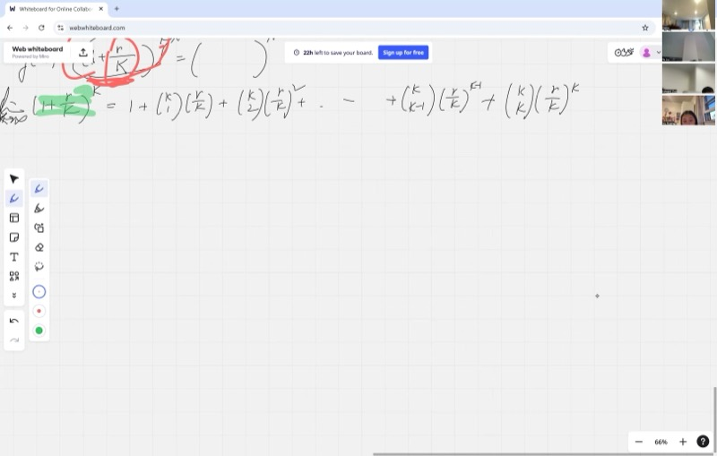
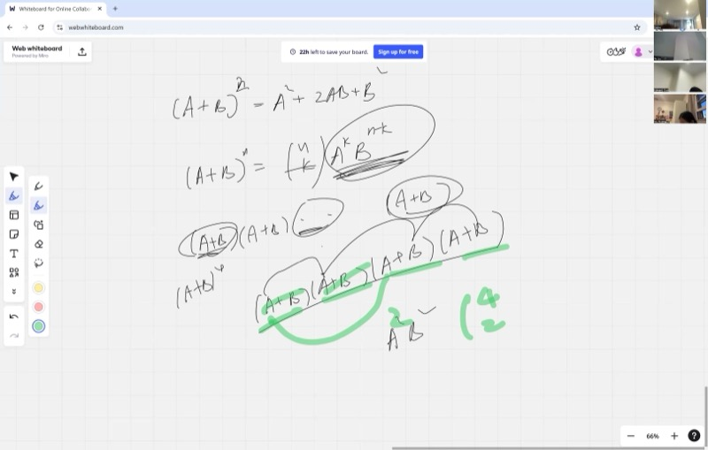
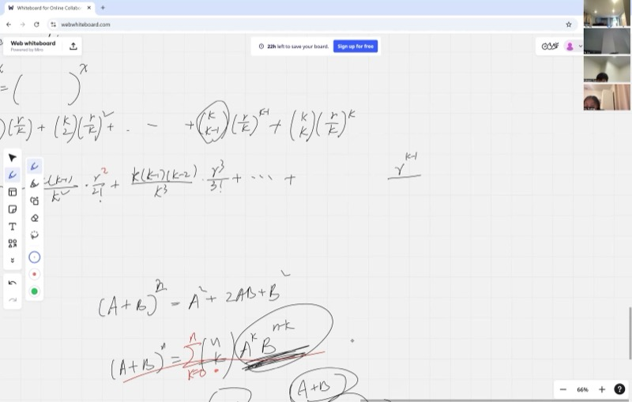
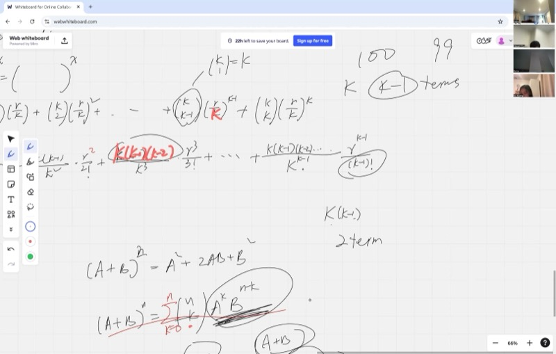

What happens if a bank pays you interest on your interest on your interest, over and over, faster and faster? You might expect your money to grow forever, but it actually settles down to a specific magical number: $e \approx 2.71828$. In this lesson, you'll discover where $e$ comes from, learn the binomial expansion trick that unlocks it, and see why $e$ is one of the most important numbers in all of math.

::: {.callout-tip collapse="true"}
## Real-World Connection: Where Does the Number e Come From?

Imagine you put \$1 in a bank account that pays 100% interest per year. If the bank compounds once a year, you get \$2. But what if they compound every month? Every day? Every second? As you compound more and more frequently, the amount you end up with gets closer and closer to a mysterious number: $e \approx 2.71828...$. This number shows up everywhere — in population growth, radioactive decay, and even in how social media posts go viral. Today we will see exactly where it comes from and why it is so special.
:::

## Topics Covered

- The origin of the number $e$ through compound interest
- The limit $\left(1 + \frac{r}{k}\right)^k \to e^r$ as $k \to \infty$
- Why the derivative of $e^x$ is $e^x$ itself — the defining property
- Binomial expansion: $(a+b)^n = \sum_{i=0}^{n} \binom{n}{i} \cdot a^{n-i} \cdot b^{i}$
- Combinatorics review: $\binom{n}{k} = \frac{n!}{k!(n-k)!}$
- Complementarity: $\binom{n}{k} = \binom{n}{n-k}$
- Patterns in binomial coefficients that lead to the limit definition of $e$

## Lecture Video

```{=html}
<video controls width="100%" preload="metadata">
  <source src="https://github.com/ymote/learningcalculus/releases/download/v1.0/calculus20250911.mp4" type="video/mp4">
</video>
```

## Key Frames from the Lecture

```{=html}
<div style="display: flex; gap: 8px; margin: 1em 0;">
  
  
  
  
</div>
```


::: {.callout-note collapse="true"}
## What You Need to Know First: Exponent Rules

You should be comfortable with the basic laws of exponents:

- $a^m \cdot a^n = a^{m+n}$
- $(a^m)^n = a^{mn}$
- $a^0 = 1$ for any $a \neq 0$

These rules are essential for understanding how $(1 + r/k)^k$ behaves as we change $k$.
:::

::: {.callout-note collapse="true"}
## What You Need to Know First: Factorials

A **factorial** is written $n!$ and means the product of all positive integers up to $n$:

$$n! = n \times (n-1) \times (n-2) \times \cdots \times 2 \times 1$$

For example: $5! = 5 \times 4 \times 3 \times 2 \times 1 = 120$.

By convention, $0! = 1$. Factorials grow incredibly fast — $10! = 3{,}628{,}800$ is already over three million.
:::

## The Origin of the Number $e$: Compound Interest

Suppose you invest \$1 at 100% annual interest rate ($r = 1$). If the bank compounds $k$ times per year, each compounding period gives you a rate of $\frac{1}{k}$, and after one year you have:

$$A = \left(1 + \frac{1}{k}\right)^k$$

Let us see what happens as $k$ grows:

| Compounding ($k$) | Expression | Value |
|---|---|---|
| 1 (annually) | $(1 + 1)^1$ | $2.000$ |
| 2 (semi-annually) | $(1 + 0.5)^2$ | $2.250$ |
| 12 (monthly) | $(1 + 1/12)^{12}$ | $2.613...$ |
| 365 (daily) | $(1 + 1/365)^{365}$ | $2.7146...$ |
| 10,000 | $(1 + 1/10000)^{10000}$ | $2.71815...$ |
| $\infty$ | $\lim_{k \to \infty} (1 + 1/k)^k$ | $e \approx 2.71828...$ |

The number never blows up to infinity — it settles down to the special constant $e$.

**Explore the limit — use the slider to increase $k$ and watch the value approach $e$:**

```{=html}
<div id="calc1" class="desmos-container"></div>
<script src="https://www.desmos.com/api/v1.9/calculator.js?apiKey=dcb31709b452b1cf9dc26972add0fda6"></script>
<script>
  var calc1 = Desmos.GraphingCalculator(document.getElementById('calc1'), {
    expressions: true,
    settingsMenu: false
  });
  calc1.setExpression({ id: 'k', latex: 'k=10', sliderBounds: {min: 1, max: 500, step: 1} });
  calc1.setExpression({ id: 'func', latex: 'y=\\left(1+\\frac{1}{x}\\right)^{x}', color: '#2d70b3', lineWidth: 2.5 });
  calc1.setExpression({ id: 'eline', latex: 'y=e', color: '#388c46', lineWidth: 2, lineStyle: 'DASHED' });
  calc1.setExpression({ id: 'pt', latex: '\\left(k,\\left(1+\\frac{1}{k}\\right)^{k}\\right)', color: '#c74440', pointSize: 10, label: '(k, (1+1/k)^k)', showLabel: true });
  calc1.setExpression({ id: 'elabel', latex: '(450, 2.718)', color: '#388c46', label: 'y = e', showLabel: true, pointSize: 0 });
  calc1.setMathBounds({ left: -10, right: 520, bottom: 1.5, top: 3.5 });
</script>
```

::: {.callout-tip collapse="true"}
## Try this with the slider

Start with $k = 1$ and slowly increase it. Notice how quickly the value gets close to $e$ — by $k = 100$ you are already within a few hundredths. But it never quite reaches $e$; it just gets closer and closer forever. That is what a **limit** means.
:::

## Generalizing: The Rate $r$

What if the interest rate is not 100% but some general rate $r$? Then after one year with $k$ compoundings:

$$A = \left(1 + \frac{r}{k}\right)^k$$

As $k \to \infty$, this approaches $e^r$:

$$\lim_{k \to \infty} \left(1 + \frac{r}{k}\right)^k = e^r$$

This is one of the most important limits in calculus. But to **prove** it, we need a powerful algebraic tool: the binomial expansion.

## Combinatorics Review: $n$ Choose $k$

Before we can expand $(a + b)^n$, we need the **binomial coefficient**, read "$n$ choose $k$":

$$\binom{n}{k} = \frac{n!}{k!(n-k)!}$$

This counts the number of ways to choose $k$ items from a group of $n$ items, where order does not matter.

### Example: How many ways can you pick 3 students from a class of 5?

$$\binom{5}{3} = \frac{5!}{3! \cdot 2!} = \frac{120}{6 \cdot 2} = 10$$

### Complementarity: $\binom{n}{k} = \binom{n}{n-k}$

Here is a beautiful fact: **choosing which items to take is the same as choosing which items to leave behind**.

$$\binom{100}{96} = \binom{100}{4}$$

Think about it: picking 96 people from 100 to be on a team is the same as picking 4 people to *not* be on the team. Instead of listing 96 names, you just list the 4 who sit out. Same number of ways, much less writing!

This is why $\binom{n}{k} = \binom{n}{n-k}$ — the formula is symmetric.

::: {.callout-tip collapse="true"}
## Why does the formula confirm this?

$$\binom{n}{n-k} = \frac{n!}{(n-k)!\left(n-(n-k)\right)!} = \frac{n!}{(n-k)! \cdot k!}$$

That is exactly the same as $\binom{n}{k} = \frac{n!}{k!(n-k)!}$, just with the two factors in the denominator swapped. Multiplication is commutative, so they are equal.
:::

## The Binomial Expansion

Now for the main tool. The **Binomial Theorem** says:

::: {.callout-important}
## Key Idea: The Binomial Theorem
The binomial theorem lets you expand any power of a sum $(a+b)^n$ into individual terms. It is the algebraic engine that powers our proof of the compound interest limit.

$$(a + b)^n = \sum_{i=0}^{n} \binom{n}{i} \cdot a^{n-i} \cdot b^{i}$$
:::

This means we expand $(a+b)^n$ by summing over all ways to pick some copies of $b$ and the rest from $a$.

### Example: Expand $(a + b)^3$

$$(a+b)^3 = \binom{3}{0}a^3 + \binom{3}{1}a^2 b + \binom{3}{2}a b^2 + \binom{3}{3}b^3$$

$$= a^3 + 3a^2b + 3ab^2 + b^3$$

### Example: Expand $(x + 1)^4$

$$(x+1)^4 = \binom{4}{0}x^4 + \binom{4}{1}x^3 + \binom{4}{2}x^2 + \binom{4}{3}x + \binom{4}{4}$$

$$= x^4 + 4x^3 + 6x^2 + 4x + 1$$

Notice the coefficients $1, 4, 6, 4, 1$ — these are the 4th row of **Pascal's Triangle**.

## Patterns in the Binomial Coefficients

When we write out $\binom{n}{k}$ for a general $n$, something useful happens. Let us write the first few coefficients with $k$ factors on top and $k!$ on the bottom:

$$\binom{n}{0} = 1, \qquad \binom{n}{1} = \frac{n}{1}, \qquad \binom{n}{2} = \frac{n(n-1)}{2!}, \qquad \binom{n}{3} = \frac{n(n-1)(n-2)}{3!}$$

The pattern: $\binom{n}{k}$ has exactly $k$ factors on top (starting at $n$ and counting down) and $k!$ on the bottom. This form will be critical when we plug in $n = k$ and take $k \to \infty$.

## Building Toward the Limit: Applying Binomial Expansion to $(1 + r/k)^k$

Now we connect everything. Set $a = 1$ and $b = r/k$ in the binomial theorem, with exponent $k$:

$$\left(1 + \frac{r}{k}\right)^k = \sum_{i=0}^{k} \binom{k}{i} \cdot 1^{k-i} \cdot \left(\frac{r}{k}\right)^i = \sum_{i=0}^{k} \binom{k}{i} \cdot \frac{r^i}{k^i}$$

Writing out the first few terms using our pattern:

$$= 1 + \frac{k}{1} \cdot \frac{r}{k} + \frac{k(k-1)}{2!} \cdot \frac{r^2}{k^2} + \frac{k(k-1)(k-2)}{3!} \cdot \frac{r^3}{k^3} + \cdots$$

$$= 1 + r + \frac{k(k-1)}{k^2} \cdot \frac{r^2}{2!} + \frac{k(k-1)(k-2)}{k^3} \cdot \frac{r^3}{3!} + \cdots$$

Now look at each fraction like $\frac{k(k-1)}{k^2}$. As $k \to \infty$:

$$\frac{k(k-1)}{k^2} = \frac{k}{k} \cdot \frac{k-1}{k} = 1 \cdot \left(1 - \frac{1}{k}\right) \to 1$$

So in the limit, every such fraction becomes 1, and we get:

::: {.callout-important}
## Key Idea: The Compound Interest Limit
When you compound interest infinitely often, the result is the exponential function $e^r$. This connects a simple banking idea to one of the most important numbers in mathematics.

$$\lim_{k \to \infty}\left(1 + \frac{r}{k}\right)^k = 1 + r + \frac{r^2}{2!} + \frac{r^3}{3!} + \cdots = \sum_{i=0}^{\infty} \frac{r^i}{i!} = e^r$$
:::

That infinite sum is the **Taylor series for $e^r$** — and that is how compound interest leads us to the number $e$.

## Why the Derivative of $e^x$ Is $e^x$ Itself

This is the property that makes $e$ truly special. Out of all possible exponential functions ($2^x$, $3^x$, $10^x$, ...), only $e^x$ is its own derivative:

::: {.callout-important}
## Key Idea: $e^x$ Is Its Own Derivative
The function $e^x$ is the only exponential function whose rate of change at every point equals its value at that point. This single property is what makes $e$ the "natural" base for calculus.

$$\frac{d}{dx}(e^x) = e^x$$
:::

No other function grows at a rate exactly equal to its current value. If you have 100 bacteria and the population is modeled by $e^x$, the rate of growth at that moment is also 100. The bigger it gets, the faster it grows — and the growth rate is always perfectly matched to the size.

**Compare $e^x$ with its derivative — they are the same curve:**

```{=html}
<div id="calc2" class="desmos-container"></div>
<script>
  var calc2 = Desmos.GraphingCalculator(document.getElementById('calc2'), {
    expressions: true,
    settingsMenu: false
  });
  calc2.setExpression({ id: 'ex', latex: 'y=e^x', color: '#2d70b3', lineWidth: 3 });
  calc2.setExpression({ id: 'label_ex', latex: '(2, 7.4)', color: '#2d70b3', label: 'f(x) = e^x (also its own derivative!)', showLabel: true, pointSize: 0 });
  calc2.setExpression({ id: 'bx', latex: 'y=b^x', color: '#c74440', lineWidth: 2 });
  calc2.setExpression({ id: 'bxderiv', latex: 'y=\\ln(b)\\cdot b^x', color: '#c74440', lineWidth: 2, lineStyle: 'DASHED' });
  calc2.setExpression({ id: 'b', latex: 'b=2', sliderBounds: {min: 1.1, max: 5, step: 0.01} });
  calc2.setExpression({ id: 'label_bx', latex: '(-1, 0.5)', color: '#c74440', label: 'b^x (solid) vs its derivative (dashed)', showLabel: true, pointSize: 0 });
  calc2.setMathBounds({ left: -4, right: 4, bottom: -1, top: 15 });
</script>
```

::: {.callout-tip collapse="true"}
## Try this with the slider

Adjust $b$ and notice that for most bases, the derivative (dashed) is a different curve from the function (solid). But set $b = 2.72$ (close to $e$) and they nearly overlap. Only at $b = e$ exactly are they identical.
:::

## Cheat Sheet

::: {.key-formula}
| Concept | Key Fact |
|---|---|
| Definition of $e$ | $e = \lim_{k \to \infty}\left(1 + \frac{1}{k}\right)^k \approx 2.71828$ |
| General compound interest limit | $\lim_{k \to \infty}\left(1 + \frac{r}{k}\right)^k = e^r$ |
| Derivative of $e^x$ | $\dfrac{d}{dx}(e^x) = e^x$ |
| Binomial Theorem | $(a+b)^n = \displaystyle\sum_{i=0}^{n}\binom{n}{i}\,a^{n-i}\,b^{i}$ |
| Binomial coefficient | $\binom{n}{k} = \dfrac{n!}{k!(n-k)!}$ |
| Complementarity | $\binom{n}{k} = \binom{n}{n-k}$ |
| Taylor series for $e^r$ | $e^r = \displaystyle\sum_{i=0}^{\infty}\dfrac{r^i}{i!} = 1 + r + \dfrac{r^2}{2!} + \dfrac{r^3}{3!} + \cdots$ |
:::
