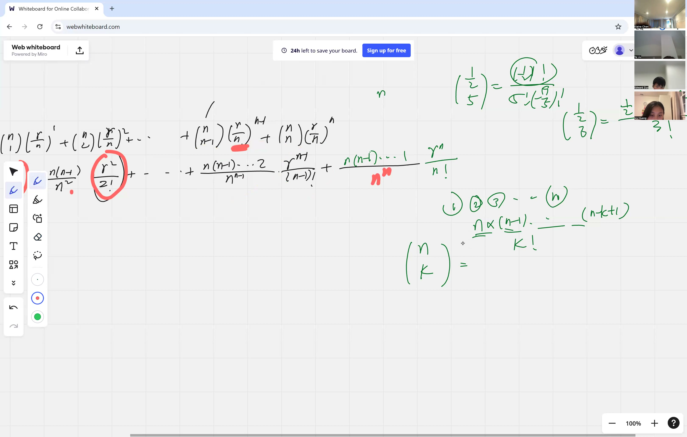
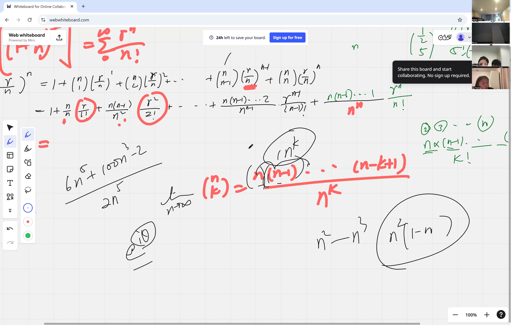
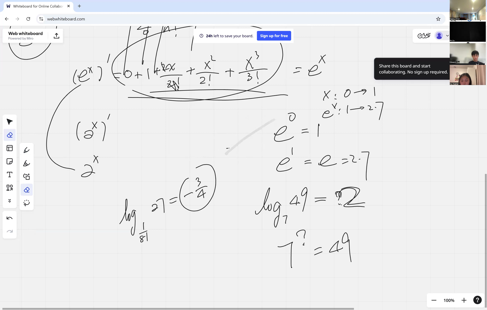
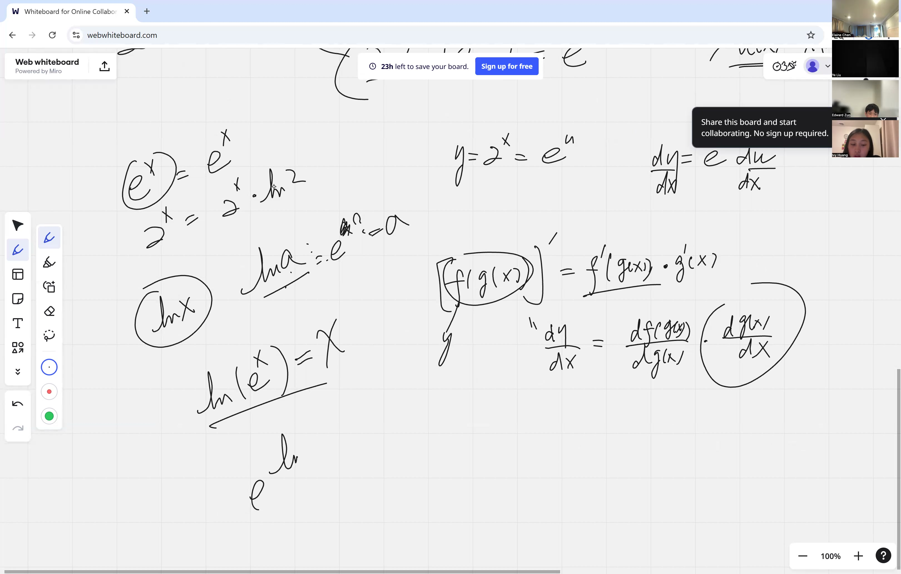

Today we're going deep into the two most powerful function families in calculus: exponentials and logarithms. You'll see how the infinite series for $e^x$ proves that it is its own derivative (how cool is that?), learn how to take derivatives of any exponential like $2^x$ or $10^x$, and meet the natural logarithm $\ln(x)$. By the end, you'll even get a sneak peek at Euler's formula, which ties together exponentials, sine, cosine, and imaginary numbers in one jaw-dropping equation.

::: {.callout-tip collapse="true"}
## Why Exponentials and Logarithms Matter

Exponential functions show up everywhere something **grows** or **decays**:

- **Population growth**: bacteria double every 20 minutes — that's exponential!
- **Compound interest**: your savings account grows exponentially over time
- **Radioactive decay**: scientists use exponential decay to date ancient fossils
- **Sound volume**: decibels use logarithms to measure how loud something is
- **Earthquakes**: the Richter scale is logarithmic — a magnitude 7 quake is 10x stronger than a magnitude 6

The number $e \approx 2.718$ is the "natural" base for all of this. Today we'll discover where $e$ comes from and why it makes calculus beautifully simple!
:::

## Topics Covered

- Binomial expansion of $(1 + r/n)^n$ term by term
- Taking the limit as $n \to \infty$ to discover the infinite series for $e^r$
- The number $e \approx 2.718\ldots$ and why it's special
- Maclaurin series (power series) — representing functions as infinite polynomials
- Proving that $\frac{d}{dx}(e^x) = e^x$ using the power series
- Derivative of $a^x$: rewrite as $e^{x \ln a}$, get $a^x \cdot \ln(a)$
- The natural logarithm $\ln(x)$ as the inverse of $e^x$
- Proving $\frac{d}{dx}\ln(x) = \frac{1}{x}$
- Preview of Euler's formula: $e^{i\theta} = \cos\theta + i\sin\theta$

## Lecture Video

```{=html}
<video controls width="100%" preload="metadata">
  <source src="https://github.com/ymote/learningcalculus/releases/download/v1.0/calculus20250915.mp4" type="video/mp4">
</video>
```

## Key Frames from the Lecture

::: {layout-ncol=2}







:::


## What You Need to Know First

::: {.callout-note collapse="true"}
## What is the Binomial Theorem?

The **Binomial Theorem** tells us how to expand $(a + b)^n$:

$$(a + b)^n = \sum_{k=0}^{n} \binom{n}{k} a^{n-k} b^k$$

where $\binom{n}{k} = \frac{n!}{k!(n-k)!}$ is the binomial coefficient ("$n$ choose $k$").

For example:

$$(1 + x)^3 = 1 + 3x + 3x^2 + x^3$$

The coefficients $1, 3, 3, 1$ come from Pascal's triangle. In this lesson, we'll use the binomial theorem on $(1 + r/n)^n$ and then let $n$ get really, really big!
:::

::: {.callout-note collapse="true"}
## What is a factorial?

A **factorial** is a product of all positive integers up to $n$:

$$n! = n \times (n-1) \times (n-2) \times \cdots \times 2 \times 1$$

Examples: $3! = 6$, $4! = 24$, $5! = 120$.

By convention, $0! = 1$.

Factorials grow incredibly fast — $10! = 3{,}628{,}800$ and $20!$ is already in the quintillions!
:::

::: {.callout-note collapse="true"}
## What is compound interest?

If you invest money at interest rate $r$ (as a decimal), compounded $n$ times per year, then after 1 year your money is multiplied by:

$$\left(1 + \frac{r}{n}\right)^n$$

For example, with $r = 1$ (100% interest) compounded monthly ($n = 12$):

$$\left(1 + \frac{1}{12}\right)^{12} \approx 2.613$$

What happens if you compound more and more often — every second, every microsecond? The answer approaches $e \approx 2.718$. That's exactly what we'll prove today!
:::

::: {.callout-note collapse="true"}
## What is the chain rule?

The **chain rule** tells us how to differentiate a function inside another function:

$$\frac{d}{dx} f(g(x)) = f'(g(x)) \cdot g'(x)$$

Think of it as peeling layers: differentiate the outer function, then multiply by the derivative of the inner function.

For example: $\frac{d}{dx}(3x+1)^5 = 5(3x+1)^4 \cdot 3 = 15(3x+1)^4$.
:::

## Key Concepts

### From Compound Interest to the Number $e$

We start with the compound interest formula and expand it using the binomial theorem:

$$\left(1 + \frac{r}{n}\right)^n = \sum_{k=0}^{n} \binom{n}{k} \left(\frac{r}{n}\right)^k$$

Writing out the binomial coefficient:

$$\binom{n}{k} \frac{r^k}{n^k} = \frac{n(n-1)(n-2)\cdots(n-k+1)}{k! \cdot n^k} \cdot r^k$$

Now here's the magic. Look at the coefficient of $r^k$:

$$\frac{n(n-1)(n-2)\cdots(n-k+1)}{n^k}$$

This is a product of $k$ fractions: $\frac{n}{n} \cdot \frac{n-1}{n} \cdot \frac{n-2}{n} \cdots$

Each fraction looks like $1 - \frac{\text{something}}{n}$. As $n \to \infty$, every one of these fractions approaches **1**. So the whole coefficient approaches $\frac{1}{k!}$, and we get:

$$\lim_{n \to \infty}\left(1 + \frac{r}{n}\right)^n = \sum_{k=0}^{\infty} \frac{r^k}{k!} = 1 + r + \frac{r^2}{2!} + \frac{r^3}{3!} + \frac{r^4}{4!} + \cdots$$

**Explore — watch the compound interest value approach $e$ as $n$ increases:**

```{=html}
<div id="calc1" class="desmos-container"></div>
<script src="https://www.desmos.com/api/v1.9/calculator.js?apiKey=dcb31709b452b1cf9dc26972add0fda6"></script>
<script>
  var calc1 = Desmos.GraphingCalculator(document.getElementById('calc1'), {
    expressions: true,
    settingsMenu: false
  });
  calc1.setExpression({ id: 'r', latex: 'r=1', sliderBounds: {min: 0.1, max: 3, step: 0.1} });
  calc1.setExpression({ id: 'compound', latex: 'y=\\left(1+\\frac{r}{x}\\right)^x \\left\\{x>0\\right\\}', color: '#2d70b3' });
  calc1.setExpression({ id: 'limit', latex: 'y=e^r', color: '#c74440', lineStyle: 'DASHED', lineWidth: 1.5 });
  calc1.setExpression({ id: 'elabel', latex: '(50, e^r)', color: '#c74440', pointSize: 0, label: 'limit = e^r', showLabel: true });
  calc1.setMathBounds({ left: -5, right: 60, bottom: -1, top: 10 });
</script>
```

*Set $r = 1$ and watch the blue curve approach $e \approx 2.718$ (red dashed line) as $x$ grows. Try other values of $r$!*

### The Definition of $e$

Plugging $r = 1$ into our series:

$$e = \sum_{k=0}^{\infty} \frac{1}{k!} = 1 + 1 + \frac{1}{2} + \frac{1}{6} + \frac{1}{24} + \frac{1}{120} + \cdots \approx 2.71828\ldots$$

The number $e$ is **irrational** — its decimal digits never repeat and never end. It's one of the most important constants in all of mathematics, right alongside $\pi$.

### Power Series (Maclaurin Series)

The expression we found is called a **power series** — we've written $e^r$ as an infinite polynomial:

$$e^r = 1 + r + \frac{r^2}{2!} + \frac{r^3}{3!} + \frac{r^4}{4!} + \cdots$$

This is also called the **Maclaurin series** for $e^r$. The idea of representing functions as infinite sums of powers of $x$ is one of the most powerful tools in all of mathematics. It lets us turn complicated functions into polynomials that we can differentiate, integrate, and compute with easily.

### Proving $\frac{d}{dx}(e^x) = e^x$

This is one of the most elegant results in calculus. We differentiate the power series **term by term**:

$$e^x = 1 + x + \frac{x^2}{2!} + \frac{x^3}{3!} + \frac{x^4}{4!} + \frac{x^5}{5!} + \cdots$$

Take the derivative of each term:

$$\frac{d}{dx}(e^x) = 0 + 1 + \frac{2x}{2!} + \frac{3x^2}{3!} + \frac{4x^3}{4!} + \frac{5x^4}{5!} + \cdots$$

Now simplify each fraction. For instance, $\frac{3x^2}{3!} = \frac{3x^2}{3 \cdot 2!} = \frac{x^2}{2!}$. In general, $\frac{kx^{k-1}}{k!} = \frac{x^{k-1}}{(k-1)!}$.

So we get:

$$\frac{d}{dx}(e^x) = 1 + x + \frac{x^2}{2!} + \frac{x^3}{3!} + \frac{x^4}{4!} + \cdots = e^x$$

The series reproduces itself! That's why $e^x$ is special: **it is its own derivative**.

**Explore — see that $e^x$ and its derivative are the same curve:**

```{=html}
<div id="calc2" class="desmos-container"></div>
<script>
  var calc2 = Desmos.GraphingCalculator(document.getElementById('calc2'), {
    expressions: true,
    settingsMenu: false
  });
  calc2.setExpression({ id: 'ex', latex: 'y=e^x', color: '#2d70b3', lineWidth: 3 });
  calc2.setExpression({ id: 'a', latex: 'a=1', sliderBounds: {min: -2, max: 3, step: 0.01} });
  calc2.setExpression({ id: 'pt', latex: '(a, e^a)', color: '#c74440', pointSize: 12, label: 'slope = height!', showLabel: true });
  calc2.setExpression({ id: 'tangent', latex: 'y - e^a = e^a(x - a)', color: '#fa7e19', lineWidth: 2 });
  calc2.setMathBounds({ left: -3, right: 4, bottom: -2, top: 15 });
</script>
```

*Drag the slider for $a$. Notice that the slope of the tangent line always equals the height of the point — because $\frac{d}{dx}(e^x) = e^x$!*

### Derivative of $a^x$ (Any Exponential Base)

What about $\frac{d}{dx}(2^x)$ or $\frac{d}{dx}(10^x)$? The trick is to rewrite any exponential using $e$:

$$a^x = e^{x \ln a}$$

Why? Because $e^{\ln a} = a$, so $e^{x \ln a} = (e^{\ln a})^x = a^x$.

Now apply the chain rule. Let $u = x \ln a$:

$$\frac{d}{dx}(a^x) = \frac{d}{dx}(e^u) = e^u \cdot \frac{du}{dx} = e^{x \ln a} \cdot \ln a = a^x \cdot \ln a$$

::: {.callout-important}
## Key Idea: Derivative of Any Exponential
To differentiate an exponential with any base, rewrite it using $e$ and apply the chain rule. The result picks up a factor of $\ln a$ -- this is why $e$ is the "cleanest" base (since $\ln e = 1$).

$$\boxed{\frac{d}{dx}(a^x) = a^x \cdot \ln a}$$
:::

Notice: when $a = e$, we get $\ln e = 1$, so $\frac{d}{dx}(e^x) = e^x \cdot 1 = e^x$. It all fits together!

**Explore — compare $a^x$ with its derivative $a^x \ln a$ for different bases:**

```{=html}
<div id="calc3" class="desmos-container"></div>
<script>
  var calc3 = Desmos.GraphingCalculator(document.getElementById('calc3'), {
    expressions: true,
    settingsMenu: false
  });
  calc3.setExpression({ id: 'a', latex: 'a=2', sliderBounds: {min: 0.5, max: 5, step: 0.1} });
  calc3.setExpression({ id: 'func', latex: 'y=a^x', color: '#2d70b3', lineWidth: 3 });
  calc3.setExpression({ id: 'deriv', latex: 'y=a^x \\cdot \\ln(a)', color: '#c74440', lineWidth: 2, lineStyle: 'DASHED' });
  calc3.setExpression({ id: 'note1', latex: '(2, a^2)', color: '#2d70b3', pointSize: 0, label: 'a^x', showLabel: true });
  calc3.setExpression({ id: 'note2', latex: '(2, a^2 \\cdot \\ln(a))', color: '#c74440', pointSize: 0, label: 'derivative', showLabel: true });
  calc3.setMathBounds({ left: -3, right: 4, bottom: -2, top: 15 });
</script>
```

*Set $a = e \approx 2.718$ and the two curves overlap perfectly — that's the magic of $e$!*

### The Natural Logarithm

The **natural logarithm** $\ln(x)$ is the inverse of $e^x$. It answers the question:

$$\ln(a) = \text{"what power of } e \text{ gives } a\text{?"}$$

So $\ln(e) = 1$ (because $e^1 = e$), $\ln(1) = 0$ (because $e^0 = 1$), and $\ln(e^3) = 3$.

Key properties:

- $e^{\ln x} = x$ for all $x > 0$
- $\ln(e^x) = x$ for all $x$
- $\ln(ab) = \ln a + \ln b$
- $\ln(a^n) = n \ln a$

### Derivative of $\ln(x) = \frac{1}{x}$

Start with the identity:

$$e^{\ln x} = x$$

Differentiate both sides using the chain rule:

$$e^{\ln x} \cdot \frac{d}{dx}(\ln x) = 1$$

But $e^{\ln x} = x$, so:

$$x \cdot \frac{d}{dx}(\ln x) = 1$$

::: {.callout-important}
## Key Idea: Derivative of the Natural Logarithm
The derivative of $\ln(x)$ turns a "transcendental" function into a simple algebraic one. This result comes straight from differentiating the identity $e^{\ln x} = x$ and solving.

$$\boxed{\frac{d}{dx}\ln(x) = \frac{1}{x}}$$
:::

This is remarkable: the derivative of $\ln(x)$ is $\frac{1}{x}$ — a simple algebraic function! And later we'll see the flip side: the integral of $\frac{1}{x}$ is $\ln|x| + C$.

**Explore — the slope of $\ln(x)$ at any point equals $\frac{1}{x}$:**

```{=html}
<div id="calc4" class="desmos-container"></div>
<script>
  var calc4 = Desmos.GraphingCalculator(document.getElementById('calc4'), {
    expressions: true,
    settingsMenu: false
  });
  calc4.setExpression({ id: 'ln', latex: 'y=\\ln(x)', color: '#2d70b3', lineWidth: 3 });
  calc4.setExpression({ id: 'a', latex: 'a=1', sliderBounds: {min: 0.2, max: 6, step: 0.01} });
  calc4.setExpression({ id: 'pt', latex: '(a, \\ln(a))', color: '#c74440', pointSize: 12, showLabel: true, label: 'slope = 1/a' });
  calc4.setExpression({ id: 'tangent', latex: 'y - \\ln(a) = \\frac{1}{a}(x - a)', color: '#fa7e19', lineWidth: 2 });
  calc4.setExpression({ id: 'inv', latex: 'y=\\frac{1}{x}', color: '#388c46', lineWidth: 1.5, lineStyle: 'DASHED' });
  calc4.setMathBounds({ left: -1, right: 7, bottom: -3, top: 4 });
</script>
```

*Drag the slider and compare: the tangent line's slope at $x = a$ always equals $\frac{1}{a}$ (green dashed curve).*

### Preview: Euler's Formula

Here's a mind-blowing teaser. If we plug an **imaginary number** $i\theta$ into the power series for $e^x$:

$$e^{i\theta} = 1 + i\theta + \frac{(i\theta)^2}{2!} + \frac{(i\theta)^3}{3!} + \frac{(i\theta)^4}{4!} + \cdots$$

Using $i^2 = -1$, $i^3 = -i$, $i^4 = 1$, and separating real and imaginary parts, we get **Euler's formula**:

::: {.callout-important}
## Key Idea: Euler's Formula
This single equation unifies exponentials, trigonometry, and imaginary numbers. It comes from plugging $i\theta$ into the power series for $e^x$ and separating real and imaginary parts.

$$\boxed{e^{i\theta} = \cos\theta + i\sin\theta}$$
:::

This connects exponentials, trigonometry, and complex numbers in one equation. Setting $\theta = \pi$ gives **Euler's identity**: $e^{i\pi} + 1 = 0$ — often called the most beautiful equation in mathematics.

::: {.callout-tip collapse="true"}
## Homework Challenge

Use Euler's formula and the power series for $e^{i\theta}$ to derive:

- The Maclaurin series for $\cos\theta$ (collect the real parts)
- The Maclaurin series for $\sin\theta$ (collect the imaginary parts)

Then differentiate those series term by term to show that $\frac{d}{d\theta}\sin\theta = \cos\theta$ and $\frac{d}{d\theta}\cos\theta = -\sin\theta$.
:::

## Cheat Sheet

::: {.key-formula}
| What you want | Formula |
|---|---|
| Definition of $e$ | $e = \displaystyle\sum_{k=0}^{\infty} \frac{1}{k!} = 1 + 1 + \frac{1}{2} + \frac{1}{6} + \cdots \approx 2.718$ |
| Power series for $e^r$ | $e^r = \displaystyle\sum_{k=0}^{\infty} \frac{r^k}{k!} = 1 + r + \frac{r^2}{2!} + \frac{r^3}{3!} + \cdots$ |
| Derivative of $e^x$ | $\frac{d}{dx}(e^x) = e^x$ |
| Derivative of $a^x$ | $\frac{d}{dx}(a^x) = a^x \cdot \ln a$ |
| Natural log definition | $\ln(a) = $ "what power of $e$ gives $a$?" |
| Derivative of $\ln(x)$ | $\frac{d}{dx}\ln(x) = \frac{1}{x}$ |
| Euler's formula | $e^{i\theta} = \cos\theta + i\sin\theta$ |

### The Big Chain of Ideas

$$\text{Compound interest} \;\longrightarrow\; \text{Binomial expansion} \;\longrightarrow\; \text{Let } n \to \infty \;\longrightarrow\; \text{Power series for } e^r \;\longrightarrow\; \frac{d}{dx}e^x = e^x$$
:::
