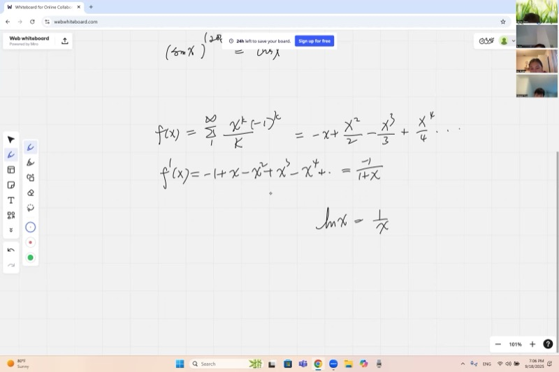
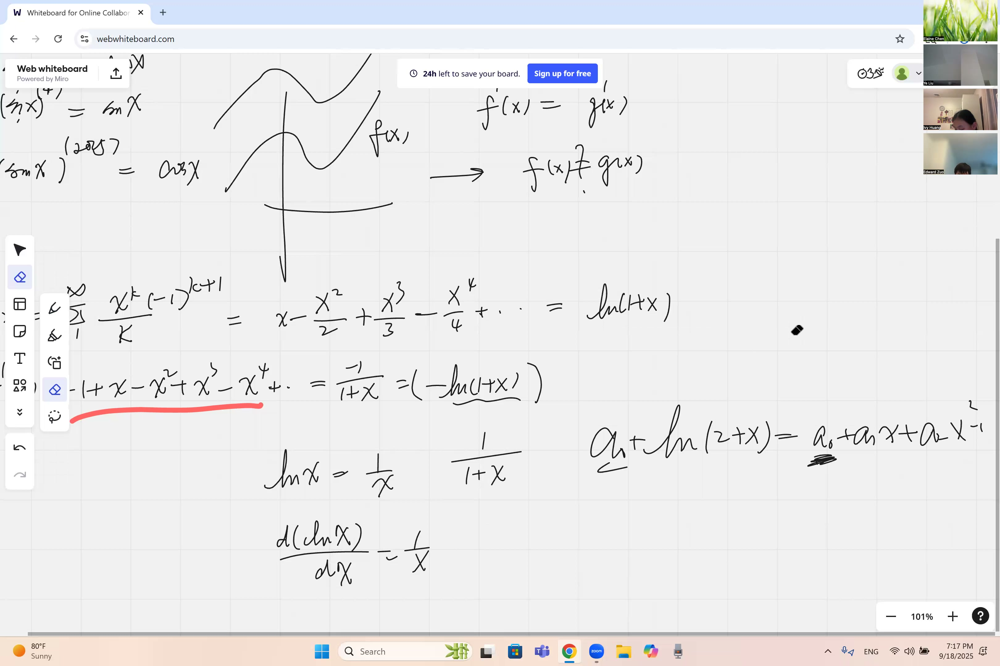
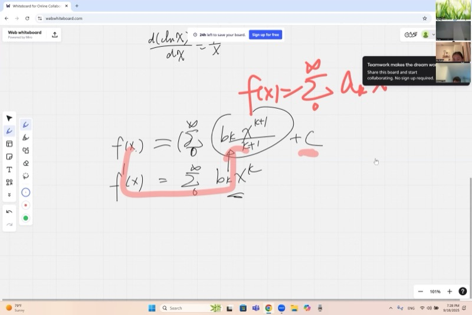
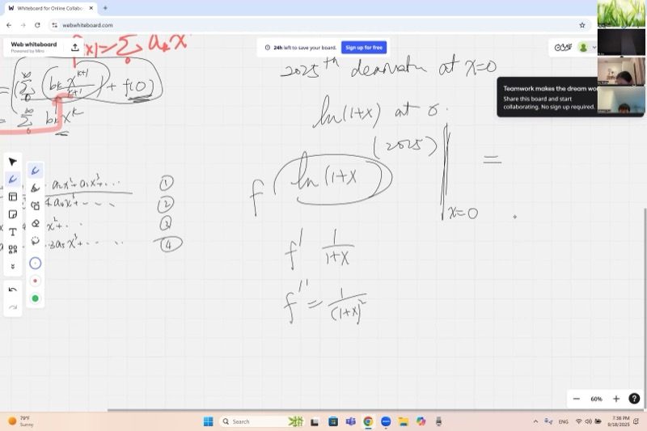

This lesson demonstrates how to determine the 2025th derivative of a function without performing a single differentiation. We derive the power series for $\ln(1+x)$ by integrating a geometric series term by term, then use the Maclaurin coefficient formula to read off derivatives of arbitrary order. We also establish the periodic cycle of higher-order derivatives of sine and cosine.

::: {.callout-tip collapse="true"}
## Motivation

Power series convert complicated functions into infinite polynomials that are amenable to analysis. The function $\ln(1+x)$ arises in numerous contexts:

- **Computer science**: algorithm complexity is often measured using logarithms — the approximation $\ln(1+x) \approx x$ for small $x$ simplifies running-time estimates.
- **Finance**: for small interest rates, $\ln(1+r) \approx r$ provides a useful approximation.
- **Physics**: when measuring small perturbations, $\ln(1+x) \approx x$ greatly simplifies calculations.
- **Engineering**: signal processing employs logarithmic series to analyze audio and radio waves.
- **Biology**: population models use $\ln(1+\text{growth rate})$ to predict species dynamics.

We derive the power series for $\ln(1+x)$ from a geometric series and then apply Maclaurin series to compute high-order derivatives without performing any differentiation.
:::

## Topics Covered

- Derivatives of $\sin x$ and $\cos x$ from Euler's formula
- Periodicity of higher-order derivatives of $\sin x$ and $\cos x$
- Geometric series $\frac{1}{1+x}$ as a power series
- Integrating a power series term by term to get $\ln(1+x)$
- Determining the integration constant by plugging in $x = 0$
- Maclaurin coefficients: if $f(x) = \sum a_k x^k$, then $a_n = \frac{f^{(n)}(0)}{n!}$
- Using Maclaurin expansions to find higher derivatives (e.g., the 2025th derivative of $\ln(1+x)$ at $x = 0$)
- Recognizing derivatives of known functions: $f'(x) = -\frac{1}{1+x}$ matches the derivative of $\ln(1+x)$

## Lecture Video

```{=html}
<video controls width="100%" preload="metadata">
  <source src="https://github.com/ymote/learningcalculus/releases/download/v1.0/calculus20250918.mp4" type="video/mp4">
</video>
```

## Key Frames from the Lecture

```{=html}
<div style="display: flex; flex-direction: column; gap: 10px; margin: 1em 0;">
  
  
  
  
</div>
```


## Prerequisites

::: {.callout-note collapse="true"}
## What is Euler's formula?

**Euler's formula** connects exponentials with trig functions using the imaginary number $i$ (where $i^2 = -1$):

$$e^{i\theta} = \cos\theta + i\sin\theta$$

From this, we can extract $\sin$ and $\cos$ by looking at the power series of $e^{i\theta}$ and separating the real and imaginary parts:

$$\cos\theta = 1 - \frac{\theta^2}{2!} + \frac{\theta^4}{4!} - \frac{\theta^6}{6!} + \cdots$$

$$\sin\theta = \theta - \frac{\theta^3}{3!} + \frac{\theta^5}{5!} - \frac{\theta^7}{7!} + \cdots$$

These power series are what let us differentiate $\sin$ and $\cos$ term by term!
:::

::: {.callout-note collapse="true"}
## What is a geometric series?

A **geometric series** is a sum where each term is a fixed multiple of the previous one:

$$\sum_{k=0}^{\infty} r^k = 1 + r + r^2 + r^3 + \cdots = \frac{1}{1-r} \quad \text{(when } |r| < 1\text{)}$$

For example, with $r = \frac{1}{2}$: $1 + \frac{1}{2} + \frac{1}{4} + \frac{1}{8} + \cdots = 2$.

In this lesson we'll use the substitution $r = -x$ to get a series for $\frac{1}{1+x}$.
:::

::: {.callout-note collapse="true"}
## What is a Maclaurin series?

A **Maclaurin series** expresses a function as an infinite polynomial centered at $x = 0$:

$$f(x) = \sum_{n=0}^{\infty} \frac{f^{(n)}(0)}{n!} x^n = f(0) + f'(0)\,x + \frac{f''(0)}{2!}x^2 + \frac{f'''(0)}{3!}x^3 + \cdots$$

The key insight is that the coefficient of $x^n$ equals $\frac{f^{(n)}(0)}{n!}$. If you already know the power series, you can read off derivatives at zero without differentiating!
:::

::: {.callout-note collapse="true"}
## What is the natural logarithm?

The **natural logarithm** $\ln(x)$ is the inverse of $e^x$. It answers: "what power of $e$ gives $x$?"

Key facts:

- $\ln(1) = 0$ because $e^0 = 1$
- $\ln(e) = 1$ because $e^1 = e$
- $\frac{d}{dx}\ln(x) = \frac{1}{x}$

So $\frac{d}{dx}\ln(1+x) = \frac{1}{1+x}$ by the chain rule.
:::

## Key Concepts

### Derivatives of sin and cos from Euler's Formula

Last time we saw the Maclaurin series for $\sin x$ and $\cos x$. By differentiating those series term by term, we can prove:

::: {.callout-important}
## Key Idea: Derivatives of Sine and Cosine
Differentiating the power series for sine and cosine term by term proves these two fundamental results. Notice the minus sign for cosine -- it shows up because cosine decreases wherever sine is positive.

$$\boxed{\frac{d}{dx}(\sin x) = \cos x} \qquad \boxed{\frac{d}{dx}(\cos x) = -\sin x}$$
:::

**Why the minus sign for cosine?** Differentiate the series for $\cos x$:

$$\cos x = 1 - \frac{x^2}{2!} + \frac{x^4}{4!} - \frac{x^6}{6!} + \cdots$$

$$\frac{d}{dx}(\cos x) = 0 - \frac{2x}{2!} + \frac{4x^3}{4!} - \frac{6x^5}{6!} + \cdots = -x + \frac{x^3}{3!} - \frac{x^5}{5!} + \cdots$$

That's exactly $-\sin x$!

**Explore -- see $\sin x$, $\cos x$, and their derivatives:**

```{=html}
<div id="calc1" class="desmos-container"></div>
<script src="https://www.desmos.com/api/v1.9/calculator.js?apiKey=dcb31709b452b1cf9dc26972add0fda6"></script>
<script>
  var calc1 = Desmos.GraphingCalculator(document.getElementById('calc1'), {
    expressions: true,
    settingsMenu: false
  });
  calc1.setExpression({ id: 'sin', latex: 'y=\\sin(x)', color: '#2d70b3', lineWidth: 3 });
  calc1.setExpression({ id: 'cos', latex: 'y=\\cos(x)', color: '#c74440', lineWidth: 3 });
  calc1.setExpression({ id: 'a', latex: 'a=0', sliderBounds: {min: -6.28, max: 6.28, step: 0.01} });
  calc1.setExpression({ id: 'pt_sin', latex: '(a, \\sin(a))', color: '#2d70b3', pointSize: 10, label: 'sin(a)', showLabel: true });
  calc1.setExpression({ id: 'tangent_sin', latex: 'y - \\sin(a) = \\cos(a)(x - a)', color: '#2d70b3', lineWidth: 1.5, lineStyle: 'DASHED' });
  calc1.setExpression({ id: 'pt_cos', latex: '(a, \\cos(a))', color: '#c74440', pointSize: 10, label: 'cos(a)', showLabel: true });
  calc1.setMathBounds({ left: -7, right: 7, bottom: -2, top: 2 });
</script>
```

*Drag the slider for $a$. The dashed line shows the tangent to $\sin x$ -- its slope is always $\cos(a)$, the height of the red curve!*

### The Derivative Cycle: Higher Derivatives of sin

A notable pattern emerges upon repeated differentiation of $\sin x$:

| Derivative | Result |
|---|---|
| $f(x) = \sin x$ | $\sin x$ |
| $f'(x)$ | $\cos x$ |
| $f''(x)$ | $-\sin x$ |
| $f'''(x)$ | $-\cos x$ |
| $f^{(4)}(x)$ | $\sin x$ |

After **4 derivatives**, we return to $\sin x$. The cycle repeats indefinitely:

$$\sin x \;\to\; \cos x \;\to\; -\sin x \;\to\; -\cos x \;\to\; \sin x \;\to\; \cdots$$

To find the $n$th derivative, one divides $n$ by 4 and examines the remainder:

| Remainder ($n \bmod 4$) | $f^{(n)}(x)$ |
|---|---|
| 0 | $\sin x$ |
| 1 | $\cos x$ |
| 2 | $-\sin x$ |
| 3 | $-\cos x$ |

For example, the 100th derivative of $\sin x$: $100 \div 4 = 25$ remainder $0$, so $f^{(100)}(x) = \sin x$.

### Geometric Series as a Power Series

Recall the geometric series formula:

$$\frac{1}{1-r} = 1 + r + r^2 + r^3 + \cdots \quad \text{for } |r| < 1$$

Now substitute $r = -x$:

$$\frac{1}{1+x} = 1 - x + x^2 - x^3 + x^4 - \cdots = \sum_{k=0}^{\infty} (-1)^k x^k$$

This is valid for $|x| < 1$. We have expressed $\frac{1}{1+x}$ as a power series.

**Explore -- see how partial sums of the series approximate $\frac{1}{1+x}$:**

```{=html}
<div id="calc2" class="desmos-container"></div>
<script>
  var calc2 = Desmos.GraphingCalculator(document.getElementById('calc2'), {
    expressions: true,
    settingsMenu: false
  });
  calc2.setExpression({ id: 'exact', latex: 'y=\\frac{1}{1+x} \\left\\{x > -1\\right\\}', color: '#2d70b3', lineWidth: 3 });
  calc2.setExpression({ id: 'n', latex: 'n=3', sliderBounds: {min: 1, max: 15, step: 1} });
  calc2.setExpression({ id: 'partial', latex: 'y=\\sum_{k=0}^{n} (-1)^k x^k', color: '#c74440', lineWidth: 2, lineStyle: 'DASHED' });
  calc2.setExpression({ id: 'label1', latex: '(0.5, \\frac{1}{1.5})', color: '#2d70b3', pointSize: 0, label: '1/(1+x)', showLabel: true });
  calc2.setExpression({ id: 'label2', latex: '(-0.5, \\sum_{k=0}^{n} (-1)^k (-0.5)^k)', color: '#c74440', pointSize: 0, label: 'partial sum', showLabel: true });
  calc2.setMathBounds({ left: -2, right: 2, bottom: -3, top: 5 });
</script>
```

*Increase $n$ with the slider and watch the red dashed curve match the blue curve better and better -- but only for $|x| < 1$!*

### From Geometric Series to ln(1+x)

The key observation is that $\frac{d}{dx}\ln(1+x) = \frac{1}{1+x}$. Therefore, if we **integrate** the geometric series term by term, we obtain $\ln(1+x)$:

$$\int \frac{1}{1+x}\,dx = \int \left(1 - x + x^2 - x^3 + \cdots\right) dx$$

$$= C + x - \frac{x^2}{2} + \frac{x^3}{3} - \frac{x^4}{4} + \cdots$$

**Determining the constant $C$**: substitute $x = 0$:

$$\ln(1+0) = C + 0 - 0 + 0 - \cdots$$
$$\ln(1) = C$$
$$0 = C$$

So $C = 0$, and we obtain:

::: {.callout-important}
## Key Idea: Power Series for ln(1+x)
By integrating the geometric series for $\frac{1}{1+x}$ term by term, we turn the natural logarithm into an infinite polynomial. This series lets you compute logarithms using only addition, subtraction, and division.

$$\boxed{\ln(1+x) = x - \frac{x^2}{2} + \frac{x^3}{3} - \frac{x^4}{4} + \cdots = \sum_{k=1}^{\infty} \frac{(-1)^{k+1}\, x^k}{k}}$$
:::

This is valid for $-1 < x \le 1$.

**Explore -- see the power series for $\ln(1+x)$ converge:**

```{=html}
<div id="calc3" class="desmos-container"></div>
<script>
  var calc3 = Desmos.GraphingCalculator(document.getElementById('calc3'), {
    expressions: true,
    settingsMenu: false
  });
  calc3.setExpression({ id: 'exact', latex: 'y=\\ln(1+x) \\left\\{x > -1\\right\\}', color: '#2d70b3', lineWidth: 3 });
  calc3.setExpression({ id: 'n', latex: 'n=3', sliderBounds: {min: 1, max: 20, step: 1} });
  calc3.setExpression({ id: 'partial', latex: 'y=\\sum_{k=1}^{n} \\frac{(-1)^{k+1} x^k}{k}', color: '#c74440', lineWidth: 2, lineStyle: 'DASHED' });
  calc3.setExpression({ id: 'label1', latex: '(0.5, \\ln(1.5))', color: '#2d70b3', pointSize: 0, label: 'ln(1+x)', showLabel: true });
  calc3.setMathBounds({ left: -2, right: 2, bottom: -3, top: 2 });
</script>
```

*Increase $n$ and watch the series (red dashed) hug the real $\ln(1+x)$ curve (blue) more closely, especially between $-1$ and $1$.*

### Recognizing Derivatives of Known Functions

Suppose someone gives you a function and tells you $f'(x) = -\frac{1}{1+x}$. How do you find $f(x)$?

We recognize that:

$$\frac{d}{dx}\ln(1+x) = \frac{1}{1+x}$$

So $-\frac{1}{1+x}$ is the derivative of $-\ln(1+x)$. Therefore:

$$f(x) = -\ln(1+x) + C$$

This technique of "working backwards" from a derivative is a preview of integration.

### Matching Maclaurin Coefficients

This is one of the most powerful techniques in the course. If a function has a Maclaurin series:

$$f(x) = a_0 + a_1 x + a_2 x^2 + a_3 x^3 + \cdots$$

then each coefficient is related to a derivative at zero:

::: {.callout-important}
## Key Idea: Reading Off Derivatives from a Power Series
If a function's power series is known, one can immediately determine any derivative at $x = 0$ without performing any differentiation. One reads off the coefficient and multiplies by $n!$.

$$\boxed{a_n = \frac{f^{(n)}(0)}{n!}}$$
:::

This means: **if the power series is known, every derivative at $x = 0$ is determined**. Rearranging:

$$f^{(n)}(0) = n! \cdot a_n$$

### Finding Crazy-High Derivatives Without Differentiating

As an illustration, suppose we seek the **2025th derivative of $\ln(1+x)$ at $x = 0$**.

Differentiating $\ln(1+x)$ two thousand and twenty-five times by hand is impractical. However, we know the power series:

$$\ln(1+x) = x - \frac{x^2}{2} + \frac{x^3}{3} - \frac{x^4}{4} + \cdots$$

The coefficient of $x^n$ is $a_n = \frac{(-1)^{n+1}}{n}$.

Using $f^{(n)}(0) = n! \cdot a_n$:

$$f^{(2025)}(0) = 2025! \cdot \frac{(-1)^{2026}}{2025} = 2025! \cdot \frac{1}{2025} = \frac{2025!}{2025} = 2024!$$

Thus the 2025th derivative of $\ln(1+x)$ at $x = 0$ is $2024!$ — obtained without differentiating even once.

**Why does $(-1)^{2026} = 1$?** Because 2026 is even, and $(-1)^{\text{even}} = 1$.

As another example, the **4th derivative of $\ln(1+x)$ at $x = 0$**:

$$f^{(4)}(0) = 4! \cdot \frac{(-1)^{5}}{4} = 24 \cdot \frac{-1}{4} = -6$$

One may verify this by differentiating $\ln(1+x)$ four times directly — the result is the same.

## Cheat Sheet

::: {.key-formula}
| What you want | Formula |
|---|---|
| Derivative of $\sin x$ | $\frac{d}{dx}(\sin x) = \cos x$ |
| Derivative of $\cos x$ | $\frac{d}{dx}(\cos x) = -\sin x$ |
| Derivative cycle of $\sin$ | $\sin \to \cos \to -\sin \to -\cos \to \sin$ (period 4) |
| Geometric series | $\frac{1}{1+x} = \displaystyle\sum_{k=0}^{\infty} (-1)^k x^k = 1 - x + x^2 - x^3 + \cdots$ |
| Power series for $\ln(1+x)$ | $\ln(1+x) = \displaystyle\sum_{k=1}^{\infty} \frac{(-1)^{k+1} x^k}{k} = x - \frac{x^2}{2} + \frac{x^3}{3} - \cdots$ |
| Maclaurin coefficient formula | $a_n = \frac{f^{(n)}(0)}{n!}$, so $f^{(n)}(0) = n!\cdot a_n$ |
| Integration constant trick | Plug in $x = 0$ after integrating to find $C$ |

### The Big Chain of Ideas

$$\frac{1}{1+x} \;\xrightarrow{\text{integrate}}\; \ln(1+x) \;\xrightarrow{\text{read off } a_n}\; \frac{(-1)^{n+1}}{n} \;\xrightarrow{\;n!\cdot a_n\;}\; f^{(n)}(0)$$
:::
