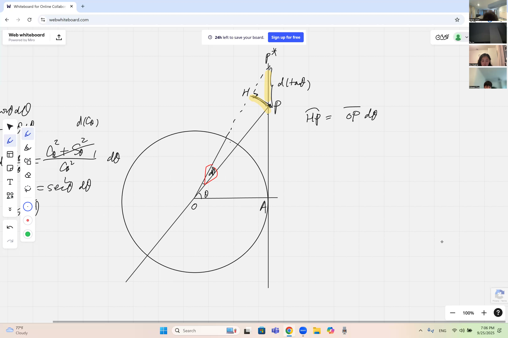
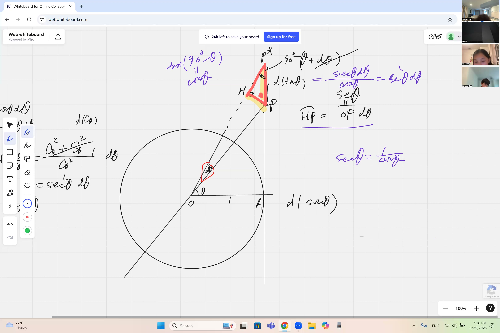
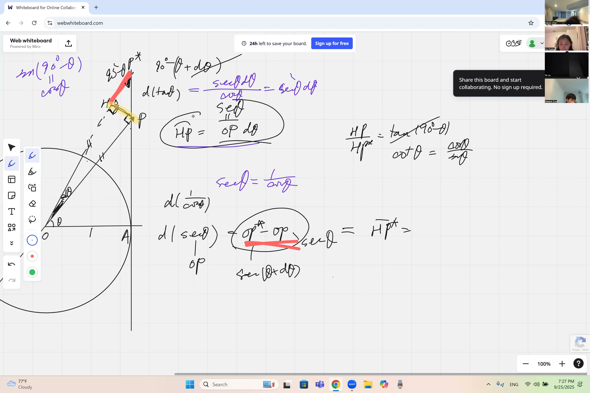
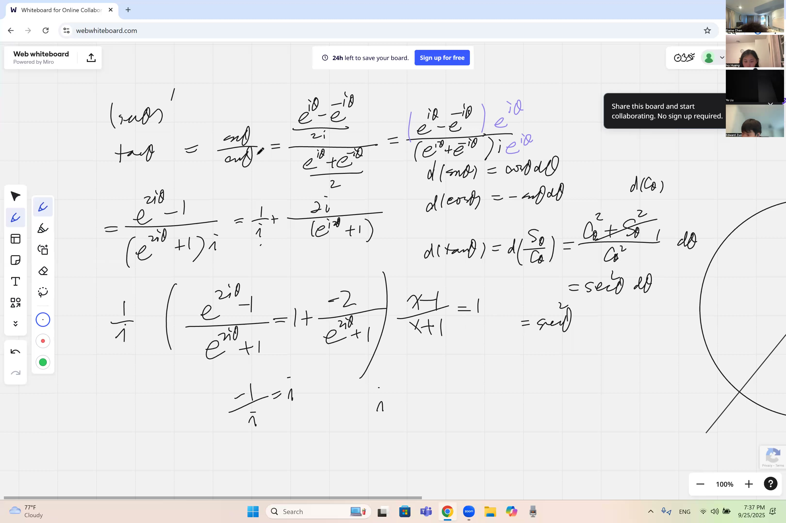

This lesson derives the derivatives of tangent and secant — two trigonometric functions that exhibit unbounded growth near their vertical asymptotes. We establish these results through three independent methods: algebraic computation via the quotient rule, geometric reasoning on the unit circle, and complex exponential techniques. All three approaches yield the same formulas.

::: {.callout-tip collapse="true"}
## Motivation

The tangent and secant functions arise in contexts involving slopes and angular dependence:

- **Navigation**: GPS systems use tangent functions to convert between angles and distances — their derivatives enable real-time course corrections.
- **Architecture**: the slope of a roof is a tangent ratio — the derivative quantifies the sensitivity of the slope to changes in angle.
- **Optics**: lenses bend light at angles described by tangent — understanding how rapidly that angle changes is essential to camera and telescope design.
- **Mechanical engineering**: at steep track sections, the tangent grows rapidly — its derivative ($\sec^2$) quantifies how fast the slope is increasing.

Given the derivatives of sine and cosine, the derivatives of tangent and secant follow — and we establish them by three distinct methods.
:::

## Topics Covered

- Derivative of $\tan\theta = \sec^2\theta$ via the quotient rule
- Graphical differentiation of trig functions on the unit circle (arc $\approx$ chord for small angles)
- Derivative of $\sec\theta = \sec\theta\cdot\tan\theta$ via similar triangles
- Complex exponential approach: writing $\tan\theta$ in terms of $e^{i\theta}$
- Long division and simplification of complex exponential expressions
- Power expansion for differentials: plugging in $\theta + d\theta$ and keeping first-order infinitesimals

## Lecture Video

```{=html}
<video controls width="100%" preload="metadata">
  <source src="https://github.com/ymote/learningcalculus/releases/download/v1.0/calculus20250925.mp4" type="video/mp4">
</video>
```

## Key Frames from the Lecture

```{=html}
<div style="display: flex; flex-direction: column; gap: 10px; margin: 1em 0;">
  
  
  
  
</div>
```


## Prerequisites

::: {.callout-note collapse="true"}
## What are tangent and secant?

**Tangent** is the ratio of sine to cosine:

$$\tan\theta = \frac{\sin\theta}{\cos\theta}$$

**Secant** is the reciprocal of cosine:

$$\sec\theta = \frac{1}{\cos\theta}$$

On the unit circle, $\tan\theta$ is the length of the vertical segment from the x-axis to where the radius line hits the vertical tangent line at $(1, 0)$. Secant is the distance from the origin to that same intersection point.
:::

::: {.callout-note collapse="true"}
## What is the quotient rule?

The **quotient rule** tells you how to differentiate a fraction of two functions:

$$\frac{d}{dx}\left(\frac{f(x)}{g(x)}\right) = \frac{f'(x)\,g(x) - f(x)\,g'(x)}{[g(x)]^2}$$

A handy mnemonic: "low d-high minus high d-low, over the square of what's below."

We already know $\frac{d}{dx}(\sin x) = \cos x$ and $\frac{d}{dx}(\cos x) = -\sin x$, so we have everything we need to differentiate $\frac{\sin x}{\cos x}$.
:::

::: {.callout-note collapse="true"}
## What are complex exponentials?

Using Euler's formula $e^{i\theta} = \cos\theta + i\sin\theta$, we can write sine and cosine as:

$$\sin\theta = \frac{e^{i\theta} - e^{-i\theta}}{2i}, \qquad \cos\theta = \frac{e^{i\theta} + e^{-i\theta}}{2}$$

This means we can also write tangent as a ratio of exponentials:

$$\tan\theta = \frac{e^{i\theta} - e^{-i\theta}}{i(e^{i\theta} + e^{-i\theta})}$$

Complex exponentials are powerful because the derivative of $e^{i\theta}$ is simply $ie^{i\theta}$ — no sign-flipping to remember!
:::

::: {.callout-note collapse="true"}
## What does "arc equals chord" mean for small angles?

When a point moves along the unit circle by a tiny angle $d\theta$, it traces out a small **arc** of length $d\theta$.

For very small angles, that curved arc is practically indistinguishable from the straight-line **chord** connecting the two endpoints. This is the key geometric idea:

$$\text{arc} \approx \text{chord} \quad \text{when } d\theta \text{ is small}$$

This approximation is what makes geometric proofs of trig derivatives work.
:::

::: {.callout-note collapse="true"}
## What are similar triangles?

Two triangles are **similar** if they have the same angles (same shape, possibly different size). When triangles are similar, the ratios of corresponding sides are equal:

$$\frac{a_1}{a_2} = \frac{b_1}{b_2} = \frac{c_1}{c_2}$$

In this lesson, we use similar triangles that appear on the unit circle when we nudge an angle by $d\theta$. The tiny triangle formed by the infinitesimal change is similar to the big triangle formed by the secant and tangent lines.
:::

## Key Concepts

### Derivative of $\tan\theta$ via the Quotient Rule

Since $\tan\theta = \frac{\sin\theta}{\cos\theta}$, we apply the quotient rule with $f(\theta) = \sin\theta$ and $g(\theta) = \cos\theta$:

$$\frac{d}{d\theta}(\tan\theta) = \frac{\cos\theta \cdot \cos\theta - \sin\theta \cdot (-\sin\theta)}{\cos^2\theta}$$

$$= \frac{\cos^2\theta + \sin^2\theta}{\cos^2\theta} = \frac{1}{\cos^2\theta}$$

::: {.callout-important}
## Key Idea: Derivative of Tangent
The derivative of tangent is secant squared. This follows from the quotient rule on sin/cos, with the Pythagorean identity doing all the heavy lifting to simplify the numerator to 1.

$$\boxed{\frac{d}{d\theta}(\tan\theta) = \sec^2\theta}$$
:::

**Explore -- see $\tan\theta$ and its derivative $\sec^2\theta$:**

```{=html}
<div id="calc1" class="desmos-container"></div>
<script src="https://www.desmos.com/api/v1.9/calculator.js?apiKey=dcb31709b452b1cf9dc26972add0fda6"></script>
<script>
  var calc1 = Desmos.GraphingCalculator(document.getElementById('calc1'), {
    expressions: true,
    settingsMenu: false
  });
  calc1.setExpression({ id: 'tan', latex: 'y=\\tan(x)', color: '#2d70b3', lineWidth: 3 });
  calc1.setExpression({ id: 'sec2', latex: 'y=\\sec(x)^2', color: '#c74440', lineWidth: 2, lineStyle: 'DASHED' });
  calc1.setExpression({ id: 'a', latex: 'a=0.5', sliderBounds: {min: -1.5, max: 1.5, step: 0.01} });
  calc1.setExpression({ id: 'pt_tan', latex: '(a, \\tan(a))', color: '#2d70b3', pointSize: 10, label: 'tan(a)', showLabel: true });
  calc1.setExpression({ id: 'tangent_line', latex: 'y - \\tan(a) = \\sec(a)^2 (x - a)', color: '#388c46', lineWidth: 1.5, lineStyle: 'DASHED' });
  calc1.setExpression({ id: 'pt_sec2', latex: '(a, \\sec(a)^2)', color: '#c74440', pointSize: 10, label: 'sec^2(a)', showLabel: true });
  calc1.setMathBounds({ left: -5, right: 5, bottom: -8, top: 8 });
</script>
```

*Drag the slider for $a$. The green dashed line is tangent to $\tan x$ (blue), and its slope always equals $\sec^2(a)$ (red dashed curve). Observe that the slope is always at least 1 — $\tan x$ is always increasing.*

### Graphical Derivation on the Unit Circle

Instead of algebra, we can derive $\frac{d}{d\theta}(\tan\theta) = \sec^2\theta$ using a picture.

On the unit circle, draw the radius at angle $\theta$ and extend it until it hits the vertical tangent line at $x = 1$. The vertical intercept on that line has height $\tan\theta$, and the distance from the origin to the intercept point is $\sec\theta$.

Now nudge $\theta$ by a tiny amount $d\theta$:

1. The radius rotates by $d\theta$, sweeping the intercept point upward along the tangent line
2. The tiny triangle formed at the intercept point is **similar** to the big triangle with sides $1$, $\tan\theta$, and $\sec\theta$
3. The small displacement along the tangent line is $\sec^2\theta \cdot d\theta$
4. This displacement equals $d(\tan\theta)$

So $\frac{d(\tan\theta)}{d\theta} = \sec^2\theta$ — the same answer, straight from the geometry!

**Explore -- see the unit circle construction for $\tan\theta$ and $\sec\theta$:**

```{=html}
<div id="calc2" class="desmos-container"></div>
<script>
  var calc2 = Desmos.GraphingCalculator(document.getElementById('calc2'), {
    expressions: true,
    settingsMenu: false
  });
  calc2.setExpression({ id: 'circle', latex: 'x^2+y^2=1', color: '#aaaaaa' });
  calc2.setExpression({ id: 'theta', latex: '\\theta=0.7', sliderBounds: {min: -1.4, max: 1.4, step: 0.01} });
  calc2.setExpression({ id: 'tangent_line_vert', latex: 'x=1', color: '#aaaaaa', lineStyle: 'DASHED' });
  calc2.setExpression({ id: 'radius', latex: 'y=x\\tan(\\theta) \\left\\{0 \\le x \\le \\frac{1}{\\cos(\\theta)}\\right\\}', color: '#2d70b3', lineWidth: 2 });
  calc2.setExpression({ id: 'pt_circle', latex: '(\\cos\\theta, \\sin\\theta)', color: '#2d70b3', pointSize: 10, label: '(cos θ, sin θ)', showLabel: true });
  calc2.setExpression({ id: 'pt_tan', latex: '(1, \\tan\\theta)', color: '#c74440', pointSize: 10, label: 'tan θ', showLabel: true });
  calc2.setExpression({ id: 'tan_seg', latex: '(1, t)', color: '#c74440', lineWidth: 3, parametricDomain: {min: '0', max: '\\tan(\\theta)'} });
  calc2.setExpression({ id: 'sec_label', latex: '(0.5/\\cos(\\theta), 0.5\\tan(\\theta))', color: '#6042a6', pointSize: 0, label: 'sec θ', showLabel: true });
  calc2.setMathBounds({ left: -1.5, right: 2.5, bottom: -2, top: 2 });
</script>
```

*Drag $\theta$ and observe the tangent height (red segment) and the secant length (purple label). Note the rapid growth of $\tan\theta$ as $\theta$ approaches $\pm\frac{\pi}{2}$.*

### Derivative of $\sec\theta$ via Similar Triangles

We seek $\frac{d}{d\theta}(\sec\theta)$. Using the same unit circle construction:

$\sec\theta$ is the distance from the origin to the point $(1, \tan\theta)$ on the vertical tangent line.

When $\theta$ increases by $d\theta$, the intercept point moves along the tangent line. The tiny triangle formed is similar to the original right triangle with legs $1$ and $\tan\theta$ and hypotenuse $\sec\theta$.

By similar triangles, the change in the hypotenuse (which is $d(\sec\theta)$) satisfies:

$$\frac{d(\sec\theta)}{\sec\theta \cdot d\theta} = \frac{\sec\theta}{1} \cdot \frac{\tan\theta}{\sec\theta}$$

Working this out:

$$d(\sec\theta) = \sec\theta \cdot \tan\theta \cdot d\theta$$

::: {.callout-important}
## Key Idea: Derivative of Secant
The derivative of secant is secant times tangent. You can prove this geometrically using similar triangles on the unit circle, or algebraically using the chain rule on $(\cos\theta)^{-1}$.

$$\boxed{\frac{d}{d\theta}(\sec\theta) = \sec\theta \cdot \tan\theta}$$
:::

::: {.callout-tip collapse="true"}
## Remark: Algebraic verification

We can verify this using the chain rule on $\sec\theta = (\cos\theta)^{-1}$:

$$\frac{d}{d\theta}(\cos\theta)^{-1} = -1 \cdot (\cos\theta)^{-2} \cdot (-\sin\theta) = \frac{\sin\theta}{\cos^2\theta} = \frac{1}{\cos\theta} \cdot \frac{\sin\theta}{\cos\theta} = \sec\theta \cdot \tan\theta \;\checkmark$$
:::

### Complex Exponential Approach to $\frac{d}{d\theta}(\tan\theta)$

An alternative algebraic method proceeds by expressing tangent via Euler's formula:

$$\tan\theta = \frac{e^{i\theta} - e^{-i\theta}}{i(e^{i\theta} + e^{-i\theta})}$$

To differentiate, we can use the quotient rule on this expression. Let $u = e^{i\theta} - e^{-i\theta}$ and $v = i(e^{i\theta} + e^{-i\theta})$. Then:

$$u' = ie^{i\theta} + ie^{-i\theta} = i(e^{i\theta} + e^{-i\theta})$$

$$v' = i(ie^{i\theta} - ie^{-i\theta}) = i^2(e^{i\theta} - e^{-i\theta}) = -(e^{i\theta} - e^{-i\theta})$$

By the quotient rule:

$$\frac{d}{d\theta}(\tan\theta) = \frac{u'v - uv'}{v^2}$$

$$= \frac{i(e^{i\theta}+e^{-i\theta}) \cdot i(e^{i\theta}+e^{-i\theta}) - (e^{i\theta}-e^{-i\theta}) \cdot [-(e^{i\theta}-e^{-i\theta})]}{[i(e^{i\theta}+e^{-i\theta})]^2}$$

The numerator becomes:

$$i^2(e^{i\theta}+e^{-i\theta})^2 + (e^{i\theta}-e^{-i\theta})^2$$

$$= -(e^{i\theta}+e^{-i\theta})^2 + (e^{i\theta}-e^{-i\theta})^2$$

Expanding both squares:

$$= -(e^{2i\theta} + 2 + e^{-2i\theta}) + (e^{2i\theta} - 2 + e^{-2i\theta}) = -4$$

The denominator is:

$$-\left(e^{i\theta}+e^{-i\theta}\right)^2 = -(2\cos\theta)^2 = -4\cos^2\theta$$

So:

$$\frac{d}{d\theta}(\tan\theta) = \frac{-4}{-4\cos^2\theta} = \frac{1}{\cos^2\theta} = \sec^2\theta \;\checkmark$$

Three completely different methods — quotient rule, geometry, and complex exponentials — all give $\sec^2\theta$.

### Long Division with Complex Exponentials

When working with expressions like $\frac{e^{i\theta} - e^{-i\theta}}{e^{i\theta} + e^{-i\theta}}$, you can simplify by dividing numerator and denominator by $e^{-i\theta}$:

$$\frac{e^{i\theta} - e^{-i\theta}}{e^{i\theta} + e^{-i\theta}} = \frac{e^{2i\theta} - 1}{e^{2i\theta} + 1}$$

One may also let $w = e^{i\theta}$ to convert everything into a clean polynomial-style fraction:

$$\tan\theta = \frac{w^2 - 1}{i(w^2 + 1)} \quad \text{where } w = e^{i\theta}$$

This substitution simplifies the quotient rule computation and reduces the likelihood of errors. The key technique is **choosing a good substitution** to simplify the algebra before differentiating.

### Power Expansion for Differentials

Another approach is to substitute $\theta + d\theta$ directly into the function and retain only first-order terms (discarding anything with $(d\theta)^2$ or higher):

For $\tan(\theta + d\theta)$, recall that:

$$e^{i(\theta+d\theta)} = e^{i\theta} \cdot e^{i\,d\theta} \approx e^{i\theta}(1 + i\,d\theta)$$

since $e^{i\,d\theta} \approx 1 + i\,d\theta$ when $d\theta$ is infinitesimally small. Substituting into the tangent formula:

$$\tan(\theta + d\theta) \approx \frac{e^{i\theta}(1+i\,d\theta) - e^{-i\theta}(1-i\,d\theta)}{i\left[e^{i\theta}(1+i\,d\theta) + e^{-i\theta}(1-i\,d\theta)\right]}$$

Expanding the numerator:

$$(e^{i\theta} - e^{-i\theta}) + i\,d\theta\,(e^{i\theta} + e^{-i\theta})$$

Expanding the denominator:

$$i\left[(e^{i\theta} + e^{-i\theta}) + i\,d\theta\,(e^{i\theta} - e^{-i\theta})\right]$$

After careful algebra (dividing and discarding second-order terms), the result is:

$$\tan(\theta + d\theta) - \tan\theta = \sec^2\theta \cdot d\theta$$

This "infinitesimal substitution" method is quite explicit: one sees exactly where each component of the derivative originates.

::: {.callout-tip collapse="true"}
## Justification for discarding $(d\theta)^2$

An infinitesimal $d\theta$ is regarded as so small that its square is negligible. More precisely, when one takes the limit as $d\theta \to 0$ in $\frac{\Delta f}{d\theta}$, any term with $(d\theta)^2$ in the numerator contributes $0$ after division by $d\theta$. Therefore, only first-order terms need to be retained — all higher-order terms vanish.
:::

**Explore -- compare $\tan(x)$ with its linear approximation at a point:**

```{=html}
<div id="calc3" class="desmos-container"></div>
<script>
  var calc3 = Desmos.GraphingCalculator(document.getElementById('calc3'), {
    expressions: true,
    settingsMenu: false
  });
  calc3.setExpression({ id: 'tan', latex: 'y=\\tan(x)', color: '#2d70b3', lineWidth: 3 });
  calc3.setExpression({ id: 'a', latex: 'a=0', sliderBounds: {min: -1.4, max: 1.4, step: 0.01} });
  calc3.setExpression({ id: 'approx', latex: 'y=\\tan(a)+\\sec(a)^2(x-a)', color: '#fa7e19', lineWidth: 2 });
  calc3.setExpression({ id: 'pt', latex: '(a, \\tan(a))', color: '#2d70b3', pointSize: 10, label: 'Point of tangency', showLabel: true });
  calc3.setExpression({ id: 'sec', latex: 'y=\\sec(x)', color: '#388c46', lineWidth: 2, lineStyle: 'DASHED' });
  calc3.setExpression({ id: 'sec_neg', latex: 'y=-\\sec(x)', color: '#388c46', lineWidth: 2, lineStyle: 'DASHED' });
  calc3.setMathBounds({ left: -5, right: 5, bottom: -8, top: 8 });
</script>
```

*Drag $a$ and see how the orange tangent line (slope $= \sec^2 a$) hugs the blue curve near the point. The green dashed curves are $\pm\sec x$ — they form the "envelope" that $\tan x$ bounces between.*

## Cheat Sheet

::: {.key-formula}
| Formula | How to remember it |
|---|---|
| $\dfrac{d}{d\theta}(\tan\theta) = \sec^2\theta$ | Quotient rule on $\frac{\sin}{\cos}$, then Pythagorean identity |
| $\dfrac{d}{d\theta}(\sec\theta) = \sec\theta\cdot\tan\theta$ | Chain rule on $(\cos\theta)^{-1}$, or similar triangles |
| $\tan\theta = \dfrac{\sin\theta}{\cos\theta}$ | SOH/CAH: opposite over adjacent |
| $\sec\theta = \dfrac{1}{\cos\theta}$ | "Secant" = reciprocal of cosine |
| $\sin^2\theta + \cos^2\theta = 1$ | The Pythagorean identity — the engine behind $\sec^2\theta$ |
| $1 + \tan^2\theta = \sec^2\theta$ | Divide the Pythagorean identity by $\cos^2\theta$ |

### Complex Exponential Forms

$$\tan\theta = \frac{e^{i\theta} - e^{-i\theta}}{i(e^{i\theta} + e^{-i\theta})}$$

### All Six Trig Derivatives (So Far)

$$\frac{d}{d\theta}(\sin\theta) = \cos\theta \qquad \frac{d}{d\theta}(\cos\theta) = -\sin\theta$$

$$\frac{d}{d\theta}(\tan\theta) = \sec^2\theta \qquad \frac{d}{d\theta}(\sec\theta) = \sec\theta\tan\theta$$

### The Infinitesimal Trick

To find the derivative of $f(\theta)$:

1. Compute $f(\theta + d\theta)$ using $e^{i\,d\theta} \approx 1 + i\,d\theta$
2. Subtract $f(\theta)$
3. Keep only terms with one factor of $d\theta$
4. Divide by $d\theta$ — the result is the derivative.
:::
