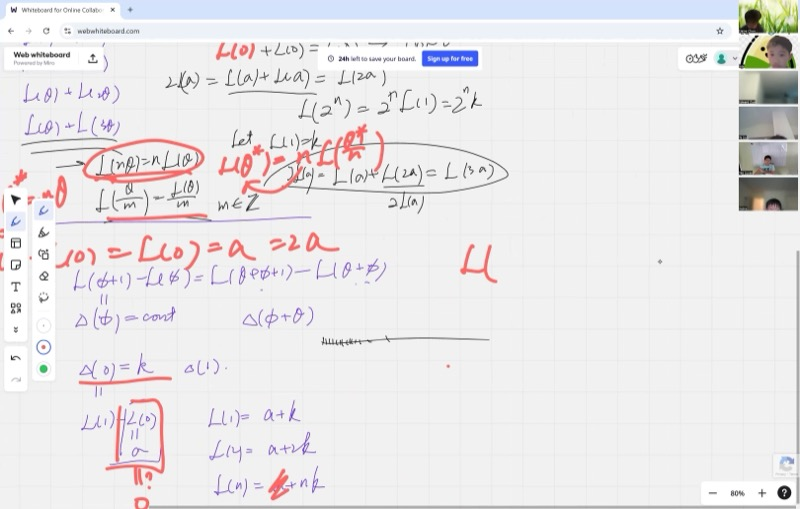
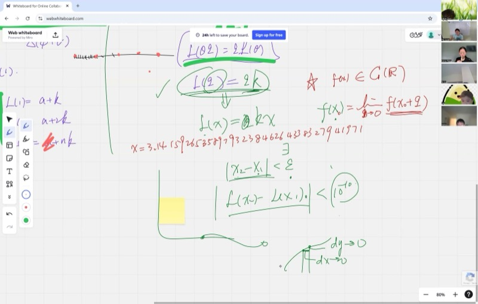
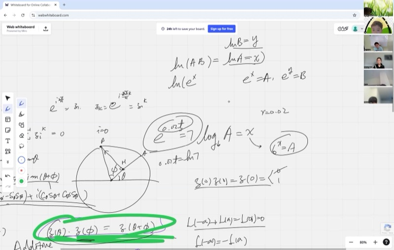

Today's lesson reveals one of the most beautiful equations in all of mathematics -- Euler's formula. It connects three seemingly unrelated ideas (exponentials, trig, and imaginary numbers) into one elegant package. We'll get there by asking a surprisingly simple question: "What kind of function turns addition into multiplication?" The answer leads us straight to $e^{i\theta} = \cos\theta + i\sin\theta$, and along the way you'll see why logarithms are the secret bridge between two worlds.

::: {.callout-tip collapse="true"}
## Why Euler's Formula & Functional Equations Matter

Euler's formula connects exponentials, trigonometry, and complex numbers in one elegant equation -- and functional equations let us reverse-engineer what a function must be from its behavior alone:

- **Electrical engineering**: AC circuits use $e^{i\omega t}$ to represent oscillating voltages and currents -- Euler's formula is the reason engineers can treat sine waves as exponentials
- **Signal processing**: MP3 compression and noise-canceling headphones rely on the Fourier transform, which is built directly on $e^{i\theta}$
- **Cryptography**: modern encryption algorithms use properties of exponential and logarithmic functions over number fields -- the same functional equation ideas at work
- **Physics**: quantum mechanics writes the state of every particle using complex exponentials; Euler's formula is the bridge between waves and algebra
- **Finance**: continuously compounded interest is modeled by $e^{rt}$, and logarithms let you solve for how long it takes your money to grow to a target
:::

## Topics Covered

- Functional equations: what kind of function satisfies $L(\theta + \phi) = L(\theta) + L(\phi)$?
- Proof that continuous additive functions must be $L(\theta) = k\theta$
- Multiplicative functions: $Z(\theta)\cdot Z(\phi) = Z(\theta + \phi)$
- Connecting multiplicative and additive functions via the logarithm
- Proving $e^{i\theta} = \cos\theta + i\sin\theta$ (Euler's formula)
- Logarithm identities: $\ln(ab) = \ln a + \ln b$
- Infinitesimal power expansion and identifying the constant $k = i$

## Lecture Video

```{=html}
<video controls width="100%" preload="metadata">
  <source src="https://github.com/ymote/learningcalculus/releases/download/v1.0/calculus20250929.mp4" type="video/mp4">
</video>
```

## Key Frames from the Lecture

```{=html}
<div style="display: grid; grid-template-columns: 1fr 1fr 1fr 1fr; gap: 10px; margin: 1em 0;">
  
  
  
  
</div>
```


## What You Need to Know First

::: {.callout-note collapse="true"}
## What is a functional equation?

A **functional equation** is an equation where the unknown is a function rather than a number. Instead of asking "find $x$ such that $2x + 3 = 7$," you ask "find a function $f$ such that $f(a + b) = f(a) + f(b)$ for all $a$ and $b$."

The strategy is usually:

1. Plug in clever special values (like $0$, or $a = b$)
2. Build up from integers to rationals to all reals
3. Use extra conditions (like continuity) to pin down the answer
:::

::: {.callout-note collapse="true"}
## What is continuity?

A function $f(x)$ is **continuous** if small changes in the input produce small changes in the output -- no jumps, no holes, no teleporting.

Formally, $f$ is continuous at $x_0$ if:

$$f(x_0) = \lim_{h \to 0} f(x_0 + h)$$

This means: for any desired closeness $\delta$ in the output, you can find a small enough window $\epsilon$ around $x_0$ so that all inputs in that window give outputs within $\delta$ of $f(x_0)$.

Graphically, you can draw the function without lifting your pencil.
:::

::: {.callout-note collapse="true"}
## What is a logarithm?

If $b^x = a$, then $x = \log_b(a)$. The logarithm answers the question: "what exponent do I put on $b$ to get $a$?"

The **natural logarithm** $\ln$ uses base $e \approx 2.718$:

$$\ln(a) = x \quad \Longleftrightarrow \quad e^x = a$$

Key property: logarithms turn multiplication into addition:

$$\ln(ab) = \ln a + \ln b$$

This is exactly what makes logarithms the bridge between multiplicative and additive functions.
:::

::: {.callout-note collapse="true"}
## What are complex numbers on the unit circle?

A complex number $z = x + iy$ can be plotted as the point $(x, y)$ in the plane. If $|z| = 1$, it lies on the **unit circle**, and we can write:

$$z = \cos\theta + i\sin\theta$$

where $\theta$ is the angle from the positive $x$-axis. Multiplying two unit complex numbers **adds their angles**:

$$(\cos\alpha + i\sin\alpha)(\cos\beta + i\sin\beta) = \cos(\alpha + \beta) + i\sin(\alpha + \beta)$$

This multiplication-to-addition connection is the starting point for today's proof.
:::

::: {.callout-note collapse="true"}
## What is the power series for $e^x$?

From the study of continuously compounded interest and binomial expansion, we showed:

$$e^x = \sum_{n=0}^{\infty} \frac{x^n}{n!} = 1 + x + \frac{x^2}{2!} + \frac{x^3}{3!} + \cdots$$

When $x$ is very small (infinitesimal), only the first few terms matter:

$$e^x \approx 1 + x \quad \text{(for small } x\text{)}$$

This approximation is the key to finding the constant $k$ at the end of the proof.
:::

## Key Concepts

### The Angle-Addition Formula as a Functional Equation

On the unit circle, define $Z(\theta) = \cos\theta + i\sin\theta$ as the unit complex number at angle $\theta$. From the cosine and sine addition formulas (proven geometrically by dropping altitudes on the unit circle):

$$\cos(\theta + \phi) = \cos\theta\cos\phi - \sin\theta\sin\phi$$
$$\sin(\theta + \phi) = \cos\theta\sin\phi + \sin\theta\cos\phi$$

we can verify that multiplying two unit complex numbers gives:

$$Z(\theta) \cdot Z(\phi) = (\cos\theta + i\sin\theta)(\cos\phi + i\sin\phi) = \cos(\theta+\phi) + i\sin(\theta+\phi) = Z(\theta + \phi)$$

So $Z$ satisfies the **multiplicative functional equation**:

::: {.callout-important}
## Key Idea: The Multiplicative Functional Equation
When you multiply two unit complex numbers, their angles add. This means the function $Z(\theta) = \cos\theta + i\sin\theta$ turns addition of angles into multiplication of numbers -- a property that will force $Z$ to be an exponential.

$$\boxed{Z(\theta) \cdot Z(\phi) = Z(\theta + \phi)}$$
:::

This is the property we will use to prove that $Z(\theta) = e^{i\theta}$.

### Step 1: Additive Functions -- $L(a + b) = L(a) + L(b)$

Before tackling the multiplicative equation, we prove a foundational result: if a continuous function $L$ satisfies

$$L(\theta + \phi) = L(\theta) + L(\phi) \quad \text{for all } \theta, \phi \in \mathbb{R}$$

then $L(\theta) = k\theta$ for some constant $k$.

**Finding $L(0)$:** Set $\theta = \phi = 0$:

$$L(0) + L(0) = L(0) \implies 2L(0) = L(0) \implies L(0) = 0$$

**Building up to integers:** Set $\phi = \theta$:

$$L(\theta) + L(\theta) = L(2\theta) \implies L(2\theta) = 2L(\theta)$$

Repeating, $L(3\theta) = L(2\theta) + L(\theta) = 3L(\theta)$, and by induction:

$$L(n\theta) = nL(\theta) \quad \text{for all positive integers } n$$

**Odd function:** Set $\phi = -\theta$:

$$L(\theta) + L(-\theta) = L(0) = 0 \implies L(-\theta) = -L(\theta)$$

So $L(n\theta) = nL(\theta)$ holds for all integers $n$ (positive, negative, and zero).

**Explore -- see that additive continuous functions are lines through the origin:**

::: {.desmos-container}
```{=html}
<div id="calc-additive" style="width: 100%; height: 400px;"></div>
<script src="https://www.desmos.com/api/v1.9/calculator.js?apiKey=dcb31709b452b1cf9dc26972add0fda6"></script>
<script>
  var calcAdd = Desmos.GraphingCalculator(document.getElementById('calc-additive'), {
    expressions: true,
    settingsMenu: false
  });
  calcAdd.setExpression({ id: 'k', latex: 'k=2', sliderBounds: {min: -5, max: 5, step: 0.1} });
  calcAdd.setExpression({ id: 'line', latex: 'y=kx', color: '#2d70b3', lineWidth: 3 });
  calcAdd.setExpression({ id: 'pt1', latex: '(1, k)', color: '#c74440', pointSize: 10, label: 'L(1) = k', showLabel: true });
  calcAdd.setExpression({ id: 'pt2', latex: '(2, 2k)', color: '#c74440', pointSize: 10, label: 'L(2) = 2k', showLabel: true });
  calcAdd.setExpression({ id: 'pt3', latex: '(3, 3k)', color: '#c74440', pointSize: 10, label: 'L(3) = 3k', showLabel: true });
  calcAdd.setMathBounds({ left: -6, right: 6, bottom: -12, top: 12 });
</script>
```
:::

*Drag the slider $k$ to change the slope. Every continuous additive function is a line through the origin -- the only freedom is the slope $k = L(1)$.*

### Step 2: Extending to Rational Numbers

We proved $L(n\theta) = nL(\theta)$ for integer $n$. Now substitute $\theta^* = n\theta$, so $\theta = \theta^*/n$:

$$L(\theta^*) = nL\!\left(\frac{\theta^*}{n}\right) \implies L\!\left(\frac{\theta}{n}\right) = \frac{L(\theta)}{n}$$

Combining both results, for any integers $n$ and $m$ (with $m \neq 0$):

$$L\!\left(\frac{n}{m}\,\theta\right) = \frac{n}{m}\,L(\theta)$$

Setting $\theta = 1$ and writing $q = n/m$:

$$L(q) = qL(1) = kq \quad \text{for every rational number } q$$

### Step 3: Using Continuity to Reach All Real Numbers

Rational numbers are **dense** in the real line: for any real number $x$, there is a sequence of rationals $q_1, q_2, q_3, \ldots$ approaching $x$. For example, the truncated decimal expansions $3, 3.1, 3.14, 3.141, \ldots$ approach $\pi$.

Since $L$ is continuous and $L(q_n) = kq_n$ for each rational approximation:

$$L(x) = \lim_{n\to\infty} L(q_n) = \lim_{n\to\infty} kq_n = k \cdot \lim_{n\to\infty} q_n = kx$$

$$\boxed{L(\theta) = k\theta \quad \text{for all real } \theta}$$

This is the power of continuity: once you know a function's values on the rationals, and it has no jumps, you know it everywhere.

### Step 4: From Multiplicative to Additive via Logarithm

Now return to the unit complex number $Z(\theta)$ satisfying $Z(\theta)\cdot Z(\phi) = Z(\theta + \phi)$.

Define a new function $f(\theta) = \ln Z(\theta)$. Using the logarithm identity $\ln(ab) = \ln a + \ln b$:

$$f(\theta) + f(\phi) = \ln Z(\theta) + \ln Z(\phi) = \ln\!\big(Z(\theta) \cdot Z(\phi)\big) = \ln Z(\theta + \phi) = f(\theta + \phi)$$

The logarithm converts the **multiplicative** equation into an **additive** one! Since $Z$ is continuous (it traces a smooth curve on the unit circle) and $\ln$ is continuous, $f$ is also continuous. By our theorem from Steps 1--3:

$$f(\theta) = k\theta \implies \ln Z(\theta) = k\theta$$

Exponentiating both sides:

$$\boxed{Z(\theta) = e^{k\theta}}$$

**Explore -- see $e^{k\theta}$ for different values of $k$:**

::: {.desmos-container}
```{=html}
<div id="calc-exp" style="width: 100%; height: 400px;"></div>
<script>
  var calcExp = Desmos.GraphingCalculator(document.getElementById('calc-exp'), {
    expressions: true,
    settingsMenu: false
  });
  calcExp.setExpression({ id: 'k', latex: 'k=1', sliderBounds: {min: 0.1, max: 5, step: 0.1} });
  calcExp.setExpression({ id: 'exp', latex: 'y=e^{kx}', color: '#2d70b3', lineWidth: 3 });
  calcExp.setExpression({ id: 'pt0', latex: '(0, 1)', color: '#c74440', pointSize: 10, label: 'Z(0) = 1', showLabel: true });
  calcExp.setExpression({ id: 'pt1', latex: '(1, e^{k})', color: '#388c46', pointSize: 10, label: 'Z(1) = e^k', showLabel: true });
  calcExp.setMathBounds({ left: -3, right: 3, bottom: -1, top: 10 });
</script>
```
:::

*Drag the slider $k$ to see how the exponential stretches or compresses. The function always passes through $(0, 1)$ because $Z(0) = e^0 = 1$.*

::: {.callout-tip collapse="true"}
## Why does $\ln(ab) = \ln a + \ln b$?

Set $\ln a = x$ and $\ln b = y$. Then $a = e^x$ and $b = e^y$, so:

$$ab = e^x \cdot e^y = e^{x+y}$$

Taking logarithms: $\ln(ab) = x + y = \ln a + \ln b$. The key step is that exponentials turn addition into multiplication -- logarithms reverse this.
:::

### Step 5: Finding $k = i$

We have shown $Z(\theta) = e^{k\theta}$ but we still need to determine $k$. Use the power series expansion for an infinitesimal angle $d\theta$:

$$Z(d\theta) = e^{k\,d\theta} = 1 + k\,d\theta + \frac{(k\,d\theta)^2}{2!} + \cdots \approx 1 + k\,d\theta$$

On the unit circle, $Z(d\theta)$ is the point at a tiny angle $d\theta$ from $(1, 0)$. Geometrically:

- The real part is $\cos(d\theta) \approx 1$ (the point barely moves horizontally)
- The imaginary part is $\sin(d\theta) \approx d\theta$ (the arc length equals the angle in radians)

So $Z(d\theta) \approx 1 + i\,d\theta$. Comparing with $1 + k\,d\theta$:

$$k\,d\theta = i\,d\theta \implies k = i$$

Therefore:

::: {.callout-important}
## Key Idea: Euler's Formula
This is the grand finale -- exponentials, trig functions, and imaginary numbers all unified in a single equation. It says that $e^{i\theta}$ traces the unit circle, with cosine as the real part and sine as the imaginary part.

$$\boxed{e^{i\theta} = \cos\theta + i\sin\theta}$$
:::

This is **Euler's formula**.

**Explore -- see $e^{i\theta}$ trace the unit circle:**

::: {.desmos-container}
```{=html}
<div id="calc-euler" style="width: 100%; height: 400px;"></div>
<script>
  var calcEuler = Desmos.GraphingCalculator(document.getElementById('calc-euler'), {
    expressions: true,
    settingsMenu: false
  });
  calcEuler.setExpression({ id: 'circle', latex: 'x^2+y^2=1', color: '#aaaaaa', lineWidth: 1 });
  calcEuler.setExpression({ id: 'theta', latex: '\\theta_1=1.0', sliderBounds: {min: -6.28, max: 6.28, step: 0.01} });
  calcEuler.setExpression({ id: 'pt', latex: '(\\cos(\\theta_1), \\sin(\\theta_1))', color: '#2d70b3', pointSize: 12, label: 'e^{i theta}', showLabel: true });
  calcEuler.setExpression({ id: 'radius', latex: 't(\\cos(\\theta_1), \\sin(\\theta_1))', color: '#2d70b3', lineWidth: 2, parametricDomain: {min: '0', max: '1'} });
  calcEuler.setExpression({ id: 'cos_seg', latex: '(t, 0)', color: '#388c46', lineWidth: 2, parametricDomain: {min: '0', max: '\\cos(\\theta_1)'} });
  calcEuler.setExpression({ id: 'sin_seg', latex: '(\\cos(\\theta_1), t)', color: '#c74440', lineWidth: 2, parametricDomain: {min: '0', max: '\\sin(\\theta_1)'} });
  calcEuler.setExpression({ id: 'cos_label', latex: '(\\cos(\\theta_1)/2, -0.15)', color: '#388c46', pointSize: 0, label: 'cos theta', showLabel: true });
  calcEuler.setExpression({ id: 'sin_label', latex: '(\\cos(\\theta_1)+0.15, \\sin(\\theta_1)/2)', color: '#c74440', pointSize: 0, label: 'sin theta', showLabel: true });
  calcEuler.setMathBounds({ left: -2, right: 2, bottom: -1.5, top: 1.5 });
</script>
```
:::

*Drag $\theta_1$ and watch $e^{i\theta}$ move around the unit circle. The green segment is $\cos\theta$ (real part) and the red segment is $\sin\theta$ (imaginary part).*

### The Beautiful Consequence: $e^{i\pi} + 1 = 0$

Setting $\theta = \pi$ in Euler's formula:

$$e^{i\pi} = \cos\pi + i\sin\pi = -1 + 0 = -1$$

::: {.callout-important}
## Key Idea: Euler's Identity
Plug $\theta = \pi$ into Euler's formula and you get the most famous equation in mathematics -- one that ties together five fundamental constants using three basic operations.

$$\boxed{e^{i\pi} + 1 = 0}$$
:::

This single equation links five fundamental constants -- $e$, $i$, $\pi$, $1$, and $0$ -- using three basic operations (addition, multiplication, exponentiation). It is often called the most beautiful equation in mathematics.

## Cheat Sheet

::: {.key-formula}
| Result | Statement |
|---|---|
| Additive functional equation | $L(\theta + \phi) = L(\theta) + L(\phi)$, continuous $\implies L(\theta) = k\theta$ |
| Multiplicative functional equation | $Z(\theta)\cdot Z(\phi) = Z(\theta+\phi)$, continuous $\implies Z(\theta) = e^{k\theta}$ |
| Euler's formula | $e^{i\theta} = \cos\theta + i\sin\theta$ |
| Euler's identity | $e^{i\pi} + 1 = 0$ |
| Logarithm converts $\times$ to $+$ | $\ln(ab) = \ln a + \ln b$ |
| Angle addition (cosine) | $\cos(\theta+\phi) = \cos\theta\cos\phi - \sin\theta\sin\phi$ |
| Angle addition (sine) | $\sin(\theta+\phi) = \cos\theta\sin\phi + \sin\theta\cos\phi$ |

### Proof Strategy Summary

1. Start with $Z(\theta)\cdot Z(\phi) = Z(\theta+\phi)$ (from trig addition formulas)
2. Take $\ln$ of both sides to get additive equation: $f(\theta) + f(\phi) = f(\theta+\phi)$
3. Prove additive + continuous $\implies f(\theta) = k\theta$
4. Exponentiate: $Z(\theta) = e^{k\theta}$
5. Use infinitesimal geometry to find $k = i$

### The Infinitesimal Argument

$$Z(d\theta) \approx 1 + i\,d\theta \quad \text{(from unit circle geometry)}$$

$$e^{k\,d\theta} \approx 1 + k\,d\theta \quad \text{(from power series)}$$

$$\implies k = i$$
:::
