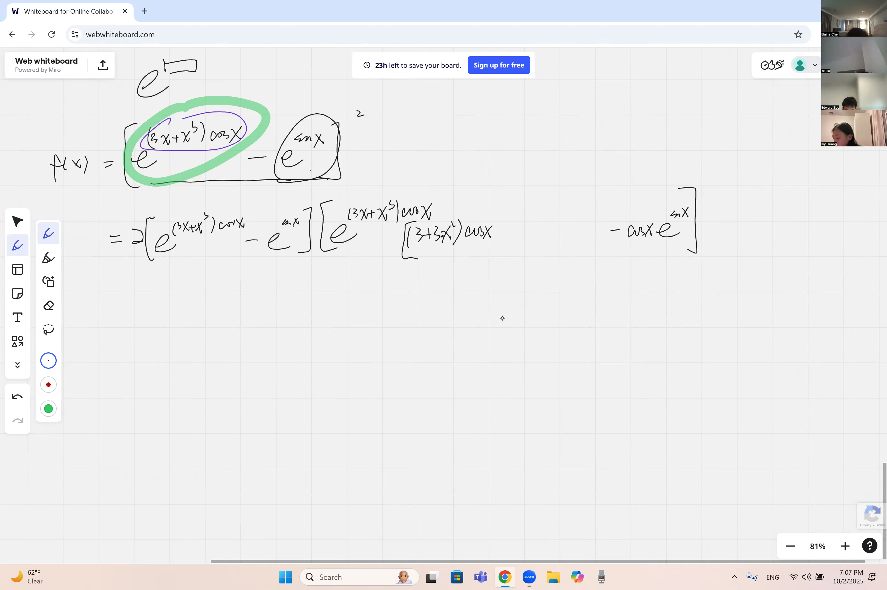
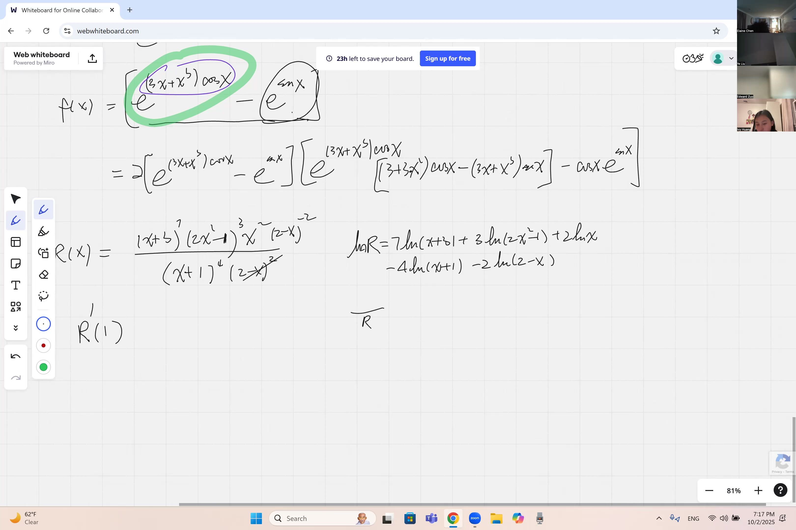
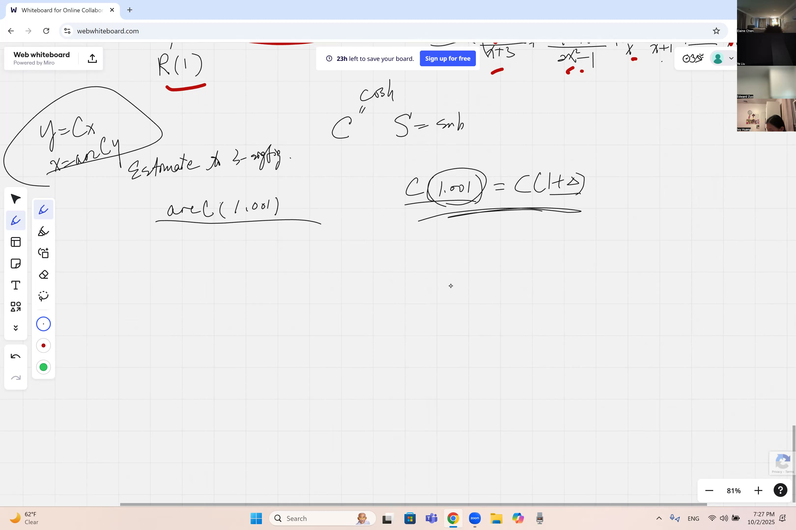
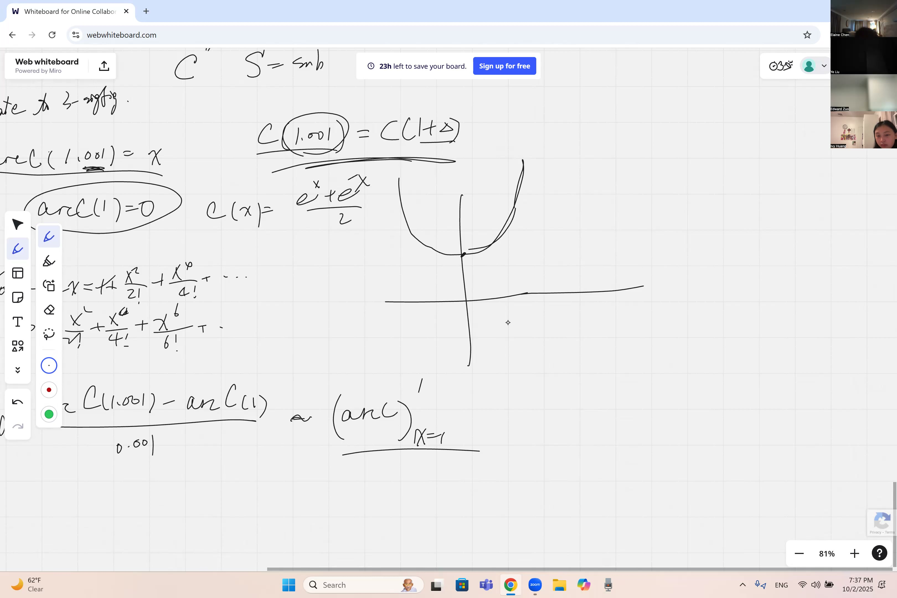

Think of today's lesson as loading up your calculus toolbox with every wrench and screwdriver you'll need for the rest of the course. We'll practice the chain rule, the product and quotient rules, and a sneaky trick called logarithmic differentiation that turns nightmarish products into simple sums. We'll also learn how to differentiate inverse functions -- and discover what happens when a derivative blows up to infinity (spoiler: your usual shortcuts stop working, and you need a Plan B).

::: {.callout-tip collapse="true"}
## Why Mastering Derivative Techniques Matters

Being able to take derivatives quickly and accurately is the gateway to the rest of calculus:

- **Physics**: velocity, acceleration, and force all come from taking derivatives of position — engineers chain-rule through complicated motion equations every day
- **Medicine**: drug concentration in the bloodstream follows exponential and rational functions — doctors need derivatives to know when a drug is most effective
- **Finance**: the rate at which an investment grows depends on derivatives of compound-interest formulas involving products and exponentials
- **Computer graphics**: rendering realistic lighting on curved surfaces requires derivatives of composite trig and polynomial functions
- **Climate science**: temperature models involve products and compositions of many functions — scientists differentiate them to predict rates of change
:::

## Topics Covered

- Review of the **power rule** from the binomial expansion: $\frac{d}{dx} x^r = r\,x^{r-1}$
- Applying the **chain rule** to peel apart nested functions layer by layer
- Using the **product rule** and **quotient rule** together on complex expressions
- **Logarithmic differentiation**: turning products into sums via $\ln$ to simplify derivatives of complicated rational functions
- Derivatives of **inverse functions**: $\frac{d}{dx}[f^{-1}(x)] = \frac{1}{f'(f^{-1}(x))}$
- Estimating $\operatorname{arccosh}(1.001)$ using differentials and the definition of the derivative
- Recognizing when a derivative is infinite and choosing alternative strategies

## Lecture Video

```{=html}
<video controls width="100%" preload="metadata">
  <source src="https://github.com/ymote/learningcalculus/releases/download/v1.0/calculus20251002.mp4" type="video/mp4">
</video>
```

## Key Frames from the Lecture

::: {layout-ncol=2}







:::


## What You Need to Know First

::: {.callout-note collapse="true"}
## What is the chain rule?

When one function is inside another — a **composite function** like $f(g(x))$ — the chain rule tells you how to differentiate:

$$\frac{d}{dx}\bigl[f(g(x))\bigr] = f'(g(x)) \cdot g'(x)$$

Think of it as peeling an onion: differentiate the outer layer first (leaving the inside alone), then multiply by the derivative of the inner layer.

**Example:** If $h(x) = (3x+1)^5$, then:

$$h'(x) = 5(3x+1)^4 \cdot 3 = 15(3x+1)^4$$
:::

::: {.callout-note collapse="true"}
## What are the product rule and quotient rule?

**Product rule:** When two functions are multiplied together:

$$\frac{d}{dx}[u \cdot v] = u' v + u v'$$

**Quotient rule:** When one function is divided by another:

$$\frac{d}{dx}\!\left[\frac{u}{v}\right] = \frac{u'v - uv'}{v^2}$$

These let you handle expressions that are built from simpler pieces multiplied or divided together.
:::

::: {.callout-note collapse="true"}
## What is a natural logarithm?

The **natural logarithm** $\ln(x)$ is the inverse of $e^x$. It has a key property that makes multiplication simpler:

$$\ln(a \cdot b) = \ln a + \ln b, \qquad \ln\!\left(\frac{a}{b}\right) = \ln a - \ln b, \qquad \ln(a^n) = n\ln a$$

This is why taking $\ln$ of both sides can convert a messy product of powers into a clean sum — exactly the trick used in **logarithmic differentiation**.
:::

::: {.callout-note collapse="true"}
## What is $\cosh x$ (hyperbolic cosine)?

The **hyperbolic cosine** is defined as:

$$\cosh x = \frac{e^x + e^{-x}}{2}$$

Its graph looks like a U-shaped curve (called a **catenary** — the shape a hanging chain makes). Key facts:

- $\cosh 0 = 1$ (the minimum value)
- $\cosh x$ is an **even function**: $\cosh(-x) = \cosh(x)$
- Its derivative is $\sinh x = \frac{e^x - e^{-x}}{2}$
- Its Maclaurin series is $\cosh x = 1 + \frac{x^2}{2!} + \frac{x^4}{4!} + \cdots$
:::

## Key Concepts

### The Power Rule Foundation

Everything starts from the **binomial expansion**. For any exponent $r$ (positive, negative, or fractional):

$$(x + dx)^r = x^r\!\left(1 + \frac{dx}{x}\right)^r \approx x^r\!\left(1 + r\,\frac{dx}{x}\right)$$

We keep only the lowest-order infinitesimal. Subtracting $x^r$ and dividing by $dx$:

$$\frac{d}{dx}\,x^r = r\,x^{r-1}$$

This extends beyond simple powers — via **power (Maclaurin) expansions**, it handles polynomials, rational functions, exponentials ($e^x = \sum x^k/k!$), and trig functions.

### Chain Rule in Action: Peeling Layers

Consider the function from class:

$$f(x) = \Bigl(e^{3x + x^3\cos x} - e^{\sin x}\Bigr)^2$$

To differentiate, work **outside-in**:

**Layer 1 — the square:** The outermost operation is $(\cdots)^2$. By the power rule:

$$f'(x) = 2\Bigl(e^{3x + x^3\cos x} - e^{\sin x}\Bigr) \cdot \frac{d}{dx}\Bigl(e^{3x + x^3\cos x} - e^{\sin x}\Bigr)$$

**Layer 2 — the exponentials:** Differentiate each term inside the bracket separately.

For $e^{\sin x}$: the derivative of $e^u$ is $e^u \cdot u'$, so:

$$\frac{d}{dx}\,e^{\sin x} = e^{\sin x}\cdot \cos x$$

For $e^{3x + x^3\cos x}$: same pattern, but the inner function is more complex:

$$\frac{d}{dx}\,e^{3x + x^3\cos x} = e^{3x + x^3\cos x}\cdot \frac{d}{dx}(3x + x^3\cos x)$$

**Layer 3 — the inner function:** Apply the product rule to $x^3 \cos x$:

$$\frac{d}{dx}(3x + x^3\cos x) = 3 + 3x^2\cos x - x^3\sin x$$

Assembling everything gives the full derivative — complicated, but each step is mechanical.

**Explore how the chain rule works on nested functions:**

::: {.desmos-container}
```{=html}
<div id="chain-rule-graph" style="width: 100%; height: 400px;"></div>
<script src="https://www.desmos.com/api/v1.9/calculator.js?apiKey=dcb31709b452b1cf9dc26972add0fda6"></script>
<script>
var elt = document.getElementById('chain-rule-graph');
var calculator = Desmos.GraphingCalculator(elt);
calculator.setExpression({id: 'f', latex: 'y=e^{\\sin(x)}', color: '#2d70b3', lineWidth: 3});
calculator.setExpression({id: 'df', latex: 'y=e^{\\sin(x)}\\cos(x)', color: '#c74440', lineStyle: 'DASHED', lineWidth: 2});
calculator.setExpression({id: 'a', latex: 'a=1', sliderBounds: {min: -6.28, max: 6.28, step: 0.01}});
calculator.setExpression({id: 'pt', latex: '(a, e^{\\sin(a)})', color: '#2d70b3', pointSize: 10, label: 'f(a)', showLabel: true});
calculator.setExpression({id: 'tan', latex: 'y=e^{\\sin(a)}+e^{\\sin(a)}\\cos(a)(x-a)', color: '#388c46', lineWidth: 1.5});
calculator.setMathBounds({left: -7, right: 7, bottom: -2, top: 8});
</script>
```
:::

### Logarithmic Differentiation

When a function is a massive **product and quotient of powers**, direct use of the product rule is a nightmare. Instead, take $\ln$ of both sides.

**Example from class:** Find $R'(1)$ where

$$R(x) = \frac{(x+3)^7 \cdot (2x^2-1)^3 \cdot x^2}{(x+1)^4 \cdot (2-x)^2}$$

**Step 1 — Take $\ln$ of both sides:**

$$\ln R = 7\ln(x+3) + 3\ln(2x^2-1) + 2\ln x - 4\ln(x+1) - 2\ln(2-x)$$

Products become sums, quotients become differences, and exponents become coefficients.

**Step 2 — Differentiate both sides:**

$$\frac{R'}{R} = \frac{7}{x+3} + \frac{12x}{2x^2-1} + \frac{2}{x} - \frac{4}{x+1} + \frac{2}{2-x}$$

On the left, the chain rule gives $\frac{1}{R}\cdot R'$. On the right, each logarithmic term differentiates cleanly. Note the last term carefully: the derivative of $(2-x)$ is $-1$, so the two negatives combine to give $+\frac{2}{2-x}$.

**Step 3 — Solve for $R'$:**

::: {.callout-important}
## Key Idea: Logarithmic Differentiation
When a function is a huge product and quotient of powers, take $\ln$ of both sides first. This converts products into sums, making differentiation much simpler. Then solve for $R'$ by multiplying both sides by $R$.

$$R'(x) = R(x)\left[\frac{7}{x+3} + \frac{12x}{2x^2-1} + \frac{2}{x} - \frac{4}{x+1} + \frac{2}{2-x}\right]$$
:::

To evaluate at $x = 1$: compute $R(1)$ once, then plug $x=1$ into each simple fraction and add them up. Much easier than expanding the product rule across five factors!

::: {.callout-tip collapse="true"}
## Why does logarithmic differentiation work?

Logarithmic differentiation exploits the **logarithm laws** to decompose a product into a sum. Differentiating a sum is trivial — you just differentiate term by term. The result is equivalent to the product rule, but organized so each factor contributes one clean fraction.

If you look at the formula, each term like $\frac{7}{x+3}$ comes from "fixing every other factor, differentiating just $(x+3)^7$, and dividing by the whole $R$." That is exactly what the generalized product rule does!
:::

**Visualize the function $R(x)$ and its derivative:**

::: {.desmos-container}
```{=html}
<div id="log-diff-graph" style="width: 100%; height: 400px;"></div>
<script src="https://www.desmos.com/api/v1.9/calculator.js?apiKey=dcb31709b452b1cf9dc26972add0fda6"></script>
<script>
var elt2 = document.getElementById('log-diff-graph');
var calc2 = Desmos.GraphingCalculator(elt2);
calc2.setExpression({id: 'R', latex: 'y=\\frac{(x+3)^{7}(2x^{2}-1)^{3}x^{2}}{(x+1)^{4}(2-x)^{2}}', color: '#2d70b3', lineWidth: 2});
calc2.setExpression({id: 'pt', latex: '(1, \\frac{(4)^{7}(1)^{3}(1)}{(2)^{4}(1)^{2}})', color: '#c74440', pointSize: 10, label: 'R(1)', showLabel: true});
calc2.setMathBounds({left: -1, right: 2, bottom: -500, top: 2000});
</script>
```
:::

### Derivatives of Inverse Functions

If $y = f(x)$ has an inverse $x = f^{-1}(y)$, then:

::: {.callout-important}
## Key Idea: Inverse Function Derivative
To differentiate an inverse function, just flip the derivative of the original function. If you know $f'$, then the derivative of $f^{-1}$ is one over $f'$ evaluated at the corresponding point.

$$\frac{d}{dy}\bigl[f^{-1}(y)\bigr] = \frac{1}{f'(x)} = \frac{1}{f'\!\bigl(f^{-1}(y)\bigr)}$$
:::

Graphically, the derivative of the inverse at a point is the **reciprocal** of the derivative of the original function at the corresponding point. If $(x_0, y_0)$ is on the graph of $f$, then $(y_0, x_0)$ is on the graph of $f^{-1}$, and:

$$\bigl(f^{-1}\bigr)'(y_0) = \frac{1}{f'(x_0)}$$

**Explore $\cosh x$ and $\operatorname{arccosh} x$ as reflections across $y = x$:**

::: {.desmos-container}
```{=html}
<div id="inverse-graph" style="width: 100%; height: 400px;"></div>
<script src="https://www.desmos.com/api/v1.9/calculator.js?apiKey=dcb31709b452b1cf9dc26972add0fda6"></script>
<script>
var elt3 = document.getElementById('inverse-graph');
var calc3 = Desmos.GraphingCalculator(elt3);
calc3.setExpression({id: 'cosh', latex: 'y=\\cosh(x)', color: '#2d70b3', lineWidth: 2, domain: {min: 0, max: 3}});
calc3.setExpression({id: 'acosh', latex: 'y=\\ln(x+\\sqrt{x^2-1})', color: '#c74440', lineWidth: 2, domain: {min: 1, max: 10}});
calc3.setExpression({id: 'mirror', latex: 'y=x', color: '#aaaaaa', lineStyle: 'DASHED'});
calc3.setExpression({id: 'pt1', latex: '(0, 1)', color: '#2d70b3', pointSize: 10, label: 'cosh(0)=1', showLabel: true});
calc3.setExpression({id: 'pt2', latex: '(1, 0)', color: '#c74440', pointSize: 10, label: 'arccosh(1)=0', showLabel: true});
calc3.setMathBounds({left: -1, right: 5, bottom: -1, top: 5});
</script>
```
:::

### Estimating $\operatorname{arccosh}(1.001)$: When Derivatives Blow Up

We want to estimate $\operatorname{arccosh}(1.001)$ to three significant figures.

**First attempt — use the derivative:**

Since $\operatorname{arccosh}(1) = 0$ (because $\cosh(0) = 1$), and $1.001$ is close to $1$, we might try:

$$\operatorname{arccosh}(1.001) \approx \operatorname{arccosh}(1) + 0.001 \cdot \frac{d}{dy}\operatorname{arccosh}(y)\Big|_{y=1}$$

But the derivative of $\operatorname{arccosh}$ at $y=1$ is $\frac{1}{\sinh(\operatorname{arccosh}(1))} = \frac{1}{\sinh(0)} = \frac{1}{0} = \infty$!

Graphically, $\cosh x$ has a **horizontal tangent** at $x = 0$, so its inverse $\operatorname{arccosh}$ has a **vertical tangent** at $y = 1$. The linear approximation fails completely.

**What does this mean?** The value $\operatorname{arccosh}(1.001)$ is much larger than $0.001$ would suggest — it grows as a **fractional power** of the increment, not linearly.

**Second attempt — solve directly from the definition:**

Set $\cosh x = 1.001$, i.e., $\frac{e^x + e^{-x}}{2} = 1.001$. Let $u = e^x$:

$$u + \frac{1}{u} = 2.002 \quad \Longrightarrow \quad u^2 - 2.002\,u + 1 = 0$$

By the quadratic formula:

$$u = \frac{2.002 \pm \sqrt{2.002^2 - 4}}{2} = 1.001 \pm \sqrt{1.001^2 - 1}$$

Since $x > 0$, we pick the $+$ sign:

$$e^x = 1.001 + \sqrt{0.002001}$$

Now $\sqrt{0.002001} \approx 0.04473$, so $e^x \approx 1.04573$, and:

$$x = \ln(1.04573) \approx 0.04473 - \frac{0.04473^2}{2} + \cdots \approx 0.0447$$

The answer $\operatorname{arccosh}(1.001) \approx 0.0447$ is **far** larger than $0.001$ — confirming that the linear derivative approach could not work here.

::: {.callout-tip collapse="true"}
## The lesson: always check your derivatives before approximating!

Whenever you want to estimate $f(a + \epsilon)$ using calculus, the approximation $f(a + \epsilon) \approx f(a) + \epsilon\,f'(a)$ requires $f'(a)$ to be **finite**. If the derivative is infinite, the function changes by a fractional power of $\epsilon$ rather than linearly, and you need a different strategy — such as solving the defining equation directly.
:::

### Cube Roots Near Zero: Another Infinite-Derivative Trap

The same issue appears with $\sqrt[3]{0.007}$. If you try to expand $x^{1/3}$ around $x = 0$:

$$\frac{d}{dx}\,x^{1/3} = \frac{1}{3}\,x^{-2/3}$$

At $x = 0$, this is $\infty$. The tangent line at the origin is **vertical**, so you cannot do a Taylor expansion there. Instead, you would expand around a nearby convenient point (like $x = 0.008 = 0.2^3$) where the derivative is finite.

**See the vertical tangent of $y = x^{1/3}$ at the origin:**

::: {.desmos-container}
```{=html}
<div id="cuberoot-graph" style="width: 100%; height: 400px;"></div>
<script src="https://www.desmos.com/api/v1.9/calculator.js?apiKey=dcb31709b452b1cf9dc26972add0fda6"></script>
<script>
var elt4 = document.getElementById('cuberoot-graph');
var calc4 = Desmos.GraphingCalculator(elt4);
calc4.setExpression({id: 'cbrt', latex: 'y=x^{1/3}', color: '#2d70b3', lineWidth: 2.5});
calc4.setExpression({id: 'pt', latex: '(0.007, 0.007^{1/3})', color: '#c74440', pointSize: 10, label: '(0.007, 0.191...)', showLabel: true});
calc4.setExpression({id: 'origin', latex: '(0,0)', color: '#388c46', pointSize: 8, label: 'vertical tangent here', showLabel: true});
calc4.setMathBounds({left: -0.05, right: 0.5, bottom: -0.1, top: 1});
</script>
```
:::

## Cheat Sheet

::: {.key-formula}
| Formula | Notes |
|---|---|
| $\frac{d}{dx}\,x^r = r\,x^{r-1}$ | Power rule — works for any real $r$ |
| $\frac{d}{dx}\,e^{u} = e^{u}\cdot u'$ | Exponential + chain rule |
| $\frac{d}{dx}[f(g(x))] = f'(g(x))\cdot g'(x)$ | Chain rule — peel layers outside-in |
| $(uv)' = u'v + uv'$ | Product rule |
| $\left(\frac{u}{v}\right)' = \frac{u'v - uv'}{v^2}$ | Quotient rule |

### Logarithmic Differentiation

For $R(x) = \prod f_i(x)^{a_i}$, take $\ln$ of both sides:

$$\ln R = \sum a_i \ln f_i(x) \qquad \Longrightarrow \qquad \frac{R'}{R} = \sum \frac{a_i\,f_i'(x)}{f_i(x)}$$

$$R'(x) = R(x)\sum \frac{a_i\,f_i'(x)}{f_i(x)}$$

### Inverse Function Derivative

$$\frac{d}{dy}\bigl[f^{-1}(y)\bigr] = \frac{1}{f'\!\bigl(f^{-1}(y)\bigr)}$$

### Hyperbolic Functions

$$\cosh x = \frac{e^x + e^{-x}}{2}, \qquad \sinh x = \frac{e^x - e^{-x}}{2}$$

$$\frac{d}{dx}\cosh x = \sinh x, \qquad \frac{d}{dx}\sinh x = \cosh x$$

$$\operatorname{arccosh}(y) = \ln\!\left(y + \sqrt{y^2 - 1}\right), \quad y \ge 1$$
:::
