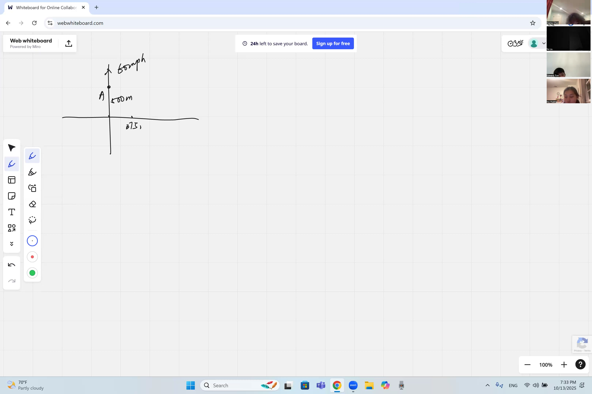

Have you ever wondered how fast the distance between two moving cars is changing, even when neither car is driving directly toward the other? In this lesson, you will learn a powerful technique called "related rates" that lets you connect different changing quantities using derivatives. It is like solving a puzzle where knowing one speed helps you figure out another -- and it all comes from the Pythagorean theorem and the chain rule, tools you already know!

::: {.callout-tip collapse="true"}
## Why Related Rates Matter

Related rates problems show up whenever two or more quantities change at the same time and are connected by an equation:

- **Traffic safety**: engineers figure out how fast two cars are closing in on each other at an intersection to design safer traffic lights
- **Medicine**: when a drug spreads through your body, doctors use related rates to predict how fast the concentration changes in your bloodstream
- **Filling a pool**: if water flows in at a steady rate, related rates tell you how fast the water level rises — especially when the pool has a sloped bottom
- **Shadows**: as you walk away from a streetlight, your shadow grows — related rates predict exactly how fast
- **Weather balloons**: as a balloon rises, radar stations track the angle of elevation — related rates connect the balloon's altitude to how fast that angle changes

These are all situations where knowing one rate of change lets you figure out another.
:::

## Topics Covered

- What a **rate** is: change of one quantity per unit change of another
- What **related rates** means: multiple variables changing simultaneously, linked by an equation
- Setting up related rates problems using the **Pythagorean theorem**: $C^2 = A^2 + B^2$
- Applying the **chain rule** to differentiate both sides with respect to time $t$
- The classic **two-car intersection problem** (3-4-5 right triangle)
- Interpreting $\frac{dA}{dt}$, $\frac{dB}{dt}$, and $\frac{dC}{dt}$ in real-world context

## Lecture Video

```{=html}
<video controls width="100%" preload="metadata">
  <source src="https://github.com/ymote/learningcalculus/releases/download/v1.0/calculus20251013_1.mp4" type="video/mp4">
</video>
```

## Key Frames from the Lecture

```{=html}
<div style="display: flex; flex-direction: column; gap: 10px; margin: 1em 0;">
  
  
  
  
</div>
```


## What You Need to Know First

::: {.callout-note collapse="true"}
## What is a rate of change?

A **rate of change** tells you how fast one quantity changes compared to another.

- Speed is a rate: distance per time, like $60 \text{ mph}$
- Growth rate: height per year
- In calculus notation, if $y$ depends on $t$, the rate of change is $\frac{dy}{dt}$

A rate is always "something per something." If a car travels 120 miles in 2 hours, its rate is $\frac{120}{2} = 60$ miles per hour.
:::

::: {.callout-note collapse="true"}
## What is a derivative?

The **derivative** of a function tells you its **instantaneous rate of change** — how fast the output changes at a single moment.

We write it as $\frac{dy}{dx}$ or $f'(x)$.

For example, if $y = x^2$, then $\frac{dy}{dx} = 2x$, which tells you that at $x = 3$, the function is changing at a rate of $6$ units of $y$ per unit of $x$.
:::

::: {.callout-note collapse="true"}
## What is the chain rule?

The **chain rule** lets you take the derivative of a composition of functions. If $y$ depends on $u$, and $u$ depends on $x$, then:

$$\frac{dy}{dx} = \frac{dy}{du} \cdot \frac{du}{dx}$$

In related rates, everything changes with respect to **time** $t$. So if $C^2 = A^2 + B^2$, and both $A$ and $B$ change over time, you differentiate both sides with respect to $t$, using the chain rule on each term.
:::

::: {.callout-note collapse="true"}
## What is the Pythagorean theorem?

For any right triangle with legs $a$ and $b$ and hypotenuse $c$:

$$a^2 + b^2 = c^2$$

Special right triangles you should memorize:

- **3-4-5**: $3^2 + 4^2 = 9 + 16 = 25 = 5^2$
- **5-12-13**: $5^2 + 12^2 = 25 + 144 = 169 = 13^2$

These ratios scale: a 300-400-500 triangle is just a 3-4-5 triangle multiplied by 100.
:::

::: {.callout-note collapse="true"}
## What is implicit differentiation?

Sometimes you cannot solve for $y$ as a simple formula in terms of $x$. **Implicit differentiation** lets you differentiate both sides of an equation as-is.

For example, given $x^2 + y^2 = 25$, differentiate both sides with respect to $x$:

$$2x + 2y \frac{dy}{dx} = 0 \implies \frac{dy}{dx} = -\frac{x}{y}$$

In related rates problems, you do the same thing but differentiate with respect to **time** $t$.
:::

## Key Concepts

### What Is a Rate?

A **rate** is a ratio of how one quantity changes with respect to another:

$$\text{rate} = \frac{\Delta(\text{output})}{\Delta(\text{input})}$$

In calculus, we make this instantaneous by taking a derivative. If a car's position is $s(t)$, its speed is:

$$v(t) = \frac{ds}{dt}$$

### What Are Related Rates?

**Related rates** problems involve two or more quantities that:

1. Are each changing over time
2. Are connected by a known equation

Because they are linked, knowing the rate of change of one quantity lets you find the rate of change of another.

The general strategy is:

1. **Draw a picture** and label all changing quantities with variables
2. **Write an equation** that relates those variables (Pythagorean theorem, area formula, similar triangles, etc.)
3. **Differentiate both sides** with respect to time $t$, using the chain rule
4. **Plug in** all known values and solve for the unknown rate

### The Two-Car Intersection Problem

Here is the classic setup from the lecture. Two cars approach an intersection (a crossroad with a traffic light):

- **Car A** is $500$ m east of the intersection, driving northward
- **Car B** is $375$ m north of the intersection
- Car A's speed is $60$ mph heading toward the intersection

The positions form a right triangle, with the distance between the cars as the hypotenuse.

**Explore how the two cars' positions create a right triangle:**

::: {.desmos-container}
```{=html}
<div id="intersection-diagram" style="width: 100%; height: 400px;"></div>
<script src="https://www.desmos.com/api/v1.9/calculator.js?apiKey=dcb31709b452b1cf9dc26972add0fda6"></script>
<script>
var elt = document.getElementById('intersection-diagram');
var calculator = Desmos.GraphingCalculator(elt, {
  expressions: true,
  settingsMenu: false
});
calculator.setExpression({id: 'slider', latex: 't=0', sliderBounds: {min: 0, max: 1, step: 0.01}});
calculator.setExpression({id: 'a_val', latex: 'a = 500(1-t)'});
calculator.setExpression({id: 'b_val', latex: 'b = 375(1-0.5t)'});
calculator.setExpression({id: 'road_h', latex: 'y=0', color: '#888888', lineWidth: 2, domain: {min: -100, max: 600}});
calculator.setExpression({id: 'road_v', latex: 'x=0', color: '#888888', lineWidth: 2, domain: {min: -100, max: 500}});
calculator.setExpression({id: 'carA', latex: '(a, 0)', color: '#2d70b3', pointSize: 14, label: 'Car A', showLabel: true});
calculator.setExpression({id: 'carB', latex: '(0, b)', color: '#c74440', pointSize: 14, label: 'Car B', showLabel: true});
calculator.setExpression({id: 'hyp', latex: '(a(1-s), b \\cdot s)', color: '#6042a6', lineWidth: 2, parametricDomain: {min: 0, max: 1}});
calculator.setExpression({id: 'leg_a', latex: '(a(1-s), 0)', color: '#2d70b3', lineStyle: 'DASHED', parametricDomain: {min: 0, max: 1}});
calculator.setExpression({id: 'leg_b', latex: '(0, b \\cdot s)', color: '#c74440', lineStyle: 'DASHED', parametricDomain: {min: 0, max: 1}});
calculator.setExpression({id: 'origin', latex: '(0,0)', color: '#000000', pointSize: 10, label: 'Intersection', showLabel: true});
calculator.setMathBounds({left: -100, right: 600, bottom: -100, top: 500});
</script>
```
:::

### Setting Up the Equation

Let $A(t)$ be the horizontal distance of Car A from the intersection, and $B(t)$ be the vertical distance of Car B. The distance $C(t)$ between the two cars satisfies:

$$C^2 = A^2 + B^2$$

This is the **Pythagorean theorem** — the key equation that *relates* the variables.

### Differentiating with Respect to Time

Now apply $\frac{d}{dt}$ to both sides. Every variable depends on $t$, so we use the **chain rule**:

$$\frac{d}{dt}\left(C^2\right) = \frac{d}{dt}\left(A^2\right) + \frac{d}{dt}\left(B^2\right)$$

$$2C \,\frac{dC}{dt} = 2A \,\frac{dA}{dt} + 2B \,\frac{dB}{dt}$$

Divide both sides by $2$:

::: {.callout-important}
## Key Idea: The Related Rates Equation for Right Triangles
When two distances form the legs of a right triangle and everything is changing over time, you can link all three rates of change together by differentiating the Pythagorean theorem. This single equation is the foundation for solving any right-triangle related rates problem.

$$\boxed{C \,\frac{dC}{dt} = A \,\frac{dA}{dt} + B \,\frac{dB}{dt}}$$

This is the **related rates equation**. It connects the three rates $\frac{dA}{dt}$, $\frac{dB}{dt}$, and $\frac{dC}{dt}$.
:::

### Solving for the Unknown Rate

Suppose at the moment in question:

- $A = 500$ m, $B = 375$ m
- Note that $500 : 375 = 4 : 3$, so this is a scaled **3-4-5** right triangle
- Therefore $C = \sqrt{500^2 + 375^2} = \sqrt{250000 + 140625} = \sqrt{390625} = 625$ m (which is $5 \times 125$)
- Car A moves toward the intersection at $60$ mph, so $\frac{dA}{dt} = -60$ (negative because $A$ is *decreasing*)

If we want to find $\frac{dC}{dt}$ (how fast the distance between the cars is changing), we plug in:

$$625 \cdot \frac{dC}{dt} = 500 \cdot (-60) + 375 \cdot \frac{dB}{dt}$$

With a known value for $\frac{dB}{dt}$ (the speed of Car B), we can solve for $\frac{dC}{dt}$.

::: {.callout-tip collapse="true"}
## Why the negative sign?

When a car moves **toward** the intersection, its distance from the intersection is *decreasing*. A decreasing quantity has a **negative** derivative. So if Car A approaches at 60 mph, we write $\frac{dA}{dt} = -60$.

Getting the signs right is one of the trickiest parts of related rates. Always ask yourself: "Is this distance getting bigger or smaller?"
:::

### General Strategy for Related Rates

Here is a step-by-step method you can use for any related rates problem:

| Step | What to Do |
|------|-----------|
| 1 | **Draw a diagram** and label every changing quantity with a variable |
| 2 | **Identify** what rates you know and what rate you need to find |
| 3 | **Write an equation** connecting the variables (geometry, physics, etc.) |
| 4 | **Differentiate** both sides with respect to $t$ using the chain rule |
| 5 | **Substitute** all known values at the specific instant |
| 6 | **Solve** for the unknown rate |

::: {.callout-tip collapse="true"}
## Common mistakes to avoid

- **Substituting values too early**: plug in numbers *after* differentiating, not before. If you substitute $A = 500$ before taking $\frac{d}{dt}$, you lose the $\frac{dA}{dt}$ term entirely because the derivative of a constant is zero.
- **Forgetting the chain rule**: every variable that changes with time needs a $\frac{d(\cdot)}{dt}$ when you differentiate.
- **Wrong signs**: a quantity that is decreasing has a negative rate. Always check whether each distance or measurement is growing or shrinking.
:::

### Visualizing How $C$ Changes Over Time

Watch how the hypotenuse $C$ changes as Car A moves toward the intersection at a constant speed (with Car B stationary):

::: {.desmos-container}
```{=html}
<div id="distance-graph" style="width: 100%; height: 400px;"></div>
<script>
var elt2 = document.getElementById('distance-graph');
var calc2 = Desmos.GraphingCalculator(elt2, {
  expressions: true,
  settingsMenu: false
});
calc2.setExpression({id: 'c_of_t', latex: 'y = \\sqrt{(500 - 60x)^2 + 375^2}', color: '#6042a6', lineWidth: 3});
calc2.setExpression({id: 'a_of_t', latex: 'y = 500 - 60x', color: '#2d70b3', lineStyle: 'DASHED', lineWidth: 1.5});
calc2.setExpression({id: 'b_const', latex: 'y = 375', color: '#c74440', lineStyle: 'DASHED', lineWidth: 1.5});
calc2.setExpression({id: 'label_c', latex: '(2, \\sqrt{(500-120)^2+375^2})', color: '#6042a6', pointSize: 0, label: 'C(t) = distance between cars', showLabel: true});
calc2.setExpression({id: 'label_a', latex: '(6, 500-360)', color: '#2d70b3', pointSize: 0, label: 'A(t) = Car A distance', showLabel: true});
calc2.setExpression({id: 'label_b', latex: '(7, 375)', color: '#c74440', pointSize: 0, label: 'B = 375 (fixed)', showLabel: true});
calc2.setMathBounds({left: -0.5, right: 10, bottom: 0, top: 700});
</script>
```
:::

Notice that $C(t)$ is **not** a straight line even though $A(t)$ decreases linearly. This is because $C = \sqrt{A^2 + B^2}$ is a nonlinear function of $A$. The rate $\frac{dC}{dt}$ itself is changing over time — this is why we must specify the *instant* at which we evaluate it.

### Another Classic Example: Expanding Circle

Many related rates problems involve geometry. Suppose a stone is dropped into a pond, creating a circular ripple whose radius $r$ increases at a constant rate:

$$\frac{dr}{dt} = 2 \text{ m/s}$$

How fast is the **area** increasing when $r = 10$ m?

**Step 1** — Write the equation relating area and radius:

$$A = \pi r^2$$

**Step 2** — Differentiate both sides with respect to $t$:

::: {.callout-important}
## Key Idea: Rate of Change of a Circle's Area
If a circle's radius is growing, its area grows faster and faster because the area formula is nonlinear. Differentiating $A = \pi r^2$ gives you a direct link between the rate the radius changes and the rate the area changes.

$$\frac{dA}{dt} = 2\pi r \,\frac{dr}{dt}$$
:::

**Step 3** — Plug in $r = 10$ and $\frac{dr}{dt} = 2$:

$$\frac{dA}{dt} = 2\pi(10)(2) = 40\pi \approx 125.7 \text{ m}^2/\text{s}$$

Even though the radius grows at a constant rate, the area grows **faster and faster** because $\frac{dA}{dt}$ depends on $r$, which is increasing.

## Cheat Sheet

::: {.key-formula}
| Formula | When to Use |
|---------|------------|
| $C^2 = A^2 + B^2$ | Right triangle relating distances |
| $2C\frac{dC}{dt} = 2A\frac{dA}{dt} + 2B\frac{dB}{dt}$ | Pythagorean related rates |
| $A = \pi r^2 \implies \frac{dA}{dt} = 2\pi r\frac{dr}{dt}$ | Expanding/shrinking circle |
| $V = \frac{4}{3}\pi r^3 \implies \frac{dV}{dt} = 4\pi r^2 \frac{dr}{dt}$ | Expanding/shrinking sphere |
| $V = \frac{1}{3}\pi r^2 h$ | Cone filling with liquid |

### Related Rates Strategy

1. Draw and label a diagram with variables
2. Write one equation connecting the variables
3. Differentiate with respect to $t$ (chain rule on every term)
4. Substitute known values **after** differentiating
5. Solve for the unknown rate

### Key Rules for Signs

- Distance **decreasing** $\implies$ $\frac{d(\cdot)}{dt} < 0$
- Distance **increasing** $\implies$ $\frac{d(\cdot)}{dt} > 0$
- Always define a positive direction in your diagram
:::
