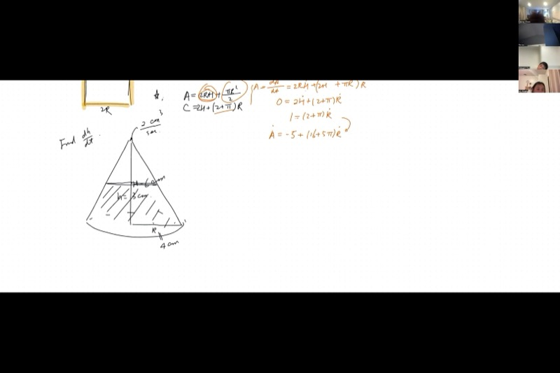
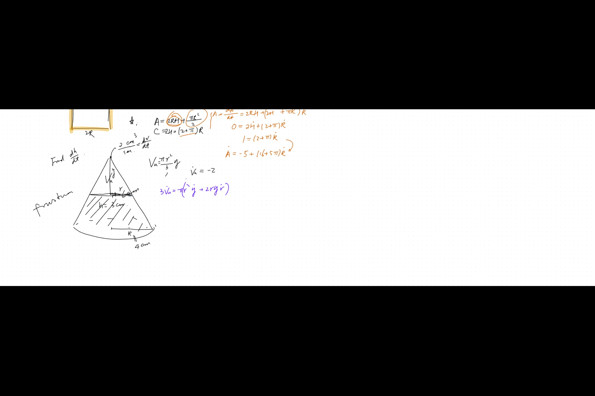
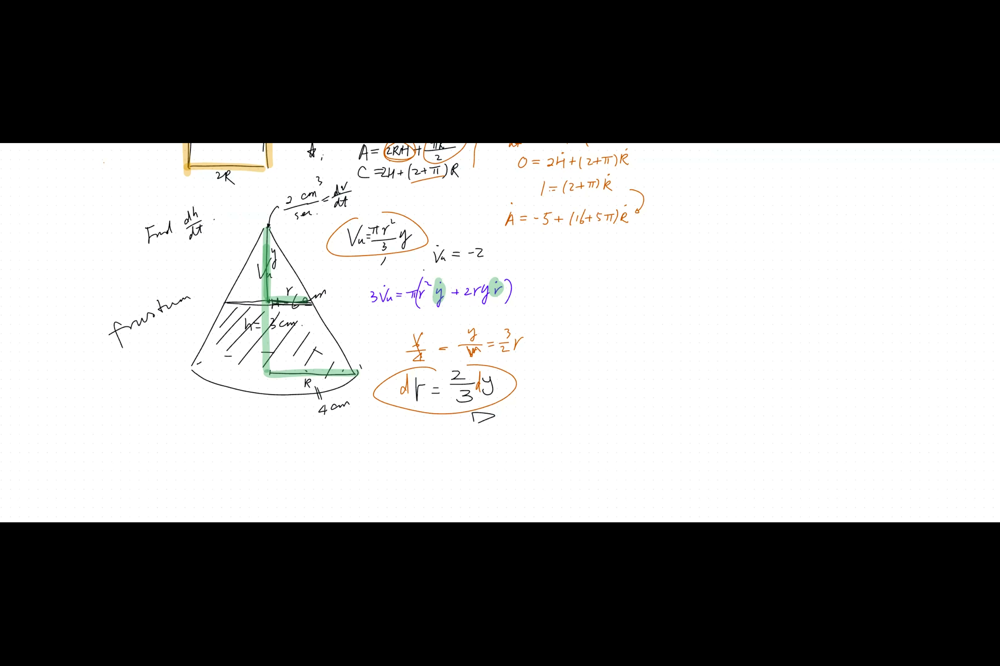

How fast is a balloon's volume growing if you only know how fast its surface area is increasing? How quickly does water rise in a cone-shaped funnel? And when you measure a building's height using an angle, how much does a tiny mistake in the angle mess up your answer? This lesson tackles all of these questions using the same three-step recipe: relate the variables, differentiate, and solve. You will be amazed at how many different real-world problems this one method can handle!

::: {.callout-tip collapse="true"}
## Why Related Rates Matter

Related rates let you figure out how fast one quantity is changing when you know how fast a different, connected quantity is changing:

- **Medicine**: when a spherical tumor grows, doctors need to know how fast the volume increases based on surface area measurements from imaging scans
- **Construction**: filling a conical storage tank with gravel or water -- engineers need to predict how quickly the level rises to avoid overflow
- **Architecture**: when redesigning a window while keeping the total framing material constant, related rates tell you how changing one dimension forces the other to adjust
- **Surveying**: measuring the height of a tall building or flagpole from the ground using angles -- small measurement errors in the angle "propagate" into errors in the computed height
These problems all follow the same three-step pattern: relate the variables, differentiate with respect to time, and solve!
:::

## Topics Covered

- Related rates with spheres: connecting $\frac{dA}{dt}$ and $\frac{dV}{dt}$ through an intermediate variable $r$
- Multi-variable related rates: French window (rectangle + semicircle) with a constant-circumference constraint
- Cone/frustum water-filling problems using similar triangles to eliminate variables
- Propagated error: relating $d\theta$ to $dh$ in indirect measurement
- The three-step procedure: (1) write all variable relationships, (2) differentiate everything, (3) substitute and solve

## Lecture Video

```{=html}
<video controls width="100%" preload="metadata">
  <source src="https://github.com/ymote/learningcalculus/releases/download/v1.0/calculus20251020.mp4" type="video/mp4">
</video>
```

## Key Frames from the Lecture

```{=html}
<div style="display: grid; grid-template-columns: 1fr 1fr; gap: 10px; margin: 1em 0;">
  
  
  
  
</div>
```


## What You Need to Know First

::: {.callout-note collapse="true"}
## What is implicit differentiation with respect to time?

When two variables are related by an equation like $A = 4\pi r^2$, and both $A$ and $r$ change over time, you can differentiate both sides with respect to $t$:

$$\frac{dA}{dt} = 8\pi r \,\frac{dr}{dt}$$

Every variable that depends on time picks up a $\frac{d(\cdot)}{dt}$ factor via the chain rule. Constants just stay as constants.
:::

::: {.callout-note collapse="true"}
## What is the product rule?

When you have two functions multiplied together, the derivative is:

$$\frac{d}{dt}[f(t) \cdot g(t)] = f'(t)\,g(t) + f(t)\,g'(t)$$

This comes up constantly in related rates. For example, differentiating an area $A = 2rh$ where both $r$ and $h$ change over time gives:

$$\frac{dA}{dt} = 2\frac{dr}{dt}\,h + 2r\,\frac{dh}{dt}$$
:::

::: {.callout-note collapse="true"}
## What are similar triangles?

Two triangles are **similar** if they have the same angles. This means the ratios of corresponding sides are equal:

$$\frac{a_1}{b_1} = \frac{a_2}{b_2}$$

In cone problems, the cross-section always forms a triangle, and the water level at any height creates a smaller triangle that is similar to the full cone. This gives you a fixed ratio between the radius and height of the water.
:::

::: {.callout-note collapse="true"}
## What are the volume and surface area formulas for spheres and cones?

**Sphere** of radius $r$:

$$A = 4\pi r^2 \qquad V = \frac{4}{3}\pi r^3$$

**Cone** with base radius $r$ and height $h$:

$$V = \frac{1}{3}\pi r^2 h$$

You do not need to memorize these right now -- they will be proven later in the course using integration.
:::

::: {.callout-note collapse="true"}
## What is a differential?

A **differential** like $dh$ represents an infinitesimally small change in $h$. When we write:

$$dh = f'(\theta)\,d\theta$$

we mean that a tiny change $d\theta$ in the input produces a tiny change $dh$ in the output, scaled by the derivative. Differentials are the building blocks of related rates -- the "rates" are just differentials divided by $dt$.
:::

## Key Concepts

### The Three-Step Procedure for Related Rates

Every related rates problem follows the same pattern:

1. **Relate** all variables with equations (geometry, definitions, constraints)
2. **Differentiate** every equation with respect to time $t$
3. **Substitute** known values and solve for the unknown rate

The critical rule: **do not plug in numerical values until after you differentiate.** If a variable is changing, plugging in its current value too early kills the derivative.

### Type 1: Sphere -- Surface Area and Volume

**Problem.** A sphere's surface area increases at $\frac{dA}{dt} = 7 \text{ m}^2/\text{min}$. Find the rate of increase of the volume.

**Step 1 -- Relate the variables.** Both $A$ and $V$ connect naturally through the radius $r$:

$$A = 4\pi r^2 \qquad V = \frac{4}{3}\pi r^3$$

**Step 2 -- Differentiate both equations:**

$$dA = 8\pi r\,dr \qquad dV = 4\pi r^2\,dr$$

Dividing by $dt$:

$$\frac{dA}{dt} = 8\pi r\,\frac{dr}{dt} \qquad \frac{dV}{dt} = 4\pi r^2\,\frac{dr}{dt}$$

**Step 3 -- Eliminate the unknown $\frac{dr}{dt}$.** From the first equation:

$$\frac{dr}{dt} = \frac{7}{8\pi r}$$

Substitute into the second:

$$\frac{dV}{dt} = 4\pi r^2 \cdot \frac{7}{8\pi r} = \frac{7r}{2}$$

::: {.callout-important}
## Key Idea: Connecting Surface Area and Volume Rates
When a sphere grows, its volume and surface area both depend on the radius. By differentiating each formula and eliminating the unknown $\frac{dr}{dt}$, you can directly link the rate of volume change to the rate of surface area change.

$$\boxed{\frac{dV}{dt} = \frac{7r}{2}}$$
:::

The answer depends on the current radius $r$. This makes physical sense: volume is measured in $\text{m}^3$ while surface area is in $\text{m}^2$, so the rate of volume change must carry an extra factor of length.

**Explore -- how $\frac{dV}{dt}$ depends on the radius when $\frac{dA}{dt} = 7$:**

::: {.desmos-container}
```{=html}
<div id="sphere-rate" style="width: 100%; height: 400px;"></div>
<script src="https://www.desmos.com/api/v1.9/calculator.js?apiKey=dcb31709b452b1cf9dc26972add0fda6"></script>
<script>
var elt1 = document.getElementById('sphere-rate');
var calc1 = Desmos.GraphingCalculator(elt1);
calc1.setExpression({id: 'dvdt', latex: 'y=\\frac{7x}{2}', color: '#2d70b3', lineWidth: 3});
calc1.setExpression({id: 'r_slider', latex: 'r=2', sliderBounds: {min: 0.5, max: 10, step: 0.1}});
calc1.setExpression({id: 'pt', latex: '(r, \\frac{7r}{2})', color: '#c74440', pointSize: 10, label: 'dV/dt at current r', showLabel: true});
calc1.setMathBounds({left: -1, right: 12, bottom: -5, top: 40});
</script>
```
:::

*The blue line shows $\frac{dV}{dt} = \frac{7r}{2}$. Drag the slider for $r$ to see how the volume growth rate is proportional to the current radius.*

### Type 2: French Window with a Constant Circumference

**Problem.** A French window consists of a rectangle topped by a semicircle. The semicircle has radius $r$ (so the window width is $2r$), and the rectangular part has height $h$. At this moment, $r = 5$ and $h = 8$. The height is decreasing at $\frac{dh}{dt} = -0.5$. The total framing (circumference) is held constant. Find $\frac{dA}{dt}$.

**Step 1 -- Write all equations.**

The area of the window:

$$A = 2rh + \frac{1}{2}\pi r^2$$

The total circumference (framing material):

$$C = 2h + (2 + \pi)r$$

**Step 2 -- Differentiate both.**

For the area (using the product rule on $2rh$):

$$\frac{dA}{dt} = 2r\frac{dh}{dt} + 2h\frac{dr}{dt} + \pi r\frac{dr}{dt} = 2r\frac{dh}{dt} + (2h + \pi r)\frac{dr}{dt}$$

For the circumference (which is constant, so $\frac{dC}{dt} = 0$):

$$0 = 2\frac{dh}{dt} + (2 + \pi)\frac{dr}{dt}$$

**Step 3 -- Solve.** From the circumference equation, isolate $\frac{dr}{dt}$:

$$\frac{dr}{dt} = \frac{-2\frac{dh}{dt}}{2 + \pi} = \frac{-2(-0.5)}{2 + \pi} = \frac{1}{2 + \pi}$$

Now plug everything into the area equation:

$$\frac{dA}{dt} = 2(5)(-0.5) + \bigl(2(8) + 5\pi\bigr) \cdot \frac{1}{2 + \pi}$$

$$= -5 + \frac{16 + 5\pi}{2 + \pi}$$

The key lesson: when a constraint holds something constant, differentiating it gives you $\frac{dC}{dt} = 0$, which provides the extra equation you need.

### Type 3: Water Filling a Conical Container

**Problem.** A cone has base radius $R = 4$ cm and height $H = 6$ cm, vertex at the bottom and opening at the top. Water is poured in at $\frac{dV_{\text{water}}}{dt} = 2 \text{ cm}^3/\text{s}$. When the water reaches $h = 3$ cm, find $\frac{dh}{dt}$.

**The clever trick.** Instead of computing the frustum volume, focus on the **empty cone at the top**. Let $y$ be the height of the empty cone and $r$ its base radius:

$$V_{\text{up}} = \frac{1}{3}\pi r^2 y$$

Since water is being added, the empty volume is decreasing:

$$\frac{dV_{\text{up}}}{dt} = -2 \text{ cm}^3/\text{s}$$

**Use similar triangles.** The full cone and the upper empty cone are similar, so $\frac{y}{r} = \frac{H}{R} = \frac{3}{2}$, giving $r = \frac{2}{3}y$ and $\frac{dr}{dt} = \frac{2}{3}\frac{dy}{dt}$.

**Substitute to get one variable.** Replace $r$ with $\frac{2}{3}y$:

$$V_{\text{up}} = \frac{1}{3}\pi\left(\frac{2}{3}y\right)^2 y = \frac{4\pi}{27}y^3$$

Differentiate:

$$\frac{dV_{\text{up}}}{dt} = \frac{4\pi}{9}y^2\frac{dy}{dt}$$

When $h = 3$, the empty part has height $y = H - h = 3$ cm:

$$-2 = \frac{4\pi}{9}(3)^2\frac{dy}{dt} = 4\pi\frac{dy}{dt}$$

$$\frac{dy}{dt} = \frac{-2}{4\pi} = \frac{-1}{2\pi}$$

Since $h = H - y$, we have $\frac{dh}{dt} = -\frac{dy}{dt}$:

::: {.callout-important}
## Key Idea: Use Similar Triangles to Eliminate Variables in Cone Problems
A cone's cross-section creates similar triangles, which lock the radius and height into a fixed ratio. This lets you rewrite the volume formula in terms of just one variable, making differentiation much simpler.

$$\boxed{\frac{dh}{dt} = \frac{1}{2\pi} \approx 0.159 \text{ cm/s}}$$
:::

**Explore -- the conical container cross-section as water fills:**

::: {.desmos-container}
```{=html}
<div id="cone-fill" style="width: 100%; height: 400px;"></div>
<script>
var elt2 = document.getElementById('cone-fill');
var calc2 = Desmos.GraphingCalculator(elt2);
calc2.setExpression({id: 'cone_left', latex: 'y = \\frac{6}{4}x \\left\\{0 \\le x \\le 4\\right\\}', color: '#aaaaaa', lineWidth: 2});
calc2.setExpression({id: 'cone_right', latex: 'y = -\\frac{6}{4}x \\left\\{-4 \\le x \\le 0\\right\\}', color: '#aaaaaa', lineWidth: 2});
calc2.setExpression({id: 'cone_top', latex: 'y = 6 \\left\\{-4 \\le x \\le 4\\right\\}', color: '#aaaaaa', lineWidth: 2});
calc2.setExpression({id: 'h_slider', latex: 'h_0 = 3', sliderBounds: {min: 0.1, max: 5.9, step: 0.1}});
calc2.setExpression({id: 'water_level', latex: 'y = h_0 \\left\\{-\\frac{2h_0}{3} \\le x \\le \\frac{2h_0}{3}\\right\\}', color: '#2d70b3', lineWidth: 3});
calc2.setExpression({id: 'water_left', latex: 'y = \\frac{6}{4}x \\left\\{0 \\le x \\le \\frac{2h_0}{3}\\right\\}', color: '#2d70b3', lineWidth: 3});
calc2.setExpression({id: 'water_right', latex: 'y = -\\frac{6}{4}x \\left\\{-\\frac{2h_0}{3} \\le x \\le 0\\right\\}', color: '#2d70b3', lineWidth: 3});
calc2.setExpression({id: 'rate_label', latex: '(5, h_0)', color: '#c74440', pointSize: 0, label: 'Water level h', showLabel: true});
calc2.setMathBounds({left: -6, right: 8, bottom: -1, top: 8});
</script>
```
:::

*Drag $h_0$ to change the water level. The cone is narrower at the bottom, so the same flow rate causes the water to rise faster at lower levels and slower near the wide top.*

### Type 4: Propagated Error

**Problem.** You measure the height of a flagpole from 50 m away by reading $\theta = 45°$. Your instrument is accurate to $\pm 0.1°$. How much error does this introduce in the height?

**Relate the variables.** From trigonometry:

$$\tan\theta = \frac{h}{50} \quad \Longrightarrow \quad h = 50\tan\theta$$

**Differentiate** (no time variable here -- just differentials):

$$dh = 50\sec^2\theta\,d\theta$$

**Plug in the known values.** At $\theta = 45°$:

$$\cos 45° = \frac{1}{\sqrt{2}} \quad \Longrightarrow \quad \sec^2 45° = 2$$

And $d\theta = \pm 0.1°$. Converting to radians:

$$d\theta = \pm 0.1 \times \frac{\pi}{180} \approx \pm 0.001745 \text{ rad}$$

Therefore:

$$dh = 50 \times 2 \times (\pm 0.001745) \approx \pm 0.175 \text{ m}$$

So a $0.1°$ angular error causes about $\pm 0.175$ m of error in the height. Since $h = 50$ m, the relative error is about $0.35\%$.

::: {.callout-tip collapse="true"}
## Propagated error vs. related rates

Propagated error is just related rates without the time variable. Instead of $\frac{dh}{dt}$ and $\frac{d\theta}{dt}$, you work directly with differentials $dh$ and $d\theta$. The key insight: **do not** compute $h(45.1°) - h(45°)$ directly. Instead, treat the small deviation as a differential -- this is faster and gives a formula that works for any angle.
:::

**Explore -- how the height error $dh$ depends on the measurement angle $\theta$:**

::: {.desmos-container}
```{=html}
<div id="prop-error" style="width: 100%; height: 400px;"></div>
<script>
var elt3 = document.getElementById('prop-error');
var calc3 = Desmos.GraphingCalculator(elt3);
calc3.setExpression({id: 'dh_curve', latex: 'y = 50 \\cdot \\sec(x)^2 \\cdot 0.1 \\cdot \\frac{\\pi}{180}', color: '#2d70b3', lineWidth: 3});
calc3.setExpression({id: 'theta_slider', latex: 'a = \\frac{\\pi}{4}', sliderBounds: {min: 0.1, max: 1.4, step: 0.01}});
calc3.setExpression({id: 'pt', latex: '(a, 50 \\cdot \\sec(a)^2 \\cdot 0.1 \\cdot \\frac{\\pi}{180})', color: '#c74440', pointSize: 10, label: 'dh at this angle', showLabel: true});
calc3.setExpression({id: 'fourtyfive', latex: 'x = \\frac{\\pi}{4}', color: '#aaaaaa', lineStyle: 'DASHED', lineWidth: 1});
calc3.setMathBounds({left: -0.2, right: 1.6, bottom: -0.5, top: 5});
</script>
```
:::

*The curve shows the height error $dh$ (in meters) for a fixed $d\theta = 0.1°$ as the angle $\theta$ varies. At steeper angles, $\sec^2\theta$ grows rapidly, meaning the same angular error causes a much larger height error. The dashed line marks $\theta = 45°$.*

## Cheat Sheet

::: {.key-formula}

### The Three-Step Related Rates Procedure

1. **Relate** all variables with equations (geometry, definitions, constraints)
2. **Differentiate** every equation with respect to $t$ (or take differentials)
3. **Substitute** known values and solve -- plug in numbers **only after** differentiating

### Key Formulas Used

| Quantity | Formula |
|---|---|
| Surface area of a sphere | $A = 4\pi r^2$ |
| Volume of a sphere | $V = \frac{4}{3}\pi r^3$ |
| Volume of a cone | $V = \frac{1}{3}\pi r^2 h$ |
| Tangent relation | $\tan\theta = \frac{\text{opposite}}{\text{adjacent}}$ |
| Derivative of $\tan\theta$ | $\frac{d}{d\theta}(\tan\theta) = \sec^2\theta$ |

### Common Pitfalls

| Mistake | Fix |
|---|---|
| Plugging in numbers before differentiating | Keep variables as variables until the very last step |
| Forgetting the product rule when two variables multiply | If $A = 2rh$ and both change, use $\dot{A} = 2\dot{r}h + 2r\dot{h}$ |
| Ignoring constraints | A constant quantity has derivative zero -- this gives you an extra equation |
| Too many unknowns | Look for geometric relationships (similar triangles, fixed ratios) to eliminate variables |

### Propagated Error Formula

If $y = f(x)$, then the error in $y$ caused by an error $dx$ in $x$ is:

$$dy = f'(x)\,dx$$

The **relative error** is $\displaystyle\frac{dy}{y} = \frac{f'(x)}{f(x)}\,dx$.
:::
