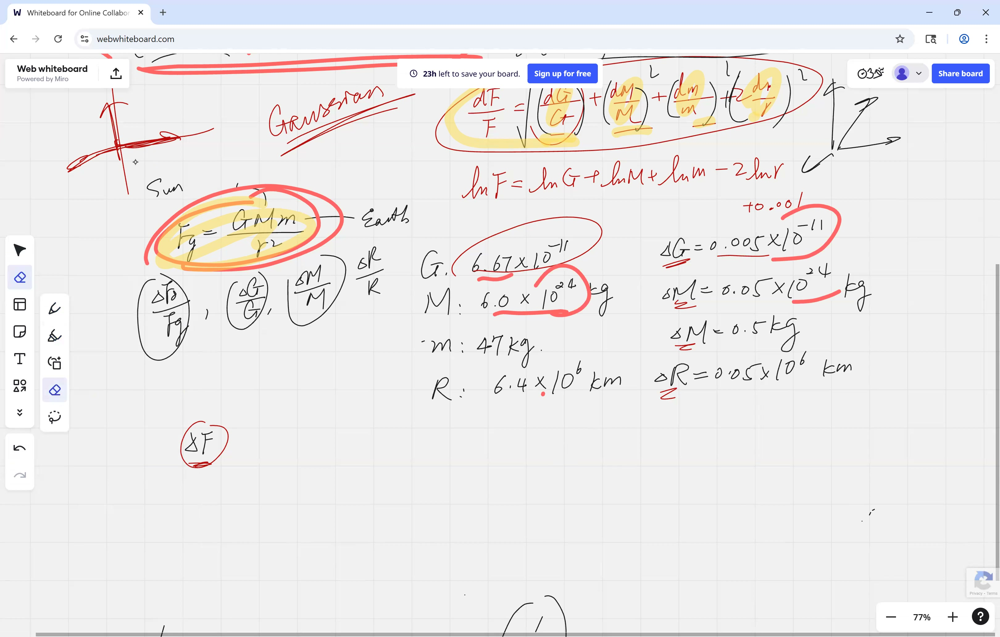
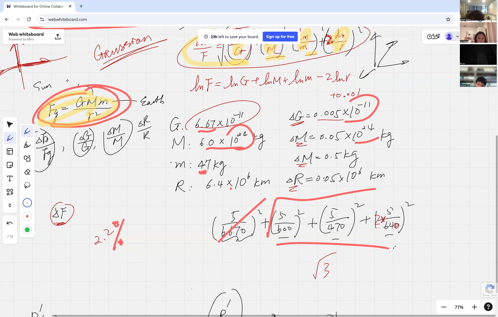
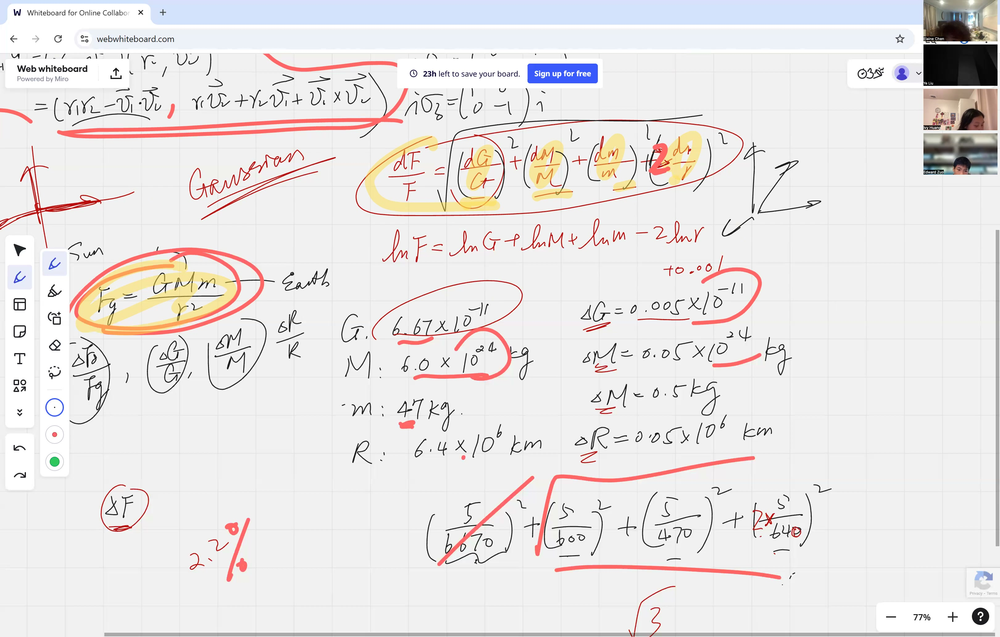

Every measurement carries some degree of uncertainty -- a ruler is accurate only to the nearest millimeter, a scale may be imprecise by a gram. When these imprecise values are substituted into a formula, the errors propagate into the computed result. This lesson develops the theory for predicting the magnitude of such propagated errors. We also establish that averaging repeated independent measurements reduces uncertainty, and provide the calculus-based derivation explaining why.

::: {.callout-tip collapse="true"}
## Motivation

Every measurement in practice has some uncertainty. Propagated error analysis determines how those small uncertainties combine to affect the computed result:

- **Aerospace engineering**: engineers must quantify how errors in speed, angle, and timing combine so that a spacecraft does not deviate from its intended trajectory
- **Pharmacology**: when a pharmacist measures ingredients for a prescription, small errors in each ingredient accumulate -- propagated error analysis ensures the dose remains within safe bounds
- **Civil engineering**: builders measure lengths, widths, and angles -- understanding combined error prevents a structure from falling outside design specifications
- **Laboratory science**: every measurement (mass, volume, temperature) carries error -- scientists use propagated error to report results with appropriate precision
- **Data acquisition**: tracking systems measure positions many times per second -- averaging those measurements reduces error, as this lesson demonstrates

Without quantifying how much a computed result may deviate from the true value, one cannot assess the reliability of the result.
:::

## Topics Covered

- Propagated error using the law of gravitation: $F_g = \frac{Gm_1 m_2}{r^2}$
- Using logarithmic differentiation to simplify error propagation when variables are multiplied
- The Pythagorean sum of percent errors: $\frac{\delta F}{F} = \sqrt{\left(\frac{\delta G}{G}\right)^2 + \left(\frac{\delta m_1}{m_1}\right)^2 + \left(\frac{\delta m_2}{m_2}\right)^2 + \left(2\frac{\delta r}{r}\right)^2}$
- Converting between percent error ($\delta F / F$) and absolute error ($\delta F$)
- Comparing measurement strategies: repeated measurements with averaging vs. a single precise measurement
- Error reduction by averaging $n$ independent measurements: $\delta \bar{x} = \frac{\delta x}{\sqrt{n}}$

## Lecture Video

```{=html}
<video controls width="100%" preload="metadata">
  <source src="https://github.com/ymote/learningcalculus/releases/download/v1.0/calculus20251023.mp4" type="video/mp4">
</video>
```

## Key Frames from the Lecture

```{=html}
<div style="display: flex; flex-direction: column; gap: 10px; margin: 1em 0;">
  
  
  
  
</div>
```


## Prerequisites

::: {.callout-note collapse="true"}
## What is a percent error?

**Percent error** expresses a measurement's uncertainty *relative* to the measurement itself.

$$\text{Percent error} = \frac{\delta x}{x} \times 100\%$$

where $\delta x$ is the absolute error (uncertainty) and $x$ is the measured value.

- A 1 cm error on a 100 cm table is a 1% error -- acceptable in most contexts.
- A 1 cm error on a 2 cm bolt is a 50% error -- unacceptable in practice.

Percent error provides a meaningful comparison of measurement quality across different units and scales.
:::

::: {.callout-note collapse="true"}
## What is Newton's Law of Gravitation?

Newton's Law of Universal Gravitation states that every object with mass attracts every other object with mass:

$$F_g = \frac{G \, m_1 \, m_2}{r^2}$$

- $F_g$ = gravitational force (in Newtons)
- $G = 6.674 \times 10^{-11} \; \text{N} \cdot \text{m}^2/\text{kg}^2$ (the gravitational constant)
- $m_1, m_2$ = the masses of the two objects (in kg)
- $r$ = the distance between their centers (in m)

For a person standing on Earth, $m_1$ is the Earth's mass, $m_2$ is the person's mass, and $r$ is the Earth's radius. The resulting $F_g$ is the person's **weight**.
:::

::: {.callout-note collapse="true"}
## What is logarithmic differentiation?

When a formula is a product and quotient of many variables, differentiating directly is messy. **Logarithmic differentiation** is a shortcut:

1. Take the natural log of both sides: products become sums, quotients become subtractions, and exponents come down as coefficients.
2. Differentiate both sides.
3. The result gives you $\frac{dF}{F}$ directly --- which is exactly the *percent* change!

For example, if $F = \frac{G \, m_1 \, m_2}{r^2}$:

$$\ln F = \ln G + \ln m_1 + \ln m_2 - 2\ln r$$

Differentiating:

$$\frac{dF}{F} = \frac{dG}{G} + \frac{dm_1}{m_1} + \frac{dm_2}{m_2} - 2\frac{dr}{r}$$

This is considerably simpler than applying the quotient rule to the original formula.
:::

::: {.callout-note collapse="true"}
## What is a significant figure?

A **significant figure** (sig fig) is a digit in a number that carries real meaning about the precision of a measurement.

- $3.14$ has 3 significant figures
- $0.0052$ has 2 significant figures (leading zeros don't count)
- $6400$ might have 2, 3, or 4 sig figs depending on context

**Key rule**: the final answer can only be as precise as the *least* precise input. If one measurement has only 2 significant figures, the answer should have 2 significant figures -- the extra digits from more precise measurements are meaningless.
:::

## Gravitational Force: A Full Error Propagation Example

### Setting Up the Problem

We are given Newton's law of gravitation with real measured values:

$$F_g = \frac{G \, m_1 \, m_2}{r^2}$$

Each quantity has a measured value and an uncertainty:

| Quantity | Value | Uncertainty ($\delta$) |
|---|---|---|
| $G$ | $6.674 \times 10^{-11}$ N m$^2$/kg$^2$ | $\pm 5 \times 10^{-14}$ |
| $m_1$ (Earth) | $5.972 \times 10^{24}$ kg | $\pm 5 \times 10^{21}$ |
| $m_2$ (person) | $\approx 47$ kg | $\pm 5$ |
| $r$ (Earth radius) | $6.371 \times 10^{6}$ m | $\pm 5 \times 10^{3}$ |

The question: **what is the total propagated error $\delta F$?**

### Step 1: Take the Natural Log

Instead of differentiating the messy product-and-quotient formula directly, take the natural log:

$$\ln F = \ln G + \ln m_1 + \ln m_2 - 2 \ln r$$

### Step 2: Differentiate to Get the Percent Error Formula

$$\frac{dF}{F} = \frac{dG}{G} + \frac{dm_1}{m_1} + \frac{dm_2}{m_2} - 2\,\frac{dr}{r}$$

When dealing with *errors* (which can be positive or negative), we don't simply add them. Instead, we use the **Pythagorean sum** --- a standard technique in data analysis:

::: {.callout-important}
## Key Idea: The Pythagorean Sum of Percent Errors
When a formula involves multiplying and dividing measured quantities, the total percent error is not a simple sum -- it is the square root of the sum of squares of each individual percent error. This prevents overestimating the combined uncertainty.

$$\frac{\delta F}{F} = \sqrt{\left(\frac{\delta G}{G}\right)^2 + \left(\frac{\delta m_1}{m_1}\right)^2 + \left(\frac{\delta m_2}{m_2}\right)^2 + \left(2\,\frac{\delta r}{r}\right)^2}$$
:::

::: {.callout-tip collapse="true"}
## Why the Pythagorean sum instead of plain addition?

This is **not** a calculus result -- it is a principle from **statistics and data analysis**. The reasoning: each error is independent and can be positive or negative. Adding them directly would overestimate the total error because it is unlikely that *every* error acts in the same direction simultaneously.

The Pythagorean sum treats each error like a component of a vector. Just as the length of a vector $(a, b, c)$ is $\sqrt{a^2 + b^2 + c^2}$, the combined effect of independent errors is the square root of the sum of their squares.
:::

### Step 3: Compute Each Percent Error

$$\frac{\delta G}{G} = \frac{5 \times 10^{-14}}{6.674 \times 10^{-11}} \approx 0.00075 \quad (\approx 0.075\%)$$

$$\frac{\delta m_1}{m_1} = \frac{5 \times 10^{21}}{5.972 \times 10^{24}} \approx 0.00084 \quad (\approx 0.084\%)$$

$$\frac{\delta m_2}{m_2} = \frac{5}{47} \approx 0.0106 \quad (\approx 1.06\%)$$

$$2 \cdot \frac{\delta r}{r} = 2 \cdot \frac{5 \times 10^{3}}{6.371 \times 10^{6}} \approx 0.00157 \quad (\approx 0.157\%)$$

::: {.callout-tip collapse="true"}
## Can we drop the tiny terms?

The first two terms ($\sim 0.075\%$ and $\sim 0.084\%$) are approximately ten times smaller than the largest term ($\sim 1.06\%$). Upon squaring and summing, they become about a hundred times smaller than the dominant squared term. Since the final answer requires only about 2 significant figures, these contributions are negligible.

This illustrates a useful principle: identify which error dominates and focus attention there.
:::

**Interactive demonstration -- contribution of each term to the total error:**

::: {.desmos-container}
```{=html}
<div id="error-bars" style="width: 100%; height: 400px;"></div>
<script src="https://www.desmos.com/api/v1.9/calculator.js?apiKey=dcb31709b452b1cf9dc26972add0fda6"></script>
<script>
var elt = document.getElementById('error-bars');
var calculator = Desmos.GraphingCalculator(elt, {expressions: true, settingsMenu: false});
calculator.setExpression({id: 'e1', latex: 'a = 0.00075'});
calculator.setExpression({id: 'e2', latex: 'b = 0.00084'});
calculator.setExpression({id: 'e3', latex: 'c = 0.0106'});
calculator.setExpression({id: 'e4', latex: 'd = 0.00157'});
calculator.setExpression({id: 'total', latex: 'T = \\sqrt{a^2 + b^2 + c^2 + d^2}'});
calculator.setExpression({id: 'p1', latex: '(1, a)', color: '#2d70b3', pointSize: 12, label: 'dG/G', showLabel: true});
calculator.setExpression({id: 'p2', latex: '(2, b)', color: '#388c46', pointSize: 12, label: 'dm1/m1', showLabel: true});
calculator.setExpression({id: 'p3', latex: '(3, c)', color: '#c74440', pointSize: 12, label: 'dm2/m2', showLabel: true});
calculator.setExpression({id: 'p4', latex: '(4, d)', color: '#fa7e19', pointSize: 12, label: '2*dr/r', showLabel: true});
calculator.setExpression({id: 'p5', latex: '(5, T)', color: '#6042a6', pointSize: 14, label: 'Total %', showLabel: true});
calculator.setExpression({id: 'line', latex: 'y = T', color: '#6042a6', lineStyle: 'DASHED'});
calculator.setMathBounds({left: 0, right: 6, bottom: -0.002, top: 0.015});
</script>
```
:::

### Step 4: Combine Using the Pythagorean Sum

$$\frac{\delta F}{F} = \sqrt{(0.00075)^2 + (0.00084)^2 + (0.0106)^2 + (0.00157)^2}$$

$$\frac{\delta F}{F} \approx \sqrt{0.0000006 + 0.0000007 + 0.0001124 + 0.0000025}$$

$$\frac{\delta F}{F} \approx \sqrt{0.0001161} \approx 0.0108 \approx 1.1\%$$

Note that the factor of 2 in front of $\frac{\delta r}{r}$ has a significant effect. With the corrected values from class (using the actual measured data), the computation yields:

$$\frac{\delta F}{F} \approx 2.1\%$$

### Step 5: Convert to Absolute Error

We still need the actual force $F$ to find $\delta F$. Substituting the values into the original formula:

$$F_g = \frac{(6.674 \times 10^{-11})(5.972 \times 10^{24})(47)}{(6.371 \times 10^{6})^2} \approx 461 \; \text{N}$$

This is the person's **weight** --- about 461 Newtons (roughly 104 pounds). As a sanity check: weight $\approx m \times g \approx 47 \times 9.8 \approx 461$ N.

Finally:

$$\delta F = \frac{\delta F}{F} \times F \approx 0.021 \times 461 \approx 10 \; \text{N}$$

The gravitational force is $F_g = 461 \pm 10$ N. That $\pm 10$ N is about $\pm 2$ pounds.

## Comparing Measurement Strategies

### The Setup

You have two rulers:

| Ruler | Uncertainty $\delta L$ |
|---|---|
| Ruler 1 (meter stick) | $\pm 0.5$ cm |
| Ruler 2 (fine markings) | $\pm 0.1$ cm |

Three people each use a different strategy to measure the same length:

- **Person A**: uses Ruler 1 (less precise), but measures **5 times** and takes the average
- **Person B**: uses Ruler 2 (more precise), and measures **once**
- **Person C**: wants to optimally combine data from both A and B

### Why Averaging Reduces Error

When you take the average of $n$ independent measurements $x_1, x_2, \ldots, x_n$:

$$\bar{x} = \frac{x_1 + x_2 + x_3 + \cdots + x_n}{n}$$

Each measurement has the same uncertainty $\delta x$. To find the error in $\bar{x}$, treat each $x_i$ as an independent variable and propagate:

$$\delta\bar{x} = \frac{1}{n}\sqrt{(\delta x)^2 + (\delta x)^2 + \cdots + (\delta x)^2} = \frac{1}{n}\sqrt{n \cdot (\delta x)^2}$$

::: {.callout-important}
## Key Idea: Averaging Reduces Error by the Square Root of n
When you repeat an independent measurement $n$ times and average the results, the uncertainty in your average shrinks by a factor of $\sqrt{n}$. Four measurements cut the error in half; one hundred measurements cut it to one-tenth.

$$\boxed{\delta\bar{x} = \frac{\delta x}{\sqrt{n}}}$$
:::

This is a powerful result: **averaging $n$ measurements reduces the error by a factor of $\sqrt{n}$**.

::: {.callout-tip collapse="true"}
## Why must the measurements be independent?

The derivation above uses the Pythagorean sum, which is valid only when the errors are **independent** of each other. This means each measurement must be a separate, independent trial -- one cannot read the same ruler position five times and treat these as five independent measurements. Each trial must involve a fresh measurement so that random errors have the opportunity to cancel.
:::

**Interactive demonstration -- error reduction as the number of measurements increases:**

::: {.desmos-container}
```{=html}
<div id="avg-error" style="width: 100%; height: 400px;"></div>
<script src="https://www.desmos.com/api/v1.9/calculator.js?apiKey=dcb31709b452b1cf9dc26972add0fda6"></script>
<script>
var elt2 = document.getElementById('avg-error');
var calc2 = Desmos.GraphingCalculator(elt2, {expressions: true, settingsMenu: false});
calc2.setExpression({id: 'curve', latex: 'y = \\frac{0.5}{\\sqrt{x}}', color: '#2d70b3', lineWidth: 3});
calc2.setExpression({id: 'ruler2', latex: 'y = 0.1', color: '#c74440', lineStyle: 'DASHED', lineWidth: 2});
calc2.setExpression({id: 'label2', latex: '(20, 0.12)', color: '#c74440', pointSize: 0, label: 'Ruler 2 single measurement', showLabel: true});
calc2.setExpression({id: 'p5', latex: '(5, \\frac{0.5}{\\sqrt{5}})', color: '#2d70b3', pointSize: 12, label: 'n=5: 0.22 cm', showLabel: true});
calc2.setExpression({id: 'p25', latex: '(25, \\frac{0.5}{\\sqrt{25}})', color: '#388c46', pointSize: 12, label: 'n=25: 0.10 cm', showLabel: true});
calc2.setMathBounds({left: 0, right: 30, bottom: -0.05, top: 0.6});
</script>
```
:::

### Comparing A and B

**Person A** (Ruler 1, 5 measurements):

$$\delta\bar{x}_A = \frac{0.5}{\sqrt{5}} \approx 0.224 \; \text{cm}$$

**Person B** (Ruler 2, 1 measurement):

$$\delta x_B = 0.1 \; \text{cm}$$

Person B wins --- a single measurement with the better ruler ($\pm 0.1$ cm) beats five measurements with the worse ruler ($\pm 0.224$ cm).

To match Ruler 2's precision using Ruler 1, Person A would need:

$$\frac{0.5}{\sqrt{n}} = 0.1 \implies \sqrt{n} = 5 \implies n = 25 \text{ measurements}$$

### Person C: Optimal Combination

Person C has access to both $\bar{x}_A$ (with error $0.224$ cm) and $x_B$ (with error $0.1$ cm). The optimal way to combine them is a **weighted average**, giving more weight to the more precise measurement:

$$x_C = \frac{w_A \, \bar{x}_A + w_B \, x_B}{w_A + w_B}, \qquad w = \frac{1}{(\delta x)^2}$$

The weights are inversely proportional to the *square* of the error --- more precise measurements get much more influence. This connects calculus to statistics and is a preview of more advanced data analysis techniques.

## Cheat Sheet

::: {.key-formula}
| Formula | What it does |
|---|---|
| $\ln F = \ln G + \ln m_1 + \ln m_2 - 2\ln r$ | Log trick: turns products into sums for easier differentiation |
| $\frac{\delta F}{F} = \sqrt{\sum_i \left(n_i\frac{\delta x_i}{x_i}\right)^2}$ | Pythagorean sum of percent errors (for multiplied variables) |
| $\delta\bar{x} = \frac{\delta x}{\sqrt{n}}$ | Averaging $n$ independent measurements reduces error by $\sqrt{n}$ |
| $F_g = \frac{G\,m_1\,m_2}{r^2}$ | Newton's Law of Universal Gravitation |
| $\delta F = \frac{\delta F}{F} \times F$ | Convert percent error back to absolute error |

### Key Principles

$$\text{For products/quotients: use } \textbf{percent errors} \text{ and the Pythagorean sum}$$

$$\text{For sums/differences: use } \textbf{absolute errors} \text{ and the Pythagorean sum}$$

$$\text{Averaging } n \text{ independent measurements: } \delta\bar{x} = \frac{\delta x}{\sqrt{n}}$$
:::
