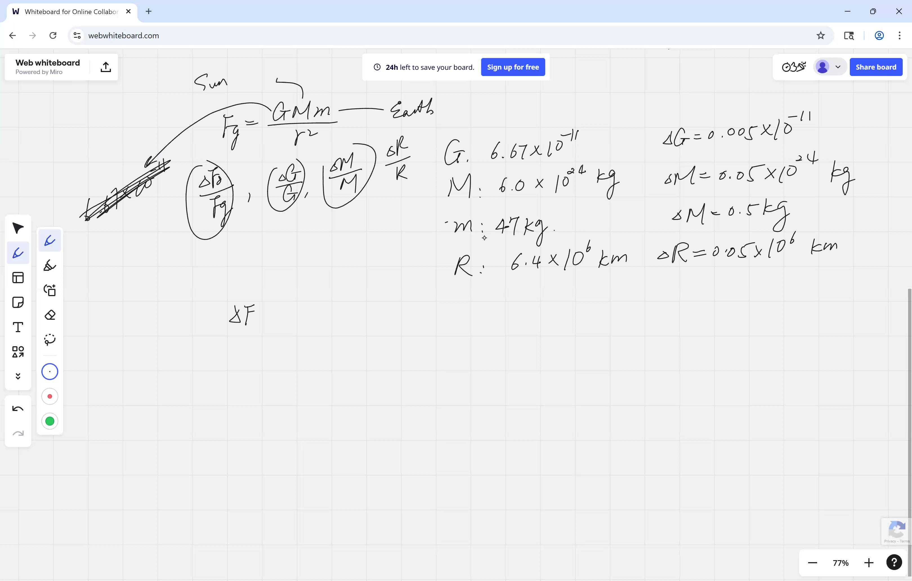
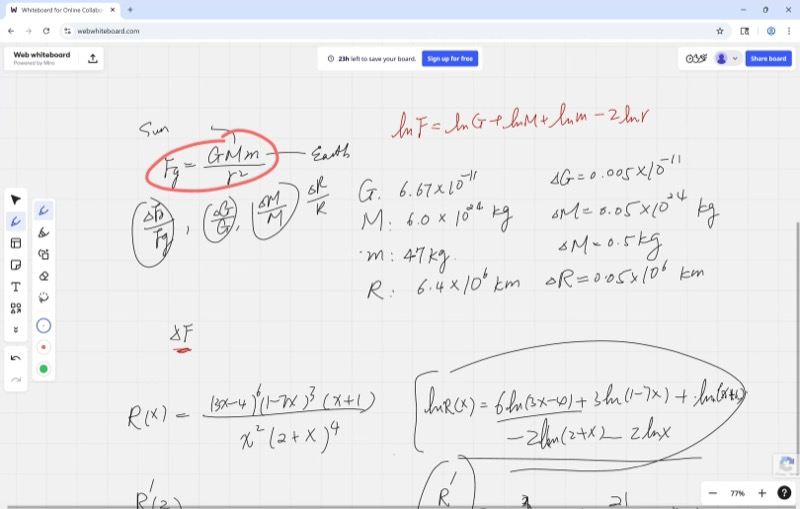
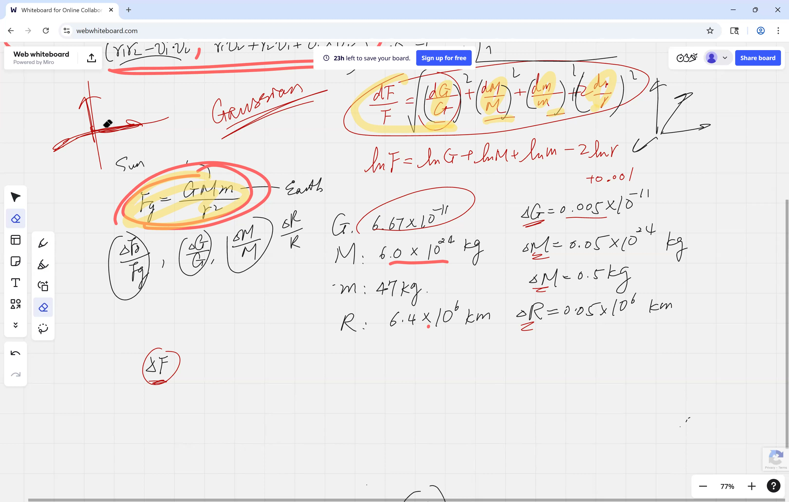
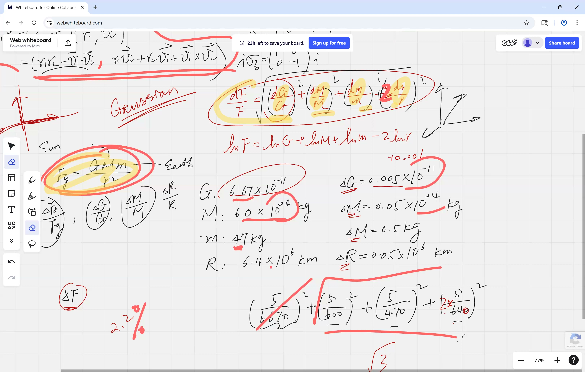

Every measurement you make has a tiny bit of error baked in -- your ruler is only so precise, your scale rounds off, and so on. But what happens to that error when you plug your measurements into a formula? In this lesson, you will learn how errors "propagate" through calculations, how to use a clever logarithm trick to make the math easy, and why independent errors combine like the sides of a right triangle instead of just adding up. By the end, you will be able to figure out how trustworthy any calculated result really is.

::: {.callout-tip collapse="true"}
## Why Propagated Error Matters

Every measurement in the real world has some inaccuracy. When you plug those measurements into a formula, the errors "propagate" into your result. Understanding how is critical:

- **Space missions**: NASA calculates how small errors in rocket thrust, fuel mass, and timing compound into trajectory deviations -- getting it wrong means missing a planet by millions of miles
- **Medicine**: a blood test result depends on instrument precision, sample volume, and chemical concentrations -- doctors need to know how reliable the final number is before making a diagnosis
- **Construction**: if every beam length has a tiny measurement error, a skyscraper's total height uncertainty depends on how those errors stack up -- engineers must guarantee the building is safe
- **Sports analytics**: when tracking a baseball's speed using radar, errors in distance and time measurements propagate into the velocity calculation -- scouts need to know if a pitcher really throws 95 mph or if it could be 93
- **Cooking at scale**: a recipe scaled up for a restaurant means small errors in each ingredient measurement accumulate -- percent error tells you whether the dish will still taste right
:::

## Topics Covered

- Propagated error in multi-variable formulas: $\Delta F$ from $\Delta G$, $\Delta M$, $\Delta m$, $\Delta r$
- Logarithmic differentiation to simplify percent error calculations
- Newton's Law of Gravitation: $F_G = \frac{G M m}{r^2}$
- Percent error vs. absolute error: $\frac{dF}{F}$ vs. $dF$
- Pythagorean (Gaussian) sum for independent errors: $\sqrt{\left(\frac{\Delta a}{a}\right)^2 + \left(\frac{\Delta b}{b}\right)^2 + \cdots}$
- Comparing measurement strategies: repeated measurements and averaging

## Lecture Video

```{=html}
<video controls width="100%" preload="metadata">
  <source src="https://github.com/ymote/learningcalculus/releases/download/v1.0/calculus20251023_2.mp4" type="video/mp4">
</video>
```

## Key Frames from the Lecture

```{=html}
<div style="display: grid; grid-template-columns: 1fr 1fr; gap: 10px; margin: 1em 0;">
  
  
  
  
</div>
```


## What You Need to Know First

::: {.callout-note collapse="true"}
## What is Newton's Law of Gravitation?

Every object with mass attracts every other object with mass. The force between them is:

$$F_G = \frac{G \cdot M \cdot m}{r^2}$$

where:

- $G \approx 6.67 \times 10^{-11} \; \text{N m}^2/\text{kg}^2$ is the **universal gravitational constant**
- $M$ and $m$ are the masses of the two objects (e.g., the Earth and a person)
- $r$ is the distance between their centers

This formula tells you your **weight**: it is the gravitational force the Earth exerts on you.
:::

::: {.callout-note collapse="true"}
## What are significant figures and rounding error?

When a number is written as $6.67 \times 10^{-11}$, it has **three significant figures**. The true value could be anywhere from $6.665 \times 10^{-11}$ to $6.675 \times 10^{-11}$.

The **rounding error** (or uncertainty) is half the last digit's place value:

$$\Delta = \frac{1}{2} \times 10^{\text{place of last digit}}$$

For $6.67 \times 10^{-11}$, the last digit is in the hundredths place of the coefficient, so $\Delta = 0.005 \times 10^{-11}$.

The number of significant figures in your **least precise** measurement limits the precision of your final answer.
:::

::: {.callout-note collapse="true"}
## What is logarithmic differentiation?

When a function is a product or quotient of many pieces, taking the natural log first converts everything into sums and differences, which are much easier to differentiate.

For example, if $R(x) = \frac{(3x-4)^6 (1-7x)^3 (x+1)}{x^2 (2+x)^4}$, then:

$$\ln R(x) = 6\ln(3x-4) + 3\ln(1-7x) + \ln(x+1) - 2\ln(x) - 4\ln(2+x)$$

Now each term differentiates easily using the chain rule, and we get:

$$\frac{R'(x)}{R(x)} = \frac{18}{3x-4} - \frac{21}{1-7x} + \frac{1}{x+1} - \frac{2}{x} - \frac{4}{2+x}$$

This avoids the nightmare of applying the quotient rule and product rule to the original expression.
:::

::: {.callout-note collapse="true"}
## What is a differential?

The **differential** $df$ represents a tiny change in $f$ caused by a tiny change $dx$ in the input:

$$df = f'(x) \cdot dx$$

In error analysis, we reinterpret $dx$ as the measurement error $\Delta x$. Then $df \approx \Delta f$ gives us the **propagated error** -- how much the output changes due to input uncertainty.

The **percent error** (or relative error) is:

$$\frac{df}{f} = \frac{\Delta f}{f}$$

This tells you what fraction of the value is uncertain, which is often more meaningful than the absolute error alone.
:::

::: {.callout-note collapse="true"}
## What is the Pythagorean theorem?

The Pythagorean theorem says that for a right triangle with legs $a$ and $b$ and hypotenuse $c$:

$$c = \sqrt{a^2 + b^2}$$

In error analysis, we use a **Pythagorean sum** of percent errors because independent errors are unlikely to all push in the same direction. They behave like perpendicular (orthogonal) components, so the total error magnitude is the square root of the sum of squares -- just like finding the hypotenuse.
:::

## Key Concepts

### Setting Up the Gravitational Force Problem

We want to calculate the gravitational force on a person standing on Earth's surface using measured values. Each measurement carries a rounding error:

| Quantity | Value | Error ($\Delta$) |
|---|---|---|
| $G$ (gravitational constant) | $6.67 \times 10^{-11}$ | $0.005 \times 10^{-11}$ |
| $M$ (mass of Earth) | $5.97 \times 10^{24}$ kg | $0.005 \times 10^{24}$ kg |
| $m$ (mass of person) | $47$ kg | $0.5$ kg |
| $r$ (radius of Earth) | $6.4 \times 10^{6}$ m | $0.05 \times 10^{6}$ m |

The force is:

$$F_G = \frac{G \cdot M \cdot m}{r^2}$$

**The problem**: find $\Delta F_G$, the propagated error in the calculated force.

### Why Direct Differentiation is a Nightmare

If you try to compute $\Delta F_G$ directly by differentiating $F_G$ with respect to each variable and applying the quotient rule, you face a massive calculation with four variables multiplied and divided together. The algebra is tedious and error-prone.

**The trick**: use logarithmic differentiation to convert to percent errors.

### The Logarithmic Differentiation Shortcut

Take the natural log of both sides of the force equation:

$$\ln F_G = \ln G + \ln M + \ln m - 2\ln r$$

The product and quotient have become a simple sum! Now differentiate:

::: {.callout-important}
## Key Idea: Log Differentiation Turns Products into Sums
When a formula is built from quantities multiplied and divided together, taking the natural log converts everything into addition and subtraction. That makes it simple to see how each measurement's percent error feeds into the final answer.

$$\frac{dF_G}{F_G} = \frac{dG}{G} + \frac{dM}{M} + \frac{dm}{m} - 2\,\frac{dr}{r}$$
:::

Each term on the right is a **percent error** -- the ratio of the uncertainty to the value itself. This is far more practical than computing absolute errors, because a tiny absolute error in $G$ (order $10^{-11}$) does not mean $G$ is highly accurate; you must compare it to $G$ itself.

**Explore -- see how percent error in radius affects force:**

```{=html}
<div id="calc1" class="desmos-container"></div>
<script src="https://www.desmos.com/api/v1.9/calculator.js?apiKey=dcb31709b452b1cf9dc26972add0fda6"></script>
<script>
  var calc1 = Desmos.GraphingCalculator(document.getElementById('calc1'), {
    expressions: true,
    settingsMenu: false
  });
  calc1.setExpression({ id: 'force', latex: 'y=\\frac{1}{x^2}', color: '#2d70b3', lineWidth: 3 });
  calc1.setExpression({ id: 'a', latex: 'a=1', sliderBounds: {min: 0.5, max: 3, step: 0.01} });
  calc1.setExpression({ id: 'pt', latex: '(a, \\frac{1}{a^2})', color: '#2d70b3', pointSize: 10, label: 'F at r=a', showLabel: true });
  calc1.setExpression({ id: 'tangent', latex: 'y=\\frac{1}{a^2}-\\frac{2}{a^3}(x-a)', color: '#c74440', lineWidth: 2, lineStyle: 'DASHED' });
  calc1.setMathBounds({ left: 0, right: 4, bottom: -1, top: 5 });
</script>
```

*Drag $a$ to change the radius. The red dashed tangent line shows the linear approximation -- its slope is $-2/a^3$, reflecting the factor of $2$ in front of $\frac{dr}{r}$. A small change in $r$ causes roughly twice as large a percent change in $F$.*

### Computing Each Percent Error

Now we plug in the numbers:

$$\frac{\Delta G}{G} = \frac{0.005}{6.67} \approx 0.00075 \approx 0.075\%$$

$$\frac{\Delta M}{M} = \frac{0.005}{5.97} \approx 0.00084 \approx 0.084\%$$

$$\frac{\Delta m}{m} = \frac{0.5}{47} \approx 0.0106 \approx 1.06\%$$

$$2 \cdot \frac{\Delta r}{r} = 2 \cdot \frac{0.05}{6.4} \approx 0.0156 \approx 1.56\%$$

Notice the first two terms (around $0.1\%$) are tiny compared to the last two (around $1\%$). In fact, dropping the first two would barely change the final answer -- **always let the least precise measurement drive your analysis**.

### The Pythagorean Sum: Why We Don't Just Add

If we simply added all four percent errors, we would get the **worst-case upper bound** -- as if every error happened to push in the same direction. But in reality, errors are **independent** (Gaussian): one measurement might read too high while another reads too low.

Independent errors are like perpendicular axes -- a deviation in $G$ doesn't affect the deviation in $m$. So the proper way to combine them is the **Pythagorean sum** (also called the root-sum-of-squares):

::: {.callout-important}
## Key Idea: The Pythagorean Sum for Independent Errors
Because independent measurement errors are unlikely to all push in the same direction, we combine them like the legs of a right triangle rather than simply adding them up. The total percent error is always smaller than the worst-case sum.

$$\frac{\Delta F_G}{F_G} = \sqrt{\left(\frac{\Delta G}{G}\right)^2 + \left(\frac{\Delta M}{M}\right)^2 + \left(\frac{\Delta m}{m}\right)^2 + \left(2\frac{\Delta r}{r}\right)^2}$$
:::

**Explore -- Pythagorean sum vs. simple sum of two errors:**

```{=html}
<div id="calc2" class="desmos-container"></div>
<script>
  var calc2 = Desmos.GraphingCalculator(document.getElementById('calc2'), {
    expressions: true,
    settingsMenu: false
  });
  calc2.setExpression({ id: 'a_val', latex: 'a=1', sliderBounds: {min: 0, max: 3, step: 0.01} });
  calc2.setExpression({ id: 'b_val', latex: 'b=1', sliderBounds: {min: 0, max: 3, step: 0.01} });
  calc2.setExpression({ id: 'simple', latex: '(a+b, 0)', color: '#c74440', pointSize: 12, label: 'Simple sum: a+b', showLabel: true });
  calc2.setExpression({ id: 'pyth', latex: '(\\sqrt{a^2+b^2}, -0.5)', color: '#2d70b3', pointSize: 12, label: 'Pythagorean: sqrt(a^2+b^2)', showLabel: true });
  calc2.setExpression({ id: 'vec_a', latex: '(t, 0)', color: '#388c46', lineWidth: 3, parametricDomain: {min: '0', max: 'a'} });
  calc2.setExpression({ id: 'vec_b', latex: '(a, t)', color: '#fa7e19', lineWidth: 3, parametricDomain: {min: '0', max: 'b'} });
  calc2.setExpression({ id: 'hyp', latex: '(t\\frac{a}{\\sqrt{a^2+b^2}}, t\\frac{b}{\\sqrt{a^2+b^2}})', color: '#6042a6', lineWidth: 2, lineStyle: 'DASHED', parametricDomain: {min: '0', max: '\\sqrt{a^2+b^2}'} });
  calc2.setMathBounds({ left: -1, right: 7, bottom: -2, top: 4 });
</script>
```

*Drag $a$ and $b$ to represent two error magnitudes. The green and orange segments are the "legs" (individual errors), the purple dashed line is the Pythagorean hypotenuse (realistic combined error), and the red dot shows the simple sum (worst case). The Pythagorean sum is always smaller or equal.*

### Crunching the Numbers

Plugging in and including all four terms:

$$\frac{\Delta F_G}{F_G} = \sqrt{(0.00075)^2 + (0.00084)^2 + (0.0106)^2 + (0.0156)^2}$$

$$= \sqrt{0.0000006 + 0.0000007 + 0.000112 + 0.000243}$$

$$= \sqrt{0.000356} \approx 0.0189 \approx 2.1\%$$

Notice that the first two terms contribute almost nothing under the square root -- as expected, the least precise measurements dominate.

### From Percent Error Back to Absolute Error

The percent error $\frac{\Delta F_G}{F_G}$ is not the final answer! We still need to find $\Delta F_G$ itself. First, compute $F_G$ from the original formula:

$$F_G = \frac{(6.67 \times 10^{-11})(5.97 \times 10^{24})(47)}{(6.4 \times 10^{6})^2} \approx 459 \;\text{N}$$

This is close to $47 \times 9.8 = 460.6$ N -- a good sanity check, since $g \approx 9.8 \;\text{m/s}^2$.

Then the absolute error is:

$$\Delta F_G = F_G \times \frac{\Delta F_G}{F_G} \approx 459 \times 0.021 \approx 10 \;\text{N}$$

That is roughly 2 pounds of uncertainty in the calculated weight -- very reasonable!

### Comparing Measurement Strategies

Suppose you want to measure a length and have two rulers:

| Ruler | Smallest marking | Error $\Delta L$ |
|---|---|---|
| Ruler 1 (meter stick) | 1 cm | 0.5 cm |
| Ruler 2 (fine ruler) | 1 mm | 0.1 cm |

Three strategies:

- **A**: Use Ruler 1 five times, take the average
- **B**: Use Ruler 2 once
- **C**: Combine A's and B's data optimally

For strategy **A**, each measurement $x_1, x_2, \ldots, x_5$ is independent with error $\Delta L = 0.5$ cm. The average is:

$$\bar{x} = \frac{x_1 + x_2 + x_3 + x_4 + x_5}{5}$$

Since the errors are independent, the Pythagorean sum applies to the numerator, and dividing by 5 gives:

$$\Delta \bar{x} = \frac{\sqrt{5 \cdot (0.5)^2}}{5} = \frac{0.5}{\sqrt{5}} \approx 0.22 \;\text{cm}$$

::: {.callout-important}
## Key Idea: Averaging Reduces Error by $1/\sqrt{n}$
If you repeat a measurement $n$ times and take the average, the error shrinks by a factor of $\frac{1}{\sqrt{n}}$. Four measurements cut the error in half; to cut it by a factor of ten, you need one hundred measurements.

$$\Delta \bar{x} = \frac{\Delta x}{\sqrt{n}}$$
:::

Repeated independent measurements improve accuracy by a factor of $\frac{1}{\sqrt{n}}$, where $n$ is the number of measurements.

**Strategy B** gives $\Delta L = 0.1$ cm in a single measurement -- better than A's $0.22$ cm!

**Strategy C** (combining data from both) can do even better by weighting each measurement by its precision -- a topic for future study.

## Cheat Sheet

::: {.key-formula}
| Formula | What it means |
|---|---|
| $F_G = \dfrac{GMm}{r^2}$ | Newton's Law of Gravitation |
| $\ln F_G = \ln G + \ln M + \ln m - 2\ln r$ | Log trick: products become sums |
| $\dfrac{dF}{F} = \dfrac{dG}{G} + \dfrac{dM}{M} + \dfrac{dm}{m} - 2\dfrac{dr}{r}$ | Percent errors from log differentiation |
| $\dfrac{\Delta F}{F} = \sqrt{\sum_i \left(\frac{\Delta x_i}{x_i}\right)^2}$ | Pythagorean sum for independent errors |
| $\Delta \bar{x} = \dfrac{\Delta x}{\sqrt{n}}$ | Error reduction by averaging $n$ measurements |

### Key Principles

1. **Percent error > absolute error**: always compare $\frac{\Delta x}{x}$, not $\Delta x$ alone
2. **Log differentiation**: when variables are multiplied/divided, take $\ln$ first to simplify
3. **Pythagorean sum**: independent errors combine as $\sqrt{a^2 + b^2}$, not $a + b$
4. **Weakest link**: your answer's precision is limited by the least precise measurement
5. **Don't forget the last step**: $\Delta F = F \times \frac{\Delta F}{F}$ -- always convert back to absolute error
:::
