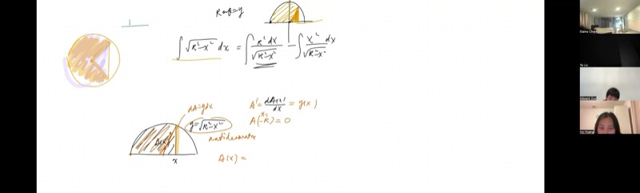
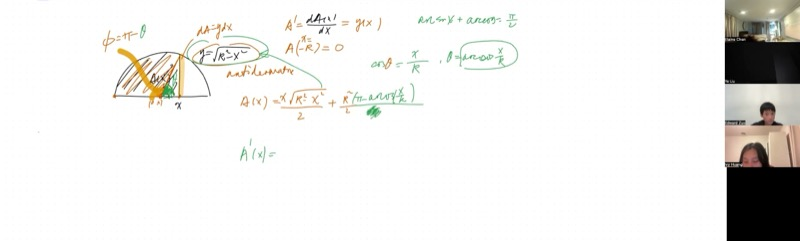
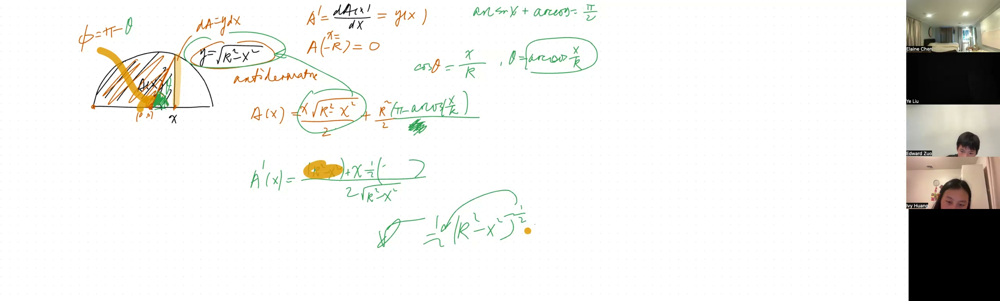
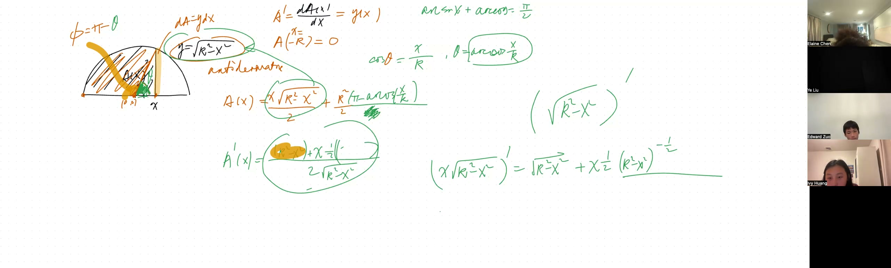

This lesson demonstrates that the area under a semicircle can be decomposed into a circular sector and a right triangle -- two regions whose areas have elementary formulas. This geometric decomposition yields the antiderivative of $\sqrt{r^2 - x^2}$ without algebraic substitution techniques, and the result is then verified by differentiating with the product rule and chain rule.

::: {.callout-tip collapse="true"}
## Motivation

The integral $\int \sqrt{r^2 - x^2}\,dx$ connects geometry and calculus in a fundamental way. It arises in numerous applications:

- **Geodesy and navigation**: calculating distances along curved paths on Earth's surface involves integrals containing $\sqrt{r^2 - x^2}$
- **Structural engineering**: designing arches, tunnels, and domes requires computing areas of circular cross-sections
- **Medical imaging**: MRI and CT scanners reconstruct circular slices of the body using these integrals
- **Celestial mechanics**: orbital mechanics involves integrating expressions with $\sqrt{r^2 - x^2}$ to compute swept areas (Kepler's second law)
- **Computer graphics**: rendering curves and circles on screens requires decomposing circular regions into triangles and sectors -- precisely the decomposition developed in this lesson

By decomposing the region under a semicircle into a sector and a triangle, we obtain the antiderivative through geometric reasoning, and then verify the result using the product rule and chain rule.
:::

## Topics Covered

- The antiderivative $\int \sqrt{r^2 - x^2}\,dx$ as the area under the upper semicircle
- Decomposing the area into a **circular sector** plus a **right triangle**
- Writing the sector area using $\arccos(x/r)$
- Writing the triangle area as $\frac{1}{2}x\sqrt{r^2 - x^2}$
- The relationship $\arcsin(x/r) + \arccos(x/r) = \frac{\pi}{2}$
- Verifying the antiderivative by differentiation using the **product rule** and **chain rule**
- Boundary condition: $A(-r) = 0$ determines the constant of integration

## Lecture Video

```{=html}
<video controls width="100%" preload="metadata">
  <source src="https://github.com/ymote/learningcalculus/releases/download/v1.0/calculus20251106.mp4" type="video/mp4">
</video>
```

## Key Frames from the Lecture

```{=html}
<div style="display: flex; flex-direction: column; gap: 10px; margin: 1em 0;">
  
  
  
  
</div>
```


## Prerequisites

::: {.callout-note collapse="true"}
## What is an antiderivative?

An **antiderivative** of a function $f(x)$ is a function $F(x)$ whose derivative equals $f(x)$:

$$F'(x) = f(x)$$

We write this using integral notation:

$$\int f(x)\,dx = F(x) + C$$

The $C$ is the **constant of integration** -- since the derivative of any constant is zero, there are infinitely many antiderivatives that differ by a constant. The value of $C$ is determined by imposing a **boundary condition** (substituting a known value).
:::

::: {.callout-note collapse="true"}
## What is the equation of a semicircle?

A full circle of radius $r$ centered at the origin satisfies:

$$x^2 + y^2 = r^2$$

Solving for $y$ gives two solutions. The **upper semicircle** is:

$$y = \sqrt{r^2 - x^2}$$

This curve exists only for $-r \le x \le r$, since we need $r^2 - x^2 \ge 0$. The area under this curve from $-r$ to $r$ is exactly $\frac{1}{2}\pi r^2$ (half the area of the circle).
:::

::: {.callout-note collapse="true"}
## What are arcsine and arccosine?

The **arcsine** function $\arcsin(u)$ answers: "what angle has sine equal to $u$?" Similarly, **arccosine** $\arccos(u)$ answers: "what angle has cosine equal to $u$?"

Key facts:

- $\arcsin(u)$ returns an angle in $\left[-\frac{\pi}{2}, \frac{\pi}{2}\right]$
- $\arccos(u)$ returns an angle in $[0, \pi]$
- They are complementary: $\arcsin(u) + \arccos(u) = \frac{\pi}{2}$ for all $|u| \le 1$
- $\frac{d}{dx}\arcsin(u) = \frac{1}{\sqrt{1 - u^2}}$ and $\frac{d}{dx}\arccos(u) = \frac{-1}{\sqrt{1 - u^2}}$

These derivatives are why arcsine and arccosine show up naturally when integrating expressions involving $\sqrt{r^2 - x^2}$.
:::

::: {.callout-note collapse="true"}
## What are the product rule and chain rule?

The **product rule** states that the derivative of a product $f(x) \cdot g(x)$ is:

$$\frac{d}{dx}[f(x)\cdot g(x)] = f'(x)\cdot g(x) + f(x)\cdot g'(x)$$

Each factor is differentiated in turn while the other is held fixed, and the results are summed. Note that the derivative is **not** $f'(x) \cdot g'(x)$.

The **chain rule** states that the derivative of a composition $h(g(x))$ is:

$$\frac{d}{dx}[h(g(x))] = h'(g(x)) \cdot g'(x)$$

One takes the derivative of the **outer function** (evaluated at the inner function), then multiplies by the derivative of the **inner function**. For example:

$$\frac{d}{dx}\sqrt{r^2 - x^2} = \frac{1}{2}(r^2 - x^2)^{-1/2} \cdot (-2x) = \frac{-x}{\sqrt{r^2 - x^2}}$$

The $(-2x)$ comes from the chain rule -- it is the derivative of the inner function $r^2 - x^2$.
:::

::: {.callout-note collapse="true"}
## What is the area of a circular sector?

A **circular sector** is a "pie slice" of a circle. If the circle has radius $r$ and the sector subtends an angle $\phi$ (in radians), the area is:

$$A_{\text{sector}} = \frac{1}{2}r^2 \phi$$

This formula works because the sector is the fraction $\frac{\phi}{2\pi}$ of the full circle, and the full circle has area $\pi r^2$:

$$A_{\text{sector}} = \frac{\phi}{2\pi} \cdot \pi r^2 = \frac{1}{2}r^2 \phi$$
:::

## Key Concepts

### The Problem: Antiderivative of the Semicircle

We want to find the antiderivative:

$$\int \sqrt{r^2 - x^2}\,dx$$

The function $y = \sqrt{r^2 - x^2}$ is the upper semicircle of radius $r$. Geometrically, the antiderivative $A(x)$ represents the **area swept under the curve** from $x = -r$ up to the moving boundary $x$.

**Interactive demonstration -- the upper semicircle $y = \sqrt{r^2 - x^2}$ with adjustable radius:**

```{=html}
<div id="calc1" class="desmos-container"></div>
<script src="https://www.desmos.com/api/v1.9/calculator.js?apiKey=dcb31709b452b1cf9dc26972add0fda6"></script>
<script>
  var calc1 = Desmos.GraphingCalculator(document.getElementById('calc1'), {
    expressions: true,
    settingsMenu: false
  });
  calc1.setExpression({ id: 'r', latex: 'r=3', sliderBounds: {min: 1, max: 5, step: 0.1} });
  calc1.setExpression({ id: 'semi', latex: 'y=\\sqrt{r^2 - x^2} \\left\\{-r \\le x \\le r\\right\\}', color: '#2d70b3', lineWidth: 3 });
  calc1.setExpression({ id: 'a', latex: 'a=1', sliderBounds: {min: '-r', max: 'r', step: 0.01} });
  calc1.setExpression({ id: 'shade', latex: '0 \\le y \\le \\sqrt{r^2 - x^2} \\left\\{-r \\le x \\le a\\right\\}', color: '#2d70b3' });
  calc1.setExpression({ id: 'pt', latex: '(a, \\sqrt{r^2 - a^2})', color: '#c74440', pointSize: 10, label: '(a, sqrt(r^2-a^2))', showLabel: true });
  calc1.setMathBounds({ left: -6, right: 6, bottom: -1, top: 5 });
</script>
```

*Drag the slider $a$ to sweep the shaded area $A(a)$ from $-r$ to $a$. This swept area is precisely the antiderivative being computed.*

### Connecting Area to Antiderivative

As $x$ advances by a tiny amount $dx$, the area grows by one thin vertical strip of width $dx$ and height $y$:

$$dA = y\,dx = \sqrt{r^2 - x^2}\,dx$$

This tells us the rate of change of the swept area:

$$\frac{dA}{dx} = y = \sqrt{r^2 - x^2}$$

So $A(x)$ is indeed an antiderivative of $\sqrt{r^2 - x^2}$. We also have the **boundary condition** $A(-r) = 0$, since no area has been swept at the starting point.

### The Key Insight: Area = Sector + Triangle

Instead of using algebraic substitution tricks, we decompose the shaded region geometrically. The area under the semicircle from $-r$ to $x$ can be split into two parts:

1. A **circular sector** (the "pie slice" from the negative $x$-axis to the radius drawn to the point)
2. A **right triangle** (the remaining piece between the radius and the vertical line at $x$)

**Interactive demonstration -- the sector and triangle decomposition:**

```{=html}
<div id="calc2" class="desmos-container"></div>
<script>
  var calc2 = Desmos.GraphingCalculator(document.getElementById('calc2'), {
    expressions: true,
    settingsMenu: false
  });
  calc2.setExpression({ id: 'r2', latex: 'r=3', sliderBounds: {min: 1, max: 5, step: 0.1} });
  calc2.setExpression({ id: 'semi2', latex: 'y=\\sqrt{r^2 - x^2} \\left\\{-r \\le x \\le r\\right\\}', color: '#2d70b3', lineWidth: 3 });
  calc2.setExpression({ id: 'a2', latex: 'a=1', sliderBounds: {min: '-r', max: 'r', step: 0.01} });
  calc2.setExpression({ id: 'pt2', latex: '(a, \\sqrt{r^2 - a^2})', color: '#c74440', pointSize: 10 });
  calc2.setExpression({ id: 'radius', latex: '(ta, t\\sqrt{r^2 - a^2})', color: '#c74440', lineWidth: 2, parametricDomain: {min: 0, max: 1} });
  calc2.setExpression({ id: 'vert', latex: 'x=a \\left\\{0 \\le y \\le \\sqrt{r^2 - a^2}\\right\\}', color: '#388c46', lineWidth: 2 });
  calc2.setExpression({ id: 'base', latex: 'y=0 \\left\\{0 \\le x \\le a\\right\\}', color: '#388c46', lineWidth: 2, lineStyle: 'DASHED' });
  calc2.setMathBounds({ left: -6, right: 6, bottom: -1, top: 5 });
</script>
```

*The red line is the radius to the point $(a, \sqrt{r^2 - a^2})$. The green lines mark the right triangle. The sector is the pie-shaped region between the negative $x$-axis and the radius.*

### Writing the Sector Area

The sector is bounded by the angle $\phi$ measured from the negative $x$-axis to the radius. We introduce the angle $\theta$ from the positive $x$-axis:

$$\cos\theta = \frac{x}{r} \implies \theta = \arccos\!\left(\frac{x}{r}\right)$$

The sector angle is then:

$$\phi = \pi - \theta = \pi - \arccos\!\left(\frac{x}{r}\right)$$

So the sector area is:

$$A_{\text{sector}} = \frac{1}{2}r^2\phi = \frac{1}{2}r^2\left[\pi - \arccos\!\left(\frac{x}{r}\right)\right]$$

### Writing the Triangle Area

The right triangle has:

- **Base** = $x$ (the horizontal distance from the origin)
- **Height** = $y = \sqrt{r^2 - x^2}$ (the vertical coordinate on the semicircle)

So the triangle area is:

$$A_{\text{triangle}} = \frac{1}{2} \cdot x \cdot \sqrt{r^2 - x^2}$$

### The Complete Antiderivative

Adding the two pieces:

::: {.callout-important}
## Key Idea: Area = Sector + Triangle
The area under a semicircle from $-r$ to $x$ decomposes into a circular sector and a right triangle. Each piece has an elementary formula, and their sum gives the full antiderivative -- no algebraic substitution is required.

$$\boxed{A(x) = \frac{1}{2}r^2\!\left[\pi - \arccos\!\left(\frac{x}{r}\right)\right] + \frac{1}{2}\,x\sqrt{r^2 - x^2}}$$
:::

**Boundary condition check**: At $x = -r$, the swept area should be zero.

- $\arccos(-r/r) = \arccos(-1) = \pi$, so the sector term gives $\frac{1}{2}r^2[\pi - \pi] = 0$.
- $\sqrt{r^2 - r^2} = 0$, so the triangle term gives $0$.

Indeed $A(-r) = 0$, confirming the formula.

### Connection to Arcsine

Earlier work showed that part of the antiderivative involves $\arcsin(x/r)$. There is no contradiction, as the following identity shows:

::: {.callout-important}
## Key Idea: Arcsine and Arccosine Are Complementary
The arcsine and arccosine of the same value always add up to $\frac{\pi}{2}$ (a right angle). This identity lets you freely switch between the two forms of the antiderivative -- they differ only by a constant.

$$\arcsin\!\left(\frac{x}{r}\right) + \arccos\!\left(\frac{x}{r}\right) = \frac{\pi}{2}$$
:::

This means $\arccos(x/r) = \frac{\pi}{2} - \arcsin(x/r)$. Substituting:

$$\pi - \arccos\!\left(\frac{x}{r}\right) = \pi - \frac{\pi}{2} + \arcsin\!\left(\frac{x}{r}\right) = \frac{\pi}{2} + \arcsin\!\left(\frac{x}{r}\right)$$

So we can rewrite the antiderivative equivalently as:

$$A(x) = \frac{1}{2}r^2\!\left[\frac{\pi}{2} + \arcsin\!\left(\frac{x}{r}\right)\right] + \frac{1}{2}\,x\sqrt{r^2 - x^2}$$

The constant $\frac{1}{2}r^2 \cdot \frac{\pi}{2} = \frac{\pi r^2}{4}$ is just a constant of integration -- it vanishes when you differentiate. So both forms are equally valid!

### Verifying by Differentiation

To confirm our geometric result, we differentiate $A(x)$ and check that we recover $\sqrt{r^2 - x^2}$.

We need:

$$\frac{d}{dx}\!\left[\frac{1}{2}r^2\!\left(\pi - \arccos\!\frac{x}{r}\right) + \frac{1}{2}\,x\sqrt{r^2 - x^2}\right]$$

**Term 1 -- the sector piece**:

$$\frac{d}{dx}\!\left[\frac{1}{2}r^2\!\left(\pi - \arccos\!\frac{x}{r}\right)\right] = \frac{1}{2}r^2 \cdot \frac{1}{\sqrt{1 - x^2/r^2}} \cdot \frac{1}{r}$$

Since $\frac{d}{dx}\arccos(u) = \frac{-1}{\sqrt{1-u^2}}$ and the minus signs cancel:

$$= \frac{r}{2} \cdot \frac{r}{\sqrt{r^2 - x^2}} = \frac{r^2}{2\sqrt{r^2 - x^2}}$$

**Term 2 -- the triangle piece**, using the **product rule** on $\frac{1}{2}x \cdot \sqrt{r^2 - x^2}$:

$$\frac{d}{dx}\!\left[\frac{1}{2}\,x\sqrt{r^2 - x^2}\right] = \frac{1}{2}\!\left[\underbrace{1 \cdot \sqrt{r^2 - x^2}}_{\text{derivative of } x,\;\text{copy } g} + \underbrace{x \cdot \frac{-2x}{2\sqrt{r^2 - x^2}}}_{\text{copy } x,\;\text{chain rule on } g}\right]$$

The chain rule gives us the inner derivative $(-2x)$ of $r^2 - x^2$:

$$= \frac{1}{2}\!\left[\sqrt{r^2 - x^2} - \frac{x^2}{\sqrt{r^2 - x^2}}\right]$$

Combining over the common denominator $\sqrt{r^2 - x^2}$:

$$= \frac{1}{2}\cdot\frac{(r^2 - x^2) - x^2}{\sqrt{r^2 - x^2}} = \frac{r^2 - 2x^2}{2\sqrt{r^2 - x^2}}$$

**Adding both terms**:

$$A'(x) = \frac{r^2}{2\sqrt{r^2 - x^2}} + \frac{r^2 - 2x^2}{2\sqrt{r^2 - x^2}} = \frac{2r^2 - 2x^2}{2\sqrt{r^2 - x^2}}$$

$$= \frac{2(r^2 - x^2)}{2\sqrt{r^2 - x^2}} = \frac{r^2 - x^2}{\sqrt{r^2 - x^2}} = \sqrt{r^2 - x^2}$$

::: {.callout-important}
## Key Idea: Geometry and Calculus Agree
When you differentiate the geometric formula (sector + triangle) using the product rule and chain rule, you get back the semicircle $\sqrt{r^2 - x^2}$. This confirms that the geometric decomposition is a valid antiderivative -- two completely different approaches give the same answer.
:::

The derivative of the geometrically derived $A(x)$ is indeed $\sqrt{r^2 - x^2}$. Geometry and calculus yield the same result.

### Why the Constant Does Not Matter

Any two antiderivatives of the same function differ by a constant. Since $\frac{d}{dx}(\text{constant}) = 0$, the constant disappears when differentiating. This is why both the arcsine version and the arccosine version are equally valid -- they differ only by the constant $\frac{\pi r^2}{4}$.

## Cheat Sheet

::: {.key-formula}
| What you want | Formula |
|---|---|
| Upper semicircle equation | $y = \sqrt{r^2 - x^2}$, valid for $-r \le x \le r$ |
| Antiderivative (arccosine form) | $\displaystyle\int\!\sqrt{r^2 - x^2}\,dx = \frac{r^2}{2}\!\left[\pi - \arccos\!\frac{x}{r}\right] + \frac{x}{2}\sqrt{r^2 - x^2} + C$ |
| Antiderivative (arcsine form) | $\displaystyle\int\!\sqrt{r^2 - x^2}\,dx = \frac{r^2}{2}\arcsin\!\frac{x}{r} + \frac{x}{2}\sqrt{r^2 - x^2} + C$ |
| Sector area | $A_{\text{sector}} = \frac{1}{2}r^2\phi$ where $\phi$ is the angle in radians |
| Triangle area | $A_{\text{triangle}} = \frac{1}{2} \cdot \text{base} \cdot \text{height}$ |
| Arcsine-arccosine identity | $\arcsin(u) + \arccos(u) = \frac{\pi}{2}$ |
| Derivative of $\arcsin(u)$ | $\frac{1}{\sqrt{1-u^2}}$ |
| Derivative of $\arccos(u)$ | $\frac{-1}{\sqrt{1-u^2}}$ |
| Product rule | $(fg)' = f'g + fg'$ |
| Chain rule | $\frac{d}{dx}[h(g(x))] = h'(g(x))\cdot g'(x)$ |

### The Big Idea

$$\underbrace{\int \sqrt{r^2 - x^2}\,dx}_{\text{calculus problem}} = \underbrace{A_{\text{sector}}}_{\frac{1}{2}r^2(\pi - \arccos\frac{x}{r})} + \underbrace{A_{\text{triangle}}}_{\frac{1}{2}x\sqrt{r^2 - x^2}} \quad \longleftrightarrow \quad \text{geometry solves calculus!}$$
:::
